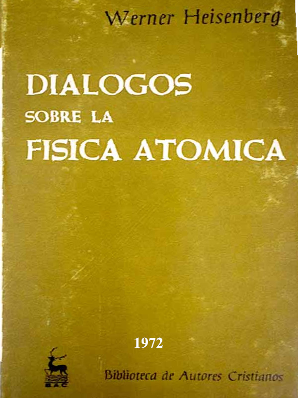
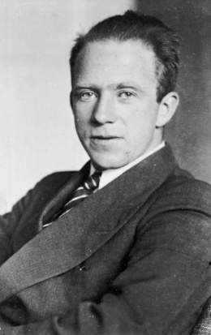

# Introducción

Werner Karl Heisenberg (Wurzburgo, 5 de diciembre de 1901 - Múnich, 1 de febrero de 1976) fue un físico alemán, Premio Nobel de Física en 1932 por la creación de la mecánica cuántica, cuyo uso ha conducido, entre otras cosas, al descubrimiento de las formas alotrópicas del hidrógeno.

**Síntesis biográfica**

En septiembre de 1906, poco antes de cumplir cinco años de edad, Heisenberg inició su enseñanza primaria en una escuela de Würzburg. Pasó tres años en esa escuela, hasta que su padre fue nombrado, en 1909, profesor de griego en la universidad de München. En junio de 1910, algunos meses después de que su padre asumiera su nuevo cargo docente, Werner y el resto de la familia se mudaron a Münich. Allí, a partir de septiembre de ese año, Werner asistió a clases en la escuela Elisabethenschule. En 1911, ingresa a estudiar al Maximilian Gymnasium de München, donde era director su abuelo materno.
Juventud

En 1923 fue ayudante del físico alemán Max Born en la Universidad de Gotinga, y desde 1924 a 1927 obtuvo una beca de la Fundación Rockefeller para trabajar con el físico danés Niels Bohr en la Universidad de Copenhague. En 1927 fue nombrado profesor de física teórica en la Universidad de Leipzig.
Madurez

Fue profesor en las universidades de Berlín (1941-1945), Gotinga (1946-1958) y Munich (1958-1976). En 1941 ocupó el cargo de director del Instituto Kaiser Wilhelm de Química Física (que en 1946 pasó a llamarse Instituto Max Planck de Física).

**Aportes**

Heisenberg, uno de los primeros físicos teóricos del mundo, realizó sus aportaciones más importantes en la teoría de la estructura atómica. En 1925 comenzó a desarrollar un sistema de mecánica cuántica, denominado mecánica matricial, en el que la formulación matemática se basaba en las frecuencias y amplitudes de las radiaciones absorbidas y emitidas por el átomo y en los niveles de energía del sistema atómico. El principio de incertidumbre desempeñó un importante papel en el desarrollo de la mecánica cuántica y en el progreso del pensamiento filosófico moderno

**Obras**

- Die physikalischen Prinzipien del Quantentheori (Los principios físicos de la teoría cuántica, 1930)
- Cosmic Radiation (Radiación cósmica, 1946)
- Physics and Philosophy (Física y filosofía, 1958)
- Introduction to the Unified Theory of Elementary Particles (Introducción a la teoría unificada de las partículas elementales, 1967).

# Prólogo

> **A mi esposa**

> *En lo que atañe a los discursos que... fueron pronunciados, me fue imposible retener en la memoria como testigo el texto exacto de lo dicho. Por eso hice hablar a los oradores tal como—en mi opinión—podría haber sido más adecuado a las circunstancias, ateniéndome, lo más estrechamente posible, al sentido de lo verdaderamente expresado.
> Tucídides, Guerra del Peloponeso I, 22, 1.*

*La ciencia la hacen los hombres. Esta circunstancia, en si obvia, cae fácilmente en olvido, y traerla de nuevo a la memoria puede contribuir a mitigar la escisión existente—y que a menudo lamentamos—entre las dos culturas, la de las ciencias del espíritu y el arte, por un lado, y la de la técnica y las ciencias de la naturaleza, por otro. Este libro trata del desarrollo de la física atómica en los últimos cincuenta años tal como el autor lo ha vivido. Las ciencias de la naturaleza se basan en experimentos y llegan a sus resultados específicos a través de los diálogos de quienes las cultivan y discuten en común la interpretación que debe darse a los experimentos. Tales conversaciones forman el contenido principal del libro. A través de ellas debe ponerse de manifiesto que la ciencia surge en el diálogo. Es evidente que, tras varios decenios, los diálogos no pueden ser reproducidos textualmente. Solo se aducen literalmente los párrafos tomados de cartas. No se trata, en rigor, por otra parte, de unas memorias. Por eso, el autor se ha permitido una y otra vez condensar, resumir y renunciar a la exactitud histórica; la imagen debía ser exacta sólo en los rasgos esenciales. En tales conversaciones, no siempre juega la física atómica el papel más importante. Con la misma frecuencia se tratan problemas humanos, filosóficos o políticos, y el autor confía que precisamente así quedará de manifiesto en qué escasa medida puede la ciencia apartarse de estas cuestiones más generales.*

*Muchas de las personas que participan en el diálogo son mencionadas con su nombre de pila, bien porque posteriormente no han llegado a ser conocidas, bien porque la relación del autor con ellas queda mejor expresada con la mera indicación del nombre propio. Además, de este modo se da menos pie a pensar que se trata de una reproducción de los diversos acontecimientos, históricamente fiel en todos sus pormenores. Por este motivo renuncié también a diseñar con más precisión la figura de estas personalidades; en cierto modo, se darán a conocer sólo en su modo de hablar. Se concede, en cambio, gran valor a la descripción viva y exacta de la atmósfera en que se desarrollaron las conversaciones. Porque en ella se revela el proceso de nacimiento de la ciencia y se comprende mejor que la colaboración de hombres muy diferentes puede conducir a resultados científicos de gran alcance. El propósito del autor ha sido conseguir que incluso los alejados de la moderna física atómica tengan una idea de las corrientes de pensamiento que acompañaron al desarrollo histórico de esta ciencia. Debe tenerse en cuenta, sin embargo, que en el trasfondo de los diálogos se dejan ver estructuras matemáticas muy abstractas y difíciles, no comprensibles sin un estudio detenido.*

*Finalmente, el autor, al redactar estas conversaciones, persiguió, además, otra meta. La moderna física atómica ha puesto de nuevo sobre el tapete problemas fundamentales de la filosofía, la ética y la política, y es menester que en esta discusión participe el mayor número posible de hombres. Tal vez, el presente libro pueda contribuir a poner las bases para ello.*

# Capítulo 1: Primer encuentro con la teoría del átomo (1919-1920)

Puede muy bien haber sucedido en la primavera de 1920. La juventud de nuestro país se hallaba inquieta y conmovida por el desenlace de la primera guerra mundial. La generación anterior, profundamente desilusionada, había perdido las riendas, y los jóvenes se unían en grupos y en comunidades más o menos numerosas para abrirse un nuevo camino o, al menos, para hallar una nueva brújula con la cual orientarse, pues la vieja parecía rota. Así, también yo, en un día claro de primavera, me encontré de camino con un grupo de diez o veinte camaradas, la mayoría de ellos más jóvenes que yo, y el paseo nos condujo, si no recuerdo mal, a través de las colinas que bordean la orilla occidental del lago Starnberg, el cual, cuando se abría un hueco en el luminoso verde de las encinas, se dejaba ver a la izquierda por debajo de nosotros, y parecía extenderse casi hasta las montañas que se divisan al fondo. Durante esta excursión se entabló, de modo un tanto sorprendente, el primer diálogo sobre el mundo de los átomos, diálogo que tanta importancia habría de encerrar en mi posterior desarrollo científico. Para que se comprenda que tales conversaciones hayan sido sostenidas por jóvenes alegres y despreocupados, abiertos a la belleza de la naturaleza floreciente, tal vez se deba recordar que los azares de la época habían anulado, en gran medida, el amparo que el hogar y el colegio suelen dispensar en épocas pacíficas a la juventud, y que en cierto modo, como sustitutivo, ésta había desarrollado una cierta independencia de opinión, de modo que se atrevía a formular juicios propios incluso cuando necesariamente carecía de base para ello.

Unos pasos delante de mí caminaba un muchacho rubio y bien plantado, cuyos padres en una ocasión me habían encargado ayudarle en sus tareas escolares. Un año antes, a sus quince años, había arrastrado, en una lucha callejera, las cajas de municiones cuando su padre estaba apostado con una ametralladora detrás de la fuente *Wittelsbach* participando en las luchas a favor de la «república soviética» muniquesa. Otros —yo entre ellos—habían trabajado dos años antes como braceros en casas de labranza de la Alta Baviera. Los vientos duros no nos eran, pues, extraños, y ninguno se asustaba de reflexionar por su propia cuenta sobre los problemas más difíciles.

La ocasión externa que motivó el diálogo fue el hecho de que yo debía preparar para el verano el examen final de bachillerato, y tuve por ello interés en conversar sobre temas científicos con mi amigo Kurt, que compartía mis aficiones y habría de hacerse más tarde ingeniero. Kurt pertenecía a una familia protestante de oficiales; era un buen deportista y un compañero digno de confianza. Un año antes, cuando Münich estuvo cercada por las tropas del Gobierno y nuestras familias habían consumido el último trozo de pan, él, mi hermano y yo habíamos hecho juntos un viaje a Garching a través de la línea de fuego y habíamos regresado con una mochila llena de víveres—pan, mantequilla y tocino—. Tales experiencias comunes constituyen buena base para una confianza sin reservas y una gozosa comprensión mutua. Pero ahora nos interesaba, sobre todo, nuestra común preocupación por las cuestiones científicas. Yo le conté a Kurt que había encontrado en mi manual de física una ilustración que me parecía totalmente absurda. Se trataba del proceso químico fundamental en el que dos materias homogéneas se unen en una nueva materia también homogénea, dando lugar a una composición química. Así, el anhídrido carbónico es formado por la unión de carbono y oxígeno. Según el libro, la mejor manera de entender las leyes observadas en tales procesos consistía en suponer que las partes más pequeñas, los átomos, de un elemento y las del otro se unen en pequeños grupos de átomos, llamados moléculas. Así, la molécula de anhídrido carbónico consta de un átomo de carbono y dos átomos de oxígeno. Para hacerlo intuible se dibujaban en el libro tales grupos de átomos. Pero, a fin de explicar por qué precisamente un átomo de carbono y dos átomos de oxígeno forman siempre una molécula de anhídrido carbónico, el dibujante había provisto a los átomos de ganchos y anillas, mediante los cuales se unían, formando la molécula. Esto me pareció totalmente falto de sentido. Porque, a mi juicio, los ganchos y las anillas son figuras muy arbitrarias, a las que se puede dar en cada caso las formas más diferentes según la utilidad técnica. Los átomos, en cambio, deben ser una consecuencia de las leyes de la naturaleza, y deben ser inducidos por éstas a unirse en moléculas. En ello, creía yo, no puede haber azar alguno, y tampoco, en consecuencia, formas tan arbitrarias como ganchos y anillas.

Kurt contestó: «Sí no quieres creer en los ganchos y anillas—que también a mí se me antojan muy sospechosos—, debes saber, ante todo, qué experiencias han llevado al dibujante a ponerlos en una figura. Porque la ciencia actual parte de experiencias, no de cualesquiera especulaciones filosóficas, y a la experiencia hay que ajustarse, siempre que se la haya realizado de modo concienzudo, es decir, con suficiente esmero. Por lo que yo sé, los químicos afirman en primer lugar que las partículas elementales de un compuesto químico siempre se dan con unas determinadas proporciones de peso. Esto es un hecho bastante sorprendente. Porque, aun creyendo en la existencia de átomos, es decir, de partes muy pequeñas características de cada elemento, las fuerzas semejantes a las conocidas en la naturaleza hasta ahora no bastan apenas para poder explicar que un átomo de carbono atraiga siempre sólo a dos átomos de oxígeno y los una a sí. Si existe una fuerza de atracción entre las dos clases de átomos, ¿por qué en algunos casos no habrían de unirse también tres átomos de oxígeno?»

«Tal vez los átomos de carbono o los del oxígeno tengan una forma tal, que un enlace triple resulte imposible precisamente por razón de ordenación espacial».

«Si aceptas esto, lo que no deja de sonar verosímil, entonces casi has venido de nuevo a dar en los ganchos y anillas del manual. Probablemente, el dibujante quiso expresar lo mismo que tú has dicho, pues él no puede conocer la forma exacta de los átomos. Dibujó ganchos y anillas para expresar del modo más drástico posible que hay formas que pueden llevar a la unión de dos átomos de oxígeno, pero no de tres, con uno de carbono».

«Bien. Los ganchos y anillas son un contrasentido. Pero tú dices que los átomos, en virtud de las leyes que son responsables de su existencia, tienen asimismo una forma que determina el modo justo de vincularse entre sí. Sólo que nosotros dos todavía no conocemos esta forma, como tampoco, evidentemente, la conocía el autor del dibujo. Lo único que creemos saber hasta ahora de esa forma, es que tiene a su cargo decidir que un átomo de carbono sólo pueda unirse a dos átomos de oxígeno y no a tres. Como se indica en el libro, los químicos inventaron a este propósito el concepto de ‘valencia química’. Pero falta todavía por averiguar si esta expresión es una mera palabra o es ya un concepto utilizable».

«Probablemente es algo más que una mera palabra, pues las cuatro valencias que se adscriben a un átomo de carbono —y de las cuales cada dos tienen que saturar las dos valencias de cada átomo de oxígeno—deben de tener algo que ver con una forma tetraédrica del átomo. Es claro que acerca de las formas tiene que haber unos conocimientos más precisos que aquellos de que actualmente tenemos nosotros noticia».

En este momento intervino en nuestra conversación Robert, quien hasta entonces había caminado en silencio junto a nosotros, pero había, sin duda, prestado atención. Robert tenía un rostro delgado, pero poderoso, enmarcado en una espesa y oscura cabellera, y a primera vista parecía un tanto sombrío. Sólo raras veces participaba en las charlas fáciles que suelen prodigarse en tales excursiones; pero cuando por la noche en la tienda de campaña había que leer algo o recitar un poema antes de la cena, nos dirigíamos a él, pues nadie conocía mejor la poesía alemana e incluso la literatura filosófica. Al recitar un poema, Robert lo hacía sin patetismo, sin énfasis, pero su dicción era tal, que el contenido de la poesía afectaba hasta al más prosaico de todos nosotros. El arte con que hablaba, el sosiego recogido con que se expresaba, instaban a escuchar, y sus palabras parecían tener más peso que las de los demás. Sabíamos también que leía libros filosóficos aparte del trabajo escolar. Robert no estaba satisfecho con nuestra conversación,

«Vosotros, los que creéis en la ciencia —dijo—, apeláis siempre con mucha facilidad a la experiencia, y pensáis que con eso ya tenéis segura la verdad en las manos. Pero, al meditar sobre lo que ocurre realmente en la experiencia, el modo como hacéis tal apelación me parece muy discutible. Lo que decís proviene de vuestros pensamientos; tan sólo de ellos tenéis un conocimiento inmediato; pero los pensamientos no están en las cosas. No podemos percibir las cosas de modo directo, antes debemos transformarlas primero en representaciones, para formar, finalmente, conceptos a base de ellas. Lo que afluye hacia nosotros desde fuera a través de la percepción sensorial, es una mezcla bastante desordenada de impresiones muy diversas, a las que no pertenecen directamente las formas o cualidades que percibimos después. Si observamos, por ejemplo, un cuadrado en una hoja de papel, ni en la retina de nuestro ojo ni en las células nerviosas de nuestro cerebro hay algo que tenga la forma de un cuadrado. Más bien debemos ordenar de forma inconsciente las impresiones sensoriales mediante una representación; debemos transformar en cierto modo el conjunto de las sensaciones en una imagen coherente, ‘llena de sentido’. El acto de la ‘percepción’ se realiza solamente cuando las impresiones aisladas se transforman, coordinándose en un todo ‘inteligible’. Por eso, antes de poder emitir un juicio con tanta seguridad acerca de las experiencias, habría que investigar de dónde vienen las imágenes para nuestras representaciones, cómo se aprehenden conceptualmente y en qué relación están con las cosas. Porque es obvio que las representaciones son anteriores a la experiencia, son la condición de la experiencia».

«Y las representaciones que tú quieres separar tan netamente del objeto de las percepciones, ¿no vienen también de la experiencia? Acaso de una manera no tan directa como se pudiera pensar ingenuamente, pero tal vez de modo indirecto; a través, por ejemplo, de la repetición frecuente de grupos homogéneos de sensaciones o mediante ciertas formas de vinculación entre los testimonios de sentidos distintos».

«Esto no me parece en modo alguno seguro, ni siquiera que arroje luz especial sobre el tema. Recientemente he estudiado las obras del filósofo Malebranche, y me ha llamado la atención un pasaje que se refiere precisamente a este problema. Malebranche distingue, esencialmente, tres posibilidades para la génesis de las representaciones. La primera es la que acabas de mencionar: los objetos producen directamente, a través de las sensaciones, las representaciones en el alma humana. Esta opinión la rechaza Malebranche, porque las impresiones sensoriales son cualitativamente distintas tanto de las cosas como de las representaciones a ellas correspondientes. La segunda opinión es la siguiente: el alma humana posee las representaciones desde un principio, o al menos posee la capacidad de formar ella misma estas representaciones. En este caso, las impresiones sensoriales sólo sirven para recordar al alma las representaciones ya existentes, o bien para estimularla a formar por sí misma las representaciones. Tercera posibilidad—por la cual se decide Malebranche—: el alma humana participa de la inteligencia divina. Está unida con Dios, y por ello Dios le ha dado la imaginación y las imágenes o ideas mediante las cuales puede ordenar y clasificar conceptualmente la diversidad de las sensaciones».

En aquel momento Kurt mostró, a su vez, su total insatisfacción: «Vosotros, los filósofos, recurrís inmediatamente a la teología. Si algo os resulta difícil, dejáis que aparezca el gran desconocido para que resuelva como por ensalmo todas las dificultades. Pero yo no me ajusto a este procedimiento. Una vez que has planteado el problema, yo quiero saber cómo puede el alma humana adquirir sus representaciones; y precisamente en este mundo, no en otro. Porque, sin duda, el alma y las representaciones se dan en este mundo. Si no quieres admitir que las representaciones se originan sencillamente de la experiencia, tienes que explicar por qué pueden venir dadas al alma humana desde el principio. ¿Puede admitirse que tales representaciones—con las cuales ya el niño va haciendo la experiencia del mundo—, o al menos la capacidad de formarlas, son innatas? Si quieres afirmar esto, está muy cerca la idea de que las representaciones se basan en las experiencias de generaciones anteriores, y no me importa mucho si se trata de nuestras experiencias actuales o de las generaciones pretéritas».

«No—replicó Robert—, de verdad no pienso así. Porque, por una parte, es muy dudoso que se pueda transmitir por herencia lo aprendido, esto es, el resultado de experiencias.

Por otra parte, puede expresarse también sin teología lo que quiere decir Malebranche, y de esa forma es más apropiado a vuestra ciencia actual. Lo intentaré. Malebranche podría haber dicho: las mismas energías ordenadoras que son responsables de la armonía visible del mundo, de las leyes de la naturaleza, de la formación de los elementos químicos y sus propiedades, de las estructuras cristalinas, del origen de la vida y de todo lo demás, toman parte, asimismo, en el nacimiento del alma humana y en la vida misma de ésta. Hacen corresponder a las cosas las representaciones y fundamentan la posibilidad de una articulación conceptual. Son responsables de aquellas estructuras realmente existentes que, al considerarlas desde nuestro punto de vista humano, al fijarlas en el pensamiento, parecen escindirse en algo objetivo—la cosa—y algo subjetivo—la representación—. La tesis de Malebranche según la cual la capacidad de formar representaciones puede haberse originado a lo largo de la historia de la evolución merced a la relación de los organismos con el mundo exterior, tiene algo de común con la opinión—tan plausible para vuestra ciencia—de que toda representación se origina en la experiencia. Pero, al mismo tiempo, Malebranche subraya que se trata de correlaciones que no pueden explicarse simplemente por una cadena de procesos individuales sometidos a la ley de la causalidad. Por tanto, que también aquí—como en la formación de los cristales y de los seres vivientes— están operando estructuras supraordenadas de índole más bien morfológica, que no pueden ser comprendidas cabalmente con los conceptos correlativos de causa v efecto. La pregunta de si la experiencia es anterior a la representación, no es más razonable que el viejo problema de si la gallina existió antes del huevo, o al revés.

»Por lo demás, yo no quisiera interrumpir vuestra discusión sobre los átomos. Lo único que deseaba era indicar que no se puede hablar tan sencillamente de experiencia respecto a los átomos, pues pudiera muy bien ser que los átomos, que no son observables directamente, tampoco sean sencillamente cosas, sino que pertenezcan a estructuras más fundamentales, en las que ya no tenga sentido alguno escindirlas en representación y cosa. Naturalmente, no se pueden tomar en serio los ganchos y las anillas de tu manual, y tampoco todas las imágenes de átomos que se encuentran de vez en cuando en libros de divulgación. Tales dibujos, que intentan facilitar la comprensión, sirven tan sólo para hacer el problema mucho menos inteligible. Creo que deberíamos tener muchísimo cuidado con el concepto ‘forma de los átomos’ que has mencionado antes. Sólo si se entiende la palabra *forma* de modo muy general, no restringida al espacio; si casi no significa mucho más que la palabra *estructura,* que acabo de usar, sólo entonces podría aceptar este concepto, y eso a medias».

Al tomar la conversación este giro, me acordé inmediatamente de una lectura que me había ocupado y cautivado un año antes, y que en algunos pasajes importantes me había resultado incomprensible. Se trataba del diálogo *Timeo,* de Platón, en el cual también se discute filosóficamente sobre las partes más pequeñas de la materia. Por las palabras de Robert empecé a comprender, aunque al principio de manera algo oscura, que, respecto a tales partes mínimas, es posible llegar a construcciones racionales tan curiosas como las que había encontrado en el *Timeo*, de Platón. No es que estas construcciones, que yo al principio había considerado totalmente absurdas, me hubiesen parecido repentinamente aceptables; pero vi abierto por primera vez ante mí un camino que, al menos en principio, podía llevar a tales construcciones.

Para hacer comprensible lo mucho que significó para mí en este momento el recuerdo del estudio del *Timeo,* debo relatar brevemente las curiosas circunstancias en que tuvo lugar esta lectura. En la primavera de 1919, la situación en Münich era bastante caótica. Se disparaba por las calles, sin que se supiese exactamente quién luchaba contra quién. El poder gubernamental se intercambiaba entre personas e instituciones cuyo nombre apenas se conocía. Saqueos y robos, de los cuales yo mismo fui víctima una vez, hicieron de la expresión ‘república soviética’ un sinónimo de anarquía. Cuando, por fin, llegó a constituirse fuera de Münich un nuevo Gobierno bávaro, que envió sus tropas para ocupar la ciudad, comenzamos a esperar la restauración de un estado de orden. El padre del amigo al que yo había ayudado antes en sus trabajos escolares asumió el mando de una compañía de voluntarios que querían tomar parte en la conquista de la capital. El nos instó a nosotros, a los amigos casi adultos de sus hijos, a ayudar, como ordenanzas conocedores de la ciudad, a las tropas invasoras. De esta manera fuimos agregados a la plana mayor, llamada ‘Comando de caballería 11’, que había establecido su cuartel en la Ludwigstrasse, en el edificio del seminario eclesiástico, frente a la Universidad. Aquí hice yo mi servicio, o, mejor dicho, aquí llevamos conjuntamente una vida aventurera totalmente libre; estábamos exentos de las clases, como muchas veces antes, y quisimos aprovechar la libertad para conocer el mundo desde nuevos ángulos. El círculo de amigos con los que un año más tarde hice la excursión por las colinas junto al lago Starnberg, se había reunido precisamente aquí, en el piso bajo. Pero esta vida aventurera duró sólo algunas semanas. Cuando aflojaron los combates y el servicio comenzó a hacerse monótono, sucedía a menudo que, después de haber pasado la noche en vela en la centralita telefónica, al amanecer me quedaba libre de toda obligación.

A fin de volver a disponerme paulatinamente para la vida escolar, solía retirarme al tejado del seminario con nuestra edición escolar griega de los diálogos de Platón. Allí, apoyado en el alero del techo y calentado por los primeros rayos del sol, podía estudiar tranquilamente y de cuando en cuando observar el despertar de la vida en la Ludwigstrasse. En una mañana de éstas, cuando el sol empezó a levantarse y la luz iluminaba el edificio de la Universidad y la fuente que lo precede, di con el diálogo *Timeo,* y precisamente con aquel pasaje donde se habla de las partes mínimas de la materia. Quizá este pasaje me había cautivado tan sólo, porque era difícil de traducir, o también porque trataba de cosas matemáticas, que siempre me habían interesado. No me acuerdo por qué concentré mi atención con tanto empeño precisamente en este texto. Pero lo que leía allí me parecía totalmente absurdo. Platón afirma que las partes mínimas de la materia están formadas por triángulos rectángulos que, después de haberse agrupado a pares en triángulos equiláteros o cuadrados, constituyen los cuerpos regulares de la estereometría: cubos, tetraedros, octaedros e icosaedros. Según Platón, estos cuatro cuerpos son las unidades fundamentales de los cuatro elementos: tierra, fuego, aire y agua. No lograba ver claramente si los cuerpos regulares eran asignados a los elementos sólo como símbolos—por ejemplo, el cubo al elemento tierra para representar la solidez y estabilidad de este elemento—, o si realmente las partes más pequeñas del elemento tierra tenían forma de cubo. Tales ideas me parecían especulaciones fantásticas; en el mejor de los casos, sólo disculpables por la falta de suficientes conocimientos empíricos en la antigua Grecia. Pero en el fondo me intranquilizaba bastante que un filósofo con un pensamiento tan crítico y agudo como Platón pudiera caer en tales especulaciones. Intentaba encontrar algunos principios a partir de los cuales pudiera entender mejor las especulaciones de Platón. Pero no conseguía descubrir nada que, aunque de lejos, me hubiera indicado el camino para ello. Sin embargo, la idea de que en las partes mínimas de la materia se tropieza al final con formas matemáticas me fascinaba. Una comprensión de la textura inextricable e indescifrable de los fenómenos naturales sólo parecía posible si se pudieran descubrir en aquélla formas matemáticas. Pero me resultaba totalmente ininteligible por qué razón se había fijado la atención de Platón de modo especial en los cuerpos regulares de la estereometría. Estos no parecían tener valor explicativo alguno. Por eso, en adelante sólo utilicé el diálogo para perfeccionar mis conocimientos de griego. Pero la preocupación persistió. El resultado más importante de la lectura fue, tal vez, la convicción de que, si quería entender el mundo material, era necesario saber algo acerca de sus partes más elementales. Por los libros de texto y por escritos de vulgarización sabía que la ciencia moderna investigaba el átomo. Quizá más tarde pudiera penetrar yo mismo en este mundo con mis estudios. Pero esto quedaba para más adelante.

El desasosiego continuaba y se convirtió para mí en parte de aquella inquietud general que cundía entre la juventud alemana. Si un filósofo del rango de Platón creía reconocer órdenes en el acontecer de la naturaleza que nosotros ahora hemos perdido de vista o que nos resultan inaccesibles, ¿qué significa entonces fundamentalmente la palabra *orden?* ¿Se hallan el orden y su comprensión vinculados a una época determinada? Nosotros crecimos en un mundo que parecía perfectamente ordenado. Nuestros padres nos enseñaron las virtudes cívicas que constituyen el presupuesto de tal orden.

Nada había, pues, de particular en la afirmación, conocida ya por la antigüedad grecorromana, de que a veces pueda ser necesario el sacrificio de la propia vida para defender un determinado orden político. La muerte de muchos amigos y parientes nos había mostrado que el mundo es así; pero ahora eran muchos los que afirmaban que la guerra había sido un crimen, y precisamente un crimen de la misma clase dirigente, que se había sentido responsable de mantener ante todo el antiguo orden europeo y que se había considerado en la obligación de hacerlo respetar incluso al precio de un conflicto bélico con otras tendencias. La vieja estructura de Europa se encontraba ahora deshecha por la derrota. Tampoco era nada extraña esta situación, pues toda guerra trae consigo, inevitablemente, una derrota. Pero ¿quedó con ello en entredicho radicalmente el valor de la vieja estructura? ¿No se trataba más bien ahora de edificar sencillamente un nuevo orden más vigoroso sobre los escombros? ¿O tenían razón aquellos que murieron en las calles de Münich para impedir, de una vez para siempre, el retorno de un orden del antiguo estilo y proclamar en su lugar otro futuro que abarcara no sólo a una nación, sino a toda la humanidad, aunque esta humanidad fuera de Alemania no pensase, en su mayoría, en la creación de tal orden nuevo? Estas preguntas habían producido un gran confusionismo en la mente de los jóvenes, y los mayores no sabían darnos respuesta alguna.

Después de la lectura del *Timeo* y antes de la excursión por las colinas que bordean el lago Starnberg, realicé otra experiencia que influyó poderosamente en mi futuro pensamiento, y que debe ser relatada antes de reanudar la conversación acerca del mundo del átomo. Algunos meses después de la ocupación de Münich, las tropas salieron de la ciudad. Nosotros asistíamos a clase como antes, sin meditar mucho sobre el valor de lo que hacíamos. Sucedió una tarde que, en la Leopoldstrasse, un joven desconocido me dijo: «¿Sabes que en la próxima semana la juventud se reúne en el castillo de Prunn? Queremos reunirnos todos, y tú debes ir también. Todos deben ir. Ahora queremos meditar nosotros mismos acerca del curso que deben seguir las cosas». Su voz tenía un acento que nunca antes había oído. Por eso decidí viajar al castillo de Prunn. Kurt quiso acompañarme. El ferrocarril —entonces todavía muy irregular—tardó muchas horas en llevarnos a la parte baja del valle del Altmühl. En los períodos geológicos primarios fue el valle del Danubio; el río Altmühl fue excavando su camino sinuoso a través de los montes Jura de Franconia, y el pintoresco valle se halla hoy coronado de viejos castillos, casi como el valle del Rhin. Tuvimos que subir a pie los últimos kilómetros que llevan al castillo de Prunn, y pudimos ver cómo los jóvenes acudían de todas partes al alto baluarte, erigido osadamente sobre una roca que se yergue perpendicular sobre el borde del valle. En el patio del castillo, en cuyo centro se alza un viejo pozo de roldana, se habían reunido ya numerosos grupos. La mayoría de ellos eran todavía alumnos de bachillerato, pero había también gente mayor, que habían sufrido como soldados todos los horrores de la guerra y habían vuelto a un mundo cambiado. Se pronunciaron muchos discursos, cuyo *pathos* nos resultaría hoy extraño: si es más importante para nosotros el destino de nuestro pueblo que el de toda la humanidad; si el sacrificio de los caídos perdió su sentido a causa de la derrota; si la juventud puede arrogarse el derecho de configurar su vida por sí misma y según su propia escala de valores; si la veracidad intrínseca es más importante que las viejas formas que habían ordenado la vida de los hombres durante siglos. Acerca de todo esto se habló y discutió con pasión.

Yo me sentía demasiado inseguro para participar en estos debates, pero escuché y medité sobre el concepto del orden. La confusión en el contenido de los discursos me pareció mostrar que también órdenes auténticos pueden entrar mutuamente en conflicto, y entonces esa lucha opera lo contrario del orden. Esto tan sólo era posible, a mi entender, si se trataba de órdenes parciales, de fragmentos segregados de la unión del orden central; elementos que, sin haber perdido aún toda fuerza configuradora, habían abandonado su orientación hacia el centro ordenador. Cuanto más escuchaba, más atormentado me sentía por la conciencia de la falta de este centro eficaz. Sufrí por ello casi físicamente, pero yo mismo no era capaz de encontrar una vía hacia ese ámbito desde la maraña de opiniones encontradas. Así pasaron horas enteras, y se pronunciaron discursos y se sostuvieron discusiones. Las sombras en el patio del castillo se hicieron más largas, y, finalmente, al cálido día le siguió un crepúsculo azul plomizo y una noche de luna clara. Continuaron todavía las conversaciones; pero de pronto, arriba, en el balcón, en lo alto del patio, apareció un joven con un violín, y, cuando se hizo el silencio, sonaron sobre nosotros los primeros grandes acordes en re menor de la *Chacona,* de Bach. Entonces se estableció de repente la vinculación con el centro de un modo indudable. El valle del Altmühl, inundado, bajo nosotros, por la claridad de la luna, habría sido motivo suficiente para un hechizo romántico; pero no fue esto lo que sucedió. Las transparentes frases de la *Chacona* fueron como viento sutil que rasga la niebla y deja al descubierto las firmes estructuras del trasfondo. Quedaba claro que se podía hablar del ámbito central; esto fue posible en todos los tiempos, con Platón y con Bach; con el lenguaje de la música, de la filosofía o de la religión; por tanto, debe ser también posible ahora y en el porvenir. Esta fue mi gran experiencia.

El resto de la noche lo pasamos en una pradera rodeada de bosques por encima del castillo, alrededor de hogueras y en tiendas de campaña, y también aquí se concedió amplia entrada al romanticismo eichendorffiano. El joven violinista, ya estudiante de universidad, se sentó en medio de nuestro grupo y tocó minuetos de Mozart y Beethoven, intercalando viejos aires populares, y yo traté de acompañarle con mi guitarra. Se mostró, además, como un compañero alegre, al que no gustaba, sin embargo, ser interrogado acerca de su solemne interpretación de la *Chacona*, de Bach. Cuando le hicimos la pregunta, nos respondió: «¿Sabes en qué tono tocaron las trompetas de Jericó?» «No». «Por supuesto, también en re menor». «¿Por qué?» «Porque han demolido las murallas de Jericó». De nuestra indignación por el juego de palabras [^1] se salvó escapándose rápidamente.

Esta noche se había desvanecido ya en la penumbra de mi memoria, y ahora marchábamos sobre las colinas cercanas al lago Starnberg y hablábamos sobre el átomo. La observación de Robert sobre Malebranche me había puesto en claro que las experiencias sobre átomos sólo pueden darse de modo muy indirecto y que probablemente los átomos no son cosas. Evidentemente, esto lo había querido indicar también Platón en el *Timeo,* y sólo así eran medio comprensibles sus especulaciones ulteriores acerca de los cuerpos regulares. Asimismo, si la ciencia moderna de la naturaleza habla de las formas de los átomos, la palabra *forma* sólo puede ser entendida aquí en su significación más general: como estructura en espacio y tiempo, como simetría de fuerzas, como posibilidad de enlace con otros átomos. Probablemente, nunca será posible una descripción intuitiva de tales estructuras, ya que no pertenecen de modo inequívoco al mundo objetivo de las cosas. Pero acaso deban ser asequibles a una consideración matemática.

Yo quería saber más acerca del aspecto filosófico del problema del átomo, y le recordé a Robert este pasaje del *Timeo*, de Platón. Entonces le pregunté si estaba de acuerdo en principio con la opinión de que todas las cosas materiales están formadas por átomos, de que hay partes mínimas, exactamente los átomos, a los cuales puede reducirse toda materia. Tenía yo la impresión de que él sostenía una actitud bastante escéptica respecto a todo este mundo conceptual relativo a la estructura atómica de la materia.

Robert me lo confirmó: «A mí me resulta extraño todo planteamiento que nos aleja excesivamente del mundo inmediato de la vivencia. El mundo de los hombres o el de los lagos y el de los bosques me son más cercanos que el de los átomos. Pero se puede, naturalmente, preguntar qué sucede si se divide siempre más y más la materia, como se puede asimismo preguntar si las estrellas remotas y sus planetas están habitados por seres vivientes. Tales preguntas no me agradan; tal vez ni siquiera me guste saber la contestación. Creo que en nuestro mundo tenemos tareas más importantes que la de plantear tales problemas».

Yo le contesté: «No quiero discutir contigo sobre la importancia de las distintas tareas. Para mí, la ciencia física siempre ha sido muy interesante, y sé que muchos hombres serios se esfuerzan por saber más sobre la naturaleza y sus leyes. Quizá el éxito de su trabajo sea importante también para la comunidad humana, pero no es esto lo que ahora me ocupa. Lo que me inquieta es lo siguiente: da la impresión —y Kurt acaba de decirlo hace poco—de que el desarrollo moderno de la ciencia y la técnica nos ha puesto de lleno en condiciones de ver directamente cada uno de los átomos o, al menos, sus efectos, y poder hacer así experimentos con el átomo. Todavía sabemos poco de esto, porque no lo hemos estudiado; pero si ello es así, ¿cómo se relaciona con tus opiniones? ¿Qué podrías decir a este respecto desde el punto de vista de tu filósofo Malebranche?»

«En todo caso, yo esperaría que los átomos se comporten de modo totalmente diferente a las cosas de la experiencia diaria. Podría muy bien pensar que, si intentamos seguir dividiendo más y más, tropezaremos al fin con discontinuidades, que permitirán deducir la existencia de una estructura discreta de la materia. Pero sospecho que las figuras con las cuales tendremos que vernos entonces se sustraerán a una fijación objetiva en imágenes representables, pues serán más bien una especie de expresión abstracta de leyes de la naturaleza, y por ello no serán cosas».
«Pero ¿y si podemos verlos directamente?»

«No se podrá verlos de modo directo, sino tan sólo en sus efectos».

«Esto es una pobre evasiva. Porque ocurre lo mismo con todas las demás cosas. También de un gato solamente ves los rayos de luz que salen de su cuerpo, es decir, los efectos del gato, pero nunca el gato en sí mismo; e incluso, si acaricias su piel, es fundamentalmente lo- mismo».

«No del todo. En esto no puedo darte la razón. Al gato lo puedo ver directamente, porque en este caso, al entrar en contacto con él, puedo e incluso debo transformar las impresiones sensoriales en una representación. Del gato hay dos vertientes: la objetiva y la subjetiva; el gato como cosa y como representación. Pero con el átomo no sucede esto. En él no se distinguen representación y cosa, porque, propiamente, el átomo no es ni lo uno ni lo otro».

Aquí volvió Kurt a intervenir en la charla. «Para mí, vuestro diálogo es demasiado erudito. Os movéis entre especulaciones filosóficas que deberían recurrir sencillamente a la experiencia. Quizá nuestros estudios nos lleven más tarde a la tarea de experimentar en el campo del átomo; entonces ya veremos qué son los átomos. Probablemente, aprenderemos que son tan reales como todas las demás cosas con las que se puede experimentar. Si es verdad que todas las cosas materiales constan de átomos, estos átomos son tan reales como las cosas materiales».

«No—replicó Robert—, esta conclusión me parece sumamente discutible. Con la misma razón podrías decir: Porque todos los seres vivientes constan de átomos, los átomos son tan vivientes como estos seres. Pero esto es un absurdo manifiesto; solamente la composición de muchos átomos en formaciones mayores puede dar a estas formaciones las cualidades o propiedades que las caracterizan precisamente como tales formaciones o cosas».

«¿Entonces tú piensas que los átomos ni son actuales ni reales?»

«¡Estás exagerando otra vez! Quizá no se trate aquí de precisar qué sabemos sobre los átomos, sino de un problema totalmente diferente, el de aclarar qué significan las palabras *actual* o *real.* Habéis mencionado hace poco un pasaje del *Timeo,* de Platón, y habéis subrayado que éste identifica las partes mínimas con formas matemáticas, a saber, los cuerpos regulares. Aunque esto no sea correcto, pues Platón no hizo experiencias directas sobre los átomos, se lo puede considerar como posible. ¿Llamarías tú ‘actuales’ y ‘reales’ a tales formas matemáticas? Si son expresión de las leyes de la naturaleza, expresión del orden central del acontecer material, se debería, tal vez, llamarlas ‘actuales’*(wirklich),* porque de ellas proceden ciertas actuaciones o efectos *(wirkungen);* pero no se las podría llamar ‘reales’, precisamente porque no son una *res,* una cosa. Ya no se sabe aquí con exactitud cómo emplear las palabras; y esto no es extraño, porque nos hemos alejado mucho del ámbito de nuestra experiencia inmediata, en el cual—en tiempos prehistóricos—se formó nuestra capacidad de hablar».

Kurt todavía no estaba del todo satisfecho con el curso de la conversación, y declaró: «Incluso la decisión acerca de todo esto la dejaría yo con mucho gusto a la experiencia. No puedo imaginarme que la fantasía humana sea suficiente para adivinar las condiciones propias de las partes más pequeñas de la materia si previamente no nos hemos familiarizado con el mundo de estas partes mínimas a través de experimentos precisos. Sólo si esto se realiza concienzudamente y sin opiniones preconcebidas puede obtenerse una auténtica comprensión. Por tanto, soy escéptico respecto a las discusiones filosóficas demasiado precisas sobre un tema tan difícil. Porque fácilmente se forman de ese modo prejuicios intelectuales que luego dificultan la comprensión en lugar de facilitarla. Espero, pues, que en el futuro sean primero los científicos y después los filósofos quienes se ocupen del átomo».

Al llegar a este punto, la paciencia de los otros compañeros se había agotado. «¿Cuándo dejaréis ya ese extraño asunto que nadie entiende? Si queréis preparar el examen, hacedlo en casa. ¿Qué tal si cantamos algo?» Pronto se entonó un canto, y el claro sonido de las voces jóvenes y los colores de las praderas floridas eran más reales que los pensamientos sobre los átomos, y disiparon el sueño al que nos habíamos entregado.

# Capítulo 2: La decisión de estudiar física

Los estudios de bachillerato y los de la Universidad quedaron para mí separados por una honda escisión. Después de una gira por Franconia, realizada tras la reválida, con el mismo grupo de amigos con los que en la primavera había hablado sobre la teoría atómica a orillas del lago Starnberg, caí gravemente enfermo; tuve que guardar cama durante muchas semanas, y a lo largo de la convalecencia subsiguiente me encontré mucho tiempo a solas con mis libros. En estos meses críticos cayó en mis manos una obra cuyo contenido me fascinó, aunque la comprendí sólo a medias. El matemático Hermann Weyl había realizado una exposición matemática de los principios de la teoría de la relatividad de Einstein bajo el título *Espacio-tiempo-materia.* La discusión de los difíciles métodos matemáticos que en este libro se desarrollaban y el abstracto edificio conceptual de la teoría de la relatividad que había en su trasfondo, absorbió mi atención y provocó mi inquietud, robusteciendo con ello mi anterior decisión de estudiar matemáticas en la Universidad de Münich.

En los primeros días de mi carrera tuvo lugar un cambio curioso y sorprendente incluso para mí, que debo referir con brevedad. Mi padre, que enseñaba en la Universidad de Münich filología griega medieval y moderna, me había procurado una entrevista con el profesor de matemáticas, Lindemann, que se hizo célebre por la definitiva solución matemática del antiquísimo problema de la cuadratura del círculo. Yo quería rogar a Lindemann que me admitiera en su seminario, porque me imaginaba estar suficientemente preparado para tal seminario gracias a los estudios matemáticos realizados durante el bachillerato. Visité a Lindemann, que también trabajaba en la administración universitaria, en la primera planta del edificio de la Universidad, en un despacho oscuro amueblado de modo extrañamente anticuado, que por la rigidez de su instalación despertó en mí un sentimiento de cierta retracción. Antes de hablar con el profesor, que no se levantó sino lentamente, observé que sobre el escritorio, junto a él, estaba agazapado un perrito de pelo negro, que en este entorno me recordó inmediatamente al perro del laboratorio de Fausto. El oscuro bicho me miró hostilmente por considerarme, sin duda, como un intruso dispuesto a perturbar la paz de su amo. Algo confundido por esto, expuse mi asunto balbuceando, y, justo cuando hablaba, me di cuenta de la poca modestia de mi ruego. Lindemann, un anciano de barba blanca, ya con aspecto algo cansado, notó también, sin duda, esta inmodestia, y la ligera excitación que le sobrecogió puede haber sido la causa de que el perrito comenzara de improviso a ladrar terriblemente sobre el escritorio. En vano trató su amo de calmarlo. El animalito tradujo su ira hacia mí en furiosos ladridos, que repetía en sucesivas oleadas, de modo que resultó cada vez más difícil entenderse. Lindemann me preguntó qué libros había estudiado últimamente. Yo cité la obra de Weyl *Espacio-tiempo-materia.* Entre la furia incontenida del pequeño guardián negro, Lindemann terminó la conversación, diciendo: «Entonces usted ya está, en todo caso, perdido para las matemáticas». Con esto quedé despedido.

Así, pues, respecto al estudio de las matemáticas, nada se hizo. Una consulta desilusionada con mi padre me llevó a la conclusión de que podría intentar el estudio de la física matemática. Para ello fijamos una visita con Sommerfeld, quien era entonces el representante de la disciplina de física teórica en la Universidad de Münich, estando considerado como uno de los profesores más brillantes de la Universidad y como un amigo de la juventud. Sommerfeld me recibió en un despacho luminoso, a través de cuyas ventanas se veía en el patio de la Universidad a los estudiantes sentados en los bancos bajo la gran acacia. Este hombre bajo y corpulento, con un bigote negro un tanto marcial, daba en principio una impresión dura, pero ya en las primeras palabras me pareció traslucirse una bondad natural, una benévola actitud para con los jóvenes que buscaban aquí dirección y consejo. De nuevo volvió a tocarse el tema de mis estudios particulares de matemáticas, y, al referirme al libro de Weyl *Espacio-tiempo-materia,* Sommerfeld reaccionó de un modo muy distinto a Lindemann:

«Usted es demasiado exigente—dijo—; usted no puede comenzar por lo más difícil y esperar que lo más fácil le sea dado sin esfuerzo. Comprendo que haya quedado fascinado por la problemática de la teoría de la relatividad; pero también en otras vertientes la física moderna aborda campos en los cuales las posiciones filosóficas fundamentales son puestas en tela de juicio, y se tratan, por tanto, cuestiones altamente apasionantes. Pero el camino que hasta ahí conduce es más largo de lo que usted se imagina ahora. Debe, pues, empezar con un trabajo modesto y esmerado en el campo de la física tradicional. Si quiere estudiar física, tiene, por lo demás, que decidir en principio si quiere trabajar de modo experimental o teórico. Por lo que usted cuenta, la teoría tal vez le quede más cercana. Pero ¿no se ocupó usted ocasionalmente con aparatos y experimentos durante el bachillerato?»

Respondí afirmativamente, y le expliqué que, cuando estudiaba bachillerato, me gustaba construir pequeños aparatos, motores e inductores eléctricos. Pero, en general, el mundo de los aparatos me era más bien ajeno y el cuidado que se debe poner en las mediciones, incluso de datos relativamente no importantes, me resultaba extraordinariamente difícil.

«Pero usted, aunque quiera dedicarse a la teoría, debe realizar con gran esmero tareas pequeñas que le parecerán a primera vista poco importantes. Si se discuten problemas tan grandes y filosóficamente relevantes como la teoría de la relatividad de Einstein o la teoría cuántica de Planck, se dan, incluso para el no principiante, muchos problemas pequeños que deben ser resueltos, y que sólo en su conjunto ofrecen una imagen del campo recién descubierto».

«Pero a mí las cuestiones filosóficas del trasfondo me interesan quizá aún más que las pequeñas tareas particulares», aduje tímidamente. Pero con esto no se dio Sommerfeld por contento.

«Usted sabe, sin embargo, cómo Schiller dijo aludiendo a Kant y a sus intérpretes: ‘cuando los reyes edifican, tienen los carreteros trabajo’. ¡Todos somos primero carreteros! Pero usted verá qué alegría le produce si hace tal trabajo cuidadosa y concienzudamente y si además, como esperamos, saca algo de él». Sommerfeld me dio entonces algunas indicaciones para el comienzo de mi estudio y prometió proponerme, tal vez muy pronto, un pequeño problema relativo a las cuestiones de la más reciente teoría atómica, en el cual podría yo probar mis fuerzas. Con esto se decidió mi adscripción a la escuela de Sommerfeld para los próximos años.

Este primer diálogo con un sabio que estaba realmente versado en física moderna y que incluso había hecho importantes descubrimientos en el campo intermedio entre la teoría de la relatividad y la teoría cuántica, repercutió largo tiempo en mí. La exigencia de meticulosidad en lo pequeño se me puso de manifiesto, pues también, aunque en otro aspecto, le había oído con frecuencia a mi padre decir lo mismo. Pero me oprimía el ánimo estar todavía tan lejos del campo al que se dirigía propiamente mi afición. Así, esta primera conversación fue continuada a través de muchos otros diálogos con mis amigos, y me ha quedado en el recuerdo especialmente uno que trató sobre la posición de la física moderna en la evolución cultural de nuestro tiempo.

Con el violinista que había tocado en la noche del castillo de Prunn la *Chacona,* de Bach, me encontré en aquel otoño a menudo en casa de nuestro amigo Walter, quien era un buen violoncelista. Intentamos trabajar en común las partituras clásicas para trío, y nos propusimos ensayar para una fiesta el célebre trío de Schubert en si bemol mayor. Como el padre de Walter había muerto prematuramente, la madre vivía sola con sus dos hijos en un piso grande y finamente decorado en la Elizabethstrasse, distante pocos minutos de mi casa paterna, en la Hohenzollernstrasse; el hermoso piano de cola Bechstein que había en el cuarto de estar acrecentaba más en mí el gusto de hacer música allí. Después de la ejecución de las piezas, permanecíamos sentados, frecuentemente hasta muy entrada la noche, enfrascados en el diálogo. En esta ocasión, la charla derivó también hacia mis planes de estudio. La madre de Walter me preguntó por qué no me había decidido por el estudio de la música:

«Por su modo de tocar y por la forma con que habla usted de esta música, tengo la impresión de que el arte lo lleva más cerca de su corazón que la ciencia y la técnica; que en el
fondo encuentra el contenido de tal música más bello que el espíritu que se expresa en aparatos y fórmulas o en refinados mecanismos técnicos. Si esto es así, ¿por qué quiere decidirse por las ciencias naturales? La marcha del mundo será al fin determinada por lo que quieran los jóvenes. Si la juventud se decide por lo bello, habrá más belleza; si se decide por lo útil, habrá más utilidad. De ahí que la decisión de cada uno, tenga importancia no sólo para él mismo, sino también para la sociedad humana».

Yo intenté defenderme: «No creo propiamente que esté uno ante una elección tan simple. Pues, aun prescindiendo de que, probablemente, no pudiera llegar a ser un músico particularmente bueno, queda todavía la pregunta de en qué dominio se puede conseguir hoy el máximo, y esta pregunta se refiere al estado en que se hallan hoy las diferentes disciplinas. Referente a la música, tengo la impresión de que las composiciones de los últimos años no son tan convincentes como las de los tiempos anteriores. En el siglo XVIII, la música estaba aún ampliamente determinada por el sentido religioso de la vida de entonces; en el siglo XVIII se llevó a cabo el tránsito al mundo del sentimiento individual, y la música romántica del siglo XIX penetró en las profundidades más íntimas del alma humana. Pero en los últimos años, la música parece haber abocado a un estadio de experimentación extrañamente inquieto y quizá algo superficial, en el cual las reflexiones teóricas juegan un papel mayor que la segura conciencia de progresar por una vía predeterminada. En las ciencias naturales, y especialmente en la física, es distinto. En ellas la prosecución del camino señalado —cuya meta entonces, hace veinte años, no podía ser sino la comprensión de ciertos fenómenos electromagnéticos—condujo por sí misma a problemas en los cuales las posiciones filosóficas fundamentales—la estructura de espacio y tiempo y la validez de la ley de la causalidad—son discutidas. Aquí, creo, se abre un horizonte nuevo de amplitud imprevisible, y probablemente, varias generaciones de físicos tendrán bastante que hacer hasta encontrar las respuestas definitivas. Por esto, a mí me parece muy seductor colaborar de algún modo a ello».

Nuestro amigo Rolf, el violinista, se mostró disconforme. «Lo que dices de la física moderna, ¿no vale también, en igual medida, de nuestra música actual? También aquí el camino parece estar prefijado. Las viejas barreras de la tonalidad fueron superadas; entramos en una tierra nueva, en la cual, respecto a sonido y ritmos, tenemos casi toda la libertad imaginable. ¿No podemos esperar que surja aquí tanta riqueza como en tus ciencias naturales?»

Walter, sin embargo, tenía algunos reparos que oponer a esta comparación. «Yo no sé—objetó—si son necesariamente lo mismo la libertad en la elección de los medios de expresividad y un horizonte nuevo y fecundo. A primera vista, parece que una libertad mayor debe representar también un enriquecimiento, un acrecentamiento de posibilidades. Pero en lo referente al arte, que me toca más de cerca que la ciencia, no podría en rigor admitir esto. El proceso del arte, en efecto, se realiza de este modo: en primer lugar, un lento proceso histórico—que transforma la vida de los hombres, sin que el individuo particular pueda ejercer en ello gran influjo—hace brotar nuevos contenidos. Después, individuos bien dotados artísticamente se esfuerzan por dar a estos contenidos forma visual o audible, aportando nuevas posibilidades expresivas del material con que elaboran su arte—los colores o los instrumentos—. Esta interrelación, o, si se quiere, esta lucha entre el contenido expresivo y la limitación de los medios expresivos, es, a mi entender, el presupuesto ineludible para que surja realmente arte. Si falta la limitación de los medios expresivos, si, por ejemplo, en la música se puede producir cualquier sonido, ya no hay tal lucha, y el esfuerzo de los artistas se agita, en cierta medida, en el vacío. Por eso me siento escéptico frente a una libertad demasiado amplia».

«En las ciencias naturales—prosiguió Walter—las nuevas técnicas hacen posible realizar nuevos experimentos y recoger nuevas experiencias, y de este modo surgen los contenidos nuevos. Los medios expresivos son aquí los conceptos con los cuales deben captarse, y de este modo entenderse los nuevos contenidos. Por ejemplo, de la lectura de escritos de divulgación he sabido que la teoría de la relatividad, que tanto te interesa, se apoya en ciertas experiencias hechas a comienzos de siglo al querer demostrar el movimiento de la tierra en el espacio con ayuda de la interferencia de los rayos luminosos. Al fracasar esta prueba, se advirtió que las experiencias nuevas, o, lo que es igual, los nuevos contenidos, hacían necesaria una ampliación de las posibilidades expresivas, es decir, del sistema conceptual de la física. Nadie podía prever al principio con seguridad que ello haría precisos cambios radicales en nociones tan fundamentales como espacio y tiempo. Por eso, sin duda, el gran mérito de Einstein fue haber sido el primero en descubrir que pueden y deben ser realizadas ciertas correcciones en las representaciones de espacio y tiempo.

»Cuanto describes de tu física, yo lo compararía más bien con la evolución de la música en la mitad del siglo XVIII. En aquel entonces, el mundo sentimental del hombre particular que nosotros conocemos por Rousseau o más tarde por el *Werther,* de Goethe, se fue adentrando—mediante un lento proceso histórico—en la conciencia de la época, y los grandes clásicos—Haydn, Mozart, Beethoven, Schubert—lograron descubrir—mediante la ampliación de los medios expresivos—una representación adecuada de este mundo sentimental. En la música actual, sin embargo, los nuevos contenidos son, a mi juicio, demasiado poco reconocibles o demasiado inaceptables, y el desbordamiento de posibilidades expresivas me causa más bien preocupación. El camino de la música actual parece, en cierta medida, estar diseñado sólo en negativo; debe abandonarse la antigua tonalidad, porque se opina que su campo de posibilidades está agotado; pero no por falta de nuevos contenidos poderosos que no puedan expresarse ya en ella. Hacia dónde se deba ir tras abandonar la tonalidad, acerca de esto no hay claridad entre los músicos, sino meros ensayos de tanteo. En la moderna ciencia de la naturaleza, los interrogantes están planteados, y la tarea consiste en encontrar las respuestas. En el arte moderno, la problemática misma es imprecisa. Pero tú debieras contarnos algo más del nuevo horizonte que crees ver ante ti en la física, y a cuya luz quieres más tarde realizar viajes de descubrimiento».

Yo intenté hacer inteligible a los demás lo poco que sobre física del átomo había llegado a conocer mediante las lecturas hechas durante mí enfermedad y a través de libros de divulgación.

«En la teoría de la relatividad—respondí a Walter—, los experimentos que has mencionado, y que coinciden a ojos vistas con experimentos de otro tipo, han llevado a Einstein a desechar el concepto, hasta ahora vigente, de simultaneidad. Esto es ya muy desconcertante. Porque, en principio, todo hombre cree que sabe exactamente lo que significa la palabra *simultaneidad,* aunque se refiera a sucesos que se desarrollan a una distancia espacial grande. Pero es claro que no lo sabe con exactitud. Si, por ejemplo, se pregunta cómo es posible comprobar que dos eventos son simultáneos y después se investigan las distintas posibilidades de comprobación por sus resultados, se reciben de la naturaleza informes de que la respuesta no es unívoca, que depende más bien del estado de movimiento del observador. Espacio y tiempo no están, por consiguiente, tan independientemente separados entre sí como se había creído hasta ahora. Einstein pudo describir, de forma matemática relativamente sencilla y conclusa, la nueva estructura de espacio y tiempo. Durante los meses de mi enfermedad intenté adentrarme algo en este mundo matemático. Mas todo este recinto, como entre tanto he aprendido por medio de Sommerfeld, está ya ampliamente descubierto, y no constituye, por tanto, ningún horizonte nuevo.

»Los problemas más interesantes se hallan ahora en otra dirección, a saber, en la teoría atómica. Aquí se plantea la cuestión básica de por qué dentro del mundo material se dan formas y cualidades que se repiten siempre. Por qué, por ejemplo, el líquido agua se forma una y otra vez de nuevo con todas sus propiedades características tanto al licuarse el hielo como al condensarse el vapor de agua o al quemarse el hidrógeno. Esto fue siempre dado por supuesto en la física tradicional, pero nunca fue entendido. Si concebimos los cuerpos materiales, por ejemplo, el agua, como compuestos de átomos —y la química hace uso de esta idea con éxito—, las leyes del movimiento, que hemos aprendido en la escuela como mecánica newtoniana, nunca podrían llevar a movimientos de las partes más pequeñas que ostenten un grado tal de estabilidad. Aquí deben actuar, por tanto, leyes naturales de una especie muy distinta, que cuiden de que los átomos se ordenen y muevan incesantemente de la misma manera, de suerte que se originen sin cesar formas de materia con las mismas propiedades estables. Las primeras indicaciones relativas a tales leyes nuevas de la naturaleza fueron dadas, como sabemos, hace veinte años por Planck en su teoría cuántica, y el físico danés Bohr puso las ideas planckianas en relación con las representaciones sobre la estructura del átomo, que Rutherford había desarrollado en Inglaterra. Por vez primera pudo con esto arrojar luz sobre la sorprendente estabilidad dentro del campo atómico, de la que acabo de hablar. Pero en este dominio se está muy lejos todavía, como piensa Sommerfeld, de una comprensión nítida de las cosas. Aquí se abre, pues, una gigantesca tierra inexplorada, donde acaso se puedan descubrir nuevas interrelaciones durante décadas. Así podría reducirse propiamente toda la química a la física de los átomos, si se formularan rectamente en este punto las leyes de la naturaleza. Todo dependerá de hallar los nuevos conceptos adecuados para poder orientarse en el nuevo campo. Creo, por tanto, que en la física atómica actual se puede seguir la pista de interrelaciones y estructuras más importantes que en la música. Pero concedo de buen grado que hace ciento cincuenta años sucedió justamente lo contrario».

«¿Tú opinas en consecuencia—respondió Walter—que todo el que quiera cooperar en la configuración espiritual de su época está atenido a las posibilidades que le brinda la evolución histórica con vistas a esta circunstancia concreta? Si Mozart hubiera nacido en nuestra época, ¿se vería limitado a escribir tan sólo música experimental y atonal, como nuestros compositores actuales?»

«Sí, supongo yo. Si Einstein hubiera vivido en el siglo XII, seguramente no habría podido hacer ningún descubrimiento científico relevante».

«Tal vez no sea lícito—objetó la madre de Walter—aducir siempre en seguida grandes figuras como Mozart o Einstein. El hombre particular no tiene muchas veces posibilidad de colaborar en un puesto decisivo. Toma más bien parte en círculos discretos y pequeños, y a este nivel es donde se debe pensar si no es más hermoso tocar el trío en sí bemol mayor de Schubert que construir aparatos o escribir fórmulas matemáticas».

Yo advertí que precisamente en este punto me habían sobrevenido muchos escrúpulos, y referí además mi diálogo con Sommerfeld, subrayando que mi futuro maestro había citado las palabras de Schiller: «Cuando los reyes edifican, tienen los carreteros trabajo».

Rolf comentó: «Esto nos afecta, naturalmente, a todos por igual. Como músico, hay que realizar, ante todo, un esfuerzo infinito solo para el dominio técnico del instrumento, y aun así sólo se pueden tocar partituras que ya fueron interpretadas mucho mejor por cientos de músicos. Y, si estudias física, habrás de construir primero, tras largo y penoso esfuerzo, aparatos que ya fueron mejor construidos por otros, o realizar reflexiones matemáticas que fueron ya pensadas con anterioridad por otros de modo extraordinariamente agudo. Cuando todo esto está logrado, nos queda, en cuanto pertenecemos a los carreteros, el constante trato con música espléndida y, de vez en cuando, el de una interpretación bien lograda. Y vosotros lograréis, en ocasiones, entender una interrelación algo mejor de lo que fue posible antes o precisar alguna cuestión más exactamente de lo que pudieron hacerlo los predecesores. No se puede predecir de modo riguroso que se vaya a colaborar en algo más importante o se pueda dar un paso adelante en algún tema decisivo, y ello ni siquiera cuando se colabora en un terreno donde hay todavía mucha tierra nueva por explorar».

La madre de Walter, que había escuchado pensativa, habló más bien para sí que dirigiéndose a nosotros, como si sus pensamientos se formaran al hablar:

«Probablemente se interpreta siempre falsamente la comparación de los reyes y los carreteros. Naturalmente, nos parece en principio que todo el esplendor procede de la actividad de los reyes y que el trabajo de los carreteros es tan sólo una colaboración accesoria. Pero tal vez lo justo sea lo contrario. La gloria de los reyes se apoya radicalmente en el trabajo de los carreteros; estriba tan sólo, sencillamente, en que los carreteros puedan conseguir trabajo fatigoso por muchos años, pero al mismo tiempo la alegría y el éxito del trabajo fatigoso. Tal vez, figuras como Bach o Mozart nos aparecen como reyes de la música sencillamente porque durante dos siglos hicieron posible a gran número de músicos más pequeños reactualizar sus pensamientos con el máximo cuidado y escrupulosidad, reinterpretarlos y hacerlos así inteligibles a los oyentes. E incluso los oyentes participan también en este trabajo de cuidadosa reactualización e interpretación, y con ello se les hacen presentes las ideas expuestas por los grandes músicos. Cuando se considera la evolución histórica—y esto me parece afectar en igual medida a las artes y a las ciencias—, debe haber en cada disciplina largos períodos de reposo o de un desarrollo lento. También en estas épocas todo depende de un trabajo concienzudo y preciso en todos sus pormenores. Lo que no se hace con plena entrega, se olvida y no merece ni ser recordado. Pero llega un momento en que este lento proceso, en el cual, a una con el cambio de los tiempos, se transforma asimismo el contenido de la respectiva disciplina, produce, de repente y muchas veces inesperadamente, nuevas posibilidades y contenidos nuevos. Grandes genios se ven como mágicamente atraídos por este proceso, por las fuerzas de crecimiento que en éste se adivinan, y así sucede que en el marco de pocos decenios se crean en un ámbito estrecho las obras más significativas de arte y se hacen descubrimientos científicos de la máxima importancia. Así, en la segunda mitad del siglo XVIII surgió la música clásica en Viena; y en el siglo XV y XVII, la pintura en los Países Bajos. Los grandes genios confieren a los nuevos contenidos espirituales su representación externa, crean las formas válidas en las cuales se desarrolla la evolución ulterior; pero no producen por sí mismos propiamente los nuevos contenidos.

»Naturalmente, puede ser que nosotros estemos ahora al comienzo de una época científica de gran fecundidad, y no se puede disuadir a un joven de querer tomar parte en ella. No se puede tampoco exigir que se realicen al mismo tiempo importantes progresos en muchas artes y ciencias; se ha de estar, por el contrario, agradecido si esto sucede al menos en un campo; si se puede participar inmediatamente en tal evolución como espectador o como activo cooperador. Más no se puede esperar. Por eso encuentro injustificados los reproches que se hacen frecuentemente al arte moderno—sea pintura moderna o música moderna—. Después de las grandes tareas que se impusieron la música o las artes figurativas en los siglos XVIII y XIX, y que fueron resueltas, debía seguir una época más tranquila, en la cual se puede conservar lo antiguo, pero sólo se puede intentar lo nuevo de modo inseguro y experimental. El parangón de lo que puede ser logrado en la música actual con los resultados de la gran época de la música clásica es poco equitativo. Pero quizá podamos concluir la tarde con un nuevo intento, por vuestra parte, de tocar el tiempo lento del trío en si bemol mayor de Schubert con la mayor belleza que os sea posible».

Así sucedió, y por el modo como Rolf—con su violín—hizo sonar en la segunda parte de esta pieza las nostálgicas frases en do mayor, pudimos vislumbrar la tristeza que le producía nuestra convicción de que la gran época de la música europea había pasado definitivamente.

Algunos días más tarde, cuando entré en el aula de la Universidad donde Sommerfeld solía dar sus lecciones, descubrí en la tercera fila a un estudiante de cabello oscuro y rostro algo impreciso y misterioso, que ya me había llamado la atención al verlo en el seminario tras mi primer diálogo con Sommerfeld. Este me lo había presentado, y después, al despedirse en la puerta de su Instituto, me había dicho que consideraba a este estudiante como uno de sus alumnos más dotados, del cual podría yo aprender mucho. Debería dirigirme tranquilamente a él cuando no entendiera algo de física. Se llamaba Wolfgang Pauli, y en todo el tiempo posterior, mientras vivió, desempeñó, respecto a mí y a cuanto intenté científicamente, el papel de un amigo y de un crítico siempre bien acogido, aunque muy duro. Me senté junto a él y le pedí que después de la clase me diera algunos consejos para mi estudio. Entró Sommerfeld en el aula, y, mientras pronunciaba las primeras frases de su lección, me susurró Wolfgang al oído: «¿No es cierto que se parece a un viejo coronel de húsares?» Cuando después de la clase volvimos al seminario del Instituto de Física Teórica, le pregunté a Wolfgang, en lo esencial, dos preguntas. Quería saber en qué medida se necesita aprender el arte de hacer experimentos, si se quiere trabajar sobre todo de modo teórico, y qué importancia tenía, a su parecer, en la física de hoy la teoría de la relatividad en comparación con la teoría del átomo. A la primera pregunta respondió Wolfgang: «Sé que Sommerfeld da gran valor a que aprendamos algo de experimentación, pero yo no soy capaz de ello; no me va el manejo de aparatos. Veo perfectamente claro que toda física debe basarse en los resultados experimentales; mas, una vez que estos resultados están ahí, la física, en todo caso la física actual, les resulta demasiado difícil a la mayoría de los físicos experimentales. La razón es que con los medios técnicos de la física experimental contemporánea penetramos en campos de la naturaleza que no pueden describirse adecuadamente con los conceptos de la vida cotidiana. Estamos necesariamente atenidos a un lenguaje matemático abstracto, que no se puede manejar sin un aprendizaje profundo de la matemática moderna. No hay más remedio, en consecuencia, que limitarse y especializarse.

A mí me resulta fácil el lenguaje matemático abstracto, y espero hacer con él algo en la física. Para ello es, naturalmente, indispensable un cierto conocimiento de la parte experimental. El matemático puro, aunque sea bueno, no entiende prácticamente nada de física».

Relaté a este propósito mi diálogo con el viejo Lindemann, lo del perrito negro faldero y la lectura del libro de Weyl *Espacio-tiempo-materia.* Este relato fue claramente el que más gracia le hizo a Wolfgang.

«Esto coincide con lo que yo esperaba—dijo—. Lindemann es un fanático de la precisión matemática. Toda ciencia natural, incluso la física matemática, es para él confusa palabrería. Weyl entiende realmente algo de teoría de la relatividad, y por eso, naturalmente, lo excluye Lindemann de la lista de matemáticos que hay que tomar en serio».

A mi pregunta sobre la importancia de la teoría de la relatividad y de la teoría del átomo, respondió Wolfgang más detenidamente; «La llamada teoría especial de la relatividad —dijo—está totalmente terminada, y se la debe aprender sencillamente y aplicar como cualquier disciplina antigua de la física. No es, por tanto, especialmente interesante para quien desee descubrir algo nuevo. La teoría general de la relatividad, o lo que aproximadamente es lo mismo, la teoría einsteniana de la gravitación, no está acabada en el mismo sentido. Pero es, además, muy insatisfactoria, ya que a lo largo de cien páginas de teoría con las más difíciles derivaciones matemáticas sólo aduce un experimento. Por eso, no se sabe con seguridad si es en absoluto verdadera. Pero esta teoría entreabre nuevas posibilidades al pensar, y por eso hay que tomarla absolutamente en serio. Hace poco escribí un artículo amplio sobre la teoría general de la relatividad, pero tal vez por ello encuentro la teoría atómica, en el fondo, más interesante. En la física del átomo hay una multitud de resultados experimentales todavía no explicados; los enunciados de la naturaleza en un lugar parecen contravenir a los de otro y hasta ahora no ha sido posible diseñar una imagen de las interrelaciones que esté a medias libre de contradicciones internas. Es cierto que el danés Niels Bohr logró poner en relación la singular estabilidad de los átomos frente a las perturbaciones externas con la hipótesis cuántica de Planck —la cual, naturalmente, tampoco se entiende—; más recientemente, parece que Bohr ha podido hacer cualitativamente comprensible el sistema periódico de los elementos y las propiedades químicas de algunas sustancias. Mas no acierto a ver claramente cómo llevará esto a cabo, pues tampoco él puede eliminar las antedichas contradicciones. En todo este terreno se camina, pues, todavía a tientas dentro de la más espesa niebla, y deberán pasar bastantes años hasta que se logre una orientación segura. Sommerfeld espera que a base de los experimentos será posible adivinar nuevas leyes. Cree en las relaciones numéricas, como en una especie de mística de los números, como creían en sus tiempos los pitagóricos en las armonías de las cuerdas que vibran. Por eso nos gusta designar esta parte de su ciencia «atomística»; pero hasta el presente nadie sabe algo mejor. Tal vez se orienta uno más fácilmente si no se conoce aún bien la física anterior con su maravilloso carácter concluso. Tú tienes ventaja aquí—sonrió entonces Wolfgang algo maliciosamente—, pero la falta de conocimientos no es, naturalmente, garantía de éxito».

A pesar de esta pequeña rudeza, Wolfgang me había confirmado todo cuanto yo me había propuesto como fundamentación de mi estudio de física. Estaba por ello contento de no haberme orientado por la matemática pura, y el negro perrito del despacho de Lindemann se me apareció en el recuerdo como «una parte de aquella fuerza que quiere siempre el mal y crea siempre el bien».

# Capítulo 3: El concepto «entender» en la física moderna (1920-1922)

Los dos primeros años de mis estudios en Münich se desarrollaron en dos mundos muy distintos: en el círculo de amigos del Movimiento de la Juventud y en el recinto abstracto- racional de la física teórica, y ambos campos estuvieron repletos de vida tan intensa, que yo me hallaba siempre en un estado de máxima tensión; no me era fácil pasar de un terreno a otro. En el seminario de Sommerfeld, los diálogos con Wolfgang Pauli constituyeron la parte más importante de mis estudios. Pero el género de vida de Wolfgang era casi diametralmente opuesto al mío. Mientras yo amaba el claro día, y todo el tiempo libre, a ser posible, lo pasaba fuera de la ciudad en excursiones por la montaña o bañándome y cocinando a la orilla de un lago bávaro, Wolfgang era un declarado noctambulo. Prefería la ciudad, gustaba de animarse por la noche, asistiendo a espectáculos divertidos en algún local y trabajando a continuación gran parte de la noche en sus problemas físicos con máxima intensidad y gran éxito, pero, naturalmente, y con gran pena de Sommerfeld, sólo raras veces llegaba a la clase de la mañana, y hasta la hora del mediodía no acudía al seminario. Esta diversidad de estilos de vida dio ocasión a ciertas diferencias, pero no fue capaz de enturbiar nuestra amistad. Nuestro común interés en la física era tan fuerte, que fácilmente superó los distintos intereses en los demás terrenos.

Cuando pienso en aquel verano de 1921 y trato de concentrar en una figura los diferentes recuerdos, brilla ante mis ojos la imagen de un campamento al borde del bosque; allá abajo, todavía en la oscuridad del amanecer, yace el lago en el que nos habíamos bañado el día anterior, y detrás, en la lejanía, la ancha cresta del Benediktenwand. Los compañeros duermen aún, pero yo abandono la tienda solo antes de salir el sol para alcanzar a través de veredas, en algo más de una hora, la próxima estación, desde donde el tren de la mañana me había de llevar puntualmente a Münich a fin de no perder la clase de Sommerfeld a las nueve. El sendero conduce primero al lago por un paraje pantanoso, después a un collado de morenas, desde donde se puede divisar, a la luz matinal, la cadena de los Alpes desde el Benediktenwand hasta el Zugspitze. En los prados floridos aparecen las primeras máquinas segadoras, y lamento un poco no poder ya, como tres años antes y en condición de mozo de labranza, intentar con una yunta de bueyes, en la granja Grossthaler en Miesbach, llevar la segadora tan derecha por los prados, que no quedase en pie ni una franja de hierba sin segar—franja que nuestro patrón llamaba «marrana»—. Así se entrecruzaban de modo multicolor en mi pensamiento la vida cotidiana campesina, el esplendor del paisaje y la clase inminente de Sommerfeld, y yo estaba persuadido de ser el hombre más feliz del mundo.

Cuando después de una o dos horas, terminada ya la clase de Sommerfeld, aparecía en el seminario Wolfgang, bien pudo haberse desarrollado nuestro saludo de la manera siguiente. Wolfgang: «Buenos días; ahí está nuestro apóstol de la naturaleza. Tienes el aspecto de haber vivido de nuevo unos cuantos días según los principios de vuestro santo patrono Rousseau. A él se le atribuye el lema famoso: ‘Vuelta a la naturaleza; subid a los árboles, monos’ ». «La segunda parte no procede de Rousseau—pude replicar yo—, y de trepar a los árboles, ni palabra. Pero tú debieras haber dicho no ‘Buenos días’, sino ‘Buen mediodía’. Son las doce. Repito que son las doce. Pero la próxima vez tienes que llevarme contigo a uno de tus locales nocturnos para que a mí también se me ocurran buenas ideas de física». «Eso no te iba de seguro a ayudar nada; pero podías contarme lo que has sacado del trabajo de Kramers, cuya recensión debes hacer próximamente en el seminario». Con esto el diálogo pasó a la discusión objetiva. En nuestras conversaciones sobre física tomaba parte también frecuentemente otro amigo de estudios, Otto Laporte, que con su inteligente y sobrio pragmatismo era un buen intermediario entre Wolfgang y yo. Más tarde publicó, junto con Sommerfeld, importantes trabajos sobre la llamada estructura «multiplete» de los espectros.

Probablemente se debió también a su mediación el que una vez emprendiéramos los tres, es decir, Wolfgang, Otto y yo, una gira en bicicleta a las montañas, que nos condujo desde Benediktbeuern, por Kesselberg arriba, hasta el lago Walchen, y desde allí, más adelante, hasta el valle del Loisach. Fue la única vez que Wolfgang se atrevió a adentrarse en mi mundo. Pero esta experiencia dio muchos frutos por los largos diálogos que mantuvimos, en grupos de dos o de tres, en esta gira, y también más tarde en Münich.

Pasamos, pues, unos días juntos de camino. Tras haber escalado la cresta del Kesselberg arrastrando algo penosamente nuestras bicicletas, recorrimos sin esfuerzo la carretera trazada arriesgadamente en la falda de la montaña a lo largo de la escarpada orilla occidental del lago Walchen—yo no vislumbraba entonces cuán importante llegaría a ser más adelante para mí este pequeño trozo de tierra—y atravesamos el lugar donde en otro tiempo un viejo arpista y su hijita habían subido al coche correo de Goethe camino de Italia, modelos para Mignon y el viejo arpista en el *Wilhelm Meister.* Más allá del oscuro lago había contemplado Goethe por primera vez —así lo refiere en su diario—las cordilleras nevadas. Pero, aunque acogimos en nosotros estas imágenes con alegría, nuestro diálogo recayó, sin embargo, una y otra vez sobre las cuestiones que nos ocupaban en relación con el estudio y la ciencia.

Wolfgang me preguntó una vez—creo que fue una tarde en la posada de Grainau—si había entendido la teoría de la relatividad de Einstein, que jugaba tan gran papel en el seminario de Sommerfeld. Sólo pude responder que no lo sabía, por no ver todavía claro qué significa propiamente la palabra *entender* en nuestras ciencias naturales. El aparato matemático de la teoría de la relatividad no me ofrece dificultad alguna; pero esto no significa que entienda sin más por qué un observador en movimiento, al usar la palabra *tiempo*, quiere significar algo distinto que un observador en reposo. Esta confusión del concepto de tiempo sigue siendo para mí inquietante, y, por lo mismo, ininteligible.

«Pero, si conoces el entramado matemático—objetó Wolfgang—, puedes calcular con precisión, respecto a cada experimento dado, lo que percibirá o medirá un observador en reposo y un observador en movimiento. Sabes también que con todo fundamento suponemos que un experimento real sucederá exactamente como lo predice el cálculo. ¿Qué más puedes pedir entonces?»

«Esta es precisamente mi dificultad—respondí—, que no sé qué más se podría exigir. Pero me siento, en cierto modo, burlado por la lógica con que este entramado matemático funciona. O bien, puedes decirlo también así, he entendido la teoría con la cabeza, pero todavía no la he comprendido con el corazón. Qué sea el "tiempo’, creo saberlo, aun sin haber aprendido física, pues nuestro pensar y actuar presupone siempre este concepto ingenuo de tiempo. Acaso se pueda también formular esto así: nuestro pensar estriba en que este concepto de tiempo funciona, en que tenemos éxito con él. Si ahora afirmamos que este concepto de tiempo debería cambiarse, entonces no sabemos ya si nuestro lenguaje y nuestro pensamiento son todavía instrumentos útiles para orientarnos. No quiero con ello referirme a Kant, que califica el espacio y tiempo de formas intuitivas *a priori* por el deseo de otorgar un carácter de absoluteidad a estas formas básicas, semejante al que les atribuía la física anterior. Sólo desearía acentuar que hablar y pensar se tornan inseguros si cambiamos nociones tan fundamentales como éstas y que la inseguridad no es compatible con la comprensión».

Otto juzgó infundada mi preocupación. «En la filosofía académica—dijo—da la impresión de que conceptos tales como ‘espacio’ y ‘tiempo’ tienen una significación fija, no modificable. Pero esto lo único que demuestra es justamente que tal filosofía académica es falsa. Con locuciones bellamente formuladas sobre la ‘esencia’ de espacio y tiempo no puedo ir a ningún sitio. Probablemente, te has ocupado ya demasiado de filosofía. Pero no debieras desconocer esta definición, digna de ser asimilada: ‘Filosofía es el abuso sistemático de una nomenclatura inventada justamente para este fin’. Cualquier exigencia absoluta es recusable de antemano. En realidad debieran utilizarse sólo las palabras y conceptos que pueden referirse inmediatamente a la percepción sensible, pudiendo reemplazar, naturalmente, la percepción sensible por una forma de observación física más complicada. Tales conceptos pueden ser entendidos sin mucha aclaración. Precisamente esta vuelta a lo observable fue el gran mérito de Einstein. Este partió con razón de esta comprobación trivial en su teoría de la relatividad. Tiempo es lo que se lee en el reloj. Si te atienes a esta significación trivial de las palabras, no hay en la teoría de la relatividad dificultad alguna. Cuando una teoría permite predecir exactamente el resultado de las observaciones, facilita con ello también todo lo que es necesario para la comprensión del mismo».

Wolfgang puso a esto algunos reparos. «Lo que tú dices vale sólo bajo algunos presupuestos muy importantes que no se pueden dejar de mencionar. En primer lugar, se debe estar seguro de que las predicciones de la teoría son unívocas y están exentas de contradicción en sí mismas. En el caso de la teoría de la relatividad viene esto garantizado por el andamiaje matemático sencillo e inteligible. En segundo lugar, de la estructura conceptual de la teoría debe desprenderse a qué fenómenos puede aplicarse o no. Si no hubiera tal límite, toda teoría sería inmediatamente rechazable, pues no es capaz de predecir todos los fenómenos del mundo. Pero, aun cuando todos estos presupuestos se cumplan, todavía no estoy del todo seguro de que se posee automáticamente una plena comprensión en el caso de que sea posible predecir todos los fenómenos pertinentes a un campo. Podría pensar también, por el contrario, que se ha comprendido perfectamente un ámbito de la experiencia, y, en cambio, no se puede calcular exactamente de antemano los resultados de la observación futura».

Yo intenté, por medio de ejemplos históricos, justificar mis dudas respecto a la posibilidad de equiparar la capacidad de predicción con la comprensión. «Tu sabes que, en la antigua Grecia, él astrónomo Aristarco ya pensó en la posibilidad de que el sol ocupara el punto central de nuestro sistema planetario. Esta idea fue rechazada, sin embargo, por Hiparco y cayó en el olvido. Ptolomeo partió de la idea de que la tierra descansa en el centro, y consideró las órbitas de los planetas como compuestas de varias órbitas circulares, de ciclos y epiciclos. Con esta concepción pudo calcular previamente con gran exactitud los eclipses de sol y de luna, y su doctrina fue considerada durante milenio y medio como la base segura de la astronomía. ¿Pero había entendido verdaderamente Ptolomeo el sistema planetario? ¿No fue Newton el primero en conocer la ley de la inercia, en introducir la fuerza como causa del cambio de la cantidad de movimiento y en explicar verdaderamente el movimiento de los planetas por la gravitación? ¿No fue él el primero en comprender este movimiento? Esta pregunta me parece decisiva. O tomemos más bien un ejemplo de la historia más reciente de la física. Cuando a fines del siglo XVIII se conocieron más exactamente los fenómenos eléctricos, se hicieron cálculos muy precisos de las fuerzas electrostáticas entre cuerpos cargados, según he aprendido en las lecciones de Sommerfeld; análogamente a lo que sucedía en la mecánica de Newton, con los cuerpos que aparecían como portadores de fuerzas. Pero sólo cuando el inglés Faraday dio un giro a la cuestión y preguntó por el campo de fuerzas, es decir, por la distribución de las fuerzas en espacio y tiempo, halló el fundamento para la comprensión de los fenómenos electromagnéticos, que más tarde sería formulada matemáticamente por Maxwell».

Otto no encontró estos ejemplos especialmente convincentes. «Yo sólo puedo ver ahí una diferencia de grado, no una distinción fundamental. La astronomía de Ptolomeo es muy buena; de otro modo, no hubiera podido mantenerse durante milenio y medio. La de Newton no fue mejor al comienzo, y sólo en el decurso del tiempo resultó que con la mecánica newtoniana se podían calcular efectivamente los movimientos de los cuerpos celestes con mayor exactitud que con los ciclos y epiciclos de Ptolomeo. No puedo propiamente admitir que Newton hiciera algo fundamentalmente mejor que Ptolomeo. Dio solamente otra representación matemática del movimiento de los planetas, y concedo que ésta se ha mostrado después, en el curso de los siglos, como la de mayor éxito».

Wolfgang consideró esta concepción como demasiado unilateralmente positivista. «Creo—advirtió—que la astronomía de Newton se distingue fundamentalmente de la de Ptolomeo.

Newton, en efecto, cambió el planteamiento. No preguntó primariamente por los movimientos, sino por la causa de los movimientos. La encontró en las fuerzas, y luego descubrió que las fuerzas en el sistema planetario son más sencillas que los movimientos. Las describió mediante su ley de gravitación. Si decimos ahora que hemos entendido, a partir de Newton, los movimientos de los planetas, queremos significar con ello que estos movimientos, muy complicados cuando son objeto de una observación más exacta, podemos reducirlos a algo muy sencillo, a saber, las fuerzas de la gravitación, y así explicarlos. En Ptolomeo se podían describir las complicaciones por una superposición de ciclos y epiciclos, pero había que aceptarlas simplemente como hechos empíricos. Además, Newton mostró que en el movimiento de los planetas ocurre fundamentalmente lo mismo que en el movimiento de una piedra que ha sido arrojada, en la oscilación de un péndulo en el bailar de una peonza. Por el hecho de que todos estos fenómenos diversos sean reducidos a la misma raíz en la mecánica newtoniana, a saber, al conocido axioma ‘masa multiplicada por aceleración = fuerza’, esta explicación del sistema planetario es eminentemente superior a la de Ptolomeo».

Otto no se dio todavía por vencido. «La palabra ‘causa’, la fuerza como causa del movimiento, todo esto parece muy bello; pero, en el fondo, con ello sólo se ha dado un pequeño paso adelante. Pues debemos seguir preguntando cuál es la causa de la fuerza y de la gravitación. Así, pues, según tu filosofía, el movimiento de los planetas sólo se habrá entendido ‘del todo cuando se conozca la causa de la gravitación, y así al infinito».

Esta crítica del concepto de ‘causa’ fue enérgicamente rechazada por Wolfgang. «Naturalmente, siempre se puede preguntar más y más; en eso consiste toda la ciencia. Pero esto no es aquí un argumento especialmente acertado. Comprender la naturaleza significa penetrar realmente en sus interrelaciones, saber ciertamente que se conoce su funcionamiento interior. Tal saber no puede adquirirse por el conocimiento de un fenómeno particular o de un grupo especial de fenómenos, aunque en ellos se hayan descubierto ciertas ordenaciones, sino tan sólo después de haber conocido en su interna coherencia una gran cantidad de hechos de experiencia y haberlos reducido a una raíz sencilla. Entonces la certeza descansa justamente en la multiplicidad de hechos examinados. El peligro de error se hace más pequeño cuanto más copiosos y múltiples son los fenómenos y cuanto más sencillo es el principio común al que pueden ser ellos reducidos. El que más adelante puedan descubrirse, quizá, nexos aún más comprehensivos, no constituye objeción alguna».

«Y tú opinas—añadí yo—que podemos dar nuestro asentimiento a la teoría de la relatividad porque integra unitariamente y reduce a una raíz común una gran cantidad de fenómenos, por ejemplo, en la electrodinámica de los cuerpos en movimiento. Como la trabazón unitaria es aquí sencilla y matemáticamente fácil de comprender, surge en nosotros el sentimiento de haberla ‘entendido’, por más que debamos acostumbrarnos a una significación nueva, o, digamos, un tanto cambiada, de las palabras *espacio* y *tiempo».*

«Sí, algo así pienso yo. El paso decisivo en Newton y en el por ti mencionado Faraday consistió en ofrecer un nuevo planteamiento, y, como consecuencia de ello, una revisión de conceptos verdaderamente esclarecedora. *Entender* quiere decir, muy en general, poseer representaciones y conceptos mediante los cuales se pueda captar una multitud de fenómenos como unitariamente coherentes, y esto significa *concebir.* Nuestro pensar se aquieta cuando percibimos que una situación especial, aparentemente embrollada, no es sino un caso especial de algo más general que puede ser formulado, en cuanto tal, de modo más sencillo. La reducción de la varia multiplicidad a lo general y simple—o digamos, en el sentido de tus griegos, de lo ‘múltiple’ a lo ‘uno’—, es lo que consideramos como *entender.* La facultad de predecir mediante el cálculo es muchas veces una consecuencia del entender, del poseer los conceptos exactos, pero no es sencillamente idéntica con el entender».

Otto murmuró: «El abuso sistemático de una nomenclatura inventada justamente para este fin. No acierto a ver por qué se ha de hablar de modo tan complicado sobre todo esto. Si se utiliza el lenguaje de manera que se refiera a lo inmediatamente percibido, apenas pueden darse equívocos, porque entonces se sabe lo que significa cada palabra. Y, si una teoría mantiene estas exigencias, se la podrá entender siempre sin mucha filosofía».

Pero Wolfgang no quería aceptar esto sin más. «Tu exigencia que parece tan plausible, fue formulada, como tú sabes sobre todo por Mach, y se dice en ocasiones que Einstein halló la teoría de la relatividad por haberse atenido a la filosofía de Mach. Pero esta conclusión me parece una simplificación demasiado burda. Es sabido que Mach no creyó en la existencia de los átomos, porque podía objetar con razón que no se los puede observar directamente. Pero hay ahora multitud de fenómenos en física y química que sólo podemos esperar entender una vez que conocemos la existencia de los átomos. En este punto, Mach fue conducido a error manifiestamente por su propio axioma, por ti tan recomendado, y yo quisiera considerarlo como pura casualidad».

«Todos cometemos faltas—opinó Otto en plan apaciguador—. No se puede hacer de ellas un motivo para complicar las cosas aún más. La teoría de la relatividad es tan simple que se la puede realmente entender. Pero el panorama se presenta todavía más sombrío en la teoría del átomo».

Con esto habíamos llegado al segundo tema principal de nuestras discusiones. Pero los diálogos sobre este punto se extendieron mucho más ampliamente que nuestra gira en bicicleta, y fueron continuados de múltiples formas en nuestro seminario de Münich, a menudo en compañía de nuestro maestro Sommerfeld.

El objeto central de este seminario de Sommerfeld era la teoría atómica de Bohr. En ella era concebido el átomo—a base de los decisivos experimentos de Rutherford en Inglaterra— como un sistema planetario en pequeño, en cuyo centro se halla el núcleo atómico, que engloba casi toda la masa del átomo, aunque es mucho más pequeño que éste y está rodeado como de planetas por los electrones, que son notablemente más ligeros. Se entendía que las órbitas de estos electrones no podían ser determinadas como era de esperar en un sistema planetario—por medio de las fuerzas y de las condiciones antecedentes, y tampoco eran susceptibles de ser alteradas eventualmente por perturbaciones externas, sino que debían ser fijadas, para aclarar la singular estabilidad de la materia frente a los influjos exteriores, mediante postulados adicionales que no tienen nada que ver con la mecánica y la astronomía al viejo estilo. Desde el famoso trabajo de Planck del año 1900 se llamó a tales postulados ‘condiciones de los cuanta’. Y estas condiciones fueron justamente las que introdujeron en la física atómica aquel elemento extraño de mística de los números, de la que anteriormente se habló. Ciertas magnitudes calculables a partir de la órbita debían ser múltiplos de números enteros de una unidad básica, a saber, del ‘quantum’ de acción de Planck. Tales reglas recordaban las observaciones de los antiguos pitagóricos, según las cuales dos cuerdas vibrantes concuerdan armónicamente cuando sus longitudes, a igual tensión, se hallan mutuamente en una relación de números enteros. Pero ¿qué tenían que ver las órbitas planetarias de los electrones con las cuerdas vibrantes? ¡Peor era todavía cómo se iba a idear la emisión de luz por el átomo! El electrón radiante debería saltar de una órbita cuántica a otra y transmitir la energía liberada en ese salto como un paquete entero, como ‘quantum’ de luz, a la radiación. No se hubieran tenido nunca en consideración seriamente tales ideas de no haberse podido explicar, mediante ellas, muy bien y con exactitud toda una serie de experimentos.

Esta mezcla de incomprensible mística de números y de logros empíricos indudables ejerció, naturalmente, sobre nosotros, jóvenes estudiantes, un gran poder de fascinación. Sommerfeld me había impuesto, poco después del comienzo de mi estudio, la tarea de ejercitarme en sacar de ciertas observaciones conocidas por él a través de un amigo, físico experimental, conclusiones sobre las órbitas electrónicas que participan en estos fenómenos y sobre los números cuánticos correspondientes. Esto no era difícil, pero el resultado fue sobremanera extraño. En lugar de números enteros, tuve que admitir también números semi-enteros como números cuánticos, lo cual contradecía plenamente al espíritu de la teoría cuántica y a la mística aritmética de Sommerfeld. Wolfgang decía que yo llegaría a introducir, además, números fraccionarios—cuartos y octavos—, con lo cual, finalmente, toda la teoría cuántica se disolvería en mis manos. Pero los experimentos se desarrollaban justamente como si los números cuánticos semi-enteros estuvieran plenamente justificados, y con ellos no se hacía sino agregar un nuevo elemento de ininteligibilidad a los muchos anteriores.

Wolfgang se había planteado un problema más difícil. Quería comprobar si en un sistema más complicado, pero todavía calculable según los métodos de la astronomía, la teoría de Bohr y las condiciones cuánticas de Bohr-Sommerfeld conducían a un resultado experimentalmente exacto. En nuestras discusiones de Münich nos habían asaltado dudas acerca de si los logros conseguidos hasta ahora por la teoría no estaban circunscritos a sistemas especialmente simples y de si en el sistema mas complicado que estudiaba Wolfgang no tendría lugar un fracaso.

En relación con este trabajo, me preguntó Wolfgang un día: «¿Crees tú propiamente que hay algo así como órbitas de electrones en un átomo?» Mi respuesta fue tal vez algo sinuosa: «Ante todo, se puede ver directamente en una cámara de niebla la trayectoria de un electrón. La franja luminosa formada por la condensación de gotitas de niebla muestra por dónde corrió el electrón. Si existe, pues, una trayectoria del electrón en la cámara de niebla, también debe haber una órbita en el átomo. Pero concedo que también aquí me han venido dudas. Porque calculamos una órbita conforme a la mecánica clásica de Newton, pero después le otorgamos, por las condiciones cuánticas, una estabilidad que justamente, según esta mecánica newtoniana, no podría jamás poseer; y si el electrón en la radiación salta de una órbita a otra—como se afirma— entonces es preferible que no digamos nada sobre si realiza aquí un salto a lo largo o a lo alto, o cualquier otro capricho, por tanto, tiene que resultar un absurdo toda la representación de una órbita del electrón dentro del átomo. Pero entonces, ¿qué?»

Wolfgang asintió: «Todo el conjunto es, en efecto, enormemente místico. Si existe una órbita del electrón en el átomo es claro que este electrón gira periódicamente con una determinada frecuencia. De donde se sigue, conforme a las leyes de a electrodinámica, que de la carga movida periódicamente proceden oscilaciones eléctricas, es decir, que sencillamente es irradiada luz con esta frecuencia. Pero esto tampoco se puede decir sino que la frecuencia oscilatoria de la luz emitida está de algún modo en el medio entre la frecuencia orbital antes del misterioso salto y después del salto. Todo esto es en el fondo, un patente desvarío».

«Es un desvarío, pero tiene método»—indiqué yo—.

«Sí, tal vez. Niels Bohr afirma conocer ahora las órbitas electrónicas para todo el sistema periódico de los elementos químicos en cada uno de los átomos, y nosotros dos—si somos sinceros—no creemos de ningún modo en las órbitas de los electrones. Sommerfeld cree, tal vez, en ello. Pero una trayectoria electrónica la podemos ver perfectamente, a pesar de todo, en una cámara de niebla. Probablemente, Niels Bohr tiene razón en algún sentido; pero no sabemos exactamente aún en cuál».

En oposición a Wolfgang, era yo en tales cuestiones optimista, y pude haber respondido aproximadamente lo siguiente: «Yo encuentro la física de Bohr, a pesar de todas las dificultades, como muy fascinante. Bohr debe de saber también que arranca de supuestos que contienen de suyo contradicciones, y que, por tanto, en esta forma no pueden corresponder a la realidad. Pero tiene un instinto certero para aproximarse, desde estos supuestos inadmisibles, a imágenes del acontecer atómico que encierran una parte decisiva de verdad. Bohr utiliza la mecánica clásica o la teoría cuántica propiamente como un pintor echa mano del pincel y del color. El pincel y el color solos no determinan lo que va a ser el cuadro, y el color nunca es la realidad; pero cuando—como sucede con el pintor—se tiene de antemano la imagen ante la mirada espiritual, es posible por medio del pincel y del color—acaso sólo desvaídamente—hacerla también visible a los demás. Bohr conoce con gran precisión el comportamiento de los átomos en los fenómenos lumínicos, en los procesos químicos y en muchos otros acontecimientos, y por eso logró intuitivamente hacerse una imagen de la estructura de los distintos átomos; una imagen que él quiere hacer inteligible a los demás físicos con los imperfectos medios auxiliares de órbitas electrónicas y condiciones cuánticas. Por tanto, no es del todo seguro que el mismo Bohr crea en las órbitas de los electrones en el átomo. Pero está convencido de la autenticidad de sus imágenes. Por de pronto, el hecho de que no haya para estas imágenes una expresión lingüística o matemática adecuada no es ninguna desventura. Es, por el contrario, una tarea extraordinariamente seductora».

Wolfgang permaneció escéptico. «Quiero comprobar, ante todo, si las hipótesis de Bohr-Sommerfeld conducen en mi problema a resultados razonables. Si no lo son—como casi me atrevo a suponer—, se sabrá, en todo caso, lo que falla, y con esto se estará ya un paso más adelante». Después prosiguió pensativo: «Las imágenes de Bohr deben ser, de algún modo, verdad. Mas ¿cómo se las puede entender y qué leyes están en su trasfondo?»

Algún tiempo más tarde me preguntó Sommerfeld de modo casi espontáneo tras un coloquio largo sobre la teoría atómica de Bohr: «¿Le gustaría a usted conocer a Niels Bohr personalmente? Bohr va a pronunciar próximamente en Gotinga una serie de conferencias sobre su teoría. Estoy invitado a ellas, y podría llevarle a usted conmigo». Tuve que tardar un momento en dar la respuesta, pues un viaje en ferrocarril a Gotinga, ida y vuelta, representaba entonces para mí un problema económico insoluble. Acaso adivinó Sommerfeld esta sombra que pasó rápidamente sobre mi rostro. Lo cierto es que añadió que cuidaría de mis gastos de viaje, y entonces mi respuesta fue, naturalmente, positiva.

El comienzo del verano de 1922 había engalanado a Gotinga, la atractiva pequeña ciudad de villas y jardines en la falda del Hainberg, con innumerables arbustos florecidos, rosas y parterres, de suerte que el mismo brillo exterior justificó la calificación que dimos a estos días más tarde: ‘los festivales Bohr’ de Gotinga. La imagen de la primera conferencia se ha mantenido imborrable en mi memoria. El *auditorium* estaba repleto hasta rebosar. El físico danés, que ya por su estatura era reconocido como escandinavo, se hallaba con la cabeza ligeramente inclinada, sonriendo amistosamente y casi algo tímidamente, sobre la cátedra, inundada por toda la luz del verano gotingueño, que entraba por las ventanas totalmente abiertas. Bohr hablaba en voz relativamente baja, con suave acento danés, y, cuando explicaba las hipótesis particulares de su teoría, escogía las palabras cuidadosamente, con meticulosidad mayor a lo que estábamos acostumbrados con Sommerfeld, y casi tras cada una de las proposiciones, formuladas con esmero, se entreveían largas series de ideas, de las que sólo era expresado el comienzo y cuyo fin se perdía en el claroscuro de una posición filosófica muy incitante para mí. El contenido de la conferencia parecía nuevo y no nuevo al mismo tiempo.

Habíamos aprendido, ciertamente, la teoría de Bohr con Sommerfeld; sabíamos, por tanto, de qué se trataba. Pero lo que se decía sonaba en boca de Bohr de forma distinta que en la de Sommerfeld. Se percibía inmediatamente que Bohr había obtenido sus resultados no mediante cálculos y demostraciones, sino por endopatía y adivinación, y que ahora se le hacía difícil defenderla ante la escuela superior de matemáticas de Gotinga. Después de cada conferencia se discutía, y al final de la tercera conferencia me arriesgué a hacer una observación crítica.

Bohr había hablado sobre el trabajo de Kramers, acerca del cual había tenido yo una comunicación en el seminario de Sommerfeld, y al final dijo: «Aunque los fundamentos de la teoría están todavía muy poco claros, bien puede uno fiarse de que los resultados de Kramers sean exactos y hayan de ser confirmados más tarde por la experimentación». Yo me levanté y propuse las objeciones que habían brotado en nuestros diálogos de Münich y me hacían dudar de los resultados de Kramers. Bohr notó en seguida que los reparos se apoyaban en una dedicación cuidadosa a su teoría.

Respondió vacilante, como si la objeción lo hubiera inquietado, y, al concluir la discusión, se acercó a mí y me preguntó si no podríamos dar juntos, después de comer, un paseo por el Hainberg, a fin de discutir a fondo los problemas planteados por mí.

Este paseo ejerció el más fuerte influjo sobre mi evolución científica ulterior, o tal vez sea más exacto decir que mi evolución científica propia comenzó con este paseo. Fuimos por uno de los muchos y bien cultivados senderos del bosque, pasamos por delante de la concurrida cafetería «Zum Rohns», hasta la soleada cima, desde donde se podía contemplar esta famosa y pequeña ciudad universitaria, dominada por las torres de las viejas iglesias de San Juan y Santiago, así como las colinas al otro lado del valle del Laine.

Bohr inició el diálogo, volviendo a las discusiones de la mañana: «Usted ha expresado hoy por la mañana algunos reparos contra el trabajo de Kramers. Tengo que decir de entrada que sus dudas me son enteramente comprensibles, y creo que debiera indicarle algo más extensamente cuál es mi actitud frente a estos problemas. En el fondo, estoy mucho más de acuerdo con usted de lo que piensa y sé muy bien lo cauto que debe uno ser en todas las afirmaciones sobre la estructura de los átomos. Quizá convenga primero que le refiera algo sobre la historia de esta teoría. En realidad, el punto de partida no fue la idea de que el átomo sea un sistema planetario en pequeño y de que se puedan aplicar aquí las leyes de la astronomía. Nunca he tomado esto de forma tan literal. El punto de arranque fue, para mí, más bien la estabilidad de la materia, que ciertamente, desde el punto de vista de la física anterior, es un puro milagro.

»Designo con la palabra *estabilidad* el hecho de que una y otra vez se presenten las mismas materias con las mismas propiedades, que se formen los mismos cristales y se originen las mismas combinaciones químicas, etc. Esto debe significar que, aun después de todos los cambios que puedan originarse por influjos exteriores, un átomo de hierro sigue siendo, en definitiva, un átomo de hierro exactamente con las mismas propiedades. Esto es incomprensible según la mecánica clásica, singularmente cuando un átomo tiene semejanza con un sistema planetario. En la naturaleza hay, por tanto, una tendencia a configurar ciertas formas—aplico ahora la palabra *formas* en el sentido más general—y a hacer surgir de nuevo estas formas aun cuando sean perturbadas o destruidas. En este contexto se podría pensar incluso en la biología, porque la estabilidad de los organismos vivos, la creación de formas muy complejas, que sólo son capaces de existir en cada caso como totalidad, es un fenómeno de índole parecida. Pero en la biología se trata de estructuras sobremanera complejas temporalmente variables, de las que no queremos hablar ahora. Quisiera referirme aquí sólo a las formas sencillas que encontramos ya en la física y en la química. La existencia de materias unitarias, la consistencia de los cuerpos sólidos, todo esto se apoya en la estabilidad de los átomos; igualmente, el hecho, por ejemplo, de que desde un tubo luminoso lleno de un determinado gas recibamos siempre luz del mismo color, un espectro luminoso con rayos espectrales exactamente iguales, todo esto no es, en modo alguno, evidente por sí mismo, sino que, al contrario, parece ininteligible si se admite el principio básico de la física newtoniana, la rigurosa determinación causal del acontecer, si el estado actual en cada caso debe ser determinado de modo unívoco por el estado inmediatamente precedente y sólo por él. Esta contradicción me inquietó desde muy pronto.

»La maravilla de la estabilidad de la materia hubiera quedado tal vez inadvertida durante largo tiempo si no hubiera sido iluminada en los últimos decenios por medio de algunas experiencias importantes de otro tipo. Planck descubrió, como usted sabe, el hecho de que la energía de un sistema atómico varía de modo discontinuo; que en la radiación de energía por un sistema tal se dan, por decir así, paradas con determinadas energías, que denominé más adelante estados estacionarios. Posteriormente, Rutherford realizó experimentos sobre la estructura de los átomos que fueron decisivos para la ulterior evolución. Allá en Manchester, en el laboratorio de Rutherford, aprendí toda esta problemática. Yo era entonces casi tan joven como usted ahora y hablé infinitas veces con Rutherford sobre tales cuestiones. Finalmente, en los tiempos mas recientes fueron investigados con mayor exactitud los fenómenos luminosos y se midieron las rayas espectrales características de los distintos elementos químicos; por otra parte, las múltiples experiencias químicas contienen además, naturalmente, una pléyade de informaciones sobre el comportamiento de los átomos. A través de toda esta evolución, que entonces viví de forma inmediata, se planteó una pregunta, que nuestro tiempo ya no puede esquivar, a saber, el problema de cómo se interrelaciona todo esto. La teoría que ensayé no intenta, por tanto, sino establecer esta conexión.

»Mas esto es ahora, en el fondo, una tarea sin esperanza, una acometida de índole muy distinta a la que solemos encontrar en la ciencia. Porque hasta ahora, en la física o en cualquiera de las otras ciencias naturales, si se quería explicar un fenómeno nuevo, se podía intentar, mediante la utilización de los conceptos y métodos preexistentes, reducir el nuevo fenómeno a los fenómenos o leyes ya conocidos. Pero en la física atómica sabemos que los conceptos anteriores no son ya suficientes. A causa de la estabilidad de la materia, la física newtoniana no tiene una aplicación exacta en el interior del átomo; en el mejor de los casos, puede a veces ofrecer un punto de apoyo. De ahí que no podrá haber tampoco una descripción intuitiva de la estructura del átomo, porque tal descripción—justamente por tener que ser intuitiva—debería utilizar los conceptos de la física clásica, que no afectan ya al acontecer. Usted sabe que con una teoría tal se intenta propiamente hacer algo imposible. Pues debemos enunciar algo sobre la estructura del átomo, pero no poseemos el lenguaje con que nos pudiéramos hacer entender. Estamos, por tanto, en la situación de un marino que ha desviado su rumbo hacia un lejano país, donde no sólo las condiciones de vida son totalmente distintas de las que él conoce por su patria, sino donde, además, el lenguaje de los hombres que allí viven le es completamente extraño. Necesita entenderse, pero no posee ningún medio para lograrlo. En tal situación, una teoría no puede de modo alguno ‘aclarar’ nada en el sentido que es usual en la ciencia. Se trata de mostrar interrelaciones y proceder con cautela y por tanteo. Así han de ser interpretados los cálculos de Kramers, y quizá yo no me haya expresado con suficiente cautela hoy por la mañana. Pero más no será posible por el momento».

Por estas declaraciones de Bohr noté inmediatamente que las dudas y objeciones que habíamos discutido en Münich le eran familiares. Para estar seguro de haberle entendido correctamente le pregunté a mi vez: «¿Qué significan entonces las imágenes de los átomos que usted ha mostrado y explicado en sus conferencias estos últimos días, y para las cuales ha aducido razones? ¿Cómo se entienden éstas?»

«Tales imágenes—respondió Bohr—fueron inducidas de la experiencia, o, si usted quiere, adivinadas; no fueron adquiridas mediante cálculos teóricos. Espero que estas imágenes describan bien la estructura de los átomos, pero la describan sólo todo lo bien que es posible en el lenguaje intuitivo de la física clásica. Hemos de poner en claro el hecho de que el lenguaje sólo puede ser empleado aquí en forma parecida a la poesía, donde no se trata de expresar con precisión datos objetivos, sino de suscitar imágenes en la conciencia del oyente y establecer enlaces simbólicos».

«¿Pero cómo es posible entonces realizar progresos? Pues, en definitiva, la física debe ser una ciencia exacta».

«Hemos de confiar—contestó Bohr—que las paradojas de la teoría cuántica, los puntos ininteligibles que ofrece en relación a la estabilidad de la materia, se vean, merced a cada nueva experiencia, a una luz más clara. SÍ esto ocurre, podemos esperar que se formen en el curso del tiempo nuevos conceptos, con los cuales podamos de alguna manera captar incluso los procesos atómicos no intuíbles. Pero todavía estamos muy lejos de esto».

Las ideas de Bohr se vincularon en mi mente con el punto de vista sostenido por Robert en nuestra excursión por el lago Starnberg, a saber, que los átomos no son cosas. Pues, aunque Bohr creía conocer múltiples detalles de la estructura interior de los átomos químicos, los electrones de que se componen las capas atómicas ya no son cosas; en todo caso, no son cosas en el sentido de la física anterior, que se pudieran describir sin reservas con conceptos como lugar, velocidad, energía, extensión. Por eso pregunté a Bohr: «Si la estructura interior de los átomos es tan poco asequible a una descripción intuitiva como usted dice, si no poseemos propiamente un lenguaje con que podamos hablar sobre esta estructura, ¿podremos entender alguna vez los átomos?» Bohr vaciló un momento, y luego dijo: «Creo que sí. Pero deberemos saber primero qué significa la palabra *entender*».

Entre tanto habíamos llegado en nuestra pequeña excursión hasta el punto más alto del Hainberg, un merendero, acaso por eso llamado «Vuelta», porque es el punto en que desde antiguo se suele iniciar el retorno. Desde allí nos dirigimos de nuevo hacia el valle, esta vez en dirección al sur, con la vista sobre colinas, bosques y aldeas del valle del Laine que desde hace largo tiempo han quedado incorporadas a la ciudad.

«Hemos hablado ya sobre muchas cosas difíciles—dijo Bohr enhebrando de nuevo el diálogo— y le he contado además cómo me adentré yo mismo en esta ciencia; pero todavía no sé absolutamente nada de usted. Tiene aspecto de muy joven. Casi se podría creer que ha comenzado con el estudio de la física atómica y sólo después ha aprendido la física anterior y otras cosas. Sommerfeld debe haberle iniciado muy temprano en este aventurado mundo de los átomos. Pero ¿cómo ha vivido la guerra?»

Yo le confesé que tenía veinte años y estudiaba el cuarto semestre; por tanto, de la física propiamente sabía aún horrorosamente poco; y le hablé de los seminarios de Sommerfeld, donde me habían atraído especialmente la confusión y la ininteligibilidad de la teoría de los cuanta. Que había sido demasiado joven para ir a la guerra y que de nuestra familia sólo mi padre había combatido en Francia como oficial de la reserva; que habíamos estado muy preocupados por su suerte, pero que volvió herido en 1916. En el último año de la guerra había tenido que trabajar yo, para no pasar demasiada hambre, como mozo de labranza en una granja bávara cerca de los Alpes. Además había vivido algo las luchas revolucionarias en Münich. Pero, por lo demás, había quedado al margen de la guerra propiamente dicha.

«Me gustaría que me hablase ampliamente de usted—dijo Bohr, para conocer de paso la situación de su país, que todavía conozco poco. Lo mismo digo del Movimiento de la Juventud, del que me han hablado los físicos de Gotinga. Tiene que visitarnos alguna vez en Copenhague, o acaso venir incluso por un tiempo más largo, a fin de poder ocuparnos juntos de física. Entonces le ensenare también nuestro pequeño país y le narraré algo de su historia».

Cuando nos acercábamos a las primeras casas de la ciudad, el diálogo se orientó hacia los físicos y matemáticos de Gotinga: Max Born, James Francia, Richard Courant y David Hilbert, que yo acababa de conocer por primera vez en aquellos días, y hablamos brevemente sobre la posibilidad de que pudiera yo pasar también una parte de mis estudios en Gotinga. De este modo, el futuro se me presentaba lleno de ilusiones y posibilidades nuevas, que yo me pintaba con luminosos colores, de vuelta a mi pensión, tras haber acompañado a Bohr a su casa.

# Capítulo 4: Reflexiones sobre política e historia (1922-1924)

El verano del año 1922 terminó para mí con una experiencia decepcionante en grado sumo. Mi maestro Sommerfeld me había aconsejado ir al Congreso de Investigadores Científicos y Médicos Alemanes en Leipzig, en el que Einstein debía pronunciar una de las principales conferencias sobre la teoría de la relatividad generalizada. Mi padre me había regalado un billete de ida y vuelta desde Münich a Leipzig, y me alegraba el poder oír hablar en persona al descubridor de la teoría de la relatividad. Al llegar a Leipzig me hospedé en una de las pensiones más económicas dentro del peor barrio de la ciudad, ya que no me podía permitir nada mejor. En el edificio donde el Congreso se celebraba encontré a algunos de los jóvenes físicos que había conocido en Gotinga durante «los festivales de Bohr» y recabé información sobre la conferencia que Einstein dentro de unas horas iba a pronunciar aquella misma tarde. Me sorprendió allí una cierta tensión en el ambiente, cuyo motivo no pude explicarme al principio; pero comprendí que aquí todo iba a presentar un cáliz muy diferente del que conocía de Gotinga. Aproveché el tiempo que quedaba para la conferencia, dando un paseo hasta el monumento de la batalla de las Naciones, bajo el cual—con el estómago vacío y con el cansancio del viaje de noche en tren—me tumbé en la hierba y me quedé dormido inmediatamente. Me desperté de repente, porque una muchacha me estaba tirando ciruelas. Se sentó la joven después a mi lado, y, para calmar mi ira y apaciguar mi hambre, me ofreció de su cesto toda la fruta que quise tomar.

La conferencia de Einstein tuvo lugar en una gran sala, a la que se podía entrar, como en un teatro, por muchas puertas laterales. Cuando quise pasar por una de estas puertas, un joven que, como más tarde supe, era adjunto o discípulo de un conocido catedrático de física de cierta ciudad universitaria alemana del sur, me entregó una hoja impresa en rojo, en la que se nos ponía en guardia frente a Einstein y su teoría de la relatividad. Se reducía dicha teoría, así afirmaba, más o menos, la hoja, a especulaciones totalmente infundadas, que por medio de una propaganda, contraria al carácter germánico, de la prensa judía había sido indebidamente sobreestimada. En el primer momento pensé que la hoja era obra de alguno de los locos que repetidamente asoman en semejantes congresos. Mas cuando se me comunicó que efectivamente el autor de la hoja era el físico renombrado por sus importantes trabajos experimentales, de quien Sommerfeld había hablado a menudo en sus clases, cayó por tierra una de mis fundamentadas esperanzas. Había vivido convencido de que al menos la ciencia podría mantenerse alejada completamente de la lucha de las opiniones políticas, que había conocido hasta hartarme en la guerra civil en Münich. Ahora veía que, por medio de hombres temperamentalmente débiles o enfermos, la misma vida científica podía quedar inficionada y desfigurada por las malas pasiones de la política. Por lo que respecta al contenido de la hoja volandera, naturalmente hizo que yo postergara todos los reparos frente a la teoría de la relatividad generalizada, que Wolfgang me había explicado ocasionalmente. Quedé firmemente convencido de la exactitud de dicha teoría. Desde hacía bastante tiempo había aprendido, por mis experiencia en la guerra civil de Münich, que jamás se puede enjuiciar una orientación política atendiendo a los objetivos que ésta proclama en público y que acaso también realmente busca, sino sólo según los medios que esa dirección política emplea para su realización. Los medios malos demuestran ciertamente que los propios sostenedores de la tesis no creen ya en la capacidad de convicción de la misma. Los medios utilizados en este caso por un físico contra la teoría de la relatividad eran tan malos y tan faltos de objetividad, que venían a declarar que este adversario no confiaba obviamente en poder refutar la teoría de la relatividad mediante argumentos científicos. Tras este desengaño no pude prestar la debida atención a la conferencia de Einstein. Ni hice después de la sesión esfuerzo alguno por saludar personalmente a Einstein, a quien me podría haber presentado Sommerfeld. Regresé a mi pensión totalmente deshecho. Allí me encontré con la desagradable sorpresa de que me habían robado todo mi equipaje, mochila, mudas y un segundo traje. Por fortuna, tenía aún en el bolsillo mi billete de vuelta. Fui a la estación y tomé el primer tren para Münich. Durante el viaje me sentí presa de una total zozobra, porque sabía que no podía descargar sobre mi padre la gran pérdida financiera sufrida. En Münich no encontré a mis padres en casa. Me busqué trabajo como leñador en el parque de Forstenried, zona boscosa situada al sur de la ciudad. El escarabajo de la madera había invadido el bosque de abetos, y eran muchos los árboles que tenían que ser cortados, y su corteza quemada. Sólo cuando hube ganado el dinero suficiente para compensar, en cierta manera, las pérdidas de mi padre, retorné a los estudios de física.

He referido con amplitud este episodio no para sacar de nuevo a luz sucesos desagradables, que sería mejor relegar al olvido, sino porque tales acontecimientos ejercieron una función decisiva en mis diálogos con Niels Bohr y en toda mi conducta en el ámbito, cargado de riesgos, entre la ciencia y la política. Ante todo, la experiencia de Leipzig dejó, naturalmente, tras sí una profunda desilusión y una grave duda acerca del sentido de la ciencia en general. Si incluso aquí no se trataba de la búsqueda de la verdad, sino de la lucha de intereses, ¿merecía la pena en tal caso ocuparse de ello? El recuerdo del paseo sobre el monte Hainberg superó al fin el pesimismo de mi espíritu, y mantuve la esperanza de que la invitación de Bohr, hecha con tanta espontaneidad, me llevaría alguna vez a una larga visita a Copenhague, la cual sería fecunda en conversaciones.

El año y medio que había de transcurrir todavía antes de la visita a Bohr lo fui llenando con un semestre de estudios en Gotinga, con una tesis doctoral sobre la estabilidad de las corrientes fluidas y el examen consiguiente en Münich, y otro semestre, como agregado de Bohr en Gotinga. En las vacaciones de Pascua de Resurrección de 1924 me embarqué por fin en Warnemünde, en el barco de pasaje que me debía llevar a Dinamarca. Durante la travesía me alegraba el ver innumerables veleros, algunos de ellos veteranos gigantes de los antiguos tiempos, con cuatro palos y numerosos cordajes, que poblaban entonces el mar Báltico. La primera guerra mundial había enviado al fondo del mar una cifra considerable de los barcos de vapor existentes en el mundo; los viejos veleros de carga tuvieron que surcar de nuevo los mares, y al viajero marítimo se le ofrecía una imagen pintoresca, como cien años antes. Al llegar hubo pequeñas dificultades con mi equipaje, que, por desconocer la lengua del país, apenas pude resolver. Pero cuando dije que quería trabajar en el Instituto del profesor Niels Bohr, este nombre me abrió todas las puertas y disipó en un instante todos los inconvenientes. Así me sentí cobijado desde el primer momento por el patrocinio de una de las más fuertes personalidades de este pequeño y amable país.

Los primeros días en el Instituto de Bohr no fueron, a pesar de lo dicho, fáciles para mí. Me vi de repente ante un gran número de jóvenes, espléndidamente dotados, de todos los países del mundo, que me superaban con mucho en el dominio de las lenguas y en la habilidad cosmopolita y que en nuestra ciencia poseían un conocimiento mucho más profundo que el mío. Niels Bohr venía a verme sólo raras veces; evidentemente, tenía mucho que hacer en la dirección del Instituto. Comprendí que no podía reclamar su tiempo más que los restantes miembros del Instituto. Más he aquí que a los pocos días entró en mi cuarto y me preguntó si estaría dispuesto a acompañarle unos días en la excursión a pie que iba a hacer por la isla Sjálland. Añadió que en el Instituto no había ocasión apenas para conversaciones detenidas, y él tenía ganas de conocerme a fondo. Así, partimos los dos, con la mochila por único equipaje. Primero en el tranvía hasta el límite norte de la ciudad. Desde allí, a pie, a través del llamado parque «del venado», que antes era un coto de caza, con el hermoso palacete del «Eremitage» en el centro y enormes manadas de ciervos y corzos en los claros. Después la marcha tomó la dirección norte. El camino discurría unas veces por la costa, otras por la campiña, atravesando bosques y siguiendo la orilla de los lagos, los cuales, con la primavera temprana todavía, se hallaban silenciosos entre arbustos que acababan de estrenar el nuevo verdor, y con las casas de verano, situadas en sus márgenes y dormitando aún con las contraventanas cerradas. Pronto nuestra conversación se orientó hacia la situación de Alemania, y Bohr quiso enterarse de mis experiencias al comienzo de la primera guerra mundial, que ahora quedaba a diez años de distancia.

«Varios veces me han hablado de los primeros días del estallido de la guerra—dijo Bohr—. Amigos nuestros tuvieron que viajar a través de Alemania en los primeros días de agosto de 1914, y me hablaron de la gran oleada de entusiasmo que sacudió a todo el pueblo alemán, y que electrizó incluso, de alguna manera, a los extranjeros, pero sobrecogiéndolos también de espanto. ¿No es sorprendente que un pueblo arrebatado por un auténtico entusiasmo marche a la guerra, siendo así que debía saber el número horroroso de víctimas que la guerra exigiría después entre amigos y enemigos y el número ingente de injusticias que se cometerían por ambas partes? ¿Puede usted aclarármelo?»

«Yo era entonces un estudiante de doce años—respondí más o menos—, y formaba, naturalmente, mi opinión sobre la base de lo que oía en las conversaciones entre mis padres y abuelos. No creo que la palabra *entusiasmo* describa exactamente el estado en que entonces nos encontrábamos. Nadie de los que yo conocía se alegraba de la amenaza que se nos echaba encima y nadie calificaba como bueno el que hubiéramos entrado en guerra. Si debo describir lo que sucedió, diría que todos tuvimos la sensación de que de repente la situación se había puesto muy seria. Sabíamos que hasta aquel momento habíamos estado rodeados de muchas bellas apariencias, desvanecidas súbitamente por el asesinato del sucesor al trono de Austria, y que detrás de ellas asomaba ahora la arista dura de la realidad, una exigencia que ni nuestro país ni todos nosotros podíamos ya esquivar y que debíamos soportar. Ante esta perspectiva, se tomó la decisión con preocupación muy honda, pero de todo corazón. Naturalmente, estábamos convencidos del derecho que asistía a la causa alemana, pues veíamos siempre a Alemania y Austria como una unidad coherente, y el asesinato del archiduque Franz Ferdinand y de su esposa por miembros de una organización secreta serbia lo considerábamos, evidentemente, como una injusticia que se nos había hecho. Por tanto, había que defenderse, y esta decisión fue tomada, como acabo de decir, por casi todos los hombres de nuestro país con toda el alma.

»Una explosión colectiva como la de entonces tiene, sin duda, algo de enajenante, algo de intranquilizador e irracional en grado sumo. Lo experimenté personalmente en aquel 1 de agosto de 1914. Viajaba con mis padres de Münich a Osnabrück, donde mi padre tenía que incorporarse al servicio como capitán de la reserva. En todas partes estaban las estaciones repletas de hombres que gritaban y corrían de un lado para otro, hablando excitadamente; trenes interminables de mercancías se veían adornados con flores y ramos y cargados de soldados y armas. Hasta el último momento se mantenían en pie junto a los vagones mujeres jóvenes y niños; se lloraba y cantaba hasta que el tren salía de la estación. Podía uno hablar con la gente más desconocida como si las hubiera conocido desde siempre; todos ayudaban a todos, en la medida que era posible, y todos los pensamientos se orientaban hacia el único destino colectivo que nos había sobrevenido a todos juntos. No quisiera borrar jamás de mi vida este día. Pero en realidad, ¿tenía este día increíble e inimaginable, que nunca podrá olvidarse en la memoria de quien lo vivió, relación alguna con lo que vulgarmente se llama entusiasmo guerrero o hasta euforia de la guerra? No lo sé; creo que, tras la terminación de la guerra, todo ha sido interpretado falsamente».

«Debe usted comprender—dijo Bohr—que en nuestro pequeño país la opinión sobre estos difíciles problemas es, naturalmente, muy distinta. ¿Me permite usted una previa observación histórica? Tal vez, la expansión de poder que Alemania había logrado en el pasado siglo se había obtenido, hasta cierto punto, con excesiva facilidad. Primero fue la guerra contra nuestro país en el año 1864, la cual ha dejado en nosotros honda huella de amargura; luego la victoria sobre Austria en 1866 y sobre Francia en 1870. Los alemanes pueden haber pensado que les resulta posible construir un gran imperio centroeuropeo, por así decir, con un simple movimiento de la mano. Pero ese propósito no puede ser tan sencillo. Para fundar reinos es preciso—aun sin excluir el uso de la fuerza—ganar, ante todo, los corazones de muchos hombres a favor de la nueva forma de convivencia. Es lo que no lograron manifiestamente los prusianos a pesar de todo su dinamismo; quizá porque su estilo de vida era demasiado duro, quizá porque su concepto de la disciplina resulta demasiado extraño a los hombres de los demás países. Los alemanes han comenzado a darse cuenta muy tarde de que no están capacitados para convencer a los demás. Por eso, la invasión del pequeño país belga tuvo que aparecer como un puro acto de violencia, que no podía justificarse en modo alguno por el asesinato del sucesor al trono austríaco. Los belgas nada tenían que ver con este atentado. Tampoco habían formado parte de una alianza contra Alemania».

«Sin duda, los alemanes hemos cometido muchos atropellos en esta guerra—tuve que admitir—, como probablemente lo han hecho también nuestros adversarios. En una guerra se producen, inevitablemente, muchas injusticias. Y reconozco voluntariamente que el único tribunal competente en esta materia, la historia universal, ha dictado sentencia contra nosotros. Por lo demás, soy todavía demasiado joven para juzgar qué políticos y en qué situaciones han tomado decisiones acertadas o falsas. Pero existen dos preguntas que se refieren más directamente a la vertiente humana de esta política y que siempre me han inquietado. Me gustaría saber la opinión de usted sobre una y otra. Hemos hablado de la ruptura de hostilidades, y también de que, en las primeras horas y días de la guerra, el mundo se sintió trastornado. Las pequeñas preocupaciones de cada día, que antes nos habían apremiado, desaparecieron. Las relaciones personales, que anteriormente habían constituido el punto central de la vida, como, por ejemplo, con los padres y los amigos, perdieron su importancia al verse comparadas con la relación directa universal con todos los demás hombres, que quedaban expuestos al mismo destino. Las casas, las calles, los bosques, todo parecía haber cobrado un aire distinto del de antes, y, para decirlo con palabras de Jacob Burckhardt, ‘el mismo cielo tenía otro tono’. Mi más íntimo amigo, un primo mío de Osnabrück, unos años mayor que yo, entró en el ejército. No sé si fue reclutado o si se alistó voluntario en las fuerzas armadas. Esta pregunta no se planteaba ni remotamente. La gran decisión estaba tomada: todo el que era físicamente útil se convertía en soldado. Mi amigo nunca había alimentado en su mente el deseo de guerra o la ambición de participar en las conquistas a favor de Alemania. Lo sabía yo bien por nuestras últimas conversaciones antes de su partida. No había pensado en ello de modo alguno, por más que estuviera convencido de la victoria. Pero sabía que se le exigía entonces el riesgo de su vida, y esto valía para él como para todos los demás. Pudo haber experimentado, sin duda, la sensación de miedo en lo más íntimo de su corazón; pero, a pesar de ello, dijo ‘sí’, como todos los demás. Si hubiera yo tenido algunos años más, quizá me habría ocurrido a mí exactamente lo mismo. Mi amigo cayó después en Francia. ¿Pero acaso tenía él la obligación de pensar, según la opinión de usted, que todo lo que sucedía era un contrasentido, una alienación, una sugestión, y que esta exigencia, que incluía el riesgo de la vida propia, no debía ser tomada en serio? ¿Qué tribunal tenía el derecho de hacer semejante afirmación? ¿Acaso la inteligencia de un joven que todavía no puede atisbar profundamente en las conexiones de la política, que sólo oye algunos hechos difícilmente comprensibles, como ‘asesinato en Sarajevo’ o ‘marcha hacia Bélgica’?»

«Todo lo que usted me dice me pone muy triste—respondió Bohr—, pues creo darme cuenta muy bien de lo que usted quiere significar. Tal vez el sentimiento que esos jóvenes experimentaron al marchar conscientes de su buena causa a la guerra pertenece al patrimonio de la máxima felicidad humana que se puede alcanzar. No hay tribunal alguno que en el punto preciso que usted ha descrito pudiera decir todavía ‘no’. ¿Y no es ésta una verdad escalofriante? La explosión colectiva que usted vivió, ¿no tiene un parentesco claramente visible con lo que, por ejemplo, acontece cuando en el otoño las aves de paso se reúnen y emigran hacia el sur? Ninguna de las aves de paso sabe quién decide sobre el vuelo hacia el mediodía y por qué tiene lugar semejante emigración. Pero cada una de ellas en particular se ve arrastrada por la excitación general, por el deseo de estar presente, y de esa manera se siente dichosa de poder volar con las demás, aunque el vuelo lleve a muchas a la muerte. En el hombre, lo maravilloso de este proceso consiste en que, por una parte, se siente aquél elementalmente forzado, como sucede, por ejemplo, en los incendios forestales o en cualquier otro proceso natural que discurre conforme a sus leyes; y en que, por otra parte, ese proceso engendra en todos aquellos que están expuestos al mismo un sentimiento de la máxima libertad. El joven que participa en una movilización general ha arrojado lejos de sí todo el peso de las agobiantes preocupaciones diarias. Cuando se pone en juego la vida o la muerte, no cuentan ya las dificultades pequeñas que hubieran, en otro caso, reducido el ámbito de la vida; entonces no necesitaban tomarse en consideración los intereses secundarios. Cuando se aspira a una única meta, la victoria por encima de todo riesgo, la vida aparece sencilla y translúcida como nunca hasta entonces. No hay tal vez descripción más bella de esta situación singular en la vida del hombre joven que la expresada en la canción caballeresca del *Wallenstein,* de Schiller. Usted conoce, sin duda, los versos finales: «Si no arriesgáis la vida sin más, no conquistaréis la vida jamás». Esto es una verdad impresionante. Pero, a pesar de esto—no, justamente, a causa de esto—, debemos hacer todos los esfuerzos necesarios para evitar las guerras; y, por tanto, se deben, naturalmente, prevenir desde el principio las causas que motivan las situaciones de tensión de donde suelen proceder las guerras. Para lo cual puede ser excelente, por ejemplo, que ambos caminemos juntos aquí, en Dinamarca».

«Deseo plantear mi segunda pregunta—continué, prolongando el diálogo—. Habló usted hace poco de la disciplina prusiana, la cual resulta demasiado extraña a los hombres de otros países. Yo me he educado y he crecido en el sur de Alemania, y pienso por tanto, por imperativos de la tradición y de la educación, de modo distinto al que tienen, por ejemplo, las poblaciones de Magdeburgo y de Königsberg. Pero esos criterios capitales de la vida prusiana, la subordinación del interés particular al interés común, la moderación en la vida privada, la honradez y la integridad, la caballerosidad, el puntual cumplimiento del deber, han causado siempre honda impresión en mí. Aun cuando más tarde estos criterios de conducta hayan sido, quizá, objeto de abuso por fuerzas políticas, no puedo dejar de estimarlos en gran manera. ¿Por qué, por ejemplo, sus compatriotas aquí, en Dinamarca, sienten de distinta manera en todo esto?»

«Creo—opinó Bohr—que nosotros podemos reconocer con plena justicia los valores de esta actitud prusiana. Pero nos gusta dejar al individuo, a sus iniciativas y planes, un espacio más amplio de libertad que el descrito por la postura prusiana. Nosotros podemos propiamente unirnos a una comunidad sólo cuando se trata de una comunidad de hombres muy libres, entre los cuales cada uno reconoce plenamente los derechos del otro. La libertad e independencia de los individuos es para nosotros más importante que el poder que se consigue por medio de la disciplina de una comunidad. Es ciertamente notable cómo tales formas de vida están determinadas con frecuencia por prototipos históricos, cuya vida propia se reduce al ámbito del mito o de la leyenda; pero que, a pesar de ello, desarrollan una fuerza poderosa. Me atrevería a afirmar que el carácter prusiano se ha configurado sobre la imagen del caballero de la Orden Teutónica, que ha emitido los votos religiosos, pobreza, castidad y obediencia; que propaga la doctrina cristiana en la lucha contra los infieles, y está, por tanto, bajo la protección de Dios. Los daneses pensamos más bien en los héroes de las leyendas islandesas, en el poeta y guerrero Egil, hijo de Skallagrim, que con sólo tres años de edad sacó—contra la voluntad de su padre—el caballo del cercado y siguió a su padre cabalgando muchas millas. O en el sabio Nial, el mejor conocedor del derecho en Islandia, a quien, por tanto, se le pedía consejo en toda clase de pleitos. Estos hombres, o sus antepasados, habían emigrado a Islandia porque no habían querido someterse al yugo de los reyes noruegos, cuyo poder era extraordinario. No podían soportar que un rey exigiera de ellos el participar en una campaña guerrera cuya dirección la llevaba el rey y no ellos. Era gente valerosa, dedicada a la guerra, y me parece que vivían, fundamentalmente, de la piratería. Si lee las sagas, acaso se horrorice usted por la extensión que en ellas alcanzan las luchas y las matanzas. Pero estos hombres anteponían a todo su libertad, y por eso justamente respetaban el derecho de los demás a la misma libertad. Se luchaba por la propiedad o por el honor, pero no por el predominio sobre los demás. Desde luego, no se puede determinar con exactitud hasta qué punto estas leyendas tienen como fundamento hechos históricos. Pero en estas sucintas crónicas narrativas de lo que acaeció en Islandia se encierra una gran fuerza poética; por ello no debe sorprendernos que tales imágenes configuren aún hoy día nuestra idea de libertad. Por otra parte, también en Inglaterra, donde los normandos desempeñaron ya desde muy temprano un gran papel, la vida estuvo caracterizada por este espíritu de independencia. La forma inglesa de democracia, la *fairness* y el respeto a las ideas e intereses del prójimo, la alta valoración del derecho, pueden proceder todas ellas de la misma fuente. Si los ingleses han sido capaces de instaurar un gran imperio universal, estos rasgos esenciales han jugado, sin duda alguna, un gran papel en tal creación. Admito de buena gana que también aquí se ha practicado en particular y con intensidad el principio de la violencia, como entre los antiguos vikingos».

Entre tanto se había echado encima la tarde. Avanzábamos pegados a la playa, a lo largo de pequeñas aldeas de pescadores, y pudimos reconocer, con perfecta visibilidad, más allá del estrecho de Öresund, la costa sueca, iluminada por el sol del atardecer. En este estrecho, la costa de Suecia dista pocas millas del litoral danés. Cuando llegamos a Helsingör empezaba a oscurecer. Dimos, a pesar de ello, una breve vuelta por las obras exteriores del castillo de Kronborg, que en el paraje más estrecho del Öresund domina la travesía, y en cuyas murallas aún están los viejos cañones, como símbolos de un poderío hace tiempo desaparecido. Bohr comenzó a contarme la historia del castillo. Federico II de Dinamarca lo había edificado a finales del siglo XVI como fortaleza, siguiendo el estilo renacentista holandés. Los baluartes, defendidos por profundos terraplenes, y el bastión, que se adentra profundamente en las aguas del Öresund, testimonian que todavía debía ejercerse aquí el poder militar. Las casamatas fueron utilizadas todavía en el siglo XVII durante la guerra de Suecia, como lugar de concentración de prisioneros. Pero cuando, al caer el crepúsculo vespertino, nos pusimos de pie sobre el bastión, junto a los viejos cañones, y dejamos resbalar la vista alternativamente sobre los grandes veleros en el Öresund y sobre el elevado edificio renacentista, experimentamos claramente la armonía que brota de un lugar en el que la hora de las batallas ha tocado a su fin. Se palpan todavía las fuerzas que lanzaron en otros tiempos a unos hombres contra otros, hundieron barcos, desencadenaron júbilos de victoria y gritos de zozobra; pero se percibe al mismo tiempo que ya no son peligrosos, que ya no pueden configurar o desfigurar la vida. Se siente de forma inmediata, casi corporalmente, la calma que se ha extendido sobre todo el lugar.

Al castillo de Kronborg, o, más exactamente, al lugar donde éste se halla situado, se refiere también la leyenda de Hamlet, el príncipe danés que se volvió loco o se fingió loco para eludir la amenaza de su tío, que abrigaba intenciones homicidas. Bohr habló de esta leyenda y dijo: «¿No resulta extraño que este castillo se torne otro cuando piensa uno que Hamlet vivió aquí? Según nuestra ciencia, pensamos que el castillo consta de piedras; nos alegran las formas con que el arquitecto las combinó. Las piedras, el verde tejado con su pátina, las tallas de madera en la iglesia, esto es en realidad el castillo. Nada de todo ello se modifica cuando se nos dice que Hamlet vivió aquí, y, sin embargo, resulta entonces un castillo totalmente distinto. En un instante, las murallas y los vallados hablan un lenguaje diferente. El patio del castillo se convierte en todo un mundo, un oscuro rincón recuerda la tenebrosidad del alma humana, llegamos a percibir la pregunta del «ser o no ser». En realidad, no sabemos casi nada de Hamlet. Dicen que sólo una breve noticia en una crónica del siglo XIII menciona el nombre de Hamlet. Nadie puede demostrar que haya existido realmente, y menos aún que haya vivido aquí, Pero todos sabemos cuántos problemas ha concentrado Shakespeare en esta figura, qué honda profundidad de abismos ha iluminado aquí con su luz. De esta manera, también el personaje tenía que lograr un lugar sobre esta tierra, y lo ha encontrado aquí, en Kronborg. Mas al conocer esto, Kronborg pasa a ser un castillo totalmente distinto».

Mientras así conversábamos, el crepúsculo se había convertido en oscura noche; un viento helado soplaba sobre el Öresund, y nos vimos obligados a continuar.

A la mañana siguiente había aumentado la fuerza del viento. El cielo estaba despejado, y sobre el azul claro del mar Báltico era fácilmente reconocible la costa sueca hasta el cabo Kullen. El camino nos llevaba a lo largo del borde norte de la isla, hacia poniente. En esta parte, el terreno se alza, aproximadamente, a 20 ó 30 metros sobre el nivel del mar, y en muchos sitios termina en forma de escollos escarpados que se adentran en la playa. La vista del cabo Kullen dio ocasión a Bohr para una observación: «Usted se ha criado en Münich, en contacto inmediato con los montañas. Me lo ha referido al narrarme sus muchas excursiones montañeras. Sé que nuestra tierra resulta demasiado llana para los habitantes de montaña. Tal vez por eso no llegue a familiarizarme plenamente con mi patria. Pero el mar es lo más importante para nosotros. Cuando posamos nuestra mirada sobre el mar, pensamos que estamos abarcando una parte del infinito».

«Lo comprendo muy bien—repliqué—; ya había observado, por ejemplo, en el rostro del pescador que vimos ayer en la playa, que la mirada de los hombres se dirige en estas costas hacia la inmensidad y manifiesta una total tranquilidad. Entre nosotros los de montaña, la cosa es diferente. Allí se remonta la mirada desde los detalles particulares de nuestro contorno inmediato, por encima de formaciones rocosas muy complejas o cumbres heladas, directamente hacia el cielo. Quizá por esto la gente es tan alegre entre nosotros».

«En Dinamarca sólo tenemos un monte—prosiguió Bohr—; tiene ciento sesenta metros de altura, y porque es tan alto, lo llamamos «monte del cielo». Circula entre nosotros la historia de que uno de nuestros compatriotas quería mostrar a un amigo noruego este monte para darle alguna impresión de nuestro paisaje. El huésped sólo se dio media vuelta despreciativamente y añadió: «En Noruega, a algo parecido lo llamamos un hoyo». Espero que no sea usted tan riguroso con nuestro paisaje. Pero cuénteme algo más sobre las excursiones que hace junto con sus amigos. Me gustaría saber en detalle cómo las llevan a cabo».

«Las hacemos a pie. Con frecuencia duran varias semanas. Por ejemplo, el verano pasado recorrimos, desde Würzburgo a través de la montaña de Rhön, hasta el borde sur de los montes de Harz, y desde allí, pasando por Jena y Weimar, retornamos por la selva de Turingia a Bamberga. Si hace suficiente calor, dormimos en el bosque, al aire libre; más a menudo, en tiendas, y, cuando el tiempo es demasiado malo, también en el heno, en las granjas de los campesinos. Muchas veces, para ganarnos el hospedaje, ayudamos a los campesinos en la cosecha, y, si el trabajo resulta útil, puede incluso que por él recibamos una suculenta comida. Generalmente, cocinamos nosotros mismos sobre una fogata en el bosque, y por la noche, al resplandor del fuego, leemos historias o cantamos y hacemos música. Algunos miembros del Movimiento de la Juventud han recopilado muchas viejas canciones populares, que más adelante han sido transcritas en polifonía con acompañamiento de violín y flauta. Todos disfrutamos mucho con este género musical, y, aunque su interpretación es más bien mala que buena, vemos que a veces suena con mucha armonía, A veces soñamos un poco con el papel del pueblo andariego de la tardía Edad Media, y comparamos la catástrofe de la última guerra y la de las luchas civiles que la siguieron con los disturbios desesperados de la guerra de los Treinta Años, de cuya miseria proceden muchas de estas magníficas canciones populares. El sentimiento de proximidad con dicha época parece haber enardecido espontáneamente a la juventud en muchas regiones de Alemania. Así, en cierta ocasión, un joven desconocido se me acercó en la calle diciendo que tenía que ir al valle del río Altmühl, pues allí se reunía la juventud en un viejo castillo. En efecto, afluían entonces de todos los lados grupos de jóvenes hacia el castillo de Prunn, que en un paraje muy pintoresco del Jura de Franconia se asoma hacia el valle del Altmühl desde una roca cortada casi a pico. Me sentía arrebatado otra vez por las fuerzas que pueden emanar de una comunidad espontáneamente formada, algo parecido a lo del 1 de agosto de 1914, del que hablábamos ayer. Por lo demás, este Movimiento de la Juventud nada tiene que ver con las cuestiones políticas».

«La vida que usted pinta presenta colores muy románticos, y le vienen a uno ganas de participar en ella. Me parece eficaz nuevamente por varias razones la imagen rectora del caballero de la Orden militar de que hablamos ayer. Pero entre ustedes, *¿no* se exigen votos obligatorios cuando se ingresa en el grupo, como se dicen que suelen hacerlos, por ejemplo, los masones?»

«No, no hay reglas escritas, ni tampoco oralmente transmitidas, a las que haya que atenerse. Respecto de tales formas, la mayoría de nosotros sería muy escéptica. Acaso deba hacer la salvedad de que existen reglas que se siguen en general, aunque nadie insista en ellas. Así, por ejemplo, no se fuma, se bebe alcohol muy pocas veces, el vestir es, según el parecer de nuestros padres, demasiado sencillo y desaliñado, y me parece imposible que a cualquiera de nosotros le interesen la vida y los locales nocturnos; pero, como digo, no hay principio alguno».

«¿Qué pasa, sin embargo, cuando uno viola una de esas reglas invisibles?»

«No lo sé; tal vez nos reiríamos de él. Pero no llega a ocurrir de todos modos».

«¿No resulta sorprendente, más aún, incluso maravilloso —dijo Bohr—, que las viejas imágenes posean todavía fuerza suficiente para configurar aun después de siglos, sin reglas escritas y sin coacciones exteriores, la vida de los hombres? Las dos primeras reglas del voto religioso, sobre las que ya hemos hablado ayer, deben mantener su vigencia. Apuntan en nuestro tiempo sencillamente a la modestia y a la disponibilidad para una vida algo más dura y más abstinente. Pero espero que la tercera regla, la obediencia, dejará en breve de tener aplicación, porque de otra manera podrían originarse grandes riesgos políticos. Usted sabe que yo aprecio más a Egil y a Nial de Islandia que a los comendadores de la Orden prusiana.

»Pero me contó usted que había vivido la guerra civil en Münich. Consiguientemente, habrá debido formarse usted una opinión sobre la problemática general de la comunidad política. ¿En qué relación se hallan su postura ante los problemas políticos entonces planteados y su vida dentro del Movimiento de la Juventud?»

«En la guerra civil yo estuve—respondí—de parte de las tropas del Gobierno, ya que la lucha me parecía un contrasentido, y esperaba que así terminaría más rápidamente. Pero tenía precisamente frente a nuestros adversarios de aquel entonces una cierta mala conciencia. Los hombres sencillos, que luchaban dentro del sector obrero, habían combatido en la guerra a favor de la victoria con la misma plenitud de entrega que los demás, habían realizado los mismos sacrificios que todos; su crítica a la clase entonces dirigente estaba completamente justificada, pues las autoridades habían planteado abiertamente al pueblo alemán un problema insoluble. Por eso me parecía importante llegar lo más rápidamente posible, acabada la guerra civil, a un contacto amistoso con las asociaciones obreras y con los hombres sencillos. Este fue un pensamiento hecho suyo también por amplios círculos del Movimiento de la Juventud. Le pondré un ejemplo. Habíamos colaborado, hace ahora cuatro años, en la creación en Münich de unos cursos de extensión universitaria, y no tuve reparo alguno en organizar excursiones nocturnas sobre astronomía, con motivo de las cuales describía, a cielo raso, a unos cientos de trabajadores con sus mujeres las constelaciones, explicaba los movimientos de los planetas y su distancia procuraba interesarles por la estructura de nuestra galaxia. En otra ocasión desarrollé ante un círculo semejante, en colaboración con una joven dama, un curso sobre la ópera alemana. Ella interpretó arias y yo la acompañé al piano. A continuación mi colaboradora contaba algo sobre la historia y la estructura de la ópera. Desde luego, esto era un *dilettantismo* falto de escrúpulos; pero creo que los trabajadores advirtieron nuestra buena voluntad, y se alegraron con las conferencias tanto como nosotros mismos. Por aquel entonces, muchos miembros del Movimiento de la Juventud se orientaron hacia la vocación de maestro de enseñanza primaria, y pienso por ello que hoy nuestras escuelas elementales tienen muchas veces mejores profesores que las llamadas escuelas superiores. En resumen, me resulta comprensible que en el extranjero se considere al Movimiento de la Juventud alemana como demasiado romántico e idealista, y se abrigue por ello la preocupación de que una actividad tan grande podría ser encauzada también por falsos canales políticos. Pero en este punto no tengo miedo alguno actualmente, pues de este Movimiento han procedido muchas iniciativas excelentes. Pienso, por ejemplo, en el interés resucitado por la música antigua, por Bach y por la música religiosa y popular anterior a su época; en el afán por una nueva y más sencilla artesanía, cuyos productos deben servir de deleite no solamente a los ricos, y en los ensayos por despertar, por medio de grupos aficionados al teatro y a la música, también dentro del pueblo, el placer del arte auténtico».

«Es excelente su gran optimismo—manifestó Bohr—. Pero se habla también con frecuencia en la prensa de corrientes antisemíticas secretas en Alemania, que, evidentemente, son impulsadas por ciertos demagogos. ¿Ha advertido usted algo de esto? »

«Sí. En Münich tales grupos tienen una relativa importancia. Se han aliado con viejos oficiales que no han podido sobreponerse a la derrota de la última guerra. Pero no damos excesiva significación a esos grupos, pues con el puro resentimiento no se puede hacer una política razonable. Lo que me parece peor es que incluso algunos buenos científicos van repitiendo tal locura».

Conté entonces mi experiencia en el Congreso de los Científicos en Leipzig, donde el ataque contra la teoría de la relatividad había sido llevado a cabo con medios políticos. No vislumbrábamos entonces ninguno de los dos las consecuencias espantosas que habrían de derivarse más adelante del confusionismo político, aparentemente sin importancia. Pero de esto se hablará más tarde. La respuesta de Bohr se refirió por ello de igual modo a los viejos oficiales amargados y al físico que no aceptaba la teoría de la relatividad. «Vea usted, en este momento comprendo claramente, una vez más, que la actitud inglesa es superior a la prusiana en algunos puntos. En Inglaterra pertenece a las más altas virtudes el saber perder con elegancia. Entre los prusianos, el sucumbir es una ignominia; concedo que entre ellos cede en honor del vencedor el ser generoso frente al vencido; esto, en cualquier supuesto, merece alabanza. Mas en Inglaterra honra al vencido el ser magnánimo frente al vencedor cuando él, el vencido, reconoce la derrota y la sobrelleva sin amargura. Esta actitud es, probablemente, más difícil que la magnanimidad del vencedor. Pero el vencido que logra conquistarse esta grandeza se eleva, por lo mismo, casi al rango del vencedor. Permanece libre al lado de los demás pueblos libres. Comprenderá usted que le hablo otra vez de los antiguos vikingos. Quizás lo encuentre también muy romántico, pero lo tomo más en serio de lo que usted acaso piense».

«No lo dude; he comprendido plenamente que se trata de algo muy serio», dije, limitándome a confirmar sus palabras.

Con semejantes conversaciones habíamos llegado hasta Gilleleje, lugar de veraneo que está situado en el extremo norte de la isla Själland, y avanzábamos por la playa de arena, poblada en verano por multitudes de alegres bañistas. En este día frío éramos nosotros los únicos visitantes. Y, como había cerca del agua unos hermosos guijarros planos, nos ejercitamos en hacer saltar las piedras sobre el agua o arrojarlas contra cestos y tablas que, despojos del mar, flotaban a alguna distancia de la orilla. Bohr me contó que en compañía de Kramers había estado poco después de la guerra en esta misma playa. Habían visto entonces en la orilla, medio sumergida todavía, una mina alemana desprendida, que, sin duda, había sido arrojada intacta a la playa, y cuyo encendedor se podía ver sobre la superficie del agua. Habían intentado alcanzar el detonador, pero sólo habían dado algunas veces a la mina, hasta que se dieron cuenta de que no averiguarían nada en absoluto del éxito de sus tiros, porque la explosión habría puesto antes término a sus vidas. Por eso trasladaron su puntería a otros objetivos. Los intentos de acertar con las piedras a objetos alejados se repetían de vez en cuando en nuestra caminata, y ello dio otra vez ocasión para hablar sobre la fuerza de las imágenes. Vi al lado de la carretera, delante de nosotros, un palo de telégrafos, que se hallaba a tal distancia, que sólo con un tiro de piedra lanzado con todas mis fuerzas podía ser alcanzado. Contra todas las reglas de la probabilidad, acerté el blanco al primer tiro. Bohr se quedó admirado y comentó: «Si se pretendiera dirigir la puntería, determinando de antemano cómo habría que arrojar la piedra y cómo habría que mover el brazo, no tendríamos ni la más mínima esperanza de acertar al blanco. Pero cuando, contra toda razón, se imagina uno sencillamente que puede acertar, entonces la cosa es distinta, y el éxito puede ser realidad». A continuación estuvimos hablando largo tiempo sobre la significación de las imágenes y de las representaciones en la física atómica, pero esta parte de la conversación no debe ser recogida aquí.

Pasamos la noche en una fonda solitaria situada junto al bosque en la parte noroeste de la isla, y a la mañana siguiente me mostró Bohr su casa de campo en Tisvilde, en la cual mantuvimos posteriormente muchas conversaciones sobre la física atómica. Pero en esta estación del año no estaba todavía preparada para una visita. En el camino de regreso a Copenhague nos detuvimos brevemente en Hilleröd para visitar rápidamente el famoso palacio Frederiksborg, un edificio renacentista solemne de estilo holandés que, rodeado de lago y parque, había servido, sin duda, a las aficiones venatorias de la corte real. Se podía fácilmente colegir que el interés de Bohr por Kronborg, el viejo castillo de Hamlet, era mayor que el que sentía aquí por el edificio algo caprichoso de una época orientada hacia la vida cortesana. Así, el diálogo se centró pronto, una vez más, en la física atómica, la cual más adelante habría de llenar todo nuestro pensamiento a lo largo de la parte, tal vez, más importante de nuestras vidas.

# Capítulo 5: La mecánica cuántica y una conversación con Einstein (1925-1926)

La evolución de la física atómica prosiguió en aquellos críticos años tal como me lo había predicho Niels Bohr en el paseo por el Hainberg. Las dificultades y las contradicciones internas que se oponían a una comprensión de los átomos y de su estabilidad no pudieron ser disminuidas ni eliminadas. Al contrario, se destacaban cada vez más agudamente. Todos los intentos hechos para vencerlas con los medios conceptuales de la física tradicional parecían condenados de antemano al fracaso.

Valga como ejemplo el descubrimiento del americano Compton, según el cual la luz (o, más exactamente, la radiación X) cambia su número de oscilaciones con la dispersión en electrones. Este resultado podía explicarse si se aceptaba que la luz, como Einstein había propuesto, consta de pequeños corpúsculos o paquetes de energía que se mueven a gran velocidad por el espacio, y, en ocasiones, al producirse el proceso de la dispersión, chocan con un electrón. Por otro lado, había muchos experimentos de los que resultaba que la luz se diferencia de las ondas de radio no fundamentalmente, sino sólo por la longitud más corta de onda; y que un rayo de luz, por tanto, debe de ser un proceso ondulatorio y no algo así como un chorro de partículas. Muy notables fueron también los resultados de las mediciones que había verificado el holandés Ornstein. Aquí se trataba de determinar las relaciones de intensidad de las rayas espectrales que están unidas en el llamado ‘multiplete’. Estas relaciones podían ser medidas con ayuda de la teoría de Bohr. El resultado fue que, a primera vista, las fórmulas conseguidas partiendo de la teoría de Bohr eran inexactas, pero que por medio de una pequeña modificación de estas relaciones era posible llegar a nuevas fórmulas, que respondían con manifiesta exactitud a las experiencias. Así se inició un proceso lento de superación de las dificultades. Nos íbamos haciendo a la idea de que los conceptos e imágenes que habíamos trasladado desde la física tradicional al campo de los átomos son allí verdaderos en un 50 por 100, y falsos en el otro 50 por 100; que no se pueden, por tanto, implantar para su aplicación módulos demasiado rigurosos. Por otra parte, con la utilización hábil de este margen de libertad se podía en ocasiones adivinar con facilidad la formulación matemática exacta de los detalles.

En los seminarios que bajo la dirección de Max Born tuvieron lugar en Gotinga, en el semestre de verano de 1924, se hablaba ya, consiguientemente, de una nueva mecánica cuántica, que más tarde debería ocupar el lugar de la antigua mecánica newtoniana, y de la que por el momento sólo en puntos particulares aislados se podían conocer los contornos. También en el semestre de invierno que le siguió, durante el cual trabajé de nuevo a temporadas en Copenhague y me esforzaba por estructurar una teoría que había desarrollado Kramers de los llamados fenómenos de dispersión, se concentraron nuestros esfuerzos no en deducir las relaciones matemáticas exactas, sino en averiguarlas partiendo de la similitud con las fórmulas de la física clásica.

Cuando pienso en el estado de la teoría atómica en aquellos meses, siempre me viene el recuerdo de la excursión que emprendí al finalizar el otoño de 1924, en compañía de unos amigos del Movimiento de la Juventud, a las montañas situadas entre Kreuth y el lago Achen. En el valle, el tiempo se hallaba en aquella sazón muy turbulento, las montañas se veían totalmente cubiertas de nubes; durante nuestra subida, la niebla se había espesado cada vez más alrededor de nuestro sendero, que se tornaba más estrecho, y después de algún tiempo vinimos a parar en un caos inmenso de rocas y maleza, donde, a pesar de nuestros esfuerzos, no acertábamos ya con el camino. Intentamos, no obstante, ganar altura, con la persuasión un tanto vaga de que en caso de urgencia sabríamos hallar al menos el camino de vuelta. Pero en el trayecto que restaba hasta la cima se produjo un cambio sorprendente. La niebla se espesaba a ratos todavía más. Perdíamos a los demás de vista y sólo nos podíamos entender a voces. Pero al misino tiempo comenzó a clarear por encima de nosotros. La claridad se acentuó. Habíamos llegado a un campo de jirones de niebla que avanzaba, y pudimos reconocer de golpe, entre dos columnas de niebla más densas, la arista resplandeciente, iluminada por el sol, de una pared de rocas elevadas, cuya existencia habíamos supuesto por nuestro mapa. Algunos pocos claros de este tipo bastaron para darnos una clara imagen del paisaje de montaña, que probablemente yacía ante y por encima de nosotros; tras otros diez minutos más de áspera escalada, nos hallamos en una cresta cimera sobre el mar de niebla iluminado por el sol. Hacia el sur se podían divisar las cumbres de la cadena montañosa Sonnwend, y, detrás de ésta, los picos nevados de los Alpes Centrales con plena claridad. El resto de nuestro camino ascendente no nos planteó problema alguno.

En la física atómica habíamos llegado claramente en el invierno de 1924 a 1925 a esa zona en la que la niebla es todavía con frecuencia impenetrablemente densa, pero en la que, por así decirlo, se adivinaban ya los claros sobre nosotros. Las diferencias de claridad anunciaban la posibilidad de horizontes decisivos.

Cuando en el semestre de verano de 1925 regresé a Gotinga—desde julio de 1924 era profesor agregado en la Universidad de dicha ciudad—, comencé mi trabajo científico consagrándome a averiguar las fórmulas verdaderas para las intensidades de las líneas en el espectro del hidrógeno, de acuerdo con métodos parecidos a los que había comprobado en mi trabajo de Copenhague con Kramers. El intento fracasó. Me adentré en la espesura impenetrable de unas fórmulas matemáticas complicadas, cuyo camino de salida no encontraba. Pero con este ensayo se afirmó en mí la idea de que no era necesario investigar las órbitas de los electrones en el átomo, sino que la totalidad de las frecuencias de oscilación y de las magnitudes que determinan la intensidad de las líneas (las llamadas amplitudes) podrían bien valer como sustitución completa de las órbitas. En cualquier caso se podían observar directamente tales magnitudes. Tal idea quedaba, por tanto, dentro del sentido de la filosofía, que nuestro amigo Otto había defendido como punto posicional de Einstein en aquel paseo en bicicleta por el lago Walchen, a saber, el considerar estas magnitudes como simples parámetros del átomo. Mi intento de llevar a cabo este plan con el átomo del hidrógeno había fracasado por la complicación del problema. Por eso buscaba yo un sistema mecánico matemáticamente más sencillo, con el que quizá pudiera seguir adelante con mis cálculos. Como tal sistema se me ofreció el péndulo oscilatorio, o, en términos más generales, el llamado oscilador inarmónico, que se usa en la física atómica como modelo, por ejemplo, de las oscilaciones moleculares. Mis planes fueron más bien favorecidos que estorbados por un impedimento externo.

A fines de mayo de 1925 caí enfermo con unas fiebres del heno, tan molestas, que tuve que suplicar a Born que me eximiera durante catorce días de mis obligaciones. Decidí marchar a la isla de Helgoland para curar radicalmente mi fiebre del heno con los aires del mar, lejos de los arbustos y praderas en flor. A mi llegada a Helgoland debí de causar una impresión lamentable con mi rostro hinchado, pues la señora de la casa donde alquilé una habitación supuso que me había peleado con alguien la noche anterior, ya que intentó aconsejarme llamándome de nuevo al orden. Mi habitación estaba situada en el segundo piso de la casa, la cual, elevada sobre el borde sur de la isla rocosa, ofrecía una vista maravillosa sobre la parte baja de la isla con su pueblo y sobre la duna, que estaba más allá avanzada sobre el mar. Cuando me encontraba sentado en mi balcón, tuve a menudo ocasión de pensar en la sugerencia de Bohr de que con la vista del mar cree uno abarcar una parte de lo infinito.

En Helgoland, fuera de los paseos diarios por la meseta y los ejercicios de baño en la duna, no hubo ocasión externa alguna que me pudiera apartar del trabajo sobre mi problema, y así avancé más rápidamente de lo que me hubiera sido posible en Gotinga. Algunos días bastaron para desechar el lastre matemático que aparece siempre al comienzo en tales casos y encontrar una formulación matemática sencilla para mi problema. Pocos días después vi con claridad creciente que en una física semejante, en lugar de las condiciones cuánticas de Bohr y Sommerfeld, debían jugar su papel solamente las magnitudes observables. Pude advertir claramente que con esta condición adicional estaba formulado ya-el-punto central de la teoría y que a partir de este momento no quedaba ya lugar para una libertad ulterior. Pero reparé en que no había garantía alguna de que el esquema matemático así originado, pudiera en absoluto ser aplicado sin contradicción. En especial resultaba totalmente incierto si en este esquema estaba vigente todavía el principio de la conservación de la energía, y no podía ocultárseme que, sin el principio de la energía, todo el esquema quedaría sin valor alguno. Por otro lado, había en mis cálculos muchas indicaciones de que la matemática por mí columbrada podía ser desarrollada realmente sin contradicciones y de forma coherente si se podía demostrar en ella el principio de la energía. En consecuencia, mi trabajo se concentró cada vez más sobre la cuestión de la validez del principio de la energía, y una noche llegué tan adelante, que pude determinar cada uno de los términos en la tabla de la energía, o, como se dice hoy, en la matriz de energía, gracias a un cálculo copiosamente circunstanciado de acuerdo con los módulos actuales. Cuando vi que en los primeros términos se confirmaba realmente el principio de la energía, caí en una especie de excitación, que me hacía cometer errores en todos los siguientes cálculos. Eran las tres de la madrugada cuando el resultado definitivo del cálculo estuvo completo ante mis ojos. La vigencia del principio de la energía se había demostrado en todos los términos, y, como este resultado se había ofrecido por sí mismo—sin violencia alguna—, no podía ya tener dudas sobre la falta de contradicciones matemáticas ni sobre la unidad completa de la mecánica cuántica aquí insinuada. En el primer momento quedé profundamente conmocionado. Tenía el presentimiento de que a través de la superficie de los fenómenos atómicos miraba hacia un fondo subyacente de belleza interior fascinante, y casi perdí el sentido al pensar que ahora tenía que ir tras esta multitud de estructuras matemáticas que la naturaleza había abierto ante mí. Estaba tan impresionado, que no pude conciliar el sueño. Por esto, con las primeras luces del alba salí de la casa y me dirigí a la punta meridional de la altiplanicie, donde una roca en forma de torre solitaria que penetraba en el mar había despertado en mí las ganas de escalarla. Logré sin mayor dificultad escalar la torre y esperé sentado en su cima la salida del sol.

Lo que había visto en la noche de Helgoland no era, ciertamente, mucho más que aquella arista de rocas iluminada por el sol en las montañas del lago Achen. Mas, por otro lado, Wolfgang Pauli, de fino sentido crítico y a quien comuniqué mis resultados, me animó a continuar en la dirección emprendida En Gotinga, Born y Jordan acogieron la nueva posibilidad. Dirac, el joven profesor inglés de Cambridge, desarrolló sus propios métodos matemáticos para la solución de los problemas planteados con esta ocasión, y después de pocos meses se haría erigido ya, por el trabajo concentrado de estos físicos, un edificio matemático cerrado y coherente, del que podíamos esperar que se ajustaría en realidad a las múltiples experiencias de la física atómica. Del trabajo extremadamente intensivo, que nos mantuvo en vilo después por una serie de meses, no es necesario hablar aquí. Pero sí debo referir la conversación con Einstein, que mantuve con él tras una conferencia sobre la nueva mecánica cuántica en Berlín.

La Universidad de Berlín se alzaba entonces como el emporio de la física en Alemania. En ella trabajaban Planck, Einstein von Laue y Nernst, En ella había descubierto Planck la teoría de los «quanta», y Rubens la había confirmado con sus mediciones de la radiación de calor, y en ella, finalmente, había formulado Einstein en 1916 la teoría general de la relatividad y la teoría de la gravitación. El centro de la vida científica lo ocupaba entonces el coloquio sobre la física, que tenía su origen en una tradición que arrancaba de la época de Helmholtz, y al que acudían casi siempre, en pleno, los profesores de física. En la primavera de 1926 fui invitado a presentar una comunicación en este coloquio acerca de la mecánica cuántica de reciente creación. Como se me ofrecía entonces la ocasión de conocer personalmente por primera vez a los físicos de mayor fama, puse gran empeño en exponer, con la mayor claridad posible, los conceptos y fundamentos matemáticos de la nueva teoría, que resultaban tan insólitos para la física de entonces, y logré suscitar de manera especial el interés de Einstein. Este me rogó después del coloquio que le acompañara a su casa para que pudiésemos discutir por extenso sobre las nuevas ideas.

De camino hacia su domicilio me preguntó sobre mi *curriculum* de estudio y sobre mis actuales aficiones por la física. Mas al llegar a casa abrió el diálogo inmediatamente con una pregunta que apuntaba a los presupuestos filosóficos de mis ensayos: «Lo que usted nos acaba de exponer suena de manera muy extraña. Usted admite que hay electrones en el átomo, y en esto, sin duda alguna, tiene razón. Pero las órbitas de los electrones en el átomo las quiere suprimir completamente, a pesar de que las trayectorias de los electrones se pueden ver de forma inmediata en una cámara de niebla. ¿Puede usted aclararme algo más exactamente las razones de estas curiosas suposiciones?»

«Las órbitas de los electrones en el átomo no se pueden observar—repliqué—; pero, a partir de la radiación emitida por el átomo en un proceso de descarga, cabe deducir inmediatamente las frecuencias de oscilación y las correspondientes amplitudes de los electrones en el átomo. El conocimiento de la totalidad de los números de oscilación y de las amplitudes es también en la física anterior algo así como un sustitutivo para el conocimiento de las órbitas electrónicas. Y como es razonable admitir en una teoría sólo las magnitudes que pueden ser observadas, me pareció natural introducir sólo estos conjuntos como representantes de las órbitas electrónicas».

«Pero usted no cree seriamente—opuso Einstein—que se puedan aceptar en una teoría física únicamente las magnitudes observables».

«¡Yo pensaba—respondí sorprendido—que precisamente usted había establecido este pensamiento como base de su teoría de la relatividad! Usted había acentuado que no se debe hablar de un tiempo absoluto, ya que tal tiempo absoluto no es observable. Sólo los datos de los relojes, por el sistema de referencias en movimiento o en reposo, son los decisivos para la determinación del tiempo».

«Tal vez haya utilizado yo este tipo de filosofía—respondió Einstein—; pero, a pesar de ello, resulta un contrasentido. O más bien diría, con mayor cautela, que puede ser de valor heurístico el acordarse de lo que se observa realmente. Pero, desde el punto de vista de los principios, es completamente falso pretender fundamentar una teoría sólo sobre magnitudes observables. Porque en realidad sucede exactamente al revés: sólo la teoría decide sobre lo que se puede observar. Mire, la observación es, en general, un proceso, sin duda alguna, muy complicado. El proceso que debe ser objeto de observación provoca determinados incidentes en nuestro aparato de medición. Como consecuencia de este hecho se desarrollan luego en el aparato ulteriores procesos, los cuales finalmente, por medio de rodeos, graban la impresión sensible y la fijación del resultado en nuestra conciencia. A lo largo de todo este camino desde el proceso hasta la fijación de nuestra conciencia, debemos saber cómo funciona la naturaleza; debemos conocer, al menos prácticamente, las leyes de la naturaleza, si pretendemos afirmar que hemos observado algo. Sólo la teoría, esto es, el conocimiento de las leyes naturales, nos permite, en consecuencia, argumentar, a partir de la impresión sensible, sobre el proceso subyacente en el fondo. Si se afirma que algo puede observarse, debería decirse para mayor exactitud: Aunque nos dispongamos a formular nuevas leyes naturales que no concuerdan con las actuales, suponemos, sin embargo, que las presentes leyes naturales, en la vía que va desde el proceso que hay que observar hasta nuestra conciencia, funcionan con tanta exactitud que nos podemos con razón fiar de ellas, y, por tanto, podemos hablar de observaciones. En la teoría de la relatividad se presupone, por ejemplo, que también, dentro del sistema de referencias en movimiento, los rayos de luz que van desde el reloj al ojo del observador funcionan con la misma exactitud que cabía esperar anteriormente. También usted admite claramente con su teoría que todo el mecanismo de la radiación de la luz, desde el átomo oscilante hasta el espectro o hasta el ojo, funciona con la misma exactitud que siempre se había supuesto; es decir, en lo esencial, conforme a las leyes de Maxwell. Si no fuera así, no podría usted observar las magnitudes que designa como observables. Su afirmación de que usted introduce sólo magnitudes observables es en realidad, por consiguiente, una suposición sobre una propiedad de la teoría por cuya formulación se esfuerza. Supone que su teoría deja intacta la descripción tradicional de los procesos de radiación en los puntos que le interesan aquí. Puede ser que tenga razón; pero no es, en modo alguno, seguro».

Me sorprendió sobremanera esta posición de Einstein, aunque sus argumentos me parecieron evidentes. Por eso pregunté de nuevo: «La idea de que una teoría es propiamente la mera suma de observaciones bajo el principio de la economía del pensamiento, procede del físico y filósofo Mach, y se viene afirmando con reiteración que usted en la teoría de la relatividad ha usado terminantemente este pensamiento de Mach. Cuanto acaba de decir ahora me parece, sin embargo, que va en una dirección abiertamente opuesta. ¿Qué debo creer ahora, o, más exactamente, qué cree usted mismo sobre este punto?»

«Esta es una historia muy larga, pero podemos hablar de ella detalladamente. Este concepto de la economía del pensar en Mach contiene, probablemente, una parte de verdad, pero me resulta demasiado trivial. Quiero primeramente aducir algunos argumentos en favor de Mach. Nuestra comunicación con el mundo se realiza, evidentemente, a través de nuestros sentidos. Ya en la niñez, cuando de pequeños aprendemos a hablar y a pensar, sucede esto al advertir la posibilidad de designar con una sola palabra impresiones sensoriales muy complejas, pero, en cierto modo, coherentes, como, por ejemplo, con la palabra *pelota.* La aprendemos de los adultos y experimentamos con ella la satisfacción de podernos hacer entender. Se puede afirmar, por tanto, que la formación de la palabra, y, por lo mismo, del concepto *pelota,* es un acto de la economía del pensar, en cuanto que nos permite resumir de manera sencilla impresiones sensoriales sumamente complicadas. Mach no aborda el problema de los presupuestos psíquicos y somáticos que tienen que darse en el hombre—aquí en el niño pequeño—para que el proceso del entendimiento pueda ponerse en marcha. En los animales, como es sabido, este proceso funciona muchísimo peor. Pero no es necesario hablar de ello ahora. Mach opina que la formación de las teorías científico-naturales—teorías eventualmente muy complicadas—se realiza, fundamentalmente, de un modo parecido. Intentamos ordenar unitariamente los fenómenos, reducirlos de algún modo a una sencillez unitaria, hasta que con ayuda de unos pocos conceptos podamos entender un grupo quizá muy amplio de fenómenos; el verbo *entender* quiere significar aquí, pura y simplemente, el poder abarcar justamente la multiplicidad de los fenómenos dentro de estos conceptos simples. Todo esto parece perfectamente razonado. Pero se plantea entonces necesariamente la cuestión de cuál es aquí el significado propio de este principio de la economía del pensar. ¿Se trata de una economía psicológica o de una economía lógica? O expresado de otro modo: ¿se trata de la vertiente subjetiva o de la vertiente objetiva del fenómeno? Cuando el niño forma el concepto de *pelota,* ¿alcanza con ello sólo psicológicamente una simplificación al resumir bajo este concepto las impresiones complicadas de los sentidos, o existe realmente la pelota? Mach respondería probablemente que «la proposición—existe realmente la pelota—no contiene más que la afirmación de las impresiones sensoriales sencillamente abarcables». Pero en esto Mach no tiene razón. Porque, en primer lugar, la proposición «existe realmente la pelota» contiene además, sin duda alguna, una multitud de enunciados sobre posibles impresiones sensoriales que quizá aparezcan en el futuro. Lo posible, lo que se espera, es un componente importante de nuestra realidad que no puede olvidarse simplemente al lado de lo fáctico. Y, en segundo lugar, debe advertirse que la conexión de las impresiones sensoriales con las ideas y las cosas pertenece a los presupuestos fundamentales de nuestro pensamiento, y que deberíamos, por tanto, despojarnos de nuestro lenguaje y de nuestro pensamiento cuando quisiéramos hablar sólo de las impresiones sensoriales. Con otras palabras, el hecho de que el mundo existe realmente, de que a nuestras impresiones sensoriales responde algo objetivo, apenas si tiene relieve en Mach. No quiero con ello dar la razón a un realismo ingenuo; sé muy bien que se trata aquí de problemas muy espinosos, pero considero que el concepto de Mach sobre la observación resulta demasiado ingenuo. Mach procede como si supiera de antemano el significado del verbo *observar;* y como considera que puede esquivar en este pasaje la opción ‘objetivo o subjetivo’, por eso su noción de la simplicidad adopta un aire tan sospechosamente comercial: economía del pensar. Esta noción tiene un matiz demasiado subjetivo. En realidad, la sencillez de las leyes de la naturaleza es también un hecho objetivo, e interesaría mucho, para una exacta formación de los conceptos, el poner en su justo equilibrio la vertiente subjetiva y objetiva de la sencillez. Por supuesto, es ésta una tarea harto difícil. Pero volvamos de nuevo al objeto de su conferencia. Sospecho que usted tendrá más adelante dificultades en su teoría precisamente en el tema de que acabamos de hablar. Quiero aclarárselo con mayor precisión. Procede como si pudiera dejarlo todo como hasta ahora en materia de observación, es decir, como si pudiera hablar pura y simplemente en el lenguaje tradicional sobre lo que los físicos observan. Se ve usted obligado a afirmar: En la cámara de niebla observamos la trayectoria del electrón a lo largo de la cámara. Pero en el átomo no debe de haber, según su opinión, órbita alguna electrónica. Esto es obviamente un contrasentido. Por la simple disminución del espacio en que el electrón se mueve, no puede suprimirse el concepto de trayectoria».

Tuve entonces que esforzarme por defender la nueva mecánica cuántica. «Hasta ahora, nada sabemos del lenguaje con que podemos hablar sobre lo que sucede en el átomo. Tenemos, eso sí, un lenguaje matemático, es decir, un esquema matemático, con ayuda del cual podemos calcular las situaciones estacionarias del átomo o las probabilidades de transición de una a otra situación. Pero todavía no sabemos—al menos de manera genérica—cómo concuerda este lenguaje con el lenguaje ordinario. Naturalmente, necesitamos esta concordancia para poder aplicar la teoría a los experimentos. Porque sobre los experimentos hablamos siempre con el lenguaje corriente, es decir, con el lenguaje tradicional de la física clásica. Por consiguiente, no puedo afirmar que hayamos entendido la mecánica cuántica. Tengo la sospecha de que el esquema matemático lo tenemos ya ordenado, pero su concordancia con el lenguaje corriente no está establecida todavía. Sólo cuando tal ajuste se logre podremos hablar también de la trayectoria del electrón en la cámara de niebla de forma que no surjan contradicciones internas. Para resolver las dificultades que usted plantea es sencillamente demasiado pronto».

«Bien, lo admito de buena gana—dijo Einstein—; podemos volver a discutir sobre estos problemas dentro de algunos años. Pero, en relación con su conferencia, desearía plantearle otra pregunta. La teoría de los ‘quanta’ tiene, sin duda, dos caras muy distintas. Por un lado, se preocupa, como siempre lo ha subrayado con razón Bohr, de la estabilidad de los átomos; hace surgir de nuevo una y otra vez las mismas formas. Por otra parte, recoge un extraño elemento de discontinuidad, de inconstancia en la naturaleza; es lo que conocemos con plena evidencia, por ejemplo, cuando observamos en la oscuridad sobre una pantalla fluorescente los centelleos de luz que parten de una sustancia radiactiva. Estas dos caras se relacionan naturalmente entre sí. En su mecánica cuántica tendrá usted que explicar estas dos caras, si habla, por ejemplo, sobre la emisión de luz por los átomos. Usted puede calcular los valores discretos de la energía en las posiciones estacionarias. En mi opinión, su teoría puede, por tanto, dar razón de la estabilidad de ciertas formas que no pueden transformarse de modo continuo, sino que son diferentes a causa de su cuantía mínima y pueden reconstruirse claramente una y otra vez. Pero ¿qué es lo que ocurre en la emisión de la luz? Usted sabe que yo he apuntado la idea de que el átomo desciende de repente de un valor estacionario de energía a otro al irradiar la diferencia energética como un paquete de energía, el llamado ‘quantum’ de luz. Este sería un ejemplo particularmente craso para aquel elemento de discontinuidad. ¿Cree usted que esta idea es correcta? ¿Puede usted describir de algún modo más exacto el paso de una posición estacionaria a otra distinta?»

En mi respuesta tuve que volverme, una vez más, a Bohr. «Creo haber aprendido de Bohr que no se puede hablar en modo alguno de semejante paso con los conceptos tradicionales y que en todo caso no podemos describirlo como un proceso en el espacio y el tiempo. Naturalmente, con ello es muy poco lo que queda dicho. Propiamente, sólo esto, que no sabemos nada. Si debo creer o no en los ‘quanta’ de luz, es cuestión que no puedo decidir. La radiación contiene claramente ese elemento de discontinuidad que usted representa con sus ‘quanta’ de luz, Pero, por otro lado, también contiene un claro elemento de continuidad, que aparece en los fenómenos de interferencia, y que se describe de forma muy sencilla con la teoría ondulatoria de la luz. Pero usted pregunta, naturalmente, con razón, si, partiendo de la nueva mecánica cuántica, que todavía no hemos comprendido realmente, podemos saber algo sobre estos problemas terriblemente difíciles. Creo que al menos debemos esperarlo. Pienso que, por ejemplo, podríamos recibir una interesante información si considerásemos un átomo que intercambia su energía con otros átomos o con el campo de radiación. Podríamos estudiar entonces la variación de la energía en el átomo. Si la energía cambia de modo discontinuo, como usted sospecha de acuerdo con la idea de los ‘quanta’ de luz, entonces la variación, o, para expresarlo con mayor rigor matemático, el cuadrado medio de las variaciones, será mayor que si la energía cambia de modo continuo. Me inclino a creer que el valor resultará mayor desde la mecánica cuántica, y que se verá, por tanto, inmediatamente el elemento de discontinuidad. Por otra parte, debería ser reconocible también el elemento de continuidad que se hace visible en el experimento de las interferencias. Quizá se pueda representar la transición de una posición estacionaria a otra distinta en una forma parecida a la que en las películas ofrece el paso de una imagen a otra. El paso no se realiza de repente, sino que una imagen se va haciendo cada vez más débil, mientras que la otra emerge despacio y se hace más fuerte, de suerte que ambas imágenes se entrelazan durante un tiempo y no sabemos exactamente lo que significan. Tal vez exista un estado intermedio, en el que no se sabe si el átomo está en la posición superior o inferior».

«Sus pensamientos se mueven ahora en una dirección sumamente peligrosa—advirtió Einstein—. Habla usted de pronto de lo que se sabe sobre la naturaleza y no de lo que la naturaleza realmente hace. Ahora bien, en las ciencias naturales sólo se puede tratar de averiguar lo que hace realmente la naturaleza. Podría suceder que usted y yo sepamos acerca de la naturaleza algo distinto. Pero ¿a quién le podría interesar esto? A usted y a mí tal vez. A los demás les resultaría totalmente indiferente. Por tanto, si su teoría ha de ser verdadera, deberá decirme algún día qué es lo que hace el átomo cuando pasa por la emisión de luz de una posición estacionaria a otra distinta».

«Tal vez—respondí con cierta vacilación—. Pero me parece que utiliza usted el lenguaje con una dureza un tanto excesiva. Reconozco que todo cuanto pudiera decir yo ahora tendría el carácter de una necia escapatoria. Aguardemos para ver cómo se desenvuelve ulteriormente la teoría del átomo».

Einstein me dirigió entonces una mirada algo crítica. «¿Por qué cree usted con tanta firmeza en su teoría, si todavía están totalmente sin aclarar tantos problemas centrales?»

He necesitado, lo confieso, mucho tiempo, para poder responder a esta pregunta de Einstein. Pero entonces le dije, aproximadamente, lo siguiente; «Creo, como usted, que la sencillez de las leyes de la naturaleza tiene un carácter objetivo, que no se trata sólo de una economía del pensar. Cuando la naturaleza nos lleva a formas matemáticas de gran sencillez y belleza—con la palabra *formas* significo aquí sistemas ordenados de principios básicos, axiomas y demás—, a formas, digo que hasta entonces no han sido alcanzadas por nadie, no se puede dejar de creer que son ‘verdad’, es decir, que representan un rasgo auténtico de la naturaleza. Puede ser que estas formas traten, además, de nuestra relación con la naturaleza, que se dé en ellas también un elemento de economía del pensar. Mas como no se habría llegado nunca espontáneamente a estas formas, como nos han sido dadas primeramente por la naturaleza, pertenecen ellas también a la misma realidad, no sólo a nuestro pensamiento sobre la realidad. Me puede usted reprochar que emplee aquí un criterio estético de la verdad al hablar de simplicidad y belleza. Pero debo confesar que para mí emana una fuerza de convicción muy grande de la simplicidad y belleza del esquema matemático que nos es sugerido aquí por la naturaleza. Sin duda, debe usted haber experimentado también el estremecimiento que se siente ante la simplicidad y el orden perfecto de las interrelaciones que la naturaleza despliega de golpe ante nosotros, y para las que estábamos totalmente impreparados. El sentimiento que nos sobrecoge con semejante perspectiva es algo completamente diferente de la alegría que se experimenta cuando cree uno haber realizado con singular pericia una pieza (física o no física) de artesanía. Por eso confío en que también las dificultades anteriormente discutidas se solucionarán de algún modo. La sencillez del esquema matemático tiene además como consecuencia el que sea posible idear muchos experimentos cuyo resultado pueda calcularse de antemano con gran exactitud de acuerdo con la teoría. Si posteriormente los experimentos se llevan a cabo y llegan al resultado previsto, podrá concluirse con certeza que la teoría representa en este campo a la naturaleza».

«El control por medio del experimento—dijo Einstein— es, en efecto, el presupuesto normal para la exactitud de una teoría. Pero no es posible comprobarlo todo de manera exhaustiva. Por eso me interesa cuanto usted me ha dicho sobre la sencillez. Pero nunca osaría afirmar que hubiera en tendido realmente lo que subyace en el fondo de esa sencillez de las leyes de la naturaleza».

Tras prolongar durante algún tiempo el diálogo sobre los criterios de la verdad en la física, me despedí. Año y medio más tarde encontré a Einstein en el Congreso de Solvay, en Bruselas, donde los fundamentos epistemológicos y filosóficos de la teoría constituyeron, una vez más, el objeto de interesantes discusiones.

# Capítulo 6: Penetrando en tierra nueva (1926-1927)

Si se nos preguntara en qué consistió propiamente la gran hazaña de Cristóbal Colón al descubrir América, habría que responder que no fue la idea de aprovechar la forma esférica de la tierra con objeto de viajar por la ruta occidental hasta las Indias; esta idea había sido ya tenida en cuenta por otros. Tampoco lo fue la cuidadosa preparación de su expedición, el experto armamento de los barcos, que otros también podrían haber llevado a cabo. Lo más difícil de este viaje de descubrimiento fue, sin duda alguna, la decisión de abandonar la tierra conocida hasta entonces y navegar hacia occidente a una distancia tan lejana, que con las reservas de víveres disponibles se hiciera imposible el retorno.

De modo parecido, sólo pueden conquistarse realmente nuevos horizontes en una ciencia cuando en un momento decisivo se está dispuesto a dejar el fundamento sobre el que descansa la ciencia anterior y dar un salto, por así decirlo, en el vacío. Einstein en su teoría de la relatividad abandonó aquel concepto de simultaneidad que había pertenecido a los firmes pilares de la física anterior, y fue precisamente esta renuncia al anterior concepto de simultaneidad la que no pudo ser asimilada por muchos renombrados físicos y filósofos y la que los convirtió en encarnizados opositores de la teoría de la relatividad. En general, cabe decir que el progreso de la ciencia sólo exige de los que en ella cooperan el admitir y el elaborar nuevos contenidos intelectuales; a esta tarea están dispuestos casi siempre cuantos trabajan en la ciencia. Cuando se pisa un terreno realmente nuevo, puede suceder que no solamente haya que aceptar nuevos contenidos, sino que sea preciso, además, cambiar la estructura de nuestro pensar, si se quiere comprender lo nuevo. Para ese cambio, muchos no están dispuestos o no son capaces. Yo había experimentado ya una primera fuerte impresión de lo difícil que resulta dar este paso decisivo en el Congreso de los Científicos, celebrado en Leipzig. Por eso era de esperar que la verdadera dificultad para la teoría cuántica de los átomos estuviera a punto de surgir.

En los primeros meses del año 1926, aproximadamente por el mismo tiempo en que debía tener mi conferencia en Berlín, conocimos los profesores de Gotinga un trabajo del físico vienes Schrödinger que abordaba los problemas de la teoría atómica desde una vertiente completamente nueva. Ya un año antes, Louis de Broglie, en Francia, había llamado la atención sobre el hecho de que el extraño dualismo entre el concepto de ondas y el concepto de partículas, que imposibilitaba por entonces una explicación racional de los fenómenos de la luz, también podría tener lugar en la materia, por ejemplo, en los electrones. Schrödinger desarrolló posteriormente esta idea, y formuló en una ecuación de ondas la ley según la cual las ondas materiales debían de propagarse bajo el influjo de un campo de fuerzas electromagnético. Según esta hipótesis, las posiciones estacionarias de una capa atómica podían compararse a las oscilaciones estacionarias de un sistema; como, por ejemplo, el de una cuerda vibrante; con lo cual las magnitudes que se habían considerado normalmente como energías de las posiciones estacionarias aparecían aquí como frecuencias de las oscilaciones estacionarias. Los resultados que Schrödinger obtuvo de este modo se ajustaban perfectamente a los resultados de la nueva mecánica cuántico, y Schrödinger consiguió muy pronto demostrar que su mecánica ondulatoria era matemáticamente equivalente a la mecánica cuántica, y que, por tanto, se trataba de dos distintas formulaciones matemáticas de las mismas estructuras. Este nuevo desarrollo nos alegró sobremanera, porque nuestra confianza en la exactitud del nuevo formalismo matemático quedaba considerablemente robustecida; además, se podían llevar a cabo, mediante el procedimiento de Schrödinger, muchos cálculos que hubieran sido extraordinariamente complicados en la mecánica cuántica.

Pero las dificultades comenzaron con la interpretación física del esquema matemático. Schrödinger pensaba que con esta conversión de las partículas en ondas materiales podía eliminar las paradojas que habían dificultado tan desesperadamente y durante largo tiempo la compresión de la teoría cuántica. Las ondas de materia debían ser, por tanto, procesos intuitivos en el espacio y el tiempo, en un sentido parecido al que solíamos emplear al hablar, por ejemplo, de las ondas electromagnéticas o las ondas del sonido. Las discontinuidades tan difícilmente inteligibles como ‘saltos cuánticos’ y cosas parecidas debían desaparecer totalmente de la teoría. Yo no podía creer esta explicación, ya que era totalmente contraria a nuestras ideas de Copenhague, y me intranquilizaba el ver que muchos físicos recibían esta interpretación de Schrödinger como una liberación. En las muchas conversaciones que había mantenido a lo largo de varios años con Niels Bohr, Wolfgang Pauli y otros muchos, creíamos haber conseguido plena claridad sobre el hecho de que no era posible una descripción espacio-temporal intuitiva de los procesos dentro del átomo, pues el elemento de discontinuidad, que también Einstein en Berlín había señalado como rasgo especialmente característico de los fenómenos atómicos, no permitía tal descripción. Evidentemente, era ésta una comprobación puramente negativa, pues de una interpretación física completa de la mecánica cuántica estábamos aún muy distantes. Creíamos, sin embargo, estar seguros de que había que separar de la representación objetiva en alguna manera los procesos que tienen lugar en las categorías de espacio y tiempo. En oposición a esto, la interpretación de Schrödinger iba a parar—y ésta era la gran sorpresa—en la abierta negación de la existencia de tales discontinuidades. No podía ya admitirse como verdadero que el átomo, al pasar de una posición estacionaria a otra distinta, cambiase repentinamente su energía e irradiase la energía emitida en forma de un ‘quantum’ de luz einsteniano. La radiación debía realizarse más bien de manera que en semejante proceso se estimulasen simultáneamente dos oscilaciones materiales estacionarias y que la interferencia de estas dos oscilaciones diera lugar a la emisión de ondas electromagnéticas; por ejemplo, ondas de luz. Esta hipótesis me pareció a mí demasiado atrevida para poder ser verdadera y reuní todos los argumentos que demostraban que las discontinuidades son un dato auténtico de la realidad. El argumento más asequible era, naturalmente, la fórmula de radiación de Planck, de cuya exactitud empírica no se podía ya dudar, y que había constituido el punto de partida para la tesis de Planck, que introdujo los valores estacionarios discretos de la energía,

Al finalizar el semestre del verano de 1926, Schrödinger fue invitado por Sommerfeld a dar varias conferencias sobre su teoría en el seminario de Münich, y allí se me presentó la primera oportunidad para la discusión. Había yo trabajado de nuevo durante aquel semestre en Copenhague, y me había asimilado también los métodos de Schrödinger gracias a una investigación sobre el átomo del helio. Aprovechando los días de descanso que pasé en el lago Mjosa, en Noruega, pude concluir el trabajo. A continuación hice una marcha completamente solo, con el manuscrito en la mochila, desde el valle Gudbrandsdal, recorriendo varias sierras por senderos no transitados hasta el fiordo de Sogne. Tras una breve parada en Copenhague, continué el viaje hasta Münich para pasar una parte de las vacaciones en casa de mis padres. Así, tuve la oportunidad de escuchar la conferencia de Schrödinger. Acudió también a la reunión de estudios el director del Instituto de Física Experimental, de la Universidad de Münich, Wilhelm Wien, quien mantenía una actitud extremadamente escéptica frente a la «atomística» de Sommerfeld.

Schrödinger explicó primero los principios matemáticos de la mecánica ondulatoria, usando el modelo del átomo de hidrógeno, y todos nos sentimos entusiasmados al ver que un problema que Wolfgang Pauli sólo había podido resolver de manera muy complicada con la ayuda de los métodos de la mecánica cuántica, pudiera despacharse ahora, en forma elegante y sencilla, con métodos matemáticos convencionales. Pero Schrödinger habló al final, además, de su interpretación de la mecánica ondulatoria, a la cual yo no podía asentir. En la discusión que siguió propuse mis objeciones; especialmente me referí .a que con la concepción de Schrödinger ni siquiera podía entenderse la ley de radiación de Planck. Pero (esta crítica mía no tuvo resultado alguno. Wilhelm Wien respondió con agudeza que él comprendía, por un lado, mi pesar de que se acabara ya con la mecánica cuántica y de que no se necesitara hablar más de contrasentidos como los saltos de ‘quanta’ y otras cosas semejantes; pero esperaba, por otro lado, que las dificultades señaladas por mí serían, sin duda, solucionadas por Schrödinger en plazo breve. Schrödinger no estuvo tan seguro en su respuesta, pero también él pensaba que sólo era cuestión de tiempo el poder aclarar en su exacto sentido los problemas planteados por mí. Ninguno de los demás se sintió impresionado con mis argumentos. Incluso Sommerfeld, que me trataba siempre con cariño, no pudo escapar a la fuerza convincente de la matemática de Schrödinger.

Volvía así algo triste a casa, y creo que aquella misma tarde escribí una carta a Niels Bohr para informarle sobre el desenlace desafortunado de la discusión. Tal vez Bohr, a consecuencia de esta carta mía, envió inmediatamente una invitación a Schrödinger para pasar en septiembre una semana o dos en Copenhague con objeto de discutir a fondo y en todos sus detalles la interpretación de la mecánica cuántica o de la mecánica ondulatoria. Schrödinger aceptó, y, naturalmente, también yo fui a Copenhague para asistir a estos importantes debates.

Las discusiones entre Bohr y Schrödinger empezaron ya en la estación de Copenhague, y se alargaron cada día desde las primeras horas de la mañana hasta muy avanzada la noche. Schrödinger vivía en casa de los Bohr, de forma que, por razones externas, apenas si había ocasión para interrumpir el diálogo. Bohr era siempre singularmente respetuoso y afable en el trato con los demás. Sin embargo, en esta ocasión se comportó, a mi juicio, como un fanático empedernido, que no estaba dispuesto a hacer concesión alguna a su interlocutor o a permitir la más mínima falta de claridad. Es prácticamente imposible reproducir el apasionamiento de las discusiones por ambas partes y expresar el convencimiento profundamente arraigado que se podía palpar por igual en las argumentaciones de Bohr y de Schrödinger. En los párrafos que siguen sólo trato de dar un muy pálido reflejo de aquellas conversaciones, en las que se luchaba con el máximo vigor para aclarar la nueva representación matemática de la naturaleza.

Schrödinger: «Debe usted comprender, Bohr, que toda la noción de los saltos cuánticos lleva necesariamente a un contrasentido. Allí se afirma que, en una posición estacionaria del átomo, el electrón da vueltas periódicas en una determinada órbita, sin emitir radiación. No hay explicación alguna de por qué no deba emitirla; según la teoría de Maxwell, sí debería emitir radiación. Por tanto, el electrón debe saltar de esta órbita a otra distinta, y es entonces cuando emite la radiación. Este tránsito, ¿se realiza poco a poco o de repente? Si la transición es gradual, entonces el electrón debe cambiar paulatinamente también su frecuencia orbital y su energía. En este caso no se entiende cómo puedan darse aún frecuencias nítidas en las rayas del espectro. Pero si la transición se opera repentinamente, es decir, de un salto, entonces, aplicando la idea de Einstein sobre los ‘quanta* de luz, se puede llegar al número exacto de ondas de luz; pero cabe preguntar en tal caso cómo se mueve el electrón en el salto. ¿Por qué no emite un espectro continuo, como exigiría la teoría de los fenómenos electromagnéticos? ¿Y por qué leyes se determina su movimiento al saltar? En consecuencia, toda la idea de los saltos de los ‘quanta’ es sencillamente absurda».

Bohr: «Sí, en lo que usted dice tiene plena razón. Pero eso no demuestra, sin embargo, que no existan saltos de los ‘quanta’. Demuestra solamente que no podemos imaginarlos; es decir, que los conceptos intuitivos con los que describimos los sucesos de la vida diaria y los experimentos de la física clásica no son adecuados para representar también los procesos en el salto cuántico. Pero esto no resulta tan sorprendente si se tiene en cuenta que los hechos de que aquí se trata no pueden ser objeto de experiencia inmediata y que no los percibimos directamente; por tanto, tampoco nuestros conceptos se adaptan a ellos».

Schrödinger: «No querría entrar en una discusión filosófica con usted sobre la formación de los conceptos, que, después de todo, es asunto que pertenece a los filósofos; deseo saber pura y simplemente qué es lo que ocurre dentro del átomo. A este respecto, me es totalmente indiferente el lenguaje que empleemos al hablar sobre ello. Si hay electrones en el átomo que son partículas—tal como nos los hemos representado hasta ahora—, entonces tienen que moverse de algún modo. No me importa por el momento describir exactamente este movimiento; pero, en definitiva, debe ser posible averiguar cómo se comportan los electrones en una posición estacionaria o también en el paso de una posición a otra. Pero ya el formalismo matemático de la mecánica ondulatoria o de la mecánica cuántica nos enseña que no hay respuesta alguna razonable para estas preguntas. Sin embargo, desde el momento en que estemos dispuestos a cambiar la imagen, y, por lo mismo, a decir que no hay electrones como partículas, sino como ondas electrónicas u ondas materiales, en ese momento todo ofrece un aspecto distinto. No nos resultan ya sorprendentes las nítidas frecuencias de las ondulaciones. La radiación de la luz se hace tan sencillamente comprensible como la emisión de ondas de radio por la antena de la emisora, y las contradicciones que antes parecían insolubles desaparecen ahora».

Bohr: «Lo siento, pero no es así. Las contradicciones no desaparecen, se desplazan solamente hacia otro sitio. Usted habla, por ejemplo, de la emisión de radiación por el átomo, o, más en general, de la interacción del átomo con el campo de radiación circundante, y opina que las dificultades se eliminarían con la hipótesis de que hubiera ondas de materia, pero no saltos de ‘quanta’. Pero piense usted solamente en el equilibrio termodinámico entre átomo y campo de radiación; tal vez, en la deducción einsteiniana de la ley de radiación de Planck. Para la deducción de esta ley es decisivo que la energía del átomo asuma valores discretos y se cambie en ocasiones de modo discontinuo; los valores discretos de las frecuencias de oscilaciones propias no ayudan nada. No puede usted pretender en serio el tirar por tierra todos los fundamentos de la teoría cuántica».

Schrödinger: «No afirmo, naturalmente, que hayamos comprendido de forma plena estas interrelaciones. Pero tampoco dispone usted de una interpretación física satisfactoria de la mecánica cuántica. No entiendo por qué no se pueda esperar que la aplicación de la termología a la teoría de las ondas de materia conducirá por último a una buena explicación de la fórmula de Planck, la cual entonces ofrecerá, sin duda, una cara algo distinta de las explicaciones actuales».

Bohr; «No, no podemos abrigar esa esperanza. Desde hace veinticinco años sabemos lo que significa la fórmula de Planck. Y además vemos de forma totalmente inmediata las discontinuidades, el carácter de salto en los fenómenos atómicos; por ejemplo, en la pantalla fluorescente o en la cámara de niebla. Vemos cómo de repente aparece un rayo de luz en la pantalla o cómo de repente corre un electrón por la cámara de niebla. No puede usted desechar, sin más, estos hechos en forma de salto y proceder como si no existieran».

Schrödinger: «Si por todo eso debemos limitarnos a esta condenada acrobacia de los ‘quanta’, lamento haber consagrado parte de mi tiempo a la teoría cuántica».

Bohr: «Pero nosotros le estamos muy agradecidos a usted de que lo haya hecho, porque su mecánica ondulatoria representa, con su claridad y sencillez matemáticas, un enorme progreso frente a la forma anterior de la mecánica cuántica».

La discusión se prolongaba muchas horas de día y de noche. Pero no pudo llegarse a un acuerdo. A los pocos días, Schrödinger se puso enfermo a consecuencia, tal vez, del enorme esfuerzo; tuvo que guardar cama por un resfriado con fiebre. La señora de Bohr le cuidaba y le llevaba té y pasteles, pero Niels Bohr se sentaba al borde de la cama y retornaba al tema con Schrödinger: «Usted tiene que comprender que...» No pudo llegarse a un auténtico entendimiento entonces, porque ninguna de las dos partes podía ofrecer una interpretación completa y acabada de la mecánica cuántica. Pero los de Copenhague nos sentimos al final de la visita plenamente seguros de que pisábamos ya el verdadero camino. Reconocíamos, sin embargo, al mismo tiempo cuán difícil resultaría el convencer a los mejores físicos de que había que renunciar efectivamente a una descripción espacio-temporal de los procesos atómicos.

En los meses siguientes, la interpretación física de la mecánica cuántica constituyó el tema central de los coloquios que mantuvimos Bohr y yo. Mi habitación estaba situada entonces en el piso más alto del edificio del Instituto, en un pequeño ático bellamente decorado, con paredes inclinadas, desde el que se podía divisar la arboleda que hay a la entrada del parque Fälled. Bohr venía con frecuencia a mi cuarto ya muy entrada la noche, y discutíamos todos los experimentos mentalmente posibles para ver si en realidad habíamos entendido de manera completa la teoría. Pronto se vio que Bohr y yo buscábamos la solución de las dificultades en direcciones algo distintas. Bohr pretendía yuxtaponer equiparadas las dos representaciones intuitivas, la imagen de partículas y la imagen de ondas, con lo que intentaba formular que estas representaciones se excluyen, sí, recíprocamente, pero que ambas juntas y sólo juntas hacían posible una descripción completa del acontecer atómico. No me agradaba, lo confieso, esta manera de pensar. Yo quería partir del hecho de que la mecánica cuántica, en su forma entonces conocida, imponía, sin duda, una interpretación física terminante para algunas magnitudes que en ella aparecían—por ejemplo, para los valores medios de la energía, el momento eléctrico, el impulso, para los valores medios de variaciones, etc.—, y que, por tanto, era totalmente probable que no había ya margen de libertad respecto a la interpretación física. Más bien se debía llegar a la interpretación general correcta por medio de una limpia conclusión lógica a partir de la interpretación más especial ya existente. Por esto me molestó bastante’—es verdad que sin razón—un trabajo, sobresaliente de suyo, de Born, en Gotinga, en el que había tratado los procesos de colisiones según los métodos de Schrödinger, y había propuesto la hipótesis de que el cuadrado de la función ondulatoria de Schrödinger es una medida para la probabilidad de hallar un electrón en la posición determinada. La tesis de Born me parecía absolutamente exacta, pero me desagradaba, porque parecía envolver un cierto margen de libertad en la interpretación. Estaba yo convencido de que la tesis de Born se seguía forzosamente de la interpretación ya fijada de las magnitudes especiales en la mecánica cuántica; esta convicción se vio confirmada después por dos investigaciones matemáticas muy esclarecedoras de Dirac y Jordán. Afortunadamente—en la mayoría de los casos—, Bohr y yo llegábamos en nuestros diálogos vespertinos a las mismas conclusiones para un experimento dado. De esta forma podíamos confiar en que nuestros tan diferentes propósitos conducirían al mismo resultado final. A pesar de todo, ninguno de los dos podíamos comprender cómo un fenómeno tan sencillo como la trayectoria de un electrón a través de la cámara de niebla pudiera armonizarse con el formalismo matemático de la mecánica cuántica o de la mecánica ondulatoria. En la mecánica cuántica no aparecía en modo alguno el concepto de trayectoria, y en la mecánica ondulatoria podía darse, ciertamente, un rayo material estrictamente dirigido; pero este rayo debía extenderse poco a poco sobre ámbitos espaciales que eran muy superiores al diámetro de un electrón. La situación experimental ofrecía, sin duda, un cariz muy diferente. Como nuestros coloquios se prolongaban frecuentemente hasta mucho más allá de la medianoche y no conducían a un resultado satisfactorio a pesar de los esfuerzos continuados durante meses, caímos, en un estado de agotamiento, que, debido a las distintas direcciones de nuestro pensamiento, provocó también, a veces, algunas tensiones. Por ello, Bohr decidió en febrero de 1927 hacer un viaje a Noruega para descansar y practicar el esquí, y yo me alegré sobremanera de poder pensar a solas en Copenhague sobre estos problemas difíciles e incluso desesperantes. Concentré entonces mis esfuerzos totalmente en la cuestión de cómo en la mecánica cuántica puede representarse matemáticamente la trayectoria de un electrón en la cámara de niebla. Cuando una de las primeras tardes tropecé en mi análisis con dificultades totalmente insuperables, comprendí con claridad meridiana que posiblemente habíamos planteado la cuestión de manera equivocada. Pero ¿qué es lo que podría haber de equivocado en el planteamiento? La trayectoria del electrón en la cámara de niebla era un hecho, ya que se la podía observar. El esquema matemático de la mecánica cuántica era un hecho también, y demasiado convincente, para permitirnos cambios ahora. Por tanto, se podía establecer—contra todas las apariencias exteriores—la conexión. Tal vez fue aquella tarde, hacia la medianoche, cuando súbitamente recordé mi conversación con Einstein, y me acordé de su afirmación: «Sólo la teoría decide sobre lo que puede observarse». Vi con claridad inmediata que la llave para abrir la puerta tan largo tiempo cerrada debía buscarla por esta vía. Por ello fui a dar todavía un paseo nocturno por el parque Fälled para meditar las consecuencias de la afirmación de Einstein. Nosotros habíamos dicho siempre con cierta superficialidad: la trayectoria del electrón puede observarse en la cámara de niebla. Pero tal vez era menos lo que realmente observábamos. Quizá sólo se podía percibir una sucesión discreta de lugares, imprecisamente determinados, del electrón. De hecho se ven sólo gotitas aisladas de agua en la cámara, las cuales, ciertamente, son mucho más extensas que un electrón. La auténtica pregunta debería, por tanto, formularse así: ¿Se puede representar, dentro de la mecánica cuántica, una situación en la cual aproximadamente—es decir, con una cierta imprecisión—se encuentre un electrón en un lugar dado, y también aproximadamente—es decir, de nuevo con una cierta imprecisión—posea una velocidad dada, y se pueden hacer estas imprecisiones tan pequeñas de forma que no se encuentren dificultades con el experimento? Un breve cálculo después de volver al Instituto confirmó que se pueden representar matemáticamente tales situaciones, y que para las imprecisiones valen aquellas relaciones que han sido designadas más tarde como relaciones de indeterminación en la mecánica. El producto de las indeterminaciones para la localización y cantidad de movimiento (bajo el término ‘cantidad de movimiento’ se entiende el producto de la masa por la velocidad) no podía ser más pequeño que el ‘quantum’ de acción de Planck. Con esto quedaba por fin establecida, así me parecía a mí, la unión entre las observaciones de la cámara de niebla y la matemática de la mecánica cuántica. De todos modos había que demostrar ahora que a partir de cualquier experimento sólo pueden surgir situaciones que resulten compatibles con aquellas relaciones de indeterminación. Pero esto me parecía de antemano aceptable, ya que los procesos durante el experimento y la observación tienen que obedecer por igual a las leyes de la mecánica cuántica. Por tanto, si presuponemos tales leyes, no- podían derivarse del experimento algunas situaciones que no se ajusten a la mecánica cuántica. «Porque sólo la teoría decide lo que puede observarse». Me propuse calcular esto a fondo y de forma pormenorizada durante los próximos días con algunos experimentos sencillos.

También me aprovechó entonces el recuerdo de un diálogo que había mantenido una vez con un compañero de estudios en Gotinga, Burkhard Drude. Al discutir las dificultades que van unidas a la imagen de las órbitas electrónicas en el átomo, había sugerido Burkhard Drude la posibilidad teórica de construir un microscopio de una potencia de resolución extraordinariamente elevada, con el que se pudiera ver directamente la órbita del electrón. Semejante microscopio no podría en modo alguno trabajar con luz visible, pero sí, quizá, con la dura radiación ‘gama ’. En principio se podría, quizá, recoger fotográficamente la órbita del electrón. Debía, por tanto, intentar demostrar yo que tampoco semejante microscopio permitiría sobrepasar los límites dados por las relaciones de indeterminación. Esta demostración tuvo éxito y fortaleció mi confianza en la armonía total de la nueva interpretación. Tras algunos cálculos más de carácter parecido, resumí mis resultados en una larga carta a Wolfgang Pauli, y recibí de él, desde Hamburgo, una respuesta de asentimiento que me animó mucho.

Al regresar Niels Bohr de sus vacaciones en Noruega, surgieron de nuevo discusiones no fáciles. También Bohr había desarrollado ampliamente sus propios pensamientos e intentado, como en nuestras conversaciones anteriores, hacer del dualismo entre imagen de ondas e imagen de partículas la base de la interpretación. En el centro de sus reflexiones estaba el concepto de complementariedad—por él recién acuñado—, cuya función era describir una situación en la cual podemos conocer el mismo suceso bajo dos aspectos distintos. Aunque estos dos aspectos se excluyan mutuamente, también se complementan, y sólo por la yuxtaposición de ambos aspectos opuestos se agota totalmente el contenido intuitivo del fenómeno. Al principio, Bohr tuvo algunos reparos contra las relaciones de indeterminación, que probablemente le parecían un caso demasiado especial de la situación general de la complementariedad. Pero reconocimos pronto, apoyados comprensivamente por el físico sueco Oscar Klein, que trabajaba en aquella sazón también en Copenhague, que no se daba ya una divergencia seria entre ambas interpretaciones, y, por tanto, que sólo se trataba de presentar el hecho plenamente entendido, de manera que resultara inteligible, a pesar de su novedad, también a la opinión pública de los físicos.

El debate con la opinión pública del mundo físico tuvo lugar más tarde, en el otoño de 1927, en dos célebres reuniones: una asamblea general de físicos en Como, en la que Bohr dio una conferencia resumiendo la nueva situación, y el llamado Congreso Solvay, de Bruselas, al cual, según la tradición de la Fundación Solvay, sólo era invitado un pequeño grupo de especialistas, quienes debían discutir detenidamente sobre los problemas de la teoría cuántica. Residíamos todos en el mismo hotel, y las más animadas discusiones tuvieron lugar no en el salón de conferencias, sino durante las comidas en el hotel.

Bohr y Einstein llevaron sobre sus hombros el peso decisivo de esta lucha en torno a la nueva interpretación de la teoría cuántica. Einstein no estaba dispuesto a aceptar el carácter principalmente estadístico de la nueva teoría cuántica. El no era, naturalmente, contrario a la formación de enunciados de probabilidad cuando no se conoce exactamente el respectivo sistema en todos sus parámetros. Sobre tales enunciados se apoyaba ya la anterior mecánica estadística y la teratología. Einstein no quería, sin embargo, admitir que por necesidad fuera fundamentalmente imposible conocer todos los parámetros necesarios para una completa determinación de los procesos. «Dios no juega a los dados», era la frase que le oíamos con frecuencia en estas discusiones. A Einstein no le satisfacían las relaciones de indeterminación, y se esforzaba por excogitar experimentos en los que estas relaciones no tienen vigencia. Las discusiones empezaban desde las primeras horas de la mañana, cuando Einstein en el desayuno nos explicaba un nuevo experimento teórico que contradecía, según su opinión, las relaciones de indeterminación. Iniciábamos inmediatamente el análisis, y, ya de camino hacia la sala de conferencias, en el que yo solía acompañar a Bohr y a Einstein, lográbamos una primera aclaración del problema planteado y de la tesis establecida. A lo largo del día volvíamos muchas veces sobre el asunto, y, por lo general, resultaba que Niels Bohr durante la cena podía demostrar a Einstein que el experimento por éste propuesto tampoco podía soslayar las relaciones de indeterminación. Einstein mostraba entonces cierto desasosiego. Pero a la mañana siguiente, durante el desayuno, tenía ya preparado un nuevo experimento teórico más complicado aún que el del día anterior, que debía demostrar ahora de una vez para siempre la invalidez de las relaciones de indeterminación. Este nuevo intento no solía tener por la noche mayor éxito que el primero. Como este juego se prolongó durante algunos días, dijo un amigo de Einstein, Paul Ehrenfest, físico de Leyden, en Holanda: «Einstein, me avergüenzas; argumentas ahora contra la nueva teoría cuántica de la misma manera que tus adversarios contra la teoría de la relatividad». Pero tampoco esta advertencia amistosa pudo convencer a Einstein.

Una vez más, vi con claridad la enorme dificultad que supone el abandonar ideas que han constituido para nosotros durante mucho tiempo el fundamento del pensar y del trabajo científico. Einstein había dedicado el trabajo de toda su vida a investigar el mundo objetivo de los procesos físicos que se despliega allá fuera, en el espacio y en el tiempo, independientemente de nosotros, según leyes fijas. Los símbolos matemáticos de la física teórica debían reflejar este mundo objetivo, y con esto posibilitar las predicciones sobre su comportamiento futuro. Ahora se afirmaba, en cambio, que, si se desciende al mundo de los átomos, no se da ya tal mundo objetivo en el espacio y el tiempo y que los símbolos matemáticos de la física teórica reflejan sólo lo posible, no lo fáctico. Einstein no estaba dispuesto—como él decía—a permitir que le quitaran el suelo de debajo de sus pies. Incluso más adelante, cuando la teoría cuántica llegó a ser una parte firme constitutiva de la física, Einstein no pudo cambiar su actitud vital. El quería hacer valer la teoría cuántica como una aclaración pasajera, pero no como la solución definitiva de los fenómenos atómicos. «Dios no juega a los dados»: he aquí un axioma que para Einstein estaba inconcusamente establecido y cuyo derribo no consentía, Bohr sólo podía responder a esto: «No es ni puede ser tarea nuestra ordenar a Dios cómo debe El regir el mundo».

# Capítulo 7: Primeros diálogos sobre las relaciones entre la ciencia y la religión (1927)

Una de las tardes que pasábamos juntos en el hotel con ocasión de la conferencia Solvay en Bruselas, nos hallábamos sentados en el *hall* algunos de los más jóvenes miembros del Congreso; entre otros, Wolfgang Pauli y yo. Poco después se nos agregó también Paul Dirac. Uno de los reunidos había hecho la pregunta: «Einstein habla mucho de Dios; ¿qué puede significar esto? No parece exacto afirmar que un científico como Einstein se sienta fuertemente vinculado a una tradición religiosa». «Einstein, tal vez no; pero Max Planck, probablemente sí—se respondió—. Existen declaraciones de Planck sobre la relación entre la religión y las ciencias naturales en las que defiende la opinión de que no se da contradicción alguna entre ambas y de que la religión y las ciencias naturales son perfectamente compatibles entre sí». Fui entonces interrogado sobre lo que yo sabía acerca de los puntos de vista de Planck en esta materia y sobre lo que yo pensaba personalmente acerca de la misma. Sólo había conversado con Planck algunas veces, casi siempre sobre física y no sobre cuestiones más generales; pero conocía a varios buenos amigos de Planck, los cuales me habían hablado mucho de él. Juzgaba por ello que podía hacerme una idea de su manera de pensar.

«Considero—respondí más o menos—que, para Planck, la religión y las ciencias de la naturaleza son compatibles, porque, como él declara, se refieren a ámbitos de la realidad totalmente distintos. Las ciencias naturales tratan del mundo material objetivo. Nos sitúan ante la tarea de elaborar enunciados exactos sobre esa realidad objetiva y comprender sus interrelaciones. En cambio, la religión trata del mundo de los valores. Habla de lo que debe ser, de lo que debemos hacer, no de lo que es. En las ciencias de la naturaleza operamos en torno a lo verdadero o lo falso; en la religión se trata de lo bueno o de lo malo, de lo valioso o de lo fútil. Las ciencias positivas son el fundamento del esfuerzo orientado hacia la técnica; la religión es el fundamento de la ética. El conflicto entre estos dos ámbitos desde el siglo XVIII parece apoyarse solamente en la equivocación de interpretar las imágenes y símbolos religiosos como afirmaciones científicas, lo cual, naturalmente, es un contrasentido. En esa concepción, que conozco bien por mi familia, ambos dominios se ordenan por separado a la vertiente objetiva y a la vertiente subjetiva del mundo. Las ciencias naturales son, hasta cierto punto, la manera según la cual nos situamos frente a la parte objetiva de la realidad y nos ajustamos a ella. La fe religiosa es, por el contrario, la expresión de una decisión subjetiva con la cual jerarquizamos los valores que han de dirigir nuestra conducta en la vida. Tomamos esta decisión, por regla general, en consonancia con la comunidad a la que pertenecemos, bien sea la familia, la nación o el ámbito cultural. La influencia más fuerte sobre tal decisión viene dada por la educación y el medio ambiente. Pero en última instancia es subjetiva, y, por tanto, no queda subordinada al criterio de ‘lo verdadero o lo falso’. Max Planck, si no me equivoco, ha aprovechado esta libertad, y su decisión se ha orientado claramente en favor de la tradición cristiana. Su pensamiento y su conducta, también en el orden de las relaciones humanas, han discurrido totalmente y sin reticencia alguna dentro del marco de esta tradición, y nadie puede negarle en este punto el más pleno respeto. De esta manera, en Max Planck quedan nítida y claramente delimitados ambos campos, el lado objetivo y el lado subjetivo del mundo, pero debo confesar que a mí no me agrada semejante separación. Dudo que, a la larga, las comunidades humanas puedan vivir con esta acentuada separación entre la ciencia y la fe».

Wolfgang hizo suya mi preocupación. «No—opinó—; difícilmente podrá ir bien tal escisión. Cuando las religiones aparecen, todo el saber de la época que está a disposición de la respectiva comunidad se incorpora naturalmente también a la forma espiritual, cuyo principal contenido son, lógicamente, los valores y las ideas de la respectiva religión. Esta forma espiritual debe ser comprensible de alguna manera—es una necesidad—incluso para el hombre más sencillo de la comunidad, aun cuando las imágenes y los símbolos sólo le ofrezcan un sentimiento indefinido acerca de lo que significan propiamente esos valores e ideas. El hombre común debe estar convencido de que la forma espiritual abarca todo el saber de la comunidad, si ha de orientar necesariamente las decisiones de su propia vida de acuerdo con los valores de aquélla. Pues creer no significa para él ‘tener por verdadero’, sino ‘confiarse a la dirección que estos valores le señalan’. Por eso sobrevienen grandes peligros cuando el nuevo saber, adquirido en el decurso de la historia, amenaza con demoler la antigua forma espiritual. La separación completa entre la ciencia y la fe es sólo un recurso de emergencia limitado a un plazo temporal muy corto. En el ambiente de la cultura occidental, por ejemplo, podría llegar, en un futuro no demasiado lejano, el momento en que los símbolos y las imágenes de la religión tradicional no posean ya una fuerza convincente ni siquiera para el pueblo sencillo; temo que entonces también la ética actual se desmoronará en brevísimo tiempo, y se producirá, consiguientemente, un horrible estado de cosas, de cuyas dimensiones apenas podemos hoy día hacernos una idea. Por tanto, la filosofía de Planck no me ofrece base firme de partida, aunque reconozco su perfecto orden lógico y respeto plenamente la postura humana que de ella deriva. La concepción de Einstein la entiendo mejor. Dios, de quien él habla tan gustosamente, tiene, sin duda, algo que ver con las leyes inalterables de la naturaleza. Einstein tiene un sentido profundo del orden central de las cosas. Halla huellas de este orden en la sencillez de las leyes naturales. Puede pensarse que ha tenido una experiencia vital intensa e inmediata de esta simplicidad al descubrir la teoría de la relatividad. Evidentemente queda todavía un largo camino desde esta experiencia hasta los contenidos de la religión. Dudo que Einstein se halle ligado a una tradición religiosa y me inclinaría a creer que le es totalmente ajena la idea de un Dios personal. Pero para él no existe separación alguna entre la ciencia y la religión. El orden central pertenece por igual, según él, al ámbito subjetivo y al ámbito objetivo, y éste me parece un mejor punto de arranque».

«¿Un punto de arranque para qué?—le pregunté—. Si consideramos la actitud ante la gran conexión armónica, por así decirlo, como asunto puramente privado, podremos comprender muy bien la postura de Einstein, pero de esta postura no se sigue absolutamente nada».

Wolfgang: «Es probable. El desarrollo de las ciencias naturales en los dos últimos siglos ha transformado totalmente el pensamiento de la humanidad incluso más allá del ámbito cultural cristiano. No carece, por tanto, de importancia lo que los físicos piensan. Ha sido precisamente la estrechez de este ideal de un mundo objetivo que se desenvuelve en el espacio y el tiempo conforme a la ley de la causalidad la que provocó el conflicto con las formas espirituales de las distintas religiones. Si las propias ciencias naturales hacen saltar este estrecho marco—y lo han hecho con la teoría de la relatividad, y lo harán más aún todavía con la teoría cuántica, sobre la que con tanta pasión discutimos ahora—, presentará otro aspecto la relación entre las ciencias de la naturaleza y el contenido que las religiones intentan alcanzar con sus formas espirituales. Probablemente, hemos abierto ya horizontes más amplios al pensamiento gracias a las interdependencias que hemos conocido en los últimos treinta años en el campo de las ciencias positivas. El concepto de complementariedad, por ejemplo, que Niels Bohr sitúa ahora en un primer plano destacado dentro de la interpretación de la teoría cuántica, no era, en modo alguno, desconocido dentro de las ciencias del espíritu, de la filosofía, si bien no había alcanzado una formulación tan explícita. Su introducción en las ciencias naturales exactas representa, sin embargo, un cambio decisivo. Pues sólo con dicho concepto puede comprenderse que la idea de un objeto material que es completamente independiente de la manera como es observado, representa sólo una extrapolación abstracta a la que exactamente no corresponde nada real. En la filosofía y en las religiones asiáticas existe la idea complementaria de un sujeto puro del conocer, al que no corresponde objeto alguno. También esta idea se presenta como una extrapolación abstracta a la que no corresponde realidad alguna psíquica o intelectual. Si profundizamos en las grandes interrelaciones, nos veremos obligados en el futuro a mantener el justo medio, al que apunta, en cierta manera, la complementariedad de Bohr. Una ciencia que sepa instalarse sobre esta manera de pensar, no sólo será más tolerante frente a las distintas formas de religión, sino que además podrá prestar un apoyo positivo al mundo de los valores con su mejor visión del todo».

Entretanto se nos había agregado Paul Dirac, quien—tenía entonces apenas veinticinco años—no sentía todavía mucha estima por la tolerancia. «No sé por qué hablamos de religión aquí—objetó—. Si somos sinceros—y un científico debe serlo—, es necesario reconocer que en la religión se expresan meras afirmaciones falsas, para las cuales en realidad no existe justificación alguna. El mismo concepto de ‘Dios’ es un simple producto de la fantasía humana. Puedo comprender el que los pueblos primitivos, expuestos a la superioridad de las fuerzas de la naturaleza más que nosotros ahora, personificaran estas fuerzas a impulsos del miedo, y llegaran así al concepto de la divinidad. Pero en nuestro mundo, en el que calamos hasta lo más hondo las estructuras de la naturaleza, no tenemos ya necesidad de semejantes ideas. No puedo admitir que el reconocimiento de la existencia de un Dios todopoderoso nos pueda en adelante prestar ayuda alguna. Veo claramente que esta hipótesis nos lleva inmediatamente a problemas absurdos, como, por ejemplo, a la pregunta de por qué Dios ha permitido la miseria y la injusticia en nuestro mundo, la opresión de los pobres por parte de los ricos y todos los demás males que él podría impedir. Si en nuestro tiempo sigue enseñándose aún la religión, no se debe ello a que las ideas religiosas tengan todavía capacidad para convencernos, sino a que se alimenta el deseo encubierto de adormecer al pueblo, a la gente sencilla. Es mucho más fácil gobernar a hombres pacíficos que a hombres alborotados y descontentos. A los primeros se les puede manejar y explotar sin obstáculos. La religión es una especie de opio que se suministra al pueblo para adormecerlo con una felicidad ilusoria y darle un calmante contra las injusticias que sufre. De aquí proceden las siempre fáciles alianzas entre los dos grandes poderes políticos, el Estado y la Iglesia. Ambos necesitan la ilusión de que un Dios bondadoso, si no en la tierra, sí, al menos, en el cielo, recompensa a aquellos que no se han rebelado contra la injusticia y han cumplido su deber pacífica y pacientemente. Decir francamente que este

Dios es sólo un producto de la fantasía humana, debe considerarse, naturalmente, como el peor pecado mortal».

«Lo que haces es acusar a la religión por el abuso político de la misma—le repliqué—, y como de casi todo en este mundo se puede abusar—también de la ideología comunista, de la que has hablado hace poco—, no es procedimiento justo el que sigue tu acusación. En última instancia, siempre existirán comunidades humanas, y tales comunidades tienen que encontrar un lenguaje común con el que puedan hablar de la vida y de la muerte y de todo el gran contexto armónico dentro del cual se desenvuelve la vida de la comunidad. Las formas espirituales que han ido desarrollándose a lo largo de la historia tras esta búsqueda de un lenguaje común, tienen que haber poseído, sin duda, una gran fuerza de convicción por el solo hecho de que inmensas multitudes de hombres han orientado su vida de acuerdo con esas formas a lo largo de los siglos. La religión no puede quedar relegada al olvido con la facilidad que tú afirmas. Tal vez para ti, otra forma, por ejemplo, la vieja religión china, posea una fuerza mayor de convicción que la que presenta la concepción religiosa de un Dios personal».

«Por principio no me sirven para nada los mitos religiosos —respondió Dirac—, ya que los mitos de las diferentes religiones se contradicen entre sí. El que yo haya nacido aquí, en Europa, y no en Asia es pura casualidad, y de ésta no puede depender el criterio de la verdad, y, por tanto, tampoco lo que yo deba creer. Yo sólo puedo creer lo que es verdadero. La norma obligatoria de mi conducta puedo deducirla, con ayuda de la sola razón, de la situación en que convivo dentro de una comunidad con los demás, a quienes debo conceder, fundamentalmente, los mismos derechos para vivir que yo reclamo. Debo esforzarme, en consecuencia, por alcanzar un limpio equilibrio de intereses; todo lo demás es superfluo; el hablar sobre la voluntad de Dios, sobre el pecado y la penitencia, sobre el más allá, al que debemos orientar nuestra conducta, sirve sólo para ocultar la ruda y desnuda realidad. La fe en la existencia de Dios favorece, asimismo, la idea de que sea ‘voluntad de Dios’ el someterse al poder de un superior, y de que, por lo mismo, deben eternizarse las estructuras sociales, que fueron, tal vez, adecuadas en el pasado, pero que no se ajustan ya a nuestro mundo moderno. El mero hablar de un contexto armónico y otras cosas semejantes me repugna en el fondo. En la vida sucede lo que en nuestra ciencia: tropezamos con dificultades, y nos esforzamos por solucionarlas. Siempre podemos solucionar solamente una dificultad y no varias al mismo tiempo; hablar del contexto armónico es por ello una superestructura mental adicional».

La discusión marchaba así zigzagueando durante bastante tiempo, y nos maravillaba el que Wolfgang no pidiera la palabra. Escuchaba, a veces con rostro algo insatisfecho, otras veces con una sonrisa maliciosa, pero no decía nada. Por último, le preguntamos qué pensaba. Nos miró como sorprendido y dijo: «Sí, sí, nuestro amigo Dirac tiene una religión; y el lema capital de esta religión reza así: ‘No hay Dios y Dirac es su profeta’». Todos nos echamos a reír, y también Dirac. Con estas palabras quedó clausurado aquel diálogo nocturno en el *hall* del hotel.

Pasado algún tiempo, creo que fue en Copenhague, referí a Niels la anterior conversación. Niels tomó inmediatamente bajo su amparo al miembro más joven de nuestro equipo. «Encuentro admirable—dijo—la absoluta libertad con que procede Paul Dirac respecto a todo aquello que puede expresarse claramente en un lenguaje lógico. Todo lo que se puede decir, ésa es su opinión, se puede también decir con claridad, y —usando la expresión de Wittgenstein—de lo que no se puede hablar es mejor callar. Cuando Dirac me presenta un nuevo trabajo, el manuscrito está escrito a mano de modo tan claro y sin correcciones, que ya la primera vista produce un goce estético; y si yo después le propongo modificar esta o aquella formulación, lo toma muy a mal y en la mayor parte de los casos no modifica nada. El trabajo es, sin duda, sobresaliente de una u otra manera. Hace poco estuve con Dirac en una pequeña exposición de arte en la que podía admirarse un paisaje italiano pintado por Manet; se trataba de una marina con maravillosos tonos azules y grises. En el primer plano se veía un barco; al lado, en el agua, destacaba un punto gris-oscuro, cuya significación no era fácil de comprender. Dirac dijo: ‘Este punto no es admisible’. Naturalmente, ésta es una rara manera de contemplar el arte. Pero tenía razón. En toda buena obra de arte, como en todo buen trabajo científico, deben precisarse con la máxima claridad todos los detalles; no puede dejarse nada al azar.

»A pesar de lo dicho, en materia de religión no es posible hablar de la misma manera. A mí me ocurre lo que a Dirac, que me resulta extraña la idea de un Dios personal. Pero hay que dejar bien claro ante todo que el lenguaje en la religión se emplea de forma muy distinta a como lo empleamos en la ciencia. El lenguaje religioso está mucho más cercano del lenguaje poético que del científico. Uno se siente inclinado primeramente a pensar que en la ciencia sólo se trata de informaciones sobre hechos objetivos, y en la poesía, de la evocación de sentimientos subjetivos. En la religión es a la verdad objetiva a la que tiende el pensamiento; por tanto, debería quedar sometida a los criterios de verdad propios de la ciencia. Pero me parece demasiado violenta esa división total en vertiente objetiva y vertiente subjetiva del mundo. Si las religiones de todos los tiempos han hablado con imágenes, símbolos y paradojas, ello quiere significar pura y simplemente que no hay otras posibilidades para captar la realidad de que aquí se trata. Pero no significa que tal realidad no sea una realidad auténtica. Con la partición de esta realidad en una vertiente objetiva y otra subjetiva no podemos hacer nada útil.

»De aquí que considere yo como una liberación de nuestro pensamiento el que hayamos comprendido, gracias a la evolución de la física en los últimos decenios, cuán problemáticos son los conceptos ‘objetivo’ y ‘subjetivo’. La comprensión había comenzado ya con la teoría de la relatividad. Hasta entonces, el enunciado de que dos hechos son simultáneos valía como una comprobación objetiva, que podía ser reproducida unívocamente por medio del lenguaje y que estaba además abierta al control de un observador cualquiera. Hoy sabemos que el concepto ‘simultáneo’ contiene un elemento subjetivo, ya que esos dos hechos, que para un observador en reposo son simultáneos, para un observador en movimiento no son necesariamente simultáneos. La descripción relativista es, sin embargo, objetiva cuando cada observador puede averiguar mediante el cálculo lo que el otro observador percibirá o ha percibido. En todo caso, nos hemos alejado bastante del ideal de una representación objetiva en el sentido de la antigua física clásica, »En la mecánica cuántica se lleva a términos más radicales el alejamiento de este ideal. Lo que podemos expresar con un lenguaje objetivador en el sentido de la física anterior son sólo enunciados sobre lo fáctico. Así, por ejemplo: ‘Aquí la placa fotográfica se ha ennegrecido’. O bien: ‘Aquí se han formado gotitas de niebla’. Acerca de los átomos no podemos hablar así. Las conclusiones que para el futuro puedan derivarse de esta comprobación dependen del planteamiento experimental, sobre el cual decide libremente el observador. Por supuesto, también aquí es indiferente que el observador sea un hombre, un animal o un aparato. Pero el pronóstico sobre el acontecer futuro no puede expresarse sin una referencia al observador o al medio de observación. Por tanto, en la ciencia actual de la naturaleza, todo hecho físico real contiene rasgos objetivos y subjetivos. El mundo objetivo de las ciencias naturales fue en el siglo pasado, como sabemos, un concepto ideal del límite, pero no la realidad. Es necesario admitir que, en todo contacto con la realidad, también en el futuro, deben separarse el lado objetivo y el lado subjetivo, debe establecerse un hiato entre ambos aspectos. Pero la posición exacta de este corte puede depender del talante que adopte el que reflexiona, puede determinarse, hasta cierto punto, voluntariamente. Por esta razón me resulta perfectamente comprensible que no pueda hablarse del contenido de la religión con lenguaje objetivante. El hecho de que las diferentes religiones configuren este contenido de muy distintas formas espirituales, no significa en realidad objeción alguna contra el núcleo real de la religión. Tal vez deban considerarse estas distintas formas como modos complementarios de descripción que se excluyen mutuamente, pero que, tomados conjuntamente en su totalidad, ofrecen una impresión de la riqueza que procede de la relación de la humanidad con el gran contexto armónico».

«Si distingues tan explícitamente el lenguaje religioso del lenguaje científico y del lenguaje artístico—continué yo—, ¿qué significan entonces las proposiciones que con frecuencia se expresan tan apodícticamente como ‘existe un Dios vivo’ o ‘existe un alma inmortal’? ¿Qué significado tiene el verbo *existe* en este lenguaje? La crítica de la ciencia, también la crítica de Dirac, se dirige precisamente contra tales formulaciones. Permíteme la siguiente comparación para considerar primeramente sólo el aspecto epistemológico del problema:

»En las matemáticas calculamos, como es sabido, con la unidad imaginaria, con la raíz cuadrada de -1, gráficamente $\sqrt{-1}$, para la cual introducimos la letra *i.* Sabemos que el número *i* no existe entre los números naturales. A pesar de ello, importantes ramas de las matemáticas—por ejemplo, toda la teoría analítica de las funciones—se basan en la introducción de esta unidad imaginaria, lo cual quiere decir que posteriormente existe $\sqrt{-1}$. Estarás, sin duda, de acuerdo conmigo si yo afirmo que la proposición 'existe $\sqrt{-1}$', no significa otra cosa que ‘existen importantes relaciones matemáticas que se pueden representar de la forma más sencilla con la introducción del concepto $\sqrt{-1}$. Ahora bien, las interrelaciones existen también sin esta introducción. Por consiguiente, se puede aplicar prácticamente esta forma matemática tanto en las ciencias naturales como en la técnica. En la teoría de las funciones es un dato categórico, por ejemplo, la existencia de importantes estructuras matemáticas que se refieren a pares de variables continuamente mudables. Estas relaciones resultan más fácilmente inteligibles si se forma el concepto abstracto $\sqrt{-1}$ aunque éste no sea fundamentalmente necesario para esa comprensión y aunque no se dé para él ningún concepto correlativo entre los números naturales. Concepto similarmente abstracto es el de lo infinito, que también en la matemática moderna juega un papel importante, aunque no tenga correspondencia alguna y aunque su admisión traiga consigo grandes dificultades. Por tanto, en la ciencia matemática se registra un proceso continuado de creciente abstracción que posibilita la comprensión unitaria de dominios cada vez más extensos. ¿Se podría entender—para tornar a nuestra pregunta inicial—el verbo *existe*, dentro del lenguaje religioso, también como ascensión a un nivel superior de abstracción? Esta ascensión debe facilitarnos la comprensión de las interconexiones del mundo; más no. Las interrelaciones son, sin embargo, siempre algo real, prescindiendo de las formas espirituales con que intentamos comprenderlas».

«Con tal que se trate del aspecto epistemológico del problema, puede aceptarse la comparación—respondió Bohr—.

Pero desde otro punto de vista resulta insuficiente. En las matemáticas podemos distanciarnos interiormente del contenido de las afirmaciones. En última instancia, todo se limita a un juego de pensamientos en el que podemos participar o del que podemos retirarnos. Pero en la religión se trata de nosotros mismos, de nuestra vida y de nuestra muerte; en ella los contenidos de la fe pertenecen a los fundamentos de nuestro obrar, y así, al menos indirectamente, a las bases de nuestra existencia. No podemos, por tanto, mirarlos desde fuera sin participar en ellos. Tampoco podemos separar en absoluto nuestra actitud ante los problemas de la religión de nuestra postura ante la sociedad humana. Aunque la religión ha surgido como estructura espiritual de una comunidad humana, puede quedar sin decidir si en el decurso de la historia tenga que ser considerada la religión como la fuerza más poderosa para la formación de la comunidad, o si la comunidad ya existente desarrollará y perfeccionará su estructura espiritual y la ajustará a su saber en cada época. La persona individual parece disponer en nuestro tiempo de un ámbito más amplio de opción acerca de la estructura espiritual en que haya de insertarse con su pensamiento y conducta, y en esta libertad se refleja el hecho de que comienzan a perder rigidez y a difuminarse las fronteras entre las distintas culturas y comunidades humanas. Pero, aun cuando el individuo se afane por una independencia extremada, tendrá que aceptar mucho, consciente o inconscientemente, de las estructuras espirituales ya existentes. Porque tendrá que hablar sobre la vida y la muerte y sobre las interconexiones supremas con los demás miembros de la comunidad que ha elegido para vivir; deberá educar a sus hijos de acuerdo con las grandes ideas directrices de la comunidad y deberá integrarse en la vida entera de dicha comunidad. Por eso las sutilezas epistemológicas no sirven para nada en esta materia. Debemos dejar perfectamente claro que existe una relación complementaria entre la reflexión crítica sobre los contenidos de fe de una religión y la conducta que tiene como presupuesto la decisión personal a favor de la estructura espiritual de dicha religión. De esta decisión conscientemente realizada deriva para la persona humana una fuerza que le dirige en su obrar, le ayuda en medio de las dificultades, y, cuando llega la hora del sufrimiento, le regala el consuelo que otorga el pertenecer a una gran comunión. La religión contribuye así a armonizar la vida de la comunidad, y en el cuadro de sus misiones más importantes entra el suscitar, con su lenguaje imaginativo y simbólico, el recuerdo del gran contexto armónico».

«Has hablado reiteradamente de la libre decisión de la persona—proseguí con mis preguntas—, decisión que sitúas, si la comparamos con la física atómica, en analogía con la libertad del observador para realizar su experimento de una u otra manera. En la física antigua no habría habido lugar para semejante comparación. Pero ¿podrías poner las características especiales de la física actual en una relación todavía más inmediata con el problema de la libre voluntad? Sabes que la determinabilidad no completa del acontecer en la física atómica es presentada, a veces, como argumento de que ahora se han abierto nuevos espacios para la libre voluntad del hombre, y también ámbitos nuevos para la intervención de Dios».

Bohr: «Estoy convencido de que se trata simplemente de una equivocación. No es lícito mezclar problemáticas distintas, que, a mi juicio, pertenecen a puntos de vista diferentes y mutuamente complementarios. Cuando hablamos de libre voluntad, hablamos de la situación en la que hay que tomar decisiones. Esta situación se halla en una relación excluyente con respecto a aquella otra decisión en la que analizamos los motivos para nuestro obrar, o también respecto a aquella en que estudiamos los procesos fisiológicos, como, por ejemplo, los procesos electroquímicos en el cerebro. Se trata, por tanto, de situaciones típicamente complementarias, y por eso el problema de si las leyes naturales determinan el acontecer totalmente o sólo estadísticamente, nada tiene que ver de manera inmediata con la cuestión de la voluntad libre. Naturalmente, los distintos puntos de vista deben, finalmente, acoplarse, es decir, deben poder ser reconocidos sin contradicciones, como pertenecientes a una misma realidad; pero la forma pormenorizada de cómo suceda esto no lo sabemos todavía. Si, por último, tratamos de la intervención de Dios, es evidente que no hablamos en este caso de las condiciones científico-naturales de un evento, sino del contexto armónico total del sentido que enlaza un evento con otros o con el pensamiento humano. También este contexto total armónico del sentido pertenece a la realidad de la misma manera que las condiciones científicas, y sería una simplificación demasiado burda el quererlo reducir exclusivamente a la vertiente subjetiva de la realidad. Mas también aquí podemos aprender algo de situaciones análogas en las ciencias naturales. Hay, como es sabido, relaciones biológicas que, conforme a su esencia, describimos de modo no causal, sino final, es decir, en relación con su fin. Piénsese, por ejemplo, en los procesos de curación de lesiones de un organismo. La interpretación finalística está en relación típicamente complementaria con la descripción trazada de acuerdo con las conocidas leyes físico-químicas o físico-atómicas; a saber, en el primer caso nos preguntamos si el proceso conduce al fin pretendido, el restablecimiento de las relaciones normales en el organismo; y en el segundo, por el decurso causal de los procesos moleculares. Ambos modos de descripción se excluyen mutuamente, pero no se hallan necesariamente en contradicción. Tenemos motivo suficiente para afirmar que un estudio de las leyes de la mecánica cuántica en un organismo vivo comprobaría en tal caso estas leyes de la misma manera que en la materia muerta. A pesar de lo cual, también la representación finalística es totalmente correcta. Creo que el desarrollo de la física atómica nos ha enseñado que hemos de pensar con más sutileza que antes».

«Volvemos siempre al aspecto epistemológico de la religión —objeté yo—. Ahora bien, la acusación de Dirac contra la religión iba dirigida propiamente al aspecto ético. Dirac quiso criticar, ante todo, la falta de autenticidad o la autoilusión que va unida demasiado fácilmente a todo pensamiento religioso, y que él, con razón, considera intolerable. Pero al proceder así se tornó en fanático del racionalismo, y tengo la impresión de que el racionalismo aquí no basta».

«Opino que estuvo muy bien—declaró Niels—el que Dirac haya subrayado con tanta energía el peligro de la autoilusión y de las contradicciones internas; pero también era absolutamente necesario que Wolfgang, con su intencionada observación final, le llamara la atención sobre la extraordinaria dificultad que encierra el escapar del todo de ese peligro». Niels terminó el diálogo con una de aquellas anécdotas que solía contar con gusto en semejantes ocasiones: «Cerca de nuestra casa de verano de Tisyilde vive un hombre que colocó encima de la entrada de su casa una herradura, la cual, según una vieja creencia popular, trae buena suerte. Cuando un conocido le preguntó: ‘¿Pero eres tú tan supersticioso? ¿Crees realmente que la herradura te traerá fortuna?’, respondió él: ‘No, naturalmente que no; pero se dice que ayuda incluso cuando no se cree en ella’».

# Capítulo 8: Física atómica y pensamiento pragmático (1929)

Los cinco años que siguieron a la conferencia Solvay de Bruselas brillaron más tarde con tanto esplendor a los ojos de los jóvenes que habían colaborado en el desarrollo de la teoría atómica, que fueron calificados varias veces por nosotros como «la edad de oro de la física atómica». Las grandes dificultades, que en los años anteriores habían consumido todas nuestras fuerzas, fueron superadas. Las puertas al nuevo campo de la mecánica cuántica de las capas atómicas quedaban abiertas de par en par, y a cuantos querían investigar y colaborar en este campo y cosechar los frutos del huerto se les ofrecían innumerables problemas que, insolubles antes, podían ahora ser abordados y resueltos con la nueva metodología. En muchos campos en los que hasta entonces la comprensión real se veía necesariamente suplantada por reglas puramente empíricas, ideas imprecisas y vislumbres vagos—como sucedía en la física de los cuerpos sólidos, del ferromagnetismo y de los enlaces químicos—, podía lograrse claridad completa con los nuevos métodos. A todo lo cual se añadió el convencimiento de que la nueva física era, incluso en el aspecto filosófico, superior a la anterior en puntos fundamentales y que —como más tarde precisaré—presentaba perspectivas mucho más amplias y ambiciosas.

Cuando al terminar el otoño de 1927 fui llamado por las Universidades de Leipzig y Zürich para hacerme cargo en ellas de una cátedra, me decidí por Leipzig, donde me resultaba especialmente atractiva la colaboración con el excelente físico experimental Peter Debye. Aunque en mi primer seminario sobre la teoría atómica tuve sólo a un alumno, abrigaba la convicción de que al final podría atraer a muchos jóvenes al campo de la nueva física atómica.

Había puesto como condición que antes de asumir en Leipzig la plena responsabilidad pudiera hacer un viaje de un año por los Estados Unidos a fin de dar conferencias allí sobre la nueva mecánica cuántica. Así, en febrero de 1929, con un frío terrible, subí en Bremerhaven al buque que me había de llevar a Nueva York. Ya el mero zarpar del puerto resultó difícil. Duró dos días, ya que el canal hacia el mar estaba bloqueado por fuertes barreras de hielo. Durante la travesía tuvimos que soportar las más duras tempestades que he conocido en mis viajes por mar, de suerte que sólo después de quince días de asperísima travesía marítima apareció ante mis ojos la costa de Long-Island, y, finalmente, a la luz del crepúsculo, la famosa «línea del cielo», la *skyline,* de Nueva York.

El Nuevo Mundo me ganó para sí casi desde el primer día. El libre y despreocupado dinamismo de los jóvenes, su sencilla hospitalidad y benevolencia, el alegre optimismo que brotaba de todos ellos, todo esto despertó en mí una sensación de alivio, como si me hubieran quitado una pesada carga de mis hombros. El interés por la nueva teoría atómica era grande. Pude recorrer muchas universidades dando conferencias, y pude así conocer bien el país en sus más distintos aspectos. Cuando mi estancia se prolongaba, podía entablar relaciones humanas que iban más allá de las partidas de tenis, de los paseos en barca o de las travesías en velero, y llevaban en ocasiones a diálogos más detenidos sobre los nuevos desarrollos en nuestra ciencia. Especial recuerdo guardo de un diálogo con mi compañero de tenis, Barton, un joven físico experimental de Chicago, quien me invitó una vez a pescar durante varios días en los parajes más retirados de los lagos situados al norte del país.

La conversación recayó sobre una observación que había hecho repetidamente en mis conferencias de América y que me maravillaba. Mientras que en Europa los caracteres no intuitivos de la nueva teoría atómica, el dualismo entre la idea corpuscular y la idea ondulatoria, el carácter meramente estadístico de las leyes naturales, conducían, por regla general, a agudas discusiones y a veces a un amargo rechazo de las nuevas ideas, la mayoría de los físicos americanos parecía dispuesta a aceptar, sin obstáculo alguno, el nuevo modo de especulación. No suscitaba éste en aquéllos dificultad alguna. Pregunté a Barton cómo se explicaba él esta diferencia, y recibí, aproximadamente, la siguiente información:

«Vosotros los europeos, y en especial vosotros los alemanes, tendéis terriblemente a considerar estos conocimientos como cuestiones de principio. Nosotros los vemos con mayor sencillez. Hasta ahora, la física newtoniana era una descripción suficientemente exacta de los hechos observados. Luego se conocieron los fenómenos electromagnéticos, y se descubrió que la mecánica newtoniana no bastaba para ellos, pero que las ecuaciones de Maxwell eran por el momento suficientes para la descripción de tales fenómenos. Últimamente, el estudio de los procesos atómicos ha demostrado que con la aplicación de la mecánica clásica y de la electrodinámica no se llega a los resultados observados. Por tanto, hubo necesariamente que perfeccionar las leyes o ecuaciones anteriores, y así surgió la mecánica cuántica. En el fondo, el físico, incluso el físico teórico, se porta en esto pura y simplemente como el ingeniero que tiene, por ejemplo, que construir un puente. Supongamos que el ingeniero advierte que las fórmulas estáticas que se habían utilizado hasta aquí no son ya del todo suficientes para su nueva construcción. Debe entonces introducir correcciones, por ejemplo, para la presión del viento, para el deterioro de los materiales, para las oscilaciones de la temperatura y otras cosas semejantes, correcciones que puede incorporar por medio de adiciones en las fórmulas tradicionales. Con ello llega a fórmulas mejores, a normas de construcción más seguras, y todos se alegrarán del progreso realizado. Pero fundamentalmente nada ha cambiado. Así sucede, a mi juicio, también en la física. Cometéis, tal vez, el error de concebir las leyes de la naturaleza como absolutas y después os admiráis de que deben modificarse. La misma calificación de ‘ley natural’ representa, a mi parecer, una arriesgada glorificación o sacralización de unas fórmulas que en el fondo sólo pueden ser una norma práctica para el trato con la naturaleza en el respectivo terreno. Por tanto, yo concluiría como consecuencia que es necesario renunciar por completo a toda exigencia de algo absoluto; es entonces cuando desaparecen las dificultades».

«No te resulta, pues, sorprendente—repliqué yo—el que un electrón aparezca, a veces, como partícula y otras veces como onda. Tú consideras esto como mera ampliación—tal vez inesperada en esta forma—de la física anterior».

«Sí, me maravillo efectivamente; pero veo lo que acontece en la naturaleza y debo contentarme con esto. Si hay formaciones que unas veces tienen el aspecto de onda y otras veces el de partícula, es obviamente preciso montar conceptos nuevos. Tal vez podríamos llamar a tales estructuras ‘ondículas’, y entonces la mecánica cuántica se convierte en una descripción matemática del comportamiento de tales ‘ondículas’» [^2].

«No, esa respuesta me resulta demasiado sencilla. No se trata de una propiedad especial de los electrones, sino de una propiedad de toda materia y de toda radiación. Si tomas electrones, o ‘quanta’ de luz, o moléculas de benceno, o piedras, siempre existen los dos aspectos, el de partículas y el de ondas, y, por tanto, se puede percibir por principio el carácter estadístico de las leyes de la naturaleza en todas partes. Sólo que los rasgos característicos de la mecánica cuántica se presentan precisamente en las estructuras atómicas con mucha mayor intensidad que en las realidades de la experiencia diaria».

«Pues bien, ahí tenéis justamente las leyes de Newton y de Maxwell algo cambiadas, y mientras el observador percibe con suma claridad las modificaciones en los fenómenos atómicos, apenas puede percibirlos en el ámbito de la experiencia diaria. De uno o de otro modo, se trata de correcciones más o menos eficaces, y, sin duda, habrá de perfeccionarse también la mecánica cuántica en el futuro a fin de que pueda describir correctamente otros fenómenos que todavía no se conocen muy bien. Por el momento, la mecánica cuántica se presenta como una norma de proceder utilizable para todos los experimentos en el campo atómico, que de manera ostensible se comprueba a maravilla».

La manera de pensar de Barton no me convencía en modo alguno. Pero comprendí que debía expresar con mayor precisión mi punto de vista para hacerme entender de él. Respondí por tanto, no sin cierto humorismo: «Creo que no se puede perfeccionar en modo alguno la mecánica newtoniana, y con esto quiero decir lo siguiente: siempre que queremos describir cualquier fenómeno con los conceptos de la física newtoniana, como, por ejemplo, lugar, velocidad, aceleración, masa, fuerza, etc., tienen plena validez las leyes de Newton, y en esto nada habrá cambiado en los próximos cien mil años. Para ser más preciso, conviene que añada algo: en cuanto al grado de exactitud con que se pueden describir los fenómenos por medio de los conceptos newtonianos, tienen vigencia también las leyes de Newton. El hecho de que este grado de exactitud sea limitado era un dato naturalmente conocido ya en la física precedente, ya que nadie podía hacer las mediciones con una exactitud perfecta. El hecho de que la exactitud en las mediciones encuentre por principio una limitación, tal como está formulado por la relación de indeterminación, es en realidad una nueva experiencia hecha por primera vez en el dominio atómico. Mas por el momento no es necesario hablar de ella. Basta hacer constar que, dentro de la exactitud de medición, vale realmente la mecánica newtoniana y mantendrá su validez también en el futuro».

«Esto no lo entiendo—replicó Barton—. ¿No representa, acaso, la mecánica de la teoría de la relatividad una mejora frente a la mecánica newtoniana? Y, sin embargo, nada se dice en aquélla de la relación de indeterminación».

«De las relaciones de indeterminación, no—repuse para continuar la explicación—, pero sí de otra estructura espacio- temporal, especialmente de una correlación entre espacio y tiempo. Mientras podamos hablar de un tiempo temporalmente absoluto, independiente del lugar y del estado de movimiento del observador; mientras nos ocupemos de cuerpos sólidos o prácticamente sólidos de extensión determinada, estarán vigentes las leyes de Newton. Pero, cuando se trata de procesos con velocidades muy altas que hemos de medir con mucha precisión, advertimos que los conceptos de la mecánica newtoniana ya no se ajustan a la experiencia. Notaremos que, por ejemplo, el reloj de un observador en movimiento, va más despacio que el de un observador en reposo, etc., y entonces tenemos que pasar a la mecánica relativística».

«¿Por qué no admites, pues, el calificar la mecánica relativística como un perfeccionamiento de la newtoniana?»

«Con mi oposición a la palabra *perfeccionamiento* en esta materia sólo pretendo prevenir una ambigüedad, y, si este peligro se elimina, puede hablarse tranquilamente también de perfeccionamiento. La ambigüedad a que me refiero reside precisamente en tu comparación con las correcciones que el ingeniero tiene que llevar a cabo en sus aplicaciones prácticas de la física. Sería totalmente falso poner como nivel de las correcciones del ingeniero los cambios fundamentales que aparecen en el paso desde la mecánica newtoniana a la mecánica relativística o cuántica, porque el ingeniero, cuando corrige, no necesita modificar nada de sus conceptos anteriores. Todas las palabras mantienen su significado anterior; sólo se introducen en las fórmulas correcciones para determinadas realidades que antes se habían descuidado. Semejantes cambios no tendrían, sin embargo, sentido alguno dentro de la mecánica newtoniana. No hay experimento alguno que pueda confirmarlo. En esto estriba precisamente el sentido absoluto y permanente de la física newtoniana: en que no puede perfeccionarse dentro de su campo de aplicación por pequeñas modificaciones y en que desde hace mucho tiempo ha encontrado su forma definitiva. Mas hay campos experimentales en los que no podemos avanzar con el sistema conceptual de la mecánica newtoniana. Para tales campos experimentales necesitamos estructuras conceptuales totalmente nuevas, y éstas nos las ofrecen, por ejemplo, la teoría de la relatividad y la mecánica cuántica. La física newtoniana tiene—y esto para mí es importante—un grado de perfección conclusa, que los recursos físicos del ingeniero jamás poseerán. Este carácter de esquema terminado garantiza el que no sean posibles ulteriores perfeccionamientos. En cambio, el tránsito hacia un sistema conceptual enteramente nuevo puede ser factible, siempre que el antiguo sistema quede necesariamente contenido como caso límite dentro del nuevo».

«¿Cómo podemos saber—preguntó, a su vez, Barton— que un sistema de la física esté completo, cerrado, en el sentido en que tú hablas precisamente de la mecánica newtoniana? ¿Qué criterios distinguen los sistemas acabados de los todavía abiertos y qué sistemas completos se dan en este sentido, según tu opinión, en la física actual?»

«El criterio más importante para un sistema cerrado es la existencia de una axiomática formulada con precisión, exenta de contradicciones; que determina, además de los conceptos, también las relaciones ordenadas dentro del sistema. En qué medida un tal sistema axiomático corresponda a la realidad, es cuestión naturalmente que sólo de modo empírico quedará resuelta, y sólo podrá hablarse de una teoría cuando ésta pueda englobar conceptualmente grandes campos experimentales.

»Si se admite la validez de este criterio, yo distinguiría en la física actual cuatro sistemas cerrados: la mecánica newtoniana, la teoría estadística del calor, la teoría especial de la relatividad juntamente con la electrodinámica maxwelliana y, por último, la nueva mecánica cuántica. Para cada uno de estos campos hay un sistema formulado con precisión de conceptos y axiomas, cuyos enunciados son rigurosamente válidos a condición de que permanezcamos dentro de los ámbitos de la experiencia que pueden ser descritos con tales conceptos. La teoría general de la relatividad no puede contarse todavía entre los sistemas cerrados, ya que su axiomática es todavía oscura y su aplicación a los problemas de la cosmología parece permitir aún muchas soluciones. Por eso tendrá que ser clasificada entre las teorías abiertas, en las cuales quedan todavía muchas indeterminaciones».

Barton se dio por medianamente satisfecho con esta respuesta, pero quería saber más sobre los motivos que fundamentan esta doctrina de los sistemas cerrados. «¿Por qué pones tanto empeño en la afirmación de que el tránsito de un campo a otro, por ejemplo, de la física newtoniana a la teoría cuántica, tiene lugar no de manera continuada, sino, hasta cierto punto, de forma discontinua? Indudablemente, tienes razón; se introducen conceptos nuevos, y los problemas presentan una cara distinta en el nuevo sistema. Mas ¿por qué es eso tan importante? Lo que importa en resumidas cuentas es el progreso de la ciencia para que abarquemos dominios cada vez más amplios de la naturaleza. Pero me parece bastante indiferente el que este progreso se realice de forma continua o de manera discontinua en etapas separadas».

«No, eso no es, en modo alguno, indiferente. Tu idea del progreso continuo en el sentido del ingeniero quitaría a nuestra ciencia toda fuerza, o, por así decirlo, toda dureza, y no sé en qué sentido podríamos hablar entonces de una ciencia exacta. Si pretendiéramos cultivar la física en este sentido puramente pragmático, elegiríamos en cada caso determinados dominios particulares sumamente asequibles a la experimentación e intentaríamos exponer los fenómenos por medio de fórmulas de aproximación. Si la noción resulta demasiado imprecisa, podríamos añadir términos de corrección, y con ello daríamos más exactitud a dicha noción. Pero no tendríamos entonces fundamento alguno para plantear el problema de las grandes interrelaciones y apenas si tendríamos perspectiva para acercarnos a las interconexiones más sencillas, que—por citar un ejemplo—dan a la mecánica newtoniana una clara superioridad sobre la astronomía de Ptolomeo. Por todo ello, el criterio más importante de la verdad en nuestra ciencia, la sencillez siempre resplandeciente de las leyes de la naturaleza, quedaría perdido. Naturalmente, puedes replicar que en este postulado de la simplicidad de las interrelaciones se encierra una pretensión de lo absoluto, para la cual no cabría una justificación lógica. ¿Por qué han de ser sencillas las leyes naturales, por qué los grandes dominios de la experiencia han de ser concebidos en formas sencillas? Para responder debo apelar a la historia de la física. Admitirás que los cuatro sistemas cerrados que antes enumeré poseen todos ellos una axiomática sumamente sencilla y que por medio de ellos son representadas interconexiones muy amplias. El concepto de ‘ley natural’, sólo dentro de una axiomática semejante queda realmente justificado, y, si esto no fuera posible, nunca habría conquistado la física el honor de ser una ciencia exacta.

»Esta simplicidad presenta, además, otra cara, que se refiere a nuestra relación con las leyes de la naturaleza. Pero no sé si podré expresarme aquí de manera correcta e inteligible. Si resumimos por medio de fórmulas los resultados de los experimentos, como debe hacerse siempre en la física teórica, y llegamos así a una descripción fenomenológica de los procesos, tenemos entonces la impresión de que hemos inventado esas fórmulas, y que las hemos inventado con éxito más o menos satisfactorio. Pero, cuando nos topamos con esas grandes interrelaciones extraordinariamente sencillas que quedan fijadas definitivamente dentro de la axiomática, tiene el asunto un aspecto muy distinto. En este caso aparece de repente ante la mirada de nuestro espíritu un orden total de interrelaciones que sin nosotros ha existido siempre y que con absoluta evidencia no ha sido hecho por el hombre. Tales interrelaciones constituyen el contenido auténtico de nuestra ciencia. Sólo cuando hemos interiorizado plenamente en nosotros mismos la existencia de tales interdependencias podemos comprender realmente nuestra ciencia».

Barton calló pensativo. No me contradijo, pero tenía yo la impresión de que mi manera de pensar le resultaba un tanto extraña.

Por fortuna, nuestro fin de semana no se redujo a estos difíciles intercambios de puntos de vista. Habíamos pasado la primera noche en una pequeña cabaña en la orilla de un lago solitario, en medio de una región aparentemente interminable de lagos y bosques. Por la mañana nos confiamos a la dirección de un indio, con el que salimos a pescar por el lago para reponer nuestras provisiones. Efectivamente, en la zona a la que nos había llevado el indio pudimos capturar en menos de una hora ocho grandes lucios, que sirvieron de suculenta cena no sólo para nosotros, sino también para la familia del indio. Animados por este éxito, quisimos repetir a la mañana siguiente la faena de pesca, pero esta vez sin la guía del indio. Las condiciones de tiempo y viento eran, aproximadamente, las mismas que el día anterior, y soltamos las velas, dirigiéndonos de nuevo al mismo sitio en el lago. Pero, a pesar de todos nuestros esfuerzos, en todo el día no quiso picar un solo pez. Al final, Barton volvió a nuestro diálogo del día anterior y dijo: «Probablemente, pasa con el mundo de los átomos lo mismo que con el de los peces y con la soledad de este lago. Cuando no estamos familiarizados, consciente o inconscientemente, con los átomos como están estos indios familiarizados con el viento y el tiempo y las condiciones de vida de los peces, pocas esperanzas podemos abrigar de comprender algo de este trabajo».

Al finalizar mi estancia en América concerté con Paul Dirac un proyecto para hacer juntos el viaje de vuelta dando un gran rodeo. Decidimos encontrarnos en el parque de Yellowstone, hacer varias excursiones por allí, y después juntos emprender el viaje de retorno por el océano Pacífico hasta el Japón y regresar a Europa recorriendo Asia. Como punto de encuentro habíamos escogido el hotel que está situado delante del famoso géiser *Old Faithful.* La víspera de la cita llegué al parque de Yellowstone y emprendí en solitario una subida a la montaña. En el camino observé que los montes son allí, a diferencia de los Alpes, formaciones de la naturaleza totalmente solitarias, apenas transitadas por el hombre. No había ni sendas ni veredas, ni indicadores ni señales, y en casos de emergencia no podía yo contar con ayuda alguna. En la ascensión perdí mucho tiempo por los rodeos que hube de dar, y al bajar me cansé tanto, que tuve que echarme sobre la hierba en un sitio cómodo y me dormí inmediatamente. Me desperté de golpe. Un oso me estaba lamiendo la cara. El susto fue impresionante. Me levanté y, envuelto en la oscuridad que se echaba encima, a duras penas pude encontrar mi camino de regreso al hotel.

En la carta que escribí a Paul para fijar nuestra cita le había indicado que quizá podríamos hacer una excursión hasta algunos de los géiseres situados por aquellos alrededores, donde, naturalmente, sería muy interesante el verlos en plena actividad. De acuerdo con su meticulosidad característica, Paul había ya preparado, cuando nos encontramos, un plano exacto de todos los géiseres que nos interesaban, en el cual no solamente estaba consignado el tiempo de erupción de cada uno de estos surtidores naturales, sino que, además, estaba dibujada la ruta, conforme a la cual, yendo de un géiser a otro, llegaríamos siempre a tiempo para presenciar el comienzo de la actividad de cada uno, de forma que en el transcurso de una sola tarde pudimos admirar muchas de estas fuentes naturales.

El largo viaje marítimo desde San Francisco a Yokohama, con escala en Hawaii, nos ofreció muchas ocasiones para dialogar sobre temas de la física. Participaba yo con gusto en los juegos usuales de a bordo, como el tenis de mesa o el tejo, pero nos quedaban disponibles muchas horas, durante las cuales, echados cómodamente en nuestras butacas, observábamos cómo los delfines se arremolinaban en torno al buque o cómo las manadas de peces voladores eran ahuyentados por nuestro vapor. Como Paul solía poner su butaca junto a la mía, podíamos hablar detenidamente sobre nuestras experiencias de América y nuestros planes futuros en la física atómica. La disponibilidad de los físicos americanos para aceptar incluso los caracteres no intuitivos de la nueva física atómica ¡sorprendía a Paul menos que a mí. También él consideraba el desarrollo de nuestra ciencia como un proceso más o menos continuado, en el que no es lo más importante plantear el problema de la estructura conceptual alcanzada en un cierto estadio de su evolución, sino el investigar el método que deba aplicarse para un desarrollo seguro y rápido de la ciencia. Cuando se parte del modo de pensar pragmático, el progresa de la ciencia aparece necesariamente como un proceso incesante de adaptación de nuestro pensamiento a la práctica experimental continuamente ampliada, en el que no cabe un cierre definitivo. Por eso, no es el cierre transitorio, sino el método de la adaptación, el que debe considerarse como cuestión capital.

Que al final de este proceso surgen, o, por mejor decir, salen a luz leyes sencillas de la naturaleza, también Paul estaba firmemente convencido de ello. Pero para él la dificultad principal era, metodológicamente, el punto de partida, no el gran contexto armónico. Cuando me exponía su método, tenía yo a menudo la impresión de que para él la investigación física se parecía, por ejemplo, a lo que significaba para algunos alpinistas una peligrosa escalada. Parece como si todo dependiera de superar los próximos tres metros. Si se logra rebasar esta meta una y otra vez, se conquista al fin la cumbre. Pero esta idea de una ruta de escalada llena de dificultades lleva sólo al desaliento. Además, los problemas sólo se conocen en su verdadera realidad cuando se llega a los pasos difíciles. Esta comparación era totalmente desacertada para mí. Me parecía, para retener la imagen de Dirac, que el comienzo debe consistir solamente en la decisión genérica sobre la ruta de escalada en su conjunto, pues estaba yo convencido de que sólo cuando se ha encontrado la verdadera ruta, y sólo entonces, podrían ser superadas las dificultades particulares. El error en la comparación se basaba, a mi juicio, en el hecho de que ante una arista rocosa no podemos en modo alguno estar seguros de que su configuración sea tal, que nos permita llegar a la cumbre. En la naturaleza, en cambio, creía yo con absoluta seguridad que sus interrelaciones son, en último término, sencillas; la naturaleza está hecha de tal manera—ésta era mi convicción—, que puede ser entendida. Tal vez podría decirlo en mayor exactitud al revés: que nuestra inteligencia está formada de tal manera, que puede comprender la naturaleza.

Los argumentos en pro de esta convicción mía habían sido ya expresados por Robert en el diálogo que sostuvimos a orillas del lago Starnberg. Las mismas fuerzas ordenadoras que han configurado la naturaleza en todas sus formas son también las responsables de la estructura de nuestra alma, y, por tanto, también de nuestra facultad de pensar.

Paul y yo hablábamos por extenso de esta cuestión metodológica y de nuestras ilusiones con respecto a la evolución futura. Cuando expresábamos nuestras diferentes concepciones sobre estos problemas, con cierta exageración, decía Paul: «Nunca se puede resolver a la vez más de una sola dificultad». Yo, en cambio, decía exactamente lo contrario: «Nunca se puede resolver una sola dificultad; nos vemos obligados siempre a resolver varias a la vez». Paul con su fórmula quería expresar, sobre todo, el hecho de que él consideraba temerario pretender solucionar de una vez varias dificultades. Conocía muy bien la dura lucha que exige cualquier progreso en un dominio tan alejado de la experiencia diaria como el de la física atómica. Por mi parte, yo quería subrayar solamente el hecho de que la auténtica solución de una dificultad estriba siempre en que tropezamos en ese mismo punto con las grandes interrelaciones sencillas, con lo cual se resuelven inmediatamente por sí mismas otras dificultades en las que no habíamos pensado al principio. De esta manera, ambas formulaciones contenían una parte considerable de verdad, y ante la aparente contradicción de una y otra sólo pudimos consolarnos recordando una sentencia de Niels Bohr que le habíamos escuchado muchas veces. Niels solía decir: «Lo contrario de una afirmación verdadera es una afirmación falsa. Pero lo contrario de una verdad profunda puede ser, en cambio, una profunda verdad».

# Capítulo 9: Conversaciones sobre la relación entre la biología, la física y la química (1930-1932)

Al regresar de América y Japón me vi envuelto en Leipzig por un sinfín de obligaciones. Tenía que dar las lecciones y dirigir los ejercicios prácticos, participar en las reuniones de la Facultad y celebrar los exámenes, modernizar el diminuto Instituto de Física Teórica e iniciar, con un seminario sobre física atómica, a jóvenes físicos en la teoría cuántica. Esta múltiple actividad era para mí nueva y me causaba satisfacción. Pero la vinculación al círculo de Copenhague en torno a Niels Bohr se me había hecho con el paso de los años tan imprescindible, que aprovechaba casi todas las vacaciones para pasar varias semanas en Copenhague con objeto de asesorarme con Niels y los demás amigos sobre la evolución de nuestra ciencia. La mayoría de los interesantes diálogos que mantuvimos no tuvieron como escenario el Instituto de Bohr, sino su casa de campo en Tisvilde, o un velero que Niels, junto con algunos amigos, tenía en el muelle llamado *Línea Larga* del puerto de Copenhague, y con el cual podían hacerse incluso grandes singladuras por el mar Báltico.

La casa de campo estaba situada al norte de la isla Själland, a unos kilómetros de la playa, en el borde de un gran bosque. La conocía ya desde nuestra primera excursión a pie. Al trozo de playa que utilizábamos para el baño llegábamos a través de caminos arenosos abiertos en el bosque totalmente rectos, lo cual daba a entender que el bosque en su totalidad era obra de una repoblación forestal dirigida a defender la isla contra tempestades y corrimientos de dunas. Niels tenía además, cuando sus niños eran todavía pequeños, un caballo y un carro de labranza, y siempre agradeceré como especial deferencia el permiso que me concedió de montar en el carro con uno de los niños a través del bosque.

Por la noche nos sentábamos con frecuencia en torno al fuego que ardía en la chimenea. El funcionamiento de ésta provocaba algunas dificultades. Cuando las puertas estaban cerradas, la habitación se llenaba de humo. Teníamos por ello que abrir al menos una puerta. Entonces se establecía una poderosa corriente y el fuego chisporroteaba. El aire frío que entraba desde fuera enfriaba la habitación. Niels, que gustaba de las expresiones paradójicas, afirmaba entonces que la chimenea había sido instalada para refrigerar la habitación. A pesar de todo ello, el ambiente en torno a la chimenea era el preferido y resultaba muy acogedor. Particularmente cuando venían otros físicos de Copenhague para visitarnos, se desarrollaban pronto cabe la chimenea conversaciones sobre problemas que a todos interesaban. Me quedó grabada de manera especial en la memoria una velada en la que—si mal no recuerdo—fueron nuestros interlocutores Kramers y Oskar Klein. Como en muchas otras ocasiones, nuestros pensamientos y palabras giraron alrededor de las anteriores discusiones con Einstein y en torno al hecho de que no habíamos logrado que Einstein aceptara el carácter estadístico de la nueva mecánica cuántica.

«¿No es extraño—comenzó Oskar Klein—que Einstein tenga grandes dificultades en aceptar el papel del azar en la física atómica? Conoce mejor que la mayoría de los demás físicos la termología estadística y, además, ha encontrado personalmente una derivación estadística convincente de la ley de Planck sobre la radiación del calor. Por tanto, no le pueden resultar extrañas estas ideas. ¿Por qué entonces se siente obligado a rechazar la mecánica cuántica sólo porque el azar alcanza en ella una significación básica?»

«Es justamente este carácter básico el que le perturba—respondí—. Que no sepamos, por ejemplo, cómo se mueve dentro de un puchero lleno de agua cada una de las moléculas de agua, es algo evidente. Por eso, nadie debe admirarse de que los físicos tengamos que aplicar en ese caso la estadística, de modo parecido a como, por ejemplo, una sociedad de seguros de vida debe establecer cálculos estadísticos sobre las probabilidades de vida de sus muchos asegurados. Pero, fundamentalmente, en la física clásica se habría admitido que, al menos por principio, se podía seguir el movimiento de cada molécula y determinarlo según las leyes de la mecánica newtoniana. Se daba, pues, en apariencia, un estado objetivo de la naturaleza en cada momento, a partir del cual se podía concluir el estado en el instante siguiente. Pero las cosas suceden de manera distinta en la mecánica cuántica. No podemos observar, sin perturbarlo, el fenómeno que observamos, y los efectos cuánticos que se hacen sentir en el medio de observación llevan por sí mismos a una indeterminación en el fenómeno que queremos observar. Es esto lo que Einstein se niega a aceptar, aunque conoce perfectamente los hechos. Considera él que no podemos pretender un análisis completo de los fenómenos con nuestra interpretación, y que, por consiguiente, deberán descubrirse en el futuro determinados parámetros nuevos de determinación del acontecer, con ayuda de los cuales se pueda fijar objetiva y completamente el fenómeno. Pero esta pretensión es, sin duda alguna, falsa».

«Con lo que dices—replicó Niels—no estoy plenamente de acuerdo. La diferencia fundamental entre las relaciones propias de la antigua termología estadística y las que corresponden a la mecánica cuántica es un hecho cierto, pero has exagerado su significación. Además, encuentro imprecisos y engañosos enunciados tales como el de que la ‘observación perturba el fenómeno’. En realidad, los fenómenos atómicos de la naturaleza nos han enseñado que no cabe emplear la palabra *fenómeno* sin dejar al mismo tiempo perfectamente en claro la clase de experimento o el medio de observación que en cada caso ha de emplearse. Cuando queda descrito un determinado experimento y se obtiene un resultado definido de la observación, puede hablarse de fenómeno, pero no de una perturbación del fenómeno motivada por la observación. Es cierto que no es posible relacionar entre sí los resultados de las distintas observaciones con la misma facilidad con que ello era posible en la física anterior. Pero esto no debe considerarse como estorbo del fenómeno por la observación, sino que más bien debería hablarse de la imposibilidad de objetivar el resultado de la observación, tal como se hacía en la física clásica y en la experiencia diaria. Distintas situaciones de observación—y con ello pienso en la totalidad de los órdenes experimentales, mediciones instrumentales, etc.—son con frecuencia complementarias entre sí, lo cual quiere decir que se excluyen mutuamente, que no pueden ser realizadas simultáneamente, y que los resultados de una no pueden compararse unívocamente con los de otra. Por eso no puedo ver tampoco una diferencia tan fundamental entre las condiciones de la mecánica cuántica y las de la termología. Un estado de observación en el que se ofrece una medición o un dato de temperatura se halla en relación excluyente con otro cualquier estado en el que las coordenadas y las velocidades de todas las partículas participantes pueden ser determinadas. Porque el concepto de temperatura se define precisamente por ese grado de incertidumbre acerca de los parámetros microscópicos del sistema que caracteriza a la denominada distribución ‘canónica’. Dicho con palabras menos técnicas: cuando un sistema que consta de muchas partículas está en continuo intercambio de energía con su entorno o con otros macrosistemas, entonces oscila la energía de cada partícula y también la energía del sistema entero. Pero los valores medios sobre muchas partículas y tiempos más largos corresponden con notable exactitud a los valores medios sobre la referida distribución normal o ‘canónica’. Todo esto se conoce ya por los trabajos de Gibbs. Una temperatura sólo se puede definir por medio del intercambio de energía. Un conocimiento preciso de la temperatura no es compatible, por tanto, con un conocimiento preciso de los lugares y velocidades de las moléculas».

«Pero ¿no significa eso—pregunté de nuevo—que la temperatura no es, en modo alguno, una propiedad objetiva? Hasta ahora estábamos acostumbrados a pensar que la afirmación ‘el té en esta jarra tiene una temperatura de 70 grados’ enuncia algo objetivo. Esto quiere decir que cualquiera que mida la temperatura en la tetera obtendrá justamente la medida de 70 grados, con independencia de cómo proceda en la medición. Pero si el concepto de temperatura significa propiamente un enunciado sobre nuestro grado de conocimiento o desconocimiento de los movimientos moleculares en el líquido del té, entonces la temperatura podrá ser muy distinta para diversos observadores, aun cuando el verdadero estado del sistema sea el mismo, ya que los distintos observadores podrían obtener conocimientos muy diferentes».

«No, no es cierto—me interrumpió Niels—. Ya la misma palabra *temperatura* se refiere a una situación de observación en la que tiene lugar un intercambio de energía entre el té y el termómetro, sean las que sean, en cualquier caso, las propiedades del termómetro. Un termómetro es realmente un termómetro sólo cuando en el sistema que hemos de medir, aquí el té, y en el termómetro, los movimientos de las moléculas, corresponden, con el grado exigido de precisión, a la distribución ‘canónica*. Bajo estos presupuestos, todos los termómetros dan el mismo resultado, y en este sentido la temperatura es una propiedad objetiva. Por lo dicho comprenderás una vez más cuán problemáticos son los conceptos ‘objetivo* y ‘subjetivo* que hasta ahora hemos empleado tan ligeramente».

Kramers albergaba todavía, respecto a esta interpretación de la temperatura, algunos reparos, y por ello quería conocer con mayor exactitud el sentido con que Niels hablaba de la temperatura de un sistema.

«Tú describes las condiciones en la tetera—dijo él—como si quisieras afirmar una especie de relación de indeterminación entre la temperatura y la energía de la tetera. Pero ¿no podrías opinar así al menos dentro de la antigua física?»

«Hasta cierto grado, sí—repuso Niels—. Lo verás mejor si, por ejemplo, preguntas por las propiedades de un solo átomo de hidrógeno en el té. La temperatura de este átomo de hidrógeno, hablando en términos generales, es ciertamente tan elevada como la del té, por ejemplo, 70 grados, puesto que está en pleno intercambio de calor con las otras moléculas en el té. Mas su energía oscila justamente a causa de tal intercambio de energía Por ello sólo es posible indicar una distribución de probabilidad para la energía. Si, por el contrario, se hubiera medida la energía del átomo de hidrógeno y no la temperatura del té, entonces no podríamos hacer deducciones precisas sobre la temperatura del té a partir de esta energía, sino concluir de nuevo sólo una distribución de probabilidad para la temperatura. La amplitud media de esta distribución de probabilidad, y, por consiguiente, la imprecisión de los valores para la temperatura o la energía, es relativamente grande en un objeto tan pequeño como el átomo de hidrógeno; por eso llama la atención. En un objeto mayor, por ejemplo, en una pequeña cantidad de té dentro de todo el fluido del té, sería mucho más pequeña y podríamos dejarla a un lado».

«En la antigua termología—continuó Kramers—, tal como la enseñamos en las clases, se atribuyen siempre a un objeto al mismo tiempo energía y temperatura. Y no se menciona jamás una imprecisión o una relación de indeterminación entre estas magnitudes. ¿Cómo puede conciliar se esto con tus opiniones?»

«Esa termología antigua—respondió Niels—se relaciona con la teoría estadística de la termodinámica de modo semejante a como la mecánica clásica se relaciona con la mecánica cuántica. En los grandes objetos no se comete un error digno de mención cuando se dan a la temperatura y a la energía simultáneamente determinados valores, de la misma manera que se puede dar a la vez determinados valores a su lugar y a su velocidad en estos objetos grandes. Cuando se trata de objetos muy pequeños, lo anterior resulta falso en ambos casos. De tales objetos pequeños se ha solido decir, según la anterior termología, que poseen energía, pero no temperatura. Pero ésta me parece una manera incorrecta de hablar, porque ni siquiera sabemos dónde trazar la frontera entre objetos pequeños y objetos grandes».

Entonces pudimos comprender por qué para Niels la diferencia esencial entre las leyes estadísticas de la termodinámica y las leyes de la mecánica cuántica era mucho menos importante que para Einstein. Niels consideraba la complementariedad como un aspecto central de la descripción de la naturaleza, que había existido siempre en la antigua termología estadística, especialmente en la forma dada por Gibbs, pero a la cual no se había prestado atención suficiente; mientras que Einstein siempre partía del mundo conceptual de la mecánica newtoniana o de la teoría de los campos de Maxwell y no había advertido los caracteres complementarios en la termodinámica estadística.

La discusión derivó después hacia otras aplicaciones del concepto de complementariedad, y Niels explicó que este concepto podría ser también importante para discriminar los hechos biológicos respecto de las leyes físico-químicas. Pero como este tema fue abordado de forma detallada en una de nuestras excursiones marítimas, me parece correcto relatar ahora una larga charla nocturna sostenida a bordo del velero.

El capitán del barco era el físico-químico de la Universidad de Copenhague, Bjerrum, quien unía, al rudo humor del viejo lobo de mar, una preparación profunda en cuestiones de navegación. Ya en mi primera visita al velero había infundido su personalidad atrayente tanta confianza en mí, que hubiera estado dispuesto a seguir a ciegas sus órdenes en cualquier situación. A la tripulación pertenecía, además de Niels, el cirujano Chievitz, el cual comentaba los sucesos de a bordo con chispeantes observaciones irónicas, y, por lo mismo, apuntaba a nuestro capitán frecuentemente como a blanco de sus amistosas burlas. Bjerrum sabía contestar muy bien a tales ataques, y constituía un agradable espectáculo el seguir este tiroteo. Además de mí formaban parte de la tripulación en este viaje otros dos miembros, de cuyos nombres no puedo acordarme.

Al final de cada verano tenía que ser llevado el yate *Chita* desde Copenhague a Svendborg, en la isla Fyn, donde permanecía durante el invierno para que se llevasen a cabo los necesarios trabajos de reparación. La travesía a Svendborg, aun con el viento más favorable, no podía hacerse en una sola singladura; nos dispusimos por ello para un viaje de varios días. Muy de madrugada salimos de Copenhague, con viento fresco del noroeste y cielo claro. Pronto pasamos el extremo sur de la isla Amager y salimos hacia la bahía abierta de Kjöge, rumbo sudoeste, Al cabo de unas horas avistamos el elevado escollo de Stevns-Klint. Pero una vez que lo hubimos rebasado cayó el viento. El yate se mecía sin movimiento alguno en el agua tranquila. Pasó una hora, pasaron dos, y comenzamos a impacientarnos. Como poco antes habíamos hablado de varias expediciones desgraciadas al Polo Norte, Chievitz hizo a Bjerrum la siguiente observación: «Si continuamos así, en calma, pronto se acabarán nuestras provisiones, y tendremos que echar a suerte quién debe ser comido primero por los demás». Bjerrum alargó a Chievitz una botella de cerveza y dijo: «No sabía que necesitarías tan pronto un reconfortante del espíritu, pero ten en cuenta que la botella debe bastar para otra hora de calma.» El cambio sobrevino, sin embargo, más rápidamente de lo que habíamos previsto. El viento viró por completo. Soplaba ahora del sudeste. El cielo se encapotó, y con la brisa, que se tornaba cada vez más recia, cayeron las primeras gotas de lluvia. Tuvimos que ponernos los impermeables. Al entrar por el angosto estrecho que separa las islas de Själland y Möen, tuvimos ya que luchar con un cortante viento sur y gruesos chubascos. En la estrecha vía navegable tuvimos que maniobrar tan a menudo, que después de una o dos horas estábamos cercanos al agotamiento. Me dolían las manos, hinchadas por el desacostumbrado trabajo con el chicote, y Chievitz murmuró: «Vaya, nuestro capitán no ha podido encontrar un canal más estrecho. Pero como navegamos por gusto, no importa». Niels trabajaba con extraordinaria energía en todas las maniobras, y yo admiraba su asombrosa reserva de fuerzas físicas.

Finalmente, al caer la noche, alcanzamos Storström, una ancha vía marítima situada entre las islas Själland y Falster, y, como nuestro rumbo marcaba entonces el noroeste y había cesado la lluvia, retornó la navegación tranquila con viento casi de popa. Pudimos descansar, y volvimos a la conversación acostumbrada. Envueltos por una densa oscuridad, navegábamos siguiendo la aguja de la brújula, y sólo de vez en cuando podíamos orientarnos con la luz de los faros lejanos. Algunos se habían echado abajo en el camarote para descansar del duro trabajo y dormir. Chievitz estaba sentado al timón; Niels, junto a él, no quitaba la vista de la aguja, y yo, en la proa, debía atisbar como serviola las luces de situación de los buques, que nos podían poner en peligro. Chievitz meditaba en voz alta: «Sí, con las luces de situación de los barcos nos va muy bien; con ellos no chocaremos. Pero si, por ejemplo, se extravía por esta zona una ballena, éstas no tienen luces de posición, ni roja a babor ni verde a estribor. Nada de extraño tendría un encontronazo. A propósito, Heisenberg: ¿ve usted ballenas?»

«No veo más que ballenas—respondí—; pero creo que la mayoría de ellas son olas grandes».

«Esperemos que sea así. Pero, ¿qué pasaría si topásemos con una ballena? Nuestro yate y ella quedarían ambos con sendos agujeros. Pero aquí está precisamente la diferencia entre la materia viva y la muerta. El boquete en la ballena se curaría por sí mismo, mientras que nuestro buque quedaría definitivamente sentenciado cuando nosotros con él estuviéramos en el fondo del mar. En otro caso, tendríamos que repararlo de nuevo».

Niels se mezcló en el diálogo. «La diferencia entre la materia viva y la materia muerta no es tan sencilla. Es verdad que en la ballena actúa, por así decirlo, una fuerza configurados que cuida de que tras la herida se restaure nuevamente el organismo entero de la ballena. Naturalmente, la ballena no sabe nada de esta fuerza configuradora. Probablemente, ésta se halla inserta todavía, de forma no conocida, dentro de su herencia biológica. Por lo que toca al barco, éste en realidad no es un objeto totalmente muerto. Está referido al hombre como la tela a la araña o el nido al pájaro. La fuerza configuradora parte en este caso del hombre, y la reparación del barco corresponde, en cierto sentido, a la curación de la ballena. Pues si ningún ser viviente, en este caso el hombre, determinara la configuración del buque, nunca podría éste, naturalmente, ser reparado. En el hecho de que en el hombre esa fuerza configuradora pase a través de la conciencia, reside, en todo caso, una diferencia importante».

«Cuando hablas así de la fuerza configuradora—volví a preguntar—, ¿te refieres a algo situado completamente fuera de la física y de la química tradicionales, fuera de la física atómica actual, o piensas que esa fuerza configuradora puede expresarse de algún modo en términos de posición de átomos, de interacciones de éstos o de cualquier efecto de resonancia y algo parecido?»

«Lo primero, debe hacerse constar claramente—respondió Niels—que un organismo posee un carácter de totalidad, que jamás podrá darse en un sistema compuesto, de acuerdo con la física clásica, de muchos elementos estructurales atómicos.

»Pero se trata ahora no ya de la física antigua, sino de la mecánica cuántica. Naturalmente, resulta seductor el establecer una comparación entre las estructuras integradoras, que podemos representar matemáticamente en la teoría cuántica —por ejemplo, las posiciones estacionarias de los átomos y de las moléculas—, y las que se presentan como consecuencia de los procesos biológicos. Pero también aquí se dan diferencias características. Las estructuras integradoras de la física atómica—átomos, moléculas, cristales—son, ciertamente, formaciones estáticas. Constan de un determinado número de elementos estructurales, núcleos atómicos y electrones, y no muestran mutación alguna con el paso del tiempo, a no ser que sean perturbadas desde fuera. Cuando acontece esta perturbación exterior, reaccionan frente a ella; pero, si no es demasiado grande, vuelven, después del cese de la perturbación, nuevamente a su estado inicial. En cambio, los organismos no son estructuras estáticas. La antiquísima comparación de un ser vivo con una llama demuestra con claridad que los organismos vivos, al igual que la llama, son una forma por medio de la cual, en cierta manera, la materia fluye. Seguramente será imposible determinar por medio de mediciones qué átomos pertenecen a un ser vivo y cuáles no. La cuestión, pues, debe plantearse así: La tendencia a crear formas por medio de las cuales una materia con determinadas propiedades químicas muy complicadas fluya por un tiempo limitado, ¿puede ser comprensible desde la mecánica cuántica?»

«El médico—objetó Chievitz—no tiene por qué ocuparse de dar respuesta a esa pregunta. Presupone que el organismo tiene la tendencia a restablecer las relaciones normales cuando éstas han sido perturbadas y cuando se da al organismo la posibilidad de tal recuperación; y el médico está al mismo tiempo convencido de que los procesos transcurren causalmente, es decir, que, por ejemplo, tras una intervención mecánica o química, se producen los mismos efectos que debían de producirse según la física y la química. El hecho de que estas dos formas de pensar no encajen propiamente es algo que no tiene relieve para la mayoría de los médicos».

«Este es precisamente el caso típico de dos formas de pensar complementarias—añadió Niels—. Podemos hablar sobre el organismo con los conceptos que se han ido formando a lo largo de la historia humana a partir del contacto con los seres vivos. En este caso, hablamos de ‘lo vivo’, de la ‘función de un órgano’, del ‘metabolismo’, de la ‘respiración’, del ‘proceso de curación’, etc. Pero podemos también plantear la cuestión desde el punto de vista del proceso causativo. En este segundo caso utilizamos el lenguaje físico-químico, estudiamos los procesos químicos o los eléctricos, por ejemplo, en materia de nervios, y gracias a ello concluimos, con notable éxito manifiesto, que las leyes físico-químicas, o, más en general, las leyes de la teoría cuántica, tienen vigencia ilimitada en el organismo. Ambos modos de pensar se contradicen entre sí. Porque en el primer caso presuponemos que el acontecer está determinado por el objetivo al que sirve, por el fin al cual está dirigido; en el segundo creemos que el hecho está fijado por el hecho inmediatamente precedente, la situación inmediatamente anterior. Que ambas aproximaciones den al azar el mismo resultado, parece, sin embargo, extremadamente inverosímil. Sin embargo, ambas formas de pensar se complementan mutuamente, pues en realidad sabemos desde hace tiempo que las dos son correctas, precisamente porque hay vida. La cuestión que se plantea para la biología no es, por tanto, cuál de los dos puntos de vista es el más auténtico, sino tan sólo cómo ha logrado la naturaleza el acoplamiento de ambos».

«No creerás por eso—añadí—que en la física atómica actual, además de las fuerzas e interacciones conocidas, se da también una fuerza vital especial—como creyó antes el vitalismo—, a la que deba atribuirse el comportamiento peculiar de los organismos vivos; por ejemplo, en lo tocante a la curación de la herida en la ballena. Según tu punto de vista, la posibilidad de las leyes típicamente biológicas, para las que no hay caso análogo alguno en la materia inorgánica, viene dada por la situación que acabas de calificar como complementaria».

«Sí, estoy de acuerdo con lo que dices—repuso Niels—. Se puede afirmar también que los dos puntos de vista de que hemos hablado se refieren a situaciones complementarias de observación. En principio, podríamos medir, probablemente, la posición de cada átomo en una célula. Pero es imposible pensar en una medición semejante sin matar al mismo tiempo la célula viva. Lo que en definitiva sabríamos se reduciría simplemente al ordenamiento de los átomos en la célula muerta y no en la célula viva. Si calculamos a continuación, de acuerdo con la mecánica cuántica, lo que sucede después con el ordenamiento de los átomos que hemos observado, la respuesta será que la célula se deshace, entra en descomposición o como se lo quiera llamar. Si, por el contrario, queremos conservar la célula con vida, y entonces sólo caben observaciones muy limitadas de la estructura atómica, los enunciados conseguidos por tales resultados serán también correctos, mas no permitirán decisión alguna sobre si la célula seguirá con vida o perecerá».

«Esta delimitación de las leyes biológicas y de las leyes físico-químicas por la complementariedad me parece evidente—continué yo—. Pero lo que acabas de decir deja abierta aún la opción entre dos interpretaciones que son radicalmente diferentes según el parecer de muchos científicos. Soñemos por un momento con un estado futuro de las ciencias naturales en el que la biología quede tan plenamente fusionada con la física y la química como en la mecánica cuántica actual están fundidas la física y la química entre sí. ¿Crees que las leyes de la naturaleza en esta ciencia unitaria serán entonces sencillamente las leyes de la mecánica cuántica, a las que se habrán incorporado los conceptos biológicos, tal como pueden corresponder a las leyes de la mecánica newtoniana también los conceptos estadísticos como temperatura y entropía; o piensas que en esa ciencia unificadora entrarán en vigor leyes naturales más comprehensivas, de las cuales la mecánica cuántica aparecerá sólo como un caso límite especial, lo mismo que podemos considerar la mecánica newtoniana como caso límite de la mecánica cuántica? Para la primera afirmación habría que añadir en todo caso a las leyes de la mecánica cuántica el concepto de evolución paleontológica, el de la selección, para explicar la multiplicidad de los organismos. No se prevén razones algunas para afirmar que el añadido de este elemento histórico tendría que originar dificultades de principio. Los organismos serían formas que la naturaleza ha ensayado sobre la tierra a lo largo de millares de millones de años dentro del marco de las leyes de la mecánica cuántica. Pero también se dan argumentos en pro de la segunda concepción. Por ejemplo, se puede afirmar que en la teoría cuántica no hay hasta ahora dato alguno de una tendencia hacia la configuración de tales formas integradoras, que se conserven por un tiempo limitado a través de cambios continuos de la materia con propiedades químicas muy determinadas. Ignoro la fuerza que puedan tener los argumentos en pro de ambas concepciones. ¿Qué opinas tú sobre esto, Niels?»

«Lo primero de todo, no acabo de ver—respondió Niels— que la elección entre una u otra posibilidad tenga tanta importancia en el estado actual de la ciencia. Todo depende de que hallemos, dentro del desarrollo de la naturaleza, un sitio adecuado para la biología frente al papel preponderante de las leyes físicas y químicas. Para esto es suficiente la idea sobre la complementariedad de las situaciones de observación que hemos propuesto anteriormente. El complemento que a la mecánica cuántica den los conceptos biológicos tendrá lugar de una o de otra manera. Pero si, además de este complemento, será necesaria también una ampliación de la mecánica cuántica, es cosa que no podemos prever por el momento. Tal vez la riqueza de las formas matemáticas que posee actualmente la teoría cuántica resulte ya suficientemente grande para poder representar también las formas biológicas. En tanto que la propia investigación biológica no entrevea una razón bastante para ampliar la física cuántica, no se deben pretender, naturalmente, tales ampliaciones. En las ciencias naturales es siempre excelente política el ser tan conservador como sea posible, y sólo, ante el apremio de observaciones que no tienen explicación, llevar adelante las nuevas ampliaciones».

«Hay biólogos que opinan que esta necesidad existe—objeté yo—; que juzgan que la teoría darwiniana en su forma actual: mutaciones al azar y selección mediante el proceso eliminatorio, no basta para explicar la pluralidad de formas orgánicas existentes en la tierra. Pero al profano le resulta explicable el que los biólogos le enseñen que pueden producirse mutaciones fortuitas; que, por lo tanto, la masa hereditaria de la especie respectiva se cambia a veces en una u otra dirección, y que, por medio de condiciones ambientales, algunas de esas especies que han cambiado se ven favorecidas en la reproducción, y otras, en cambio, quedan suprimidas. Cuando Darwin aclara que se trata aquí de un proceso selectivo por virtud del cual sólo ‘el más fuerte sobrevive’, podría creerse de grado tal explicación; pero, probablemente, se planteará la pregunta de si en dicha frase se expone o se define la palabra *fuerte.* Llamamos especies ‘fuertes’, o ‘aptas’, o ‘capaces para la vida’ aquellas que en determinadas circunstancias prosperan particularmente bien. Pero, aun cuando veamos con claridad que por este proceso selectivo se originan especies particularmente aptas o dotadas para vivir, sin embargo, siempre resulta difícil de creer que órganos tan complicados como, por ejemplo, el ojo humano se hayan formado paulatinamente por tales mutaciones casuales. Muchos biólogos opinan que, sin duda, esa formación es posible, y se sienten, además, en condiciones de aducir los pasos sucesivos que podrían haber conducido, dentro del curso de la historia de la tierra, hasta el producto final; en este caso, el ojo. Otros biólogos, sin embargo, se muestran escépticos.

»Me han referido cierta conversación que tuvo sobre este problema el matemático, especializado en la teoría cuántica, Von Neumann con un biólogo. El biólogo era un seguidor convencido del moderno darwinismo. Von Neumann era escéptico. El matemático llevó al biólogo a la ventana de su cuarto de estudio y le dijo: «¿Ve usted allá arriba, sobre la colina, aquel hermoso caserío blanco? Ha surgido al azar. A lo largo de millones de años se ha ido formando la colina, a través de procesos geológicos; crecieron árboles, se pudrieron, cayeron y volvieron a erguirse; más tarde, el viento cubrió fortuitamente la cima de la colina con arena; probablemente, un proceso volcánico lanzó las piedras sobre el pasaje, y, por casualidad también, quedaron éstas ordenadas por estratos. Y así siguió adelante el proceso. Evidentemente, en el curso de la historia de la tierra se han ido originando otras cosas merced a estos desordenados procesos fortuitos. Pero he aquí que una vez, después de mucho, muchísimo tiempo, surgió también el caserío, a continuación entraron los hombres en él, y ahora son ellos sus habitantes», Por supuesto, el biólogo no quedó demasiado contento con esta argumentación. Pero Von Neumann no es en absoluto biólogo, y yo no me atrevo a afirmar quién tiene razón aquí. Supongo que entre los biólogos no se da una opinión unánime sobre si el proceso darwiniano de selección basta para explicar o no los organismos complicados».

«Esta es puramente una cuestión que ha de plantearse a escala del tiempo—dijo Niels—. La teoría darwiniana en su forma actual contiene dos afirmaciones independientes. La primera dice que en el proceso de la herencia se prueban incesantemente formas nuevas, la mayoría de las cuales en las circunstancias del medio ambiente son, a su vez, eliminadas como inservibles; sólo algunas, pocas, las aptas, se conservan. Desde un punto de vista empírico, esto puede ser acertado. Pero en un segundo momento se presupone que las nuevas formas se producen por perturbaciones fortuitas de las estructuras genéticas. Esta segunda tesis es más problemática, aun cuando difícilmente podamos imaginarnos una cosa distinta. El argumento de Neumann pretende poner en claro que, en efecto, transcurrido un tiempo suficientemente largo, casi todo puede originarse por casualidad, pero que en semejante explicación fácilmente se llega a tiempos tan absurdamente largos, que en la naturaleza ciertamente no aparecen. En resumidas cuentas, sabemos por las observaciones físicas y astrofísicas que desde el origen de los más primitivos seres vivos sobre la tierra pueden haber transcurrido a lo sumo unos cuantos miles de millones de años. En ese tiempo tiene que haberse desarrollado toda la evolución desde los seres vivos más primitivos hasta los más desarrollados. El que el juego de las mutaciones fortuitas y de las eliminaciones por el proceso selectivo haya sido suficiente para conducir durante tal tiempo hasta los complicados organismos más desarrollados, depende en realidad de los tiempos biológicos que se necesitan para el desarrollo de las nuevas especies. En mi opinión, sabemos hoy día demasiado poco sobre tales tiempos para poder dar una respuesta segura al problema. Por esto habrá que dejarlo por el momento tal como está».

«Un argumento más—continué yo—que se aduce a veces en favor de la necesidad de ampliar la teoría cuántica es la existencia de la conciencia humana. Es evidente que el concepto ‘conciencia’ no aparece ni en la física ni en la química, y no se puede comprender en realidad cómo deba darse algo parecido en el campo de la mecánica cuántica. En una ciencia de la naturaleza que abarque también los organismos vivos, la conciencia debe tener su puesto, porque también ella pertenece a la realidad».

«Este argumento—dijo Niels—parece, a primera vista, muy convincente. Dentro de los conceptos físico-químicos no podemos encontrar nada que ni de muy lejos tenga que ver con la conciencia. Sabemos que la conciencia existe solamente porque nosotros mismos la poseemos. La conciencia es, por tanto, también una parte de la naturaleza, o, en términos más generales, de la realidad; y debemos poder describir y entender, al lado de la física y de la química, cuyas leyes están abarcadas en la teoría cuántica, otras leyes de esencia totalmente distinta. Pero no sé a este respecto si se precisa más libertad que la ya dada por el concepto de complementariedad. También aquí me parece que es poca la diferencia que existe entre un método que—como el de la interpretación estadística de la termología—incorpora nuevos conceptos a la mecánica cuántica y formula con ellos nuevas leyes, y un procedimiento que—como sucedió con la ampliación de la física clásica, que llevo a la teoría cuántica—debe ampliar la misma teoría cuántica con un formalismo más general para abarcar también la existencia de la conciencia. El verdadero problema es el siguiente: ¿Cómo puede concordar la parte de la realidad que comienza con la conciencia con aquella otra que se describe en la física y la química? ¿Cómo hacer para que no entren en conflicto las leyes propias de estas dos partes? Aquí se trata, evidentemente, de una estricta situación de complementariedad, que deberá analizarse, naturalmente, con mucha mayor exactitud, cuando, mas adelante, sean más amplios nuestros conocimientos biológicos».

Así se fue prolongando el diálogo durante algunas horas. Niels gobernaba el timón, Chievitz controlaba la brújula y yo continuaba sentado en la proa, intentando atisbar en la noche oscura cualquier punto luminoso. La medianoche había quedado atrás. Entre los densos nubarrones, un claro resplandor revelaba, de vez en cuando, la posición de la luna. Debíamos de haber recorrido ya unas cuarenta millas desde que habíamos entrado en el estrecho de Storström. Por tanto, debíamos aproximarnos ya al estrecho de Sund de Ornö, que queríamos pasar antes de echar el ancla. Según la carta marítima, la entrada del estrecho estaba señalizada por una escoba que sobresalía del agua. Pero para mí era un misterio cómo podríamos encontrar una escoba en medio de la corriente con una noche negra como la pez y tras cuarenta millas de navegación.

Chievitz me preguntó: «Heisenberg, ¿ha divisado usted ya la escoba?»

«No, pero podría usted preguntarme también si había avistado la pelota de tenis de mesa que saltó de la borda del último vapor que pasó».

«Entonces es usted un mal navegante».

«¿No puede usted venirse a la proa?»

Chievitz contestó con voz tan fuerte que se le pudo oír también abajo en el camarote: «Es la vieja historia de siempre, como en todas las malas novelas: el capitán dormita, el barco choca contra un escollo y la tripulación se va al fondo del mar».

Desde abajo resonó la voz adormilada de Bjerrum: «¿Sabéis los de arriba, al menos aproximadamente, dónde estamos?»

Chievitz: «Sí, con toda exactitud: en el yate *Chita,* bajo la dirección del capitán Bjerrum, que por desgracia duerme».

Bjerrum subió a cubierta y se hizo cargo de la navegación. En la vasta lejanía se podían entrever las señales de un faro, que había que localizar con precisión. Tras esto recibí el encargo de sondear el fondo del mar, lo cual era posible con cierta exactitud gracias a la marcha relativamente lenta del barco. Consultamos entonces la carta marina, y como teníamos dos coordenadas para determinar nuestra posición, la línea recta al faro y la línea de la profundidad medida de las aguas, obtuvimos una posición que, como pudimos comprobar con grata sorpresa, debía estar a algo más de una milla de la escoba buscada. Navegamos todavía durante unos minutos en la dirección señalada. Bjerrum vino a situarse a mi lado en la proa, y, mientras que yo no podía ver absolutamente nada, él exclamó de repente: «Ahí está». Sólo nos separaban unos cien metros de la entrada del estrecho de Sund de Ornö. Al otro lado de la isla echamos poco después el ancla, y todos experimentamos la alegría de poder pasar el resto de la noche en el camarote descansando con un profundo sueño.

# Capítulo 10: La mecánica cuántica y la filosofía de Kant (1930-1932)

Mi nuevo círculo en Leipzig iba ampliándose rápidamente en aquellos años. Jóvenes muy inteligentes de los países más diversos se reunieron con nosotros para participar en el desarrollo de la mecánica cuántica o para aplicarla a la estructura de la materia. Estos físicos activos y abiertos a todo lo nuevo enriquecieron las discusiones de nuestro seminario y extendieron mes a mes el campo explorado gracias a las nuevas investigaciones. El suizo Félix Bloch fundamentó la comprensión de las propiedades eléctricas de los metales; Landau, de Rusia, y Peierls discutieron los problemas matemáticos de la electrodinámica cuántica; Friedrich Hund desarrolló la teoría del enlace químico; Edward Teller calculó las propiedades ópticas de las moléculas. A la edad de apenas dieciocho años, Carl Friedrich von Weizsacker se sumó a este grupo e introdujo un cierto aire filosófico en sus diálogos; aunque estudiaba física, se advertía claramente que siempre que los problemas físicos de nuestro seminario tocaban cuestiones filosóficas o epistemológicas, prestaba especial atención e interés y participaba en las discusiones con extraordinaria intensidad.

Una ocasión singular para las conversaciones de carácter filosófico se nos presentó un año o dos más tarde cuando una joven filósofa, Grete Hermann, vino a Leipzig para discutir con los físicos atómicos acerca de las afirmaciones filosóficas de éstos, afirmaciones de cuya falsedad en principio estaba firmemente convencida. Grete Hermann había estudiado y colaborado en la escuela del filósofo de Gotinga Nelson, y se había nutrido allí con el pensamiento de la filosofía kantiana tal como ésta había sido interpretada por el filósofo y científico Fries a principios del siglo XIX. Pertenecía a los postulados de la escuela de Fries, y, por consiguiente, también a los del equipo de Nelson, el criterio de que las reflexiones filosóficas debían poseer el mismo grado de rigor que corresponde singularmente a la matemática moderna. Grete Hermann creía poder demostrar con este grado de precisión que la forma que Kant había dado al principio de causalidad era algo incontrovertible, y, como la nueva mecánica cuántica ponía en tela de juicio—al menos en cierta medida—esta forma kantiana de la ley de la causalidad, la joven filósofa estaba decidida a llevar la lucha hasta el final.

Nuestra primera charla, en la que ella discutió con Carl Friedrich von Weizsacker y conmigo, creo que comenzó, más o menos, con la siguiente exposición:

«En la filosofía de Kant, la ley de la causalidad no es una aserción empírica que pueda comprobarse o negarse por la experiencia, sino que es, por el contrario, la condición de toda experiencia, pertenece a las categorías del pensamiento que Kant denominó *a priori.* Las impresiones sensoriales con las cuales percibimos el mundo no serían más que un juego subjetivo de sensaciones, a las que no correspondería objeto alguno si no hubiera una regla según la cual las sensaciones provienen de un proceso antecedente. Esta regla, a saber, la vinculación unívoca entre la causa y el efecto, debe ser por ello presupuesta, si queremos objetivar las percepciones, si queremos afirmar que hemos experimentado algo, una cosa o un suceso. Por su parte, las ciencias naturales tratan de experiencias, y, más exactamente, de experiencias objetivas; sólo las experiencias que pueden ser controladas también por otros y son objetivas en este sentido preciso, pueden constituir el objeto de las ciencias naturales. Pues bien, de esto se sigue necesariamente que toda ciencia de la naturaleza debe presuponer la ley de la causalidad, y que solamente puede haber ciencia en tanto en cuanto haya ley de causalidad. Por tanto, esta ley es, en cierto sentido, un instrumento de nuestro pensar con el cual tratamos de transformar la materia prima de nuestras impresiones sensoriales en experiencia. Y tan sólo en la medida en que logramos esto poseemos también un objeto para las ciencias positivas. ¿Cómo puede entenderse, pues, que la mecánica cuántica quiera borrar esta ley de la causalidad, y, sin embargo, al mismo tiempo pretenda mantenerse como ciencia?»

Intenté lo primero explicar las experiencias que habían conducido a la interpretación estadística de la teoría cuántica.

«Supongamos que tenemos que trabajar con un átomo aislado de la sustancia radio B. Sin duda, es más fácil experimentar a la vez con muchos átomos de esta clase, es decir, con una pequeña cantidad de radio B, que con un solo átomo; pero en principio no hay obstáculo alguno para estudiar también el comportamiento de un único átomo de esta clase. Lo que sabemos es que, tarde o temprano, el átomo de radio B emitirá un electrón en determinada dirección, y con ello se transformará en un átomo de radio C. Por término medio, esto tendrá lugar después de haber pasado apenas media hora, pero el átomo individual podrá desintegrarse después de un segundo o después de varios días. Al decir ‘término medio’ queremos significar en este caso que, si trabajamos con muchos átomos de radio B, después de media hora se habrá desintegrado, aproximadamente, la mitad de los átomos. Sin embargo, no podemos indicar, y aquí precisamente se manifiesta cierto fallo de la ley de la causalidad, en el caso de un solo átomo individual de radio B, causa alguna por virtud de la cual se transforme en este preciso momento y no más temprano o más tarde, y emita el electrón precisamente en esta dirección y no en cualquier otra. Por muchas razones, estamos convencidos de que tales causas no existen».

Grete Hermann replicó; «Precisamente en ese punto puede demostrarse el error de la actual física atómica. Del hecho de no haber encontrado todavía causa alguna para una determinada experiencia, no se puede deducir en buena lógica que no exista semejante causa. Yo sólo deduciría como conclusión que tenemos aquí un problema sin solución, lo cual sólo quiere decir que los físicos atómicos deben seguir investigando hasta encontrar la causa. El conocimiento que tienen del estado del átomo de radio B antes de la emisión del electrón es, sin duda, incompleto hasta ahora, porque de lo contrario podría determinarse cuándo y en qué dirección se emitirá el electrón. Por todo ello es menester continuar las investigaciones hasta que se logre un conocimiento perfecto».

«No, nosotros juzgamos que este conocimiento es completo—intenté explicarle—. Porque de otros experimentos que también podemos hacer con el átomo de radio B se sigue que no hay otras determinaciones del átomo en cuestión fuera de las que ya conocemos. Me explicaré. Acabamos de afirmar que no se sabe en qué dirección se emitirá el electrón; y usted ha contestado que, en consecuencia, deberíamos seguir buscando los parámetros que determinen esta dirección. Pero, en el supuesto de que hayamos encontrado tales parámetros, incidimos en la siguiente dificultad: el electrón que tiene que ser emitido, puede ser considerado también como una onda material que emana del núcleo atómico. Una onda de este tipo puede causar fenómenos de interferencia. Supongamos, además, que las partes de la onda irradiadas del núcleo en direcciones opuestas son sometidas a interferencias mediante un aparato adecuado, y que la consecuencia es la supresión del movimiento ondulatorio en una determinada dirección. Esto significaría que se puede predecir con certeza que el electrón no será emitido en esa misma dirección. Pero, si hubiésemos conocido nuevos parámetros responsables de la emisión del electrón en una dirección exactamente determinada, entonces no habría interferencia alguna. No se daría el fenómeno de extinción de las oscilaciones ondulatorias, y no se podría sostener la conclusión antedicha. Sin embargo, esa extinción se ha observado realmente como resultado experimental. La naturaleza nos informa con ello que no existen los parámetros ocultos y que nuestro conocimiento es completo ya sin esos nuevos parámetros».

«Pero esto es terrible—dijo Grete Hermann—. Por un lado, usted dice que nuestro conocimiento del átomo de radio B es incompleto, porque no sabemos cuándo y en qué dirección será emitido el electrón; por otro lado, usted dice que el conocimiento es completo, porque caeríamos en una contradicción con otros experimentos si se diesen factores determinantes. Ahora bien, nuestro conocimiento no puede ser a la vez completo e incompleto. Esto es absurdo».

Carl Friedrich empezó entonces a analizar los presupuestos de la filosofía de Kant. «La aparente contradicción—dijo—que aquí encontramos proviene, probablemente, de que procedemos como si se pudiese hablar de un átomo de radio B ‘en sí’.

Pero esto no es evidente y en sentido estricto tampoco resulta correcto. Ya en el propio Kant la ‘cosa en sí’ es un concepto problemático. Kant sabe que no se puede predicar nada de la ‘cosa en sí’; lo que se nos da son únicamente objetos de la percepción. Pero Kant supone que estos objetos de la percepción se pueden entrelazar u ordenar según el modelo de una ‘cosa en sí\ En el fondo, presupone que esa estructura de la experiencia nos viene dada como un *a priori,* al cual nos hemos acostumbrado en nuestra vida diaria, y que constituye exactamente el fundamento de la física clásica. Según esta concepción, el mundo consta de cosas en el espacio que se transforman en el tiempo, consiste en procesos que se siguen según una regla determinada. Pero en la física atómica hemos aprendido que no es ya posible vincular u ordenar las percepciones según el modelo de la ‘cosa en sí’. Por lo cual no hay ningún átomo de radio B ‘en sí’».

Grete Hermann le interrumpió: «La forma con que usted usa el concepto de ‘cosa en sí’ no me parece corresponder exactamente al espíritu de la filosofía kantiana. Hay que distinguir claramente entre la cosa en sí y el objeto físico. Según Kant, la cosa en sí no se representa en el fenómeno ni siquiera de modo indirecto. Este concepto tiene, en las ciencias naturales y en toda la filosofía teórica, la sola función de designar aquello acerca de lo que no se puede saber absolutamente nada. Porque todo nuestro saber depende de la experiencia, y la experiencia no tiene otro significado que conocer las cosas tales como se nos aparecen. Tampoco el conocimiento *a priori* se dirige a las ‘cosas como pueden ser en sí’, porque su única función es hacer posible la experiencia. Si usted habla del átomo ‘en sí’ del radio B en el sentido de la física clásica, se refiere más bien a lo que Kant llama *Gegenstand* u objeto. Objetos son las partes del mundo de los fenómenos: sillas y mesas, estrellas y átomos».

«¿Incluso aunque no sean visibles, como, por ejemplo, los átomos?»

«Incluso entonces, porque los inferimos de los fenómenos. El mundo fenoménico es una totalidad coherente, y nunca es posible—ni siquiera en la percepción diaria—distinguir netamente entre lo inmediatamente visto y lo deducido de ello. Usted ve esta silla; por el momento no ve el otro lado de ella, pero lo reconoce con la misma certidumbre con que percibe la parte delantera. Esto quiere decir que la ciencia es objetiva; es objetiva porque no habla de percepciones, sino de objetos».

«Pero del átomo no vemos ni la parte delantera ni la de atrás. ¿Por qué ha de tener las mismas propiedades que las sillas y las mesas?»

«Porque es un objeto. Sin objetos no hay ciencia objetiva. Y lo que el objeto es se determina por las categorías de sustancia, causalidad, etc. Si usted renuncia al empleo riguroso de estas categorías, desiste de la posibilidad de la experiencia en cuanto tal».

Pero Carl Friedrich no quería cejar en su empeño. «En la teoría cuántica se trata de un nuevo modo de objetivar las percepciones, cosa que Kant no podía entonces adivinar. Toda percepción es referida a una situación de observación, que debe ser indicada, si hemos de llegar desde la percepción a la experiencia. Hoy día no es posible ya objetivar el resultado de las percepciones en la forma que lo hacía la física clásica. Cuando se ha llevado a cabo un experimento del que se puede concluir que aquí y ahora se encuentra un átomo de radio B, el conocimiento entonces adquirido es completo para esa determinada situación de observación; pero para otra situación que, por ejemplo, admitiría observaciones acerca de un electrón emitido, ya no es completo. Cuando dos situaciones de observación están entre sí en la relación que Bohr ha llamado complementaria, un conocimiento completo de una significa al mismo tiempo un conocimiento incompleto de la otra».

«¿Y con ello quiere usted destruir todo el análisis de la experiencia que ha llevado a cabo Kant?»

«De ninguna manera, porque, a mi modo de ver, tal pretensión no sería posible. Kant ha observado con todo rigor cómo realmente se adquiere la experiencia, y creo que su análisis en lo esencial es correcto. Pero cuando Kant declara que las formas de la intuición espacio y tiempo y la categoría causalidad son *a priori* con respecto a la experiencia, corre el riesgo de absolutizarlas afirmando que necesariamente deberían entrar también de la misma forma en el contenido de cualquier teoría física de los fenómenos. Pero no es así, como lo demuestran la teoría de la relatividad y la teoría cuántica. A pesar de ello, Kant tiene toda la razón en el siguiente sentido: los experimentos que hace el físico, por principio tienen que describirse siempre en el lenguaje de la física clásica, porque de lo contrario no sería posible comunicar a los demás físicos qué es lo que se ha medido. Sólo así quedan los demás en condiciones de controlar los resultados. El *a priori* kantiano, por tanto, no está derogado en la nueva física, pero sí, en cierto modo, relativizado. Los conceptos de la física clásica, es decir, también los conceptos de ‘espacio’, ‘tiempo’, ‘causalidad’, son, en este sentido, *a priori* en la teoría de la relatividad y en la teoría cuántica, porque tienen que emplearse al describir los experimentos—o, expresándolo con mayor cuidado, porque se utilizan de hecho—. Pero su contenido queda modificado en estas nuevas teorías».

Grete Hermann respondió: «Con todo lo dicho no he obtenido todavía una contestación clara a mi pregunta, que hemos tomado como punto de partida. Quería saber por qué en los casos en que aún no hemos encontrado las causas suficientes para calcular un evento, por ejemplo, la emisión de un electrón, no deberíamos seguir buscando. Ustedes no prohíben tal búsqueda; pero añaden que no puede llevar a nada, porque no puede haber ulteriores factores de determinación; porque es la indeterminación, que puede formularse en precisos términos matemáticos, la que facilita predicciones determinadas para otras situaciones experimentales. Y también esto se verifica en los experimentos. Hablando así, la indeterminación aparece casi como una realidad física, alcanza un carácter objetivo, siendo así que comúnmente la indeterminación se interpreta como incertidumbre, y en cuanto tal es algo meramente subjetivo».

Intenté entonces intervenir en la conversación, y dije: «Con lo dicho ha descrito usted exactamente el rasgo característico de la actual teoría cuántica. Si queremos inducir leyes a partir de los fenómenos atómicos, resulta que no podemos ya vincular regularmente procesos objetivos en espacio y tiempo, sino—para usar una expresión más cuidadosa—situaciones de observación. Tan sólo para éstas obtenemos leyes empíricas. Los símbolos matemáticos con que describimos tales observaciones representan más bien lo posible que lo fáctico. Quizá se podría decir que representan algo intermedio entre lo posible y lo fáctico, que puede llamarse objetivo a lo sumo, en el mismo sentido que damos a la temperatura en la termo- logia estadística. Este conocimiento determinado de lo posible permite algunos pronósticos exactos y precisos, pero generalmente tan sólo facilita conclusiones acerca de la probabilidad de un futuro evento. Kant no podía prever que en los campos de la experiencia que se encuentran más allá de la experiencia diaria no es ya posible llevar a cabo una ordenación de lo percibido según el modelo de la ‘cosa en sí’ o—si usted lo prefiere—del ‘objeto’; o bien, expresándolo con una fórmula sencilla, que los átomos no son cosas u objetos».

«¿Pero qué son en definitiva?»

«Para esto apenas hay una expresión lingüística, porque nuestro lenguaje se ha formado con las experiencias diarias, y los átomos no son precisamente objetos de nuestra vida diaria. Pero, si usted se contenta con circunlocuciones, los átomos son partes de situaciones de observación, partes que poseen un alto valor explicativo para un análisis físico de los fenómenos».

Carl Friedrich añadió: «Puestos a hablar sobre las dificultades de la expresión lingüística, acaso sea la lección más importante que se puede aprender de la física moderna lo siguiente: todos los conceptos de que nos servimos para describir las experiencias sólo tienen un campo limitado de aplicación. Las nociones como ‘cosa’, ‘objeto de la percepción’, ‘punto temporal’, ‘simultaneidad’, ‘extensión’, etc., nos sirven para reflejar situaciones experimentales en las que con tales conceptos encontramos dificultades. Esto no significa que tales nociones no sean condiciones de todas las experiencias, pero sí que se trata de condiciones que exigen un análisis crítico en cada situación y que no permiten deducir postulados absolutos».

Al parecer, Grete Hermann se sintió decepcionada con este giro de nuestra charla. Había esperado que con los métodos de la filosofía kantiana podría rechazar con todo rigor las pretensiones de los físicos atómicos, o que, al revés, se podría demostrar que Kant en algún punto hubiese cometido un error decisivo. Ahora, en cambio, parecía haber algo así como un empate aburrido, que no satisfacía su ansia de claridad. Continuó preguntando: «Esta relativización del *a priori* kantiano e incluso del lenguaje mismo, ¿no significa una completa resignación en el sentido de ‘sabemos que no podemos saber nada’? Según el criterio de ustedes, *¿no* hay un fundamento del conocimiento, sobre el cual podamos apoyarnos firmemente?»

Carl Friedrich respondió entonces de modo muy alentador que él en el desarrollo de las ciencias de la naturaleza encontraba justificación para una concepción algo más optimista:

«Cuando decimos que Kant con su *a priori* ha analizado correctamente la situación del conocimiento científico de su época, pero que en la física atómica de hoy estamos ante una nueva situación de ese conocimiento, presenta esta afirmación una cierta similitud con la tesis de que Arquímedes con sus leyes de la palanca ha formulado correctamente las reglas prácticas de importancia para la técnica de su tiempo, pero que tales leyes no son suficientes para la técnica de hoy; por ejemplo, la técnica electrónica. Las leyes de la palanca de Arquímedes contienen auténtica ciencia, no vagas opiniones. Mantendrán su vigencia para todos los tiempos en tanto se trate de palancas; y si en los planetas de cualesquier sistemas estelares muy remotos existen palancas, necesariamente también allí las afirmaciones de Arquímedes resultarán correctas. La segunda parte de mi exposición dice que los hombres, al ampliar el campo de sus conocimientos, han penetrado en esferas de la técnica para las cuales el concepto de palanca ya no es suficiente. En el fondo, esto no significa ni una relativización ni una historización de las leyes de la palanca, sino tan sólo quiere decir que estas leyes se convierten, con la evolución histórica, en partes de un sistema más amplio de la técnica, y que, por lo mismo, pierden posteriormente la importancia central que al principio poseían. De modo parecido, creo que el análisis kantiano del conocimiento contiene auténtica ciencia, no simple opinión; y que resulta correcto, cuando se trata de seres vivos, capaces de reflexionar, que entran en esa relación con su medio ambiental a la que, desde el punto de vista del hombre, hemos denominado ‘experiencia’. Sin embargo, también el *a priori* kantiano puede ser desplazado más tarde de su posición central, para convertirse en parte de un análisis mucho más amplio del proceso del conocimiento. Sin duda alguna, en este contexto sería falso el pretender debilitar el saber científico o filosófico con la frase ‘Cada época tiene su propia verdad. Pero al mismo tiempo hay que tener presente que con el desarrollo histórico se modifica también la estructura del pensar humano. El progreso de la ciencia no sólo se realiza con el conocimiento y la comprensión de nuevos hechos por parte del hombre, sino que también se efectúa porque aprendemos de nuevo y sin cesar el genuino significado de la palabra *entender*».

Con esta contestación, que en parte era de Bohr, Grete Hermann pareció conformarse modestamente. Temamos la impresión de haber entendido mejor la relación de la filosofía kantiana con la ciencia moderna.

# Capítulo 11: Discusiones sobre el lenguaje (1933)

La «edad de oro de la física atómica» caminaba rápidamente a su fin. En Alemania crecía el desasosiego político. Grupos radicales de derecha e izquierda organizaban manifestaciones callejeras, mantenían luchas armadas en los barrios más pobres y se enfrentaban en mítines y concentraciones públicas. Imperceptiblemente se iba generalizando un clima de inquietud, con su secuela de angustias en la vida universitaria y en las juntas de las Facultades. Durante algún tiempo traté de desentenderme del peligro e ignorar los alborotos callejeros. Mas la realidad acaba por imponerse a nuestros deseos, y así, esta vez invadió mi conciencia por medio de un sueño. Un domingo por la mañana tenía pensado salir muy temprano a dar una vuelta en bicicleta en compañía de Carl Friedrich. Había puesto el despertador a las cinco. Mas, antes de despertar, una escena singular se me apareció en la inconsciencia del sueño. Iba yo nuevamente con las primeras luces del alba, como en la primavera de 1919, por la Ludwigstrasse de Münich. Una luz rojiza que se hacía cada vez más clara e intranquilizadora invadía la calle. Parecía más fuego que albor matinal. Una multitud con banderas rojas y negroblanquirrojas avanzaba desde la glorieta de la Victoria hacia las fuentes que hay delante de la Universidad, mientras el aire se llenaba de rugidos. De pronto, a mi lado, un fusil ametrallador comenzó a tabletear. Di un salto para ponerme a salvo, pero entonces desperté. El tableteo de la metralleta era sencillamente el timbre del despertador, y aquella luz rojiza no era otra cosa que el sol de la mañana dando sobre las cortinas de mi dormitorio. No obstante, desde entonces me di cuenta que la situación volvía a ensombrecerse.

A la catástrofe de enero de 1933 siguió todavía una plácida temporada de vacaciones con los antiguos amigos, que iluminó largo tiempo nuestro recuerdo como una hermosa aunque doliente despedida de la «edad de oro».

En las montañas que dominan la aldea Bayrischzell, y se denominan Steile Alm, al sur del Gran Traithen, tenía a mi disposición un albergue de esquiadores que mis amigos del Movimiento de la Juventud habían reconstruido después que un alud lo había medio destruido. El padre de un compañero que llevaba un negocio de maderas había proporcionado tablones y herramientas; el dueño del albergue, un campesino, había acarreado hasta la cima del Alm el material de construcción durante el verano. En el transcurso de unas gratas semanas otoñales había aparecido, gracias al trabajo de mis amigos, un nuevo tejado, se habían reparado las contraventanas y se había instalado dentro una estancia para dormir. Así, en el invierno podríamos visitar regularmente las alturas del Alm, utilizando el refugio para practicar el esquí. Invité a pasar las vacaciones de Pascua de Resurrección de 1933 en el refugio a Niels y su hijo Christian, a Félix Bloch y a Carl Friedrich. Niels, Christian y Félix tenían intención de venir desde Salzburgo, donde Niels tenía cosas que hacer, hasta Oberaudorf, y desde allí subir. Carl Friedrich y yo habíamos llegado ya dos días antes al refugio con el objeto de acomodarlo y aprovisionarlo. Semanas antes habían sido transportadas, con viento favorable, varias cajas con los artículos de primera necesidad hasta el albergue Brünnstein, desde donde tuvimos que llevarlas en mochilas hasta la cima, que dista escasamente una hora.

En los primeros momentos de nuestra expedición se presentaron algunas dificultades. La primera noche que pasamos solos Carl Friedrich y yo en el refugio, se desencadenó una tormenta y nevó incesantemente. A base de mucho esfuerzo, y a paladas, pudimos dejar libre por la mañana la entrada. Hacia mediodía nos abrimos camino con mucho trabajo a través de la nieve reciente, que alcanzaba un metro de altura, hasta el albergue Brünnstein; pero como no era previsible que la nevada cesase, por eso empezamos a tomar en serio el peligro de un alud. Desde dicho albergue llamé por teléfono, conforme habíamos quedado, a Niels a Salzburgo y le describí la situación en que se encontraba nuestra montaña, prometiéndole ir a recogerle al día siguiente, junto con Carl Friedrich, a la estación ferroviaria de Oberaudorf. Niels repuso al principio que esto era totalmente innecesario y que él, Christian y Félix podrían tomar un taxi en Oberaudorf y llegar al refugio. Tuve que convencerle de que esta idea era del todo descabellada, y así acordamos vernos en Oberaudorf. También durante la segunda noche nevó sin parar, como en la primera, de forma que por la mañana el refugio estaba casi sepultado por la nieve. De nuestras huellas del día anterior no quedaba rastro alguno. Pero el cielo se aclaró y el paisaje quedó despejado, de suerte que pudimos evitar los lugares en que había riesgo de alud. Carl Friedrich y yo nos pusimos inmediatamente en marcha, abriendo un nuevo camino hacia el albergue de Brünnstein, desde donde logramos sin dificultades abrirnos una pista monte abajo hasta Oberaudorf. Nuestro propósito era utilizar después esta senda para subir con nuestros huéspedes. Con el cielo claro y el tiempo sereno, la pista podría mantenerse en buen estado al menos hasta la tarde.

A mediodía nos encontrábamos en el andén de la estación de Oberaudorf ante el tren de que habíamos hablado, pero Niels, Christian y Félix no aparecían. En cambio, vimos descargar de un compartimento un voluminoso equipaje (esquíes, mochilas y abrigos) que se parecía al pertrecho de nuestros huéspedes. Por el jefe de estación supimos que los dueños del equipaje habían perdido el tren, pues habían bajado a tomar una taza de café en una de las estaciones, y sólo podrían venir en el siguiente tren, que llegaba a las cuatro de la tarde. Vi entonces con preocupación que tendríamos que hacer la mayor parte de la subida en condiciones muy difíciles a causa de la nieve y de la oscuridad. Carl Friedrich y yo empleamos el tiempo en retirar del equipaje de los de Copenhague los trastos innecesarios; debíamos economizar las fuerzas. A las cuatro en punto llegaron nuestros huéspedes. Expliqué a Niels que aún tendríamos que correr una auténtica aventura en nuestro camino hacia el refugio. Había caído tanta nieve, que la ascensión habría sido francamente imposible de no haber trazado Carl Friedrich y yo, al tiempo de bajar, una pista sobre la nueva nieve, que alcanzaba un metro de altura.

«Es extraño—respondió Niels después de meditar un poco—, siempre pensé que una montaña es algo que hay que empezar desde abajo».

Esta observación dio pie después a ulteriores consideraciones. Recordamos que en América se puede tener la vivencia de algo así como «una subida inversa de montaña» cuando se visita el Gran Cañón. Se llega en coche-cama a una altura de 2.000 metros al borde de una gran meseta desértica, desde donde después se puede descender hasta el río Colorado, para nuevamente subir a los 2.000 metros a fin de alcanzar el coche-cama. Por esto lo llaman allí con acierto «cañón» y no «montaña». Enfrascados en esta conversación, avanzamos bien durante las dos primeras horas. Mas yo tenía que contar con que una subida que en verano requiere solamente dos o tres horas podría requerir, en las condiciones en que ahora se encontraba la nieve, seis y hasta siete horas. Al caer la noche llegábamos a la parte más penosa del camino. Iba yo delante; venía después Niels; en medio, Carl Friedrich, que nos alumbraba con una luz protegida del viento, y, finalmente, Christian y Félix. La huella o pista estaba, en general, muy marcada, y resultaba por eso fácil encontrarla. Sólo en lugares muy descampados la había cubierto el viento. Para mí resultaba inquietante el que la nieve alta fuera todavía totalmente polvo. Como Niels empezaba a dar señales de cansancio, se hizo necesario subir más despacio; eran ya cerca de las diez de la noche, y yo pensaba que tendríamos aún que andar, aproximadamente, de media a una hora hasta llegar al albergue Brünnstein.

Pasábamos en aquellos momentos por un repecho escarpado, y ocurrió entonces algo sorprendente. Me invadió la sensación de estar como nadando. No podía ya controlar mis movimientos. De pronto sentí una opresión tan intensa por todas partes, que por un momento me quedé sin respiración. Afortunadamente, tenía la cabeza fuera de las opresoras masas de nieve, y me fue posible librarme de ellas con los brazos en pocos segundos. Me volví. Estaba todo oscuro, y no podía ver a ninguno de mis amigos. Grité: «¡Niels!», pero no recibí respuesta. Un terror de muerte me invadió, porque imaginé que todos habían quedado sepultados en el alud. Tan sólo cuando tras ímprobos esfuerzos logré desenterrar y sacar fuera mis esquíes, descubrí en la pendiente, muy por encima de donde yo estaba, una luz. Entonces grité varias veces con todas las fuerzas de mis pulmones, y percibí la respuesta de Carl Friedrich. Empecé a darme cuenta de que, indudablemente, había sido yo arrastrado por un alud, sin advertirlo, a lo largo de un gran trozo de pendiente. Por fortuna, los demás habían quedado más arriba, libres del alud, como pude pronto comprobar por las llamadas. No me fue difícil entonces remontar contra el viento la pendiente hasta donde brillaba la antorcha, y pudimos continuar nuestro camino con toda clase de precauciones. A las once de la noche alcanzamos el albergue Brünnstein, y decidimos no arriesgarnos, dejando para el día siguiente la subida hasta el refugio. Pasamos la noche en el albergue. A la mañana siguiente llegamos a nuestra cima alpina del Alm después de atravesar, bajo un cielo azul oscuro, masas de nieve cegadoramente blancas.

Dado lo cansados que estábamos por las fatigas de la ascensión y el susto del alud, no hicimos aquel día ninguna excursión importante. Recostados al sol sobre el techo del refugio después de limpiarlo de nieve, charlamos sobre los acontecimientos más recientes acaecidos en nuestra ciencia. Niels había traído de California una fotografía sacada en una cámara de niebla, que inmediatamente ocupó el centro del interés y sobre la que discutimos acaloradamente. Se trataba de un problema que pocos años antes había sido planteado por Paul Dirac en su trabajo sobre la teoría relativística del electrón. Según esta teoría, que la experiencia había confirmado brillantemente, debía concluirse por medio de razones matemáticas que junto a los electrones con carga negativa debía de haber una segunda clase de elementos parecidos con carga eléctrica positiva. Dirac había intentado primero identificar estas partículas hipotéticas con el protón, es decir, con el núcleo del átomo de hidrógeno. Los demás físicos no habíamos quedado satisfechos, porque casi se podía demostrar de manera concluyente que la masa de estas partículas cargadas positivamente debía ser igual a la de los electrones, mientras que los protones son casi dos mil veces más pesados. Por otra parte, las partículas hipotéticas tenían que comportarse de muy otra manera que la materia ordinaria. Según esto, al encontrarse con un electrón ordinario, debían, juntamente con éste, poder transformarse en radiación. Por ello, hoy hablamos también de «antimateria».

Niels nos mostró entonces una fotografía de cámara de niebla de la que parecía desprenderse la existencia de una «antipartícula» de ese tipo. Se veía una huella de gotitas de agua, que a todas luces había sido originada por una partícula procendente de arriba. Esta había atravesado después una placa de plomo y había dejado al otro lado de la placa una nueva huella. La cámara de niebla estaba dentro de un intenso campo magnético; por eso, las huellas, a causa de la fuerza magnética desviadora, se habían curvado. La densidad de las gotitas de agua en la huella respondía exactamente a la densidad que era de esperar para los electrones. Mas, a juzgar por la curvatura, debía deducirse la existencia de una carga eléctrica positiva, si la partícula realmente había venido desde arriba. Pero esta última suposición se seguía casi inevitablemente del hecho de que la curvatura en la parte superior de la placa era menor que en la parte inferior, y, por tanto, la partícula había perdido velocidad al atravesar la placa de plomo. Discutimos largamente sobre la cuestión de si era convincente toda esta cadena de razonamientos. Para todos nosotros estaba claro que podría tratarse de un resultado del máximo alcance. Después de dedicar nuestra conversación largo tiempo a las posibles fuentes de errores experimentales, pregunté a Niels:

«¿No resulta sorprendente que en toda esta discusión no hayamos hablado de la teoría cuántica? Procedemos como si la partícula con carga eléctrica fuera exactamente una cosa igual a una gotita de aceite eléctricamente cargada o una bolita de medula de saúco de los antiguos aparatos. Empleamos, sin más, los conceptos de la física clásica, como si no hubiéramos oído nunca hablar de los límites de estos conceptos y de las relaciones de indeterminación. ¿No pueden surgir errores por ello?»

«No, ciertamente que no—replicó Niels—. Sin duda alguna, pertenece a la esencia de un experimento el que podamos describir lo observado con los conceptos de la física clásica. Naturalmente, en esto consiste también la paradoja de la teoría cuántica. Por un lado, formulamos leyes que son muy distintas de las de la física clásica, y, por otro, utilizamos en el lugar de la observación, allí donde medimos o fotografiamos, los conceptos clásicos sin reparo. Y debemos obrar de esta manera porque estamos supeditados ciertamente al lenguaje para comunicar nuestros resultados a los demás. Un aparato de medición es precisamente un aparato de medición sólo cuando en él, por el resultado de la observación, puede deducirse una conclusión unívoca sobre el fenómeno que se observa, cuando puede presuponerse un estricto nexo causal. Mas, cuando nosotros describimos teóricamente un fenómeno atómico, debemos establecer en algún lugar un hiato entre el fenómeno y el observador o su aparato. La posición del hiato puede elegirse indistintamente, mas por el lado del observador tenemos que utilizar el lenguaje de la física clásica, porque no poseemos ningún otro lenguaje para expresar nuestros resultados. Sabemos, es verdad, que los conceptos de este lenguaje son imprecisos y que sólo tienen un ámbito de empleo limitado, pero estamos condicionados a este lenguaje; en última instancia, podemos, a pesar de todo, comprender con él, al menos indirectamente, el fenómeno».

«¿No sería posible imaginar—preguntó Félix—que, cuando hayamos entendido mucho mejor la teoría cuántica, podremos renunciar a los conceptos clásicos y hablar más fácilmente sobre los fenómenos del átomo con una lengua de nueva creación?»

«No es éste nuestro problema—respondió Niels—. La ciencia de la naturaleza consiste en observar fenómenos y comunicar el resultado a los demás con el fin de que éstos lo puedan comprobar. Sólo cuando se llega a la conformidad sobre lo que objetivamente ha ocurrido u ocurre una y otra vez con regularidad, se tiene una base firme para entenderlo. Y todo este proceso de observación y comunicación se realiza, prácticamente, dentro de los módulos conceptuales de la física clásica. La cámara de niebla es un aparato de medición, o sea, podemos concluir unívocamente por esta fotografía que una partícula con carga positiva—que tiene, además, las propiedades de un electrón—ha pasado a través de la cámara. Hemos de apoyarnos para esta deducción en que el aparato de medición estaba construido correctamente; que estaba atornillado con fijeza a la mesa; que, además, la cámara fotográfica estaba tan firmemente montada, que no pudieron producirse desplazamientos durante la toma de fotografías; que la lente tenía el enfoque adecuado, etc.; es decir, hemos de estar seguros de que se cumplían todas las condiciones que, según la física clásica, tienen que cumplirse para una medición exacta. Pertenece a los presupuestos fundamentales de nuestra ciencia hablar sobre nuestras mediciones con un lenguaje que en lo esencial tiene igual estructura que el que utilizamos para expresar las experiencias de la vida diaria. Hemos aprendido que este lenguaje es, sí, un instrumento muy imperfecto para orientarse y entenderse. Pero este instrumento es, no obstante, el presupuesto para nuestra ciencia».

Mientras así, tumbados al sol sobre el tejado del refugio, continuábamos nuestras reflexiones físicas y filosóficas, emprendió Christian una pequeña marcha de exploración por los aledaños de nuestro emplazamiento. Trajo consigo una rueda de viento medio destrozada por la nieve, que, sin duda, habían construido mis amigos durante una estancia anterior —quizá para indicar la fuerza y dirección del viento, quizá también, y sin más, porque parecía una cosa muy divertida—. Naturalmente, decidimos montar una nueva y mejor rueda de viento. Niels, Félix y yo intentamos tallar por lo menos tal artefacto con un trozo de leño de cocina. Félix y yo nos dedicamos a construir una forma aerodinámicamente ideal, o sea, una especie de hélice, mientras Niels se limitó a cortar de un trozo de leña cuadrado las dos alas como dos planos formando ángulo recto. El resultado final demostró, sin embargo, que nuestras hélices «ideales» resultaban mecánicamente tan inexactas, que apenas si giraban con el viento. Por el contrario, la rueda de viento de Niels estaba tan equilibrada y tan limpiamente trabajada en todos sus detalles, por ejemplo, en el orificio del eje en torno al cual debía girar la rueda, que inmediatamente fue reconocida y propuesta como la mejor. De hecho giraba con el viento sin fallo alguno y con rapidez. Niels dijo únicamente sobre nuestros dos ensayos: «Sí, los señores son muy ambiciosos». Pero él se había sentido claramente orgulloso por su limpio trabajo manual, cosa que se acomodaba bien con su posición respecto a la física clásica.

Por la noche jugamos al póker. Aunque había también en el refugio un gramófono pésimo y algunos discos aún peores con canciones de moda, la necesidad que sentíamos por esta clase de música era mínima. El estilo de nuestro juego de póker se apartó algo del usual. La combinación de cartas sobre la que se apoyaba una puesta era anunciada y subrayada en voz alta, de suerte que se convirtió también en cuestión de arte persuasoria el poder hacer creer a los demás esta combinación de cartas. Este estilo de juego dio a Niels nuevo pretexto para filosofar sobre la significación del lenguaje.

«Es, sin duda alguna, evidente—opinaba—que aquí empleamos el lenguaje de muy distinta manera a como lo empleamos en la ciencia. En cualquier caso, se trata aquí no de representar la realidad, sino de disimularla. De esta forma la fanfarronada pertenece a la esencia del juego. Mas ¿cómo se puede disimular la realidad? El lenguaje puede producir en el oyente imágenes, representaciones, que más adelante dirigen su conducta y resultan más poderosas que las conclusiones a que habría llegado por la más depurada reflexión. Pero ¿de qué depende el que podamos provocar estas imágenes con suficiente intensidad en el pensamiento del oyente? Es cierto que no depende pura y simplemente del volumen de voz con que hablamos. Esto resultaría demasiado primitivo. Tampoco de una especie de estribillo, como el que repite el buen vendedor para hacer su publicidad. Ninguno de nosotros posee tales cantilenas, y apenas se puede pensar que cayéramos en semejante trampa. La facultad de convencer depende simplemente, tal vez, del grado de intensidad con que podamos representarnos la combinación de cartas que queremos sugerir a los demás».

Esta reflexión halló después en el juego una inesperada confirmación. Niels afirmó con gran convencimiento en una partida que tenía cinco cartas del mismo color; se hicieron envites muy altos, y la parte contraria se rindió, finalmente, una vez que quedaron sobre la mesa cuatro cartas. Niels ganó una elevada suma de dinero. Cuando, concluido el juego, se disponía Niels a mostrarnos también, lleno de orgullo, su quinta carta del mismo color, descubrió con el mayor asombro que no había estado en posesión de cinco cartas del mismo color. Había confundido un «diez Corazón» con un «diez Carreaux». Su envite había sido, por consiguiente, puro engaño. Tras este éxito, tuve que pensar, una vez más, en nuestro diálogo durante la excursión por la región de los lagos y en la fuerza de las imágenes, que determina desde hace siglos el pensar de los hombres.

En torno a nuestro refugio, el frío caía rápidamente por las noches sobre los campos de nieve. Incluso el fuerte *grog* que animaba el juego de póker no podía contrarrestar durante mucho tiempo el frío dentro de aquel recinto con mala calefacción. Por ello nos enfundábamos pronto en nuestros sacos de dormir y nos echábamos a descansar sobre los sacos de paja que nos servían de colchón. En medio del silencio, mis pensamientos giraban de nuevo en torno a la fotografía de la cámara de niebla que Niels nos había enseñado a mediodía en el tejado del refugio. ¿Podía ser verdad que realmente se dieran los electrones positivos presentidos por Dirac? Y en caso afirmativo, ¿cuáles serían las consecuencias? Cuanto más cavilaba sobre este tema, tanto más fuertemente me sacudía esa especie de conmoción que sufrimos cuando uno se ve obligado a variar las bases fundamentales de su pensamiento. Durante el año anterior había trabajado yo en la estructura de los núcleos atómicos. El descubrimiento del neutrón por Chadwick había hecho surgir la idea de que los núcleos del átomo constan de protones y neutrones que se mantienen unidos por enormes fuerzas desconocidas hasta entonces. Esto parecía muy probable. Mucho más problemática había sido la hipótesis de que, dentro del núcleo del átomo, al lado del protón y del neutrón, ya no se dan más electrones. Algunos de mis amigos me habían criticado por esto de forma muy dura. «Se puede observar—decían—que, en la desintegración radiactiva beta, los electrones abandonan el núcleo atómico». Pero yo me había formado la idea del neutrón como un compuesto de protón y electrón, donde un elemento formado de esta manera, es decir, el neutrón, por razones a primera vista incomprensibles, tenía que ser de igual tamaño que el protón. Las fuertes interacciones recién descubiertas, que mantienen unido al núcleo atómico, no parecían transformarse empíricamente en el intercambio de protón y neutrón. Esta simetría podía, en parte, comprobarse, por cuanto se admitía que la fuerza de enlace se originaba por el intercambio del electrón entre ambas partículas pesadas. Pero esta imagen tenía dos imperfecciones notables. En primer lugar, no era tan evidente por qué no debería haber también interacciones fuertes entre un protón y un protón o entre un neutrón y otro neutrón. Y en segundo lugar resultaba incomprensible por qué, además, ambas fuerzas—prescindiendo de las relativamente pequeñas cantidades eléctricas— parecían empíricamente ser igual de grandes. Además, el neutrón tenía empíricamente tanta similitud con el protón, que parecía poco racional concebir el uno como simple y el otro como compuesto.

Si, pues, existía el electrón positivo que Dirac presagiaba o, como se dice ahora, el positrón, teníamos que admitir que había surgido un nuevo estado de cosas. En tal caso, también se podía concebir el protón como compuesto de neutrón y positrón, y la simetría entre protón y neutrón volvía a restablecerse nuevamente y de manera total. ¿Tenía entonces un sentido afirmar que el electrón o el positrón están presentes en el núcleo atómico? ¿No podían originarse, de modo parecido, por la energía, como ocurre al revés, según la teoría de Dirac, con el electrón y el positrón, que se transforman juntamente en energía de radiación? Mas si la energía puede transformarse en pares de electrón y viceversa, se podía también preguntar, simplemente, de cuántas partículas se compone un núcleo atómico.

Hasta entonces habíamos venido creyendo en la antigua concepción de Demócrito, que se puede resumir con esta frase: «En el principio era el átomo». Se suponía que la materia visible estaba integrada por pequeñas unidades, y, si la vamos dividiendo una y otra vez, llegamos, por último, a las unidades mínimas, que Demócrito llama «átomos», y que ahora se llamarían «partículas elementales»; por ejemplo, «protones» o «electrones». Pero acaso toda esta filosofía era falsa. Tal vez en ella no existían pequeñísimas piezas o «ladrillos» susceptibles de ulterior división. Quizá se podía dividir aún más la materia; pero, llegados a un límite, ya no se darían propiamente más divisiones, sino la transformación de la materia en energía y el que las partes no sean ya más pequeñas que lo partido. Pero ¿qué es lo que había en el principio? ¿Una ley de la naturaleza, una razón matemática, una simetría? «En el principio era la simetría». Esto tenía resonancias de la filosofía platónica del *Timeo,* por lo que me vinieron otra vez a la memoria las lecturas que hice en el tejado del seminario del Münich en el verano de 1919. Si la partícula en la fotografía de la cámara de niebla era realmente el positrón de Dirac, quedaba con ello abierta de par en par la puerta para un nuevo y vastísimo mundo. Los caminos por los que se debía avanzar hacia este nuevo mundo se dibujaban ya con alguna imprecisión. Finalmente me quedé dormido.

A la mañana siguiente, el cielo estaba tan azul como el día anterior. Inmediatamente después de desayunar nos atamos los esquíes y marchamos por el Himmelmoos-Alm hasta el pequeño lago del Seeon-Alm; de allí descendimos por un puerto al fondo solitario del valle situado a espaldas del Gran Traithen, para por detrás alcanzar la cumbre de la montaña que dominaba nuestro albergue. Al coronar la cima que desde la cumbre se extiende hacia levante fuimos por casualidad testigos de un singular fenómeno meteorológico y óptico. El suave viento que soplaba del norte empujaba cuesta arriba una fina neblina, la cual aparecía translúcida por efecto del sol allí donde tocaba la cima en que nos hallábamos. Nuestras sombras se podían reconocer fácilmente sobre la nube, y cada uno de nosotros veía la silueta de su propia cabeza rodeada de un claro resplandor en forma de halo brillante. Niels, que gozaba especialmente con este desusado fenómeno, dijo que ya había oído hablar antes de este singular hecho óptico. Añadió la opinión divulgada de que tal vez este resplandor lumínico que veíamos, habría servido de modelo a los antiguos pintores para aureolar las cabezas de los santos. «Y tiene, quizá, su porqué—añadió con un ligero guiño de ojos—el que solamente se pueda ver este nimbo rodeando la imagen en sombras de la propia cabeza». Esta observación, naturalmente, despertó gran algazara y dio ocasión incluso a varias consideraciones autocríticas. Pero queríamos llegar rápidamente al refugio. Por ello organizamos una competición de marcha monte abajo. Cuando Félix y yo nos deslizábamos especialmente satisfechos, tuve otra vez la mala suerte de provocar un alud relativamente grande al deslizarme por una loma escarpada. Por fortuna, todos quedamos en la parte superior al alud, y fuimos llegando, aunque a grandes intervalos, sanos y salvos al refugio. Mi obligación era ahora preparar la comida. Niels, que se encontraba algo cansado, se sentó junto a mí en la cocina, mientras los demás, Félix, Carl Friedrich y Christian, se tostaban al sol en el tejado. Aproveché la oportunidad para proseguir la charla comenzada en la cima.

«Tu explicación de la aureola de los santos—dije—es, naturalmente, muy sugestiva e incluso me siento movido de buena gana a ver en ella una parte de verdad al menos. Pero, con todo, sólo me satisface a medias, pues en cierta ocasión, en un intercambio de correspondencia con un positivista muy devoto de la escuela de Viena, afirmé yo una cosa muy distinta. Me molestaba el hecho de que los positivistas procedieran como si cada palabra tuviera una única significación definida, como si no estuviera permitido emplearla en otro sentido. Le había puesto yo este ejemplo: entendemos a primera vista lo que se quiere decir cuando alguien afirma de una persona estimada que la habitación se torna más luminosa cuando ésta entra en aquélla. Naturalmente, para mí es indudable que el fotómetro no registraría en ese caso diferencia alguna de luminosidad. Yo me resistía a tener que tomar la significación física del vocablo *luminoso* como la única propia y hacer valer la otra únicamente como significación figurada. Podría, en consecuencia, pensar que la experiencia rectamente invocada ha contribuido también de alguna manera al hallazgo de la aureola de los santos».

«Por supuesto, también para mí tiene valor esta explicación—replicó Niels—, pues ambos estamos, sin duda alguna, mucho más de acuerdo de lo que tú crees. Evidentemente, el lenguaje tiene este singular carácter oscilante. No sabemos nunca exactamente lo que significa una palabra, y el sentido de lo que decimos depende de cómo estén unidas las palabras en la frase, del contexto de la misma y de otras innumerables circunstancias adyacentes que no podemos enumerar de manera total. Si lees los escritos del filósofo americano William James, te encontrarás con que ha descrito todo esto con maravillosa precisión. Explica cómo, al oír cualquier vocablo, se nos revela ciertamente un sentido que aparece en nuestra conciencia claramente como el primordial de esa palabra. Pero al lado de él surgen y se deslizan como en penumbra otras significaciones; inciden, asimismo, conexiones con otros conceptos, y las repercusiones se extienden hasta lo inconsciente. Esto ocurre en el lenguaje ordinario y, sobre todo, en el poético. Pero también sucede, en cierta medida, en lo que se refiere al lenguaje de las ciencias naturales. Precisamente la naturaleza nos enseña en la física atómica, una vez más, hasta dónde llega el ámbito de aplicación de conceptos que antes nos parecían totalmente determinados y aproblemáticos. Basta pensar en nociones como las de *lugar* y *velocidad.*

»Sin duda alguna, constituyó un gran descubrimiento de Aristóteles y de la antigüedad griega el poder idealizar y precisar el lenguaje de forma que puedan lograrse conclusiones lógicamente concatenadas. Este lenguaje preciso es mucho más estricto que el lenguaje ordinario, pero su valor para las ciencias naturales es inestimable.

»Los representantes del positivismo tienen razón cuando acentúan con intensidad el valor de este tipo de lenguaje y nos advierten frente al peligro de que el lenguaje pueda convertirse en algo falto de contenido si abandonamos el campo de las formulaciones estrictamente lógicas. Pero en este punto han pasado tal vez por alto que dentro de las ciencias naturales, y en el mejor de los casos, nos vamos acercando a este ideal, aunque, ciertamente, no lo podamos alcanzar. En efecto, el mismo lenguaje con que describimos nuestros experimentos contiene nociones cuyo campo de aplicación no nos es posible determinar con exactitud. Claro está que se podría decir que los esquemas matemáticos con los que en calidad de físicos teóricos configuramos la naturaleza, tienen o deben tener este grado de pureza y rigor lógicos. Mas toda la problemática vuelve a surgir en el momento en que comparamos los esquemas matemáticos con la naturaleza. Por lo tanto, en algún momento hemos de pasar del lenguaje matemático al lenguaje corriente si pretendemos formular un enunciado sobre la naturaleza, tarea que es la misión propia de la ciencia natural».

«La crítica de los positivistas, sin embargo—continué yo—, se dirige, ante todo, a la llamada filosofía académica, y principalmente contra la metafísica en sus relaciones con la problemática religiosa. En ésta y en aquélla se habla muchas veces—opinan los positivistas—de problemas aparentes, que se revelan como inexistentes, cuando se les somete a un estricto análisis lingüístico. ¿Hasta qué punto te parece justificada esta crítica?»

«Seguramente tal crítica contiene gran parte de verdad —replicó Niels—y se puede aprender mucho de ella. Mi objeción contra el positivismo no procede de que yo sea en esto menos escéptico, sino de que, por el contrario, temo que esa postura no favorezca fundamentalmente a las ciencias naturales. Para formularlo en forma extremada: en la religión se renuncia de antemano a otorgar a las palabras un sentido unívoco, mientras que en las ciencias naturales se parte de la esperanza, o también de la ilusión, de que podrá ser posible algún día dar a las palabras un sentido unívoco. Pero, repito, se puede aprender mucho de esta crítica de los positivistas. No alcanzo a ver, por ejemplo, qué puede significar eso del ‘sentido de la vida’. La palabra *sentido* tiene que suponer siempre un enlace entre aquello acerca de cuyo sentido se trata y otra cosa diferente, como una intención, una idea, un plan. Pero con el término *vida* se designa todo, incluso el mundo que vivimos, y no se halla en ella otra cosa alguna con la que pueda quedar vinculada».

«Sin embargo, sabemos lo que pensamos—añadí—cuando hablamos del sentido de la vida. Naturalmente, el sentido de la vida es algo que depende de nosotros mismos. Yo diría que apuntamos con tal expresión a la configuración de nuestro propio vivir, con la cual nos ordenamos dentro del gran contexto causal; quizá es sólo una imagen, un propósito, una esperanza; pero, en todo caso, algo que podemos entender bien».

Niels calló pensativo y dijo luego: «No, el sentido de la vida está en que no tiene sentido decir que la vida no tiene sentido. La apetencia total por conocer es algo que carece de fondo».

«¿No eres tú, tal vez, demasiado riguroso en este punto con el lenguaje? Sabes muy bien que los antiguos sabios chinos colocaban el concepto *Tao* en la cima de la filosofía, pero *Tao* se traduce frecuentemente por *sentido*. Los sabios chinos seguramente no hubieran tenido nada que objetar contra la unión de las palabras *Tao y vida».*

«Si se emplea la palabra *sentido* en forma tan general, puede presentar una perspectiva diferente. Y ninguno de nosotros puede afirmar con seguridad el significado propio de la palabra *Tao.* Mas, al hablar de los filósofos chinos y de la vida, me viene a la mente una de las antiguas leyendas. Se cuenta de tres filósofos que probaron un sorbo de vinagre —al cual en China se le llama ‘agua de la vida’—. El primer filósofo dijo: ‘Es agrio’; el segundo, ‘Es amargo’; pero el tercero, que probablemente era Lao-tse, exclamó: ‘Está fresco’».

Carl Friedrich vino a la cocina y preguntó si estaba ya preparada la comida. Pude responderle, afortunadamente, que podía ir a buscar a los demás y sacar los platos de aluminio y los cubiertos, porque la comida estaba dispuesta. Nos sentamos a la mesa, y el antiguo refrán «a buen hambre no hay pan duro» se volvió a confirmar, para mi tranquilidad, de excelente manera. Después de la comida nos distribuimos las faenas propias de la sobremesa. Niels prefirió lavar los platos, mientras yo limpiaba el fogón y otros partían leña con el hacha o ponían orden en lo demás. No es necesario advertir que, dentro de una semejante cocina de montaña, la higiene no podía responder a las exigencias propias de la ciudad. Niels comentó esta circunstancia: «Con el lavado de la vajilla ocurre exactamente lo mismo que con el lenguaje. Tenemos agua sucia para lavar y trapos sucios de cocina, y, sin embargo, podemos, en último término, limpiar con ellos platos y vasos. Lo mismo sucede con el lenguaje. Hay conceptos oscuros y una lógica circunscrita, de forma desconocida, a su zona de aplicación, y, a pesar de todo, logramos con ellos aclarar nuestra comprensión de la naturaleza».

Los días siguientes tuvimos tiempo variable. Realizamos algunas excursiones de diferente extensión, como la subida a la garganta del Train y un lanzamiento en esquíes por la rampa del Unterberger-Alm. Volvimos de nuevo a discutir sobre el problema del lenguaje un día en que Carl Friedrich y yo después de comer intentamos captar con nuestras cámaras fotográficas una manada de gamuzas que buscaban comida en la empinada cuesta del Traithen. No habíamos logrado engañarlas ni acercarnos suficientemente a la manada. Admirábamos el instinto, que posibilita a los animales interpretar como señales de peligro los más leves indicios de los hombres, como una huella en la nieve, el doblarse de una rama o un soplo de viento en el husmeo, para escoger el camino más apropiado de huida. Esto dio a Niels ocasión para meditar sobre la distinción entre inteligencia e instinto.

«Tal vez las gamuzas tienen tanta maña en esquivaros precisamente porque no pueden reflexionar o hablar sobre cómo se hace esto, porque todo su organismo está especializado para saber encontrar en los parajes montañosos seguridad frente a los atacantes. Una especie animal desarrollará, por regla general, casi hasta la perfección total, en virtud del proceso de selección, unas capacidades corporales muy determinadas, pues de esta manera se ve forzada a sobrevivir en medio de la lucha por la vida. Si las condiciones externas sufren fuertes cambios, la especie no puede adaptarse y se extingue. Hay peces que pueden lanzar cargas eléctricas y defenderse con éstas de sus enemigos. Hay otros cuya apariencia externa se acomoda tan perfectamente a la arena del mar, que, cuando están en el fondo, no podemos distinguirlos de la arena, con lo que quedan a salvo de los atacantes. Sólo en los hombres se ha realizado de modo muy distinto la especialización. Su sistema nervioso, que le capacita para pensar y para hablar, puede ser considerado como un órgano con el que el hombre puede ir espacial y temporalmente mucho más lejos que el animal. El hombre puede recordar lo que ha ocurrido y puede calcular de antemano lo que probablemente acaecerá. Puede representarse lo que está pasando en un sitio espacialmente alejado de él y puede aprovechar las experiencias de los demás hombres. Por eso se hace, en cierto modo, mucho más flexible y acomodaticio que el animal, de forma que cabe hablar de una especialización en la flexibilidad. Pero, naturalmente, a causa de este avanzado desarrollo del pensamiento y del lenguaje, y, más en general, por la preponderancia del entendimiento, se atrofia sensiblemente la capacidad del hombre para un conveniente comportamiento instintivo en particular. Por esta razón el hombre es inferior al animal en muchos casos. Carece de ese olfato tan fino y no puede lanzarse con tanta seguridad monte arriba y monte abajo como las gamuzas. En cambio, le es dado compensar estas deficiencias con el acceso a ámbitos espaciales y temporales más grandes. La evolución del lenguaje marca en esta línea el paso, probablemente, más decisivo. Porque el hablar, y junto con él, indirectamente, también el pensar, es una habilidad que, en oposición a todas las demás capacidades corporales, no se desarrolla en el individuo aislado, sino entre los individuos. Aprendemos a hablar únicamente en unión con los demás hombres. El lenguaje es, en cierta medida, una red que se teje entre los hombres, en la que quedamos atrapados con nuestro pensar, con nuestra posibilidad de conocimiento».

«Cuando se oye hablar sobre el lenguaje a los positivistas o a los lógicos—tercié yo—, se tiene la impresión de que las formas y posibilidades de expresión del lenguaje pueden ser consideradas y analizadas con total independencia de la selección, del acontecer biológico previo. Si se comparan inteligencia e instinto, tal como tú acabas de hacer, podría también imaginarse que en las distintas zonas de la tierra han surgido formas distintas de entendimiento y de lenguaje. Efectivamente, son muy distintas las gramáticas de las diferentes lenguas, y quizá las diferencias en la gramática puedan conducir a diferencias en la lógica».

«Naturalmente que pueden darse de esa manera diferentes formas de hablar y de pensar—-respondió Niels—, de la misma manera que se dan diferentes razas o distintas especies de organismos. Pero así como todos estos organismos están estructurados en gran parte según las mismas leyes de la naturaleza, aun con casi las mismas combinaciones químicas, así también a las distintas posibilidades de la lógica sirven de base ciertas formas fundamentales que no están hechas por el hombre y que, totalmente independientes de nosotros, pertenecen a la realidad. Estas formas juegan un papel decisivo en el proceso de selección que desarrolla el lenguaje, mas no están producidas por este proceso».

«Por mi parte, retorno a la diferencia entre el hombre y las gamuzas—intervino Carl Friedrich—. Tu punto de vista antes parecía ser el de que inteligencia e instinto se excluyen recíprocamente. ¿Piensas así sólo en el sentido de que por medio del proceso de selección se desarrolla hasta su máxima perfección una u otra capacidad, sin que se pueda esperar la evolución simultánea de ambas? *¿O* piensas en una auténtica relación de complementariedad, de suerte que una posibilidad excluya totalmente la otra?»

«Opino solamente que ambas maneras específicas de existir en el mundo son radicalmente distintas. Naturalmente, muchas de nuestras acciones están también determinadas por el instinto. Podría pensar, por ejemplo, que, al juzgar a otro hombre cuando por su porte exterior y por su fisonomía intentamos descubrir si es inteligente o si podemos entendernos con él, juega un papel no solamente la experiencia, sino también el instinto».

Algunos de nosotros estábamos ocupados en arreglar el refugio durante esta conversación, ya que necesariamente dentro de unos días terminarían las vacaciones. Niels se dispuso a afeitarse. Hasta entonces daba un poco la impresión de ser un viejo leñador noruego que hubiera pasado muchas semanas en el bosque, apartado de la civilización; ahora era admirable ver cómo nuevamente se transformaba ante el espejo, gracias al afeitado, en un profesor de física. Reflexionando sobre este cambio, le brotó la siguiente frase: «¿Parecería inteligente también un gato si le afeitáramos?»

Por la noche jugamos otra vez al póker, y como en nuestra singular manera de jugar desempeñaba un gran papel el lenguaje, es decir, el exagerar la combinación de cartas anunciada, propuso Niels intentarlo una vez más, pero ahora totalmente sin cartas. Probablemente, ganarían la partida Félix y Christian, opinaba Niels, puesto que él seguramente no iba a poder imponerse a la eficacia persuasiva de éstos. Intentado el ensayo, fracasó rotundamente. Niels comentaba:

«Esta propuesta mía envolvía claramente una sobreestimación del lenguaje, ya que éste necesita vincularse a la realidad. En el genuino póker están siempre algunas cartas sobre la mesa. El lenguaje se utiliza para completar esta parte real de una imagen con el mayor optimismo y poder de convencimiento posible. Mas, si no se parte de una realidad determinada, nadie puede provocar por sugestión algo digno de crédito».

Cuando terminaron nuestras vacaciones, hicimos el descenso cargados con las mochilas por la pista occidental, más corta, hacia el valle que se abre entre Bayrischzell y Landl. Era un día cálido de sol, y allá abajo, donde cesaba la nieve, florecían entre los árboles las anémonas azuladas y los prados aparecían sobresaturados de primaveras. Como nuestro equipaje era muy pesado, cogimos en el *Zipfelwirt* dos caballos y un viejo carro abierto de labranza. Volvimos a olvidar que debíamos retornar a un mundo cargado de preocupaciones políticas. El cielo estaba tan luminoso como los rostros de los dos jóvenes muchachos, Carl Friedrich y Christian, que se sentaban en el carro con nosotros. Y así fuimos bajando al encuentro de la primavera bávara.

# Capítulo 12: Revolución y vida universitaria (1933)

A principios del semestre de verano de 1933, cuando volví a mi Instituto de Leipzig, ya estaba en plena marcha el proceso de destrucción. Varios de los más aplicados alumnos de mi seminario habían abandonado Alemania y otros se disponían a huir. Mi ilustre agregado de cátedra, Félix Bloch, se decidió por la emigración, y entonces tuve yo que preguntarme si mi permanencia en Alemania podía tener todavía algún sentido. De esta época de torturante cavilar sobre lo que era o no era oportuno hacer, se me han quedado grabadas dos conversaciones que después me han servido de mucho; la primera, con un joven estudiante nacionalsocialista que asistía a mis clases; la segunda, con Max Planck.

Vivía yo entonces en un pequeño apartamento en el ático de paredes inclinadas que había en el piso superior de mi Instituto. Al amueblarlo me había comprado como objeto principal de la habitación, en la casa comercial Blüthner, de Leipzig, un piano de cola, en el que con frecuencia tocaba por la noche, bien solo, bien en plan de música de cámara con mis amigos. Como accesoriamente tomaba lecciones en la Escuela Superior de Música con el pianista Hans Beltz, tenía que aprovechar muchas veces la pausa del mediodía para ejercitarme. En aquellas semanas me había puesto a estudiar el concierto en la menor de Schumann.

Un día, después de comer, salía de casa tras una de esas horas de ejercicio para bajar a mi Instituto. Entonces me encontré que en uno de los bancos junto a la ventana de la planta baja estaba sentado un joven estudiante a quien en mis clases, ocasionalmente, había visto con uniforme caqui. Se incorporó algo aturdido, saludó, y le pregunté si deseaba hablarme.

Me respondió, un tanto azorado, que no, que solamente escuchaba la música. Pero que, puesto que le hacía yo esa pregunta, me agradecería le permitiera hablar conmigo. Le cité en mi apartamento, y allí me expuso sus preocupaciones.

«Voy a sus lecciones, y sé que en ellas puedo aprender mucho. Pero por lo demás no tengo ningún otro contacto con usted. De vez en cuando me he puesto a escucharle cuando estudia música, pues de otra manera sólo raras veces puedo escucharla. Sé también que ha estado usted en el Movimiento de la Juventud, al que yo también he pertenecido. Usted, en cambio, no viene jamás a nuestras reuniones juveniles, ni a las asambleas de los estudiantes nacionalsocialistas de la juventud hitleriana, ni a círculos más amplios. Yo soy jefe en la juventud hitleriana, y sería un placer para mí tenerle algún día en nuestro grupo. Pero usted hace como si perteneciera por completo al círculo cerrado de los profesores antiguos y conservadores, que solamente pueden vivir en el mundo de ayer, y a quienes la nueva Alemania que ahora surge les es totalmente ajena, por no decir odiosa. No puedo, sin embargo, imaginar, sin más, que haya todavía alguien tan joven y que cultiva tan vivamente la música como usted que pase ante esta nuestra juventud, que hoy construye o quiere construir una Alemania nueva, con talante de extraño y con incomprensión. Necesitamos hombres que tengan más experiencia que nosotros y que estén dispuestos a colaborar en esta construcción. Tal vez le choque a usted el que ahora sucedan cosas odiosas, el que hombres inocentes sean perseguidos o arrojados fuera de Alemania. Pero créame, yo encuentro esto tan absurdo y tan horrible como usted, y estoy seguro de que ninguno de mis amigos tomaría parte en algo semejante. Creo que en una gran revolución no se puede evitar que durante los primeros momentos de excitación se vaya demasiado lejos y que después de los primeros éxitos se incorporen también hombres de menor valía. Pero cabe pensar que éstos sean eliminados después de un breve periodo de transición. Para esto precisamos nosotros de la debida colaboración de todos aquellos que quieren una recta estructuración, pues inyectarían en el Movimiento mucha más savia de aquellas ideas que ya estaban vivas en el Movimiento de la Juventud. Así, pues, dígame usted por qué no quiere tener nada que ver con nosotros.»

«Si se tratase solamente de jóvenes estudiantes, me atrevería, a lo mejor, a contribuir a la causa con mis discursos y mi cooperación para que se impusiese la opinión de aquellos a quienes tengo por los mejores. Pero ahora se han puesto en movimiento grandes masas populares, y apenas importará el parecer de unos cuantos profesores y estudiantes. Por otra parte, los jefes de la revolución se han sabido garantizar el futuro mediante el desprecio hacia los llamados intelectuales, frente al peligro de que el pueblo pueda tomar en serio la exhortación a la razón que tal vez le hagan los hombres espiritualmente más destacados. Por eso soy yo ahora el que tengo que hacerle esta pregunta: ¿Cómo sabe usted que se está construyendo una Alemania nueva? Que usted tiene la mejor voluntad, no se lo puedo negar. Pero hasta ahora únicamente estamos seguros de que se está destruyendo la vieja Alemania y de que se cometen muchas injusticias; en cuanto a todo lo demás, eso es hasta ahora puro sueño. Si usted intentara cambiar y mejorar solamente aquellas instituciones dentro de las cuales se han producido irregularidades, estaría de acuerdo. Pero lo que sucede es realmente una cosa completamente distinta. Usted tiene que comprender que yo no puedo cooperar a que Alemania se vea aniquilada; que quede esto claro».

«No. Usted es realmente injusto con nosotros. No debe afirmar que todavía se podría lograr algo con pequeñas reformas. Desde la última guerra ha ido empeorando la situación de año en año. Que perdimos la guerra y que los demás han sido más fuertes que nosotros, esto es verdad, y significa que de esto tenemos algo que aprender. Pero ¿qué es lo que ha sucedido desde entonces? Se han multiplicado los *clubs* nocturnos y los cabarets, y el sarcasmo ha caído sobre todos aquellos que sufrieron, que se esforzaron y sacrificaron. ¿Por qué todo este absurdo? \[Divertios, la guerra se perdió, pero existe el alcohol y aquí hay mujeres hermosas! En la economía, la corrupción ha sobrepasado todo los límites imaginables. Cuando el Gobierno ya no tenía un céntimo, porque había que pagar las reparaciones de guerra o porque el pueblo había empobrecido demasiado como para poder pagar grandes impuestos, entonces simplemente se dedicaba a hacer funcionar la máquina de hacer billetes. ¿Por qué no? Que con este proceder los viejos y los débiles fueran engañados y perdieran sus últimos ahorros y hubieran de morir de hambre, era cosa que a nadie preocupaba. El Gobierno tenía suficiente dinero, los ricos se hicieron más ricos, y los pobres más pobres. Y usted debe reconocer que, en los peores escándalos de corrupción de los últimos tiempos, siempre estaban metidos los judíos».

«¿Y de eso deduce usted el derecho a considerar a los judíos como una clase especial de hombres, a maltratarlos descaradamente y a expulsar de Alemania a una serie de hombres excelentes? ¿Por qué no deja que sean los tribunales los que castiguen a quienes cometieron injusticias, con independencia de su condición religiosa o de su raza?»

«Porque eso es justamente lo que no ocurre. La justicia desde hace mucho tiempo se ha convertido en una justicia politizada, que quiere perpetuar los monstruosos estados de cosas de ayer, que protege solamente a la clase hasta ahora dirigente, sin preocuparse por el bienestar de todo el pueblo. Vea usted cuán suaves han sido las sentencias en los peores escándalos públicos. Pero es que, además, el clima de decadencia se palpa en muchos otros sectores. En las modernas exposiciones artísticas se ensalza como arte elevado la creación más absurda y la más completa confusión espiritual, y, si a la gente sencilla no le gusta, se le dice: ‘Esto tú no lo entiendes, porque eres demasiado tonto para ello’. ¿Se ha preocupado el Estado de las gentes pobres? A este propósito se afirma que existen excelentes instituciones sociales y que se tiene la preocupación de que nadie pase hambre. Pero ¿basta, acaso, con dar al pobre lo justo para que no pase hambre y no preocuparnos ya más de él? Usted debe admitir que nosotros practicamos esto mucho mejor. Nos sentamos al lado de los obreros, nos ejercitamos con ellos en la milicia política de la *SA-Sturm*, recogemos medios de subsistencia y vestidos para los pobres, marchamos al lado de los trabajadores en las manifestaciones, y tenemos la sensación de que son felices cuando tomamos parte en su vida. Esto es, sin duda, una mejora. Cada cual ha trabajado para su propio bolsillo en los catorce años anteriores. Lo que importaba, ante todo, era llevar mejores vestidos que el vecino, tener mejor arreglada la casa para aparentar más. Los mismos diputados en el Parlamento federal no han tenido otro pensamiento que el de sacar el mayor provecho para su partido. Cada uno reprochaba a los demás el ansia de ganar, para enriquecerse él, a su vez, sin escrúpulos ni límites. No pensaba ya nadie en el bien común. Y, cuando no era posible llegar a un acuerdo, se peleaban o se tiraban los tinteros a la cabeza. A esto se ha puesto fin definitivamente, cosa que no es, ciertamente, una desgracia».

«¿No ha pensado usted nunca en lo que significa el que el pueblo alemán desde 1919 haya tenido que aprender a gobernarse a sí mismo y que no era tan fácil el inculcar que se deben respetar voluntariamente los derechos de los demás si, a su vez, el Gobierno no cuida con su autoridad de la justicia conmutativa?»

«Puede ser. Pero los partidos han tenido tiempo en catorce años de aprenderlo. La realidad es que cada año ha ido empeorando la situación y ésta no ha mejorado en nada. Si dentro de Alemania nos combatimos y engañamos mutuamente, no debe extrañarnos el que en el extranjero el prestigio de Alemania decaiga cada vez más y se burlen de nosotros. En la Sociedad de Naciones se habla del derecho de los pueblos a la autodeterminación; pero, naturalmente, a los tiroleses del Sur no se les pregunta a quién quieren ser anexionados —el Tirol del Sur pertenece a Italia—. Se habla también largamente de seguridad y de desarme, pero esto significa siempre el desarme de los alemanes y la seguridad de los demás. No puede reprocharnos el que nosotros los jóvenes no queramos compartir más este engaño total ni dentro ni fuera. En el fondo, tampoco usted puede desearlo».

«¿Y usted cree que su Führer, Adolfo Hitler, es un hombre de bien?»

«Comprendo que Hitler le resulte antipático, porque le parece demasiado primitivo. Pero como se dirige al pueblo sencillo, tiene que echar mano del lenguaje de éste. No le puedo demostrar a usted que sea hombre honrado, pero pronto comprobará usted cómo tiene más éxito que nuestros políticos de ahora. Usted va a ser testigo de cómo los enemigos de Alemania en la última guerra van a hacer más concesiones a Hitler que a sus antecesores sencillamente porque desde ahora ellos tendrían que imponerse a sí mismos sacrificios si quisieran mantener en pie la injusticia practicada hasta ahora. En los últimos años esto era mucho más fácil, porque el Gobierno alemán toleraba todas las coacciones de fuera».

«Aunque usted tuviera razón en esto, yo no sé si una concesión obligada de los demás debería usted considerarla como un éxito auténtico de su movimiento o de Hitler, ya que, en cuanto se produzca cualquier cambio brusco conseguido a contrapelo, Alemania se creará de nuevo más enemigos; y adonde lleva el principio ‘muchos enemigos, mucha honra’, lo podríamos haber aprendido bien desde la última guerra».

«¿Usted piensa entonces que Alemania debe seguir tranquilamente siendo la nación despreciada y escarnecida por todos, que tiene que soportarlo todo, que tiene que admitir el ser la única culpable de la última guerra, porque así lo cuentan mentirosamente y sólo porque en realidad perdió la guerra? ¿Encuentra usted todo esto tolerable?»

«En este punto nos entendemos mal—traté yo de objetarle—. Debo explicarle con mayor detalle lo que pienso. Ante todo, comprendo el que países como Dinamarca, Suecia o Suiza vivan muy bien, aunque los últimos cien años no hayan ganado ninguna guerra y sean, en el aspecto militar, relativamente débiles. Además, en esta situación de cierta dependencia de las grandes potencias logran mantener perfectamente su carácter propio. ¿Por qué no podemos nosotros aspirar a algo parecido? Puede objetarse que somos un pueblo mucho más grande y económicamente más fuerte que los suecos y los suizos, y que, por lo tanto, nos corresponde un mayor influjo en el acontecer del mundo. Pero yo extiendo mi mirada hacia un futuro más lejano. Los cambios en la estructura del mundo de los que ahora somos testigos tienen cierto parecido con las transformaciones operadas en Europa en el tránsito de la Edad Media a la Edad Moderna. Se produjo entonces la ampliación de la técnica, especialmente la del armamento-, lo cual trajo consigo como consecuencia la desaparición de los pequeños núcleos, antes políticamente independientes, como el castillo feudal y la ciudad—desaparecidos, en todo caso, como formas políticamente independientes—, y la sustitución de los mismos por unidades mayores, es decir, por Estados territoriales más o menos grandes. Una vez realizado este paso, no ofreció ventaja alguna considerable para la ciudad el rodearse de costosas murallas y fosos de defensa. Por el contrario, la ciudad pequeña, que había renunciado a las murallas, podía muchas veces expansionarse más fácil y rápidamente que otra más grande, cuyo crecimiento quedaba delimitado por una muralla defensora. En nuestra época, la técnica realiza también enormes progresos; la técnica de los armamentos se ha visto modificada radicalmente con el invento del avión. Hoy existe también la tendencia a formar unidades políticas más grandes, que rebasen las fronteras de la nación. Esto no se puede desconocer. Por ello, podríamos atender mejor a la seguridad de nuestro país renunciando abiertamente al rearme, para en su lugar procurar, mediante esfuerzos económicos, entablar relaciones de buena vecindad con las naciones que nos rodean. El incremento del rearme tal vez sólo intensificaría las fuerzas de represalia en las demás potencias, y provocaría, como último efecto, por consiguiente, una sensible merma de la seguridad. Pertenecer a una comunidad política mayor podría ser una defensa mucho mayor. Con todo esto sólo pretendo decir que es siempre muy difícil emitir juicios acerca del valor de los objetivos políticos cuya consecución queda muy lejos todavía. Creo, por tanto, que no es correcto valorar un movimiento político sobre la base de las metas que proclama públicamente, y que acaso también anhela realmente, sino sólo por los medios que emplea para su realización. Estos medios, por desgracia, son igualmente malos en el partido nacionalsocialista y en el partido comunista, y vienen a demostrar que tampoco sus defensores creen en la fuerza de convicción de sus ideas. Por consiguiente, no me sirve ninguno de los dos movimientos, y estoy convencido, bien a pesar mío, de que uno y otro sólo podrán traer la desdicha a Alemania».

«Pero usted debe admitir al menos que con medios buenos no se ha conseguido nada. El Movimiento de la Juventud no ha organizado mítines, ni ha roto cristales, ni ha aporreado a los contrincantes. Con su ejemplo, ha intentado únicamente implantar nuevos y más correctos módulos de valores. ¿Pero ha mejorado algo con ello?»

«En la vida puramente política, tal vez no. Pero, en el sector de. la actividad cultural de la juventud, los resultados han sido muy fecundos. Piense usted en la enseñanza primaria, en la artesanía, en la nueva arquitectura del Bauhaus, en Dessau; en el cultivo de la música antigua, en los grupos corales y en los teatros de aficionados. ¿No es esto un logro?»

«Quizá, sí. No trato de negarlo e incluso me alegro de ello. Pero Alemania debe liberarse, también en el aspecto político, del estado de descomposición interior y tutela exterior, y está claro que esto no ha sido posible sólo con medios buenos. La consecuencia no puede ser que ahora siga todo como antes. Usted nos critica porque seguimos a un hombre que se le hace demasiado primitivo y cuyos medios usted desaprueba. Su antisemitismo también a mí me parece el lado mas desfavorable de nuestro Movimiento, pero tengo la esperanza de que pronto cesará. Ahora bien, alguno de los representantes de la época anterior, alguno de los viejos profesores que ahora se lamentan de la revolución, ¿intento en su día mostrarnos a nosotros los jóvenes un camino que fuera mejor, que nos hubiera llevado a la meta con medios mejores? No hubo nadie que nos dijera cómo podíamos salir de la miseria de otra manera. Usted tampoco. ¿Qué podíamos hacer entonces?»

«Y por eso ha participado usted en la aplicación de la violencia y en la revolución, con la absurda ilusión de que de la destrucción podría surgir alguna cosa buena. Ya conoce usted lo que ha escrito Jacob Burckhardt sobre el resultado último de las revoluciones en la política exterior: ‘Ya es una dicha grande el que una revolución no convierta en señor al enemigo ancestral’. ¿Por qué nosotros los alemanes habíamos de tener tan extraña dicha? Si nosotros los viejos—tengo ya que contarme entre ellos—no hemos dado ningún consejo, es por la sencilla razón de que no sabíamos dar otro que ese tan trivial de que se debe hacer el trabajo concienzuda y ordenadamente, y esperar así a que cunda el buen ejemplo».

«Usted quiere, por tanto, volver otra vez a lo viejo, a lo pasado, a lo de ayer. En su opinión, todo intento de cambio es malo. Pues bien, con estas ideas es justamente con las que no se puede ya convencer a la juventud. Así nunca habría nada nuevo en el mundo. ¿Con qué derecho entonces defiende usted en su ciencia ideas nuevas revolucionarias? Lo cierto es que también se ha roto radicalmente con todo lo anterior en la teoría de la relatividad y en la teoría cuántica».

«Cuando hablamos de revoluciones en la ciencia es importante que se tenga una idea muy clara de estas revoluciones. Pensemos, por ejemplo, en la teoría cuántica de Planck. Usted seguramente sabe que Planck fue desde un principio un espíritu abiertamente conservador, que nunca tuvo el deseo de cambiar seriamente la física antigua. Pero se había propuesto solucionar un problema rigurosamente delimitado, quería entender el espectro de la radiación del calor. Naturalmente, lo intentó manteniendo todas las leyes físicas anteriores, y necesitó muchos años para convencerse de que esto no era posible. Sólo entonces propuso una hipótesis que no encajaba dentro de la física anterior. Aun después de esto, pretendió llenar de nuevo con hipótesis adicionales la brecha que había abierto en los muros de la física antigua. Esta pretensión se demostró como algo decididamente imposible, y el desarrollo ulterior de la hipótesis planckiana hizo necesaria una reestructuración de la física entera. Pues bien, incluso después de la reestructuración, no se ha cambiado absolutamente nada en aquellos sectores de la física que pueden ser entendidos totalmente con los conceptos de la física clásica.

»Dicho de otra manera: en el seno de la ciencia solamente puede operarse una correcta y fructífera revolución cuando se hacen esfuerzos por cambiar lo menos posible, cuando uno se limita, ante todo, a la solución de un problema muy concreto y rigurosamente definido. El intento de dar de lado a todo lo anterior y de cambiar a capricho lleva a resultados absurdos. Este tipo de destrucción de todo lo existente sólo lo intentan, en el campo de las ciencias naturales, los fanáticos sin sentido crítico, los seres que están medio locos, como, por ejemplo, esas gentes que afirman poder dar con un *perpetuum mobile*. Naturalmente, de tales ensayos no se saca nada. Confieso que no sé si las revoluciones en la ciencia pueden parangonarse con las que tienen lugar en la convivencia humana. Pero, ello no obstante, podría afirmar—aunque se tratara de una pura ilusión—que también en la historia las revoluciones de mayor alcance son aquellas en las que se intenta solucionar solamente problemas rigurosamente delimitados cambiando lo menos posible. Piense usted en aquella gran revolución de hace dos mil años, cuyo autor—Cristo—dijo: ‘No he venido a suprimir la ley, sino a cumplirla’. Una vez más: lo que interesa es circunscribirse al objetivo principal y cambiar lo menos posible. Lo poco que entonces deba modificarse puede en adelante gozar de tal fuerza transformadora, que sea capaz de cambiar por sí mismo casi todas las restantes formas de la vida».

«Pero ¿por qué se aferra usted tanto a las viejas formas? Con frecuencia ocurrirá que esas viejas formas no se ajustarán a los nuevos tiempos, y el mantenerlas en pie obedecería sólo a una especie de pereza. ¿Por qué no eliminarlas en el acto? Encuentro absurdo, por ejemplo, que los profesores se presenten todavía en las ceremonias de la Universidad con sus trajes talares medievales. Son, indudablemente, antiguallas de las que hay que prescindir».

«Naturalmente que me tienen sin cuidado las formas antiguas; pero, en cambio, me interesan los contenidos que pueden estar representados por ellas. Quisiera esclarecer este punto con una comparación tomada de la física. Las fórmulas de la física clásica representan un saber derivado de antiguas experiencias, que no fue sólo correcto entonces, sino que será válido también en el futuro y en todos los tiempos. La teoría cuántica da sólo formalmente a este tesoro de la experiencia una configuración distinta. Pero por lo que se refiere al contenido no puede cambiarse nada de la física en lo referente al movimiento del péndulo, a las leyes de la palanca, a los movimientos de los planetas, ya que tampoco en estos procesos varía el mundo. Volviendo a los trajes talares: este viejo formulismo se remonta a la época de la división del pueblo en estamentos sociales, y le corresponde como contenido la experiencia mucho más antigua de que el grupo de hombres que han estudiado mucho y cuyo pensamiento se ha formado en la escuela y con el contacto de muchos otros grandes y profundos pensadores es algo singularmente importante para la comunidad humana, ya que sus consejos están mejor fundamentados que los de los demás. El traje talar debe expresar esta posición especial y proteger a su portador de los rudos ataques de la masa, aun cuando él en su vida particular no haga suficientemente honor a su estado. Seguramente, esta experiencia tiene en nuestro mundo tanta o mayor vigencia que hace cientos de años; pero de hecho carece en absoluto de importancia el que exteriormente se exprese por medio del traje talar o, tal vez mejor, en formas modernas. En todo caso, tengo la sospecha de que muchos críticos de los trajes talares quieren suprimir también el propio contenido por ellos expresado. Pero esto es una pura tontería, ya que, ciertamente, no podemos cambiar los hechos reales».

«Sí, usted pone ahora de nuevo en juego los datos de la experiencia contra el dinamismo de la juventud, como hacen y han hecho siempre los viejos. Contra esto no podemos decir nada más, y de nuevo nos encontramos solos».

Mi visitante dio media vuelta para irse, pero yo le pregunté si no quería que ejecutase otra vez para él la última frase del concierto de Schumann todo lo bien que se puede hacer sin orquesta. Se alegró, y luego, al despedirse, tuve la impresión de que me seguía considerando como amigo.

En las semanas siguientes, los ataques a la Universidad fueron cada vez más terribles. Uno de nuestros colegas de la Facultad, el matemático Levy, que, según la ley, no debía temer nada, dado que en la primera guerra mundial había alcanzado muchas altas condecoraciones, fue súbitamente destituido de su cátedra. La indignación entre los miembros jóvenes de la Facultad—pienso aquí especialmente en Friedrich Hund, Carl Friedrich Bonhoeffer y el matemático Van der Waerden— fue tan grande, que estuvimos pensando si debíamos dimitir de nuestro puesto en la Universidad e inducir, en lo posible, a muchos otros colegas a dar el mismo paso. Pero antes quise cambiar impresiones otra vez con una persona mayor de toda nuestra confianza. Por eso pedí una entrevista con Max Planck, y le visité en su casa de la Wangenheimstrasse, en Berlín-Grünewald.

Planck me recibió en su salón, no muy iluminado, pero instalado acogedoramente a la antigua, en cuyo centro colgaba todavía sobre la mesa, no en función real de servicio, sino como elemento decorativo, la antigua lámpara de petróleo. Me pareció que Planck había envejecido mucho desde nuestro último encuentro. Su fino y delgado rostro tenía profundas arrugas; al saludar mostraba una sonrisa dolorida y daba la impresión de estar infinitamente cansado.

«Viene usted en busca de asesoramiento en cuestiones políticas—comenzó él—, pero me temo no poderle ya dar ningún consejo. No tengo ya esperanza alguna de que pueda detenerse la catástrofe de Alemania, y con ella la de las universidades alemanas. Antes de que usted me refiera las ruinas de Leipzig, que seguramente son iguales a las de Berlín, deseo informarle primero sobre una conversación que he mantenido hace unos días con Hitler. Había confiado yo en que podría ponerle en claro los enormes daños que a las universidades alemanas, y en particular a la investigación física en nuestro país, podría causar la expulsión de los colegas judíos; que tal manera de proceder no tendría sentido y sería profundamente inmoral, ya que la mayor parte de ellos son ciertamente hombres que se sienten totalmente alemanes y que en la última guerra expusieron, como todos, su vida por Alemania. Pero no he encontrado comprensión alguna por parte de Hitler, o, lo que es peor, no hay lenguaje con el que pueda uno entenderse con semejante hombre. Hitler ha perdido, a mi parecer, todo contacto real con el mundo exterior. Lo que otro le dice, lo recibe, en el mejor de los casos, como un estorbo molesto, que inmediatamente domina con su voz, declamando machaconamente las mismas frases sobre la decadencia espiritual de los últimos catorce años, sobre la necesidad de poner dique a este desmoronamiento en el último minuto, etc. Con esto se tiene la impresión fatal de que está convencido personalmente de semejante locura, y se le procura a su alrededor la posibilidad de esta fe mediante la exclusión violenta de todas las influencias externas; al estar poseído por un cuadro de ideas fijas, se hace inasequible a toda propuesta razonable y llevará a Alemania a una espantosa catástrofe».

Le relaté entonces los sucesos de Leipzig y le informé sobre nuestro plan, discutido entre los profesores jóvenes de nuestra Facultad, de dimitir colectivamente de nuestras cátedras, y expresar con esto de modo claro y decidido el «Hasta aquí sí, pero ni un paso más». Max Planck estaba de antemano convencido de la inutilidad de tal plan.

«Me alegra el que usted, como joven, sea todavía optimista y crea poder atajar el mal con tales pasos. Pero, por desgracia, sobreestima usted demasiado el influjo de las universidades y de los hombres espiritualmente cultivados. Prácticamente, no tendría publicidad alguna el paso que usted diera. La prensa o callaría por completo o hablaría de la dimisión de usted en un tono tal de escarnio, que nadie llegaría a sacar de ello consecuencias serias. Usted sabe que no es posible influir en el curso de un alud cuando éste se ha puesto en movimiento. Los destrozos que causará, las vidas humanas que aniquilará, son hechos que están determinados y decididos por las leyes de la naturaleza, aunque no los conozcamos de antemano. En realidad, tampoco Hitler puede decidir el curso de los acontecimientos, porque él es, en gran medida, más un ser arrastrado por su locura que un impulsor. No puede saber si las fuerzas que ha desencadenado le engrandecerán definitivamente o le aniquilarán miserablemente.

»Por tanto, el gesto de usted tendría, hasta que termine la catástrofe, repercusiones solamente para usted mismo—tal vez esté usted dispuesto a aguantar mucho en este aspecto—; pero para la vida en nuestro país, todo lo que usted haga será efectivo, en el mejor de los casos, sólo después del final. Hacia éste hemos, pues, de dirigir nuestra atención. Si usted se retira, lo único que le quedará por hacer, en el caso más favorable, será buscar una colocación en el extranjero. Lo que le ocurriría, en casos menos afortunados, prefiero no describirlo. Tendría usted que sumarse en el extranjero a la gran masa de los que emigran y tienen que buscar un puesto, y, lo que es probable, quitándoselo indirectamente a otro más necesitado que usted. Podría, probablemente, trabajar con tranquilidad en el extranjero, viviría sin peligro, y después del final de la catástrofe podría, si lo desea, volver a Alemania con la buena conciencia de no haber contraído compromisos con los destructores de Alemania. Pero hasta entonces, probablemente, transcurrirán muchos años, usted será otro y los hombres en Alemania habrán cambiado, y es muy dudoso lo que usted podría hacer en ese mundo transformado.

»Si no presenta la dimisión y permanece aquí, tiene usted ante sí un quehacer muy distinto. No podrá detener la catástrofe y para poder sobrevivir tendrá que contraer una y otra vez compromisos. Pero puede usted intentar formar, junto con otros, islotes de resistencia. Puede reunir jóvenes en torno a usted, puede mostrarles cómo se realiza una buena ciencia y enseñarles a mantener una conciencia fiel a la antigua y correcta escala de valores. Claro que nadie sabe cuántos de esos islotes de resistencia podrán sobrevivir al final de la catástrofe. Yo, sin embargo, estoy convencido de que incluso pequeños grupos de jóvenes bien dotados a quienes ayudemos a atravesar con tal espíritu estos tiempos de horror, significarán mucho en la restauración al terminar esta etapa, ya que tales grupos pueden representar gérmenes de cristalización de los que brote la nueva sociedad. Lo que digo valdrá primeramente sólo para reestructurar la investigación científica en Alemania. Pero nadie sabe qué papel desempeñarán la ciencia y la técnica en el futuro; puede ser que tal papel resulte trascendental incluso para ámbitos mayores. Mi opinión es que todos aquellos que pueden significar algo y que no se vean obligados—por ejemplo, a causa de su raza—a emigrar, deberían esforzarse por quedarse aquí para preparar un futuro más lejano. Esto será ciertamente muy difícil y no carecerá de riesgos, ya que los compromisos que habrá que aceptar podrán acarrear más tarde responsabilidades e incluso sufrimientos. Pero quizá haya que hacerlo a pesar de todo. Naturalmente, yo no puedo criticar a nadie porque tome una decisión diferente; como la de emigrar, porque la vida en Alemania se le hace insoportable o porque no puede ver ni tampoco impedir las injusticias que están ocurriendo. Pero, en una situación tan horrenda como la que atravesamos ahora en Alemania, no se puede ya actuar correctamente. En toda decisión personal presente, aparece un cierto margen de complicidad con la injusticia. Por eso, en definitiva, cada cual está emplazado a solas con su propia conciencia. No tiene sentido alguno el dar o recibir consejos. Por eso, sólo puedo decirle que no se forje ilusión alguna de poder impedir el mal con lo que usted haga hasta el final de la catástrofe. Pero, en orden a la decisión que haya de tomar, piense usted en la época que vendrá después».

Nuestra conversación se limitó a estas advertencias. De vuelta a casa y ya en el tren camino de Leipzig, daban vueltas sin cesar en mi cabeza estos pensamientos, mientras yo me torturaba con la pregunta de si debía emigrar o debía quedarme. Casi envidiaba a los amigos a quienes les había sido arrebatada por la fuerza su base de vida en Alemania, y sabían, por tanto, que tenían que abandonar nuestro país. Se les había hecho una amarga injusticia y tenían que enfrentarse con grandes dificultades materiales, pero, al menos, se les había ahorrado la elección. Probé a plantearme el problema, una y otra vez, de nuevas maneras, a fin de ver mejor la solución acertada. Cuando en nuestra casa alguien de la familia enferma de muerte a causa de una infección, ¿qué es lo más procedente? ¿Abandonar la casa para que no se extienda la infección? ¿O cuidar al enfermo, aun cuando no exista ninguna esperanza? ¿Pero tenía sentido el comparar una revolución con una enfermedad? ¿No era éste un método barato de zafarse de las normas morales? Y entonces, ¿cuáles eran los compromisos de los que había hablado Planck? Al empezar las clases se debía alzar la mano para cumplir con las normas exigidas por el partido nacionalsocialista. ¡Cuántas veces había yo saludado antes mientras levantaba la mano y hacía señas a los alumnos! ¿Era ésta, por tanto, una confesión deshonrosa? Se debían firmar los oficios con un « ¡Viva Hitler! » Esto era, sin duda, mucho más desagradable, pero afortunadamente sólo raras veces tendría yo que firmar tales documentos, y, por tanto, este saludo tenía aproximadamente el retintín del «nada tengo que ver contigo». Había que tomar parte en ceremonias y desfiles. Pero con frecuencia podría esquivarse el cumplimiento de tales obligaciones. Cada uno de estos pasos, aisladamente, era quizá defendible, pero habría que dar todavía muchos pasos más. ¿Y serían éstos, asimismo, justificables? ¿Había actuado bien Guillermo Tell cuando negó el saludo al sombrero de Gessler, y con ello puso en máximo peligro la vida de su hijo? ¿No debía haber transigido entonces? Y si la respuesta aquí era «no», ¿cómo era posible que se transigiera ahora en Alemania?

Si, por el contrario, la decisión era emigrar, ¿cómo se compaginaba esta decisión con el imperativo categórico kantiano de que se debe obrar de tal manera que el propio obrar pueda valer también como máxima universal? Ciertamente, no todos podían emigrar. En este globo, ¿se podía ir rodando incansablemente de un país a otro para escapar de las catástrofes sociales que fueran a surgir a cada paso? Los demás países no iban a quedar indemnes a largo plazo de tales o parecidas catástrofes. En última instancia, se pertenecía, además, a un determinado país por nacimiento, lengua y educación. Y emigrar, ¿no significaba entregar nuestro país sin luchar a un grupo de posesos psicológicamente desequilibrados, que en su locura llevarían a Alemania a una desgracia imprevisible?

Planck había hablado de que existen decisiones en las que no es posible esquivar del todo la injusticia. ¿Eran tales situaciones absolutamente posibles? Como físico intenté plantearme experimentos teóricos, es decir, idear, dentro del presente caso, situaciones de necesidad que, aunque no se den en la realidad, sean, sin embargo, suficientemente parecidas a las situaciones reales y al mismo tiempo tan extremas, que se pueda entrever inmediatamente la imposibilidad de una solución humanamente justificable. Al final llegue al siguiente y pavoroso ejemplo: un Gobierno dictatorial ha encarcelado a diez de sus enemigos y está decidido a matar al más importante de ellos, y quizá también a los diez. Pero al Gobierno le interesa mucho hacer aparecer este asesinato como medida justa ante el extranjero. Entonces coge a otro de sus enemigos que, gracias a su gran renombre internacional, aún estaba en libertad—podría ser, v. gr., un reconocido jurista—, y le brinda el acuerdo siguiente: Si usted como jurista está dispuesto a cubrir la rectitud del asesinato del más importante de los enemigos bajo su firma y con el correspondiente informe, entonces serán puestos en libertad los otros nueve encarcelados y se les ofrecen garantías para que salgan del país. Si se niega usted a la firma, los diez prisioneros serán ejecutados. El jurista sabe con certeza que el dictador cumplirá la amenaza. ¿Qué debe hacer? ¿Es su «chaleco blanco», como se decía entonces cínicamente, de más valor que la vida de los nueve amigos? Ni siquiera la muerte voluntaria del jurista sería solución, ya que impediría, sin duda, la salvación de los presos inocentes.

Me vino entonces al pensamiento una conversación con Niels que había versado sobre la complementariedad de los conceptos *justicia* y *amor.* En realidad, ambos, *justicia* y *amor,* son componentes esenciales de nuestro comportamiento en la convivencia con los demás hombres; pero, en último término, se excluyen mutuamente. La justicia manda al jurista denegar su firma. Además, las consecuencias políticas de la firma precipitarían en la desgracia, tal vez, a más hombres que a aquellos nueve amigos. Pero ¿debe el amor cerrarse al grito de auxilio que los familiares de los amigos, desesperados, dirigen al jurista? Me pareció entonces algo infantil entretenerme con tales juegos absurdos del pensamiento. Se trataba, sin embargo, de decidir aquí y ahora si quería emigrar o si quería quedarme en Alemania. Había que pensar en la época posterior a la catástrofe. Esto es lo que había dicho Planck, y me convenció.

Por consiguiente, ésta fue la conclusión: formar islotes de resistencia, reunir a jóvenes y hacer lo posible por qué cruzaran indemnes a través de la catástrofe, y después que aquello acabara reconstruir de nuevo. Esta era la tarea a la que Planck se había referido. Esto implicaba, inevitablemente, el aceptar compromisos y, más adelante, el sufrir castigo por ellos y tal vez algo peor. Pero era, al menos, un deber claramente planteado. En el extranjero estaría uno de sobra. Allí sólo había tareas que podían ser realizadas mejor por otros muchos. Al llegar a Leipzig, mi decisión estaba tomada: permanecer, al menos provisionalmente, en Alemania y en la Universidad de Leipzig y ver hacia dónde me iba a llevar más tarde este camino.

# Capítulo 13: Discusiones sobre las posibilidades de la técnica atómica y sobre las partículas elementales (1935-1937)

A pesar de la intranquilidad que la revolución alemana y la emigración que le siguió habían despertado en la vida científica—no sólo de nuestro país—, la física atómica se desarrolló en aquellos años con asombrosa rapidez. En el laboratorio de lord Rutherford, de Cambridge, en Inglaterra, Cockcroft y Walton habían construido una instalación de alta tensión con la que era posible acelerar los núcleos atómicos del hidrógeno, los protones, hasta energías tan altas, que, cuando se bombardeaba con ellos un núcleo atómico ligero, podían sobrepasar la barrera creada por la repulsión eléctrica y alcanzar y transformar el núcleo atómico. Con este y otros aceleradores parecidos, especialmente el ciclotrón desarrollado en América, podían realizarse muchos experimentos nuevos de física nuclear, gracias a los cuales pronto se formó una imagen muy clara de las propiedades de los núcleos atómicos y de las fuerzas que en ellos actúan. Los núcleos atómicos no podían compararse, como ocurre con los átomos enteros, a un sistema planetario en pequeño, en el cual las fuerzas más potentes proceden de un cuerpo central pesado que determina las órbitas de los corpúsculos ligeros que giran en torno a él. Más bien, los diferentes núcleos atómicos son, en cierta manera, gotas de diferente tamaño compuestas de la misma especie de materia nuclear, que por su parte consta, en proporciones casi iguales, de protones y neutrones. La densidad de esta materia nuclear formada de protones y neutrones es aproximadamente la misma en todos los núcleos atómicos. Únicamente la fuerte repulsión electroestática entre los protones hace que en los núcleos pesados el número de neutrones sea algo mayor que el de protones. Las poderosas fuerzas que dan cohesión a la materia nuclear se mantienen invariables en un intercambio de protón y neutrón; esta hipótesis se había comprobado. La simetría así descubierta entre protón y neutrón, con la que yo un día había soñado en el refugio del Steile Alm, se manifiesta además experimentalmente por el hecho de que algunos núcleos atómicos emiten electrones y otros emiten positrones en la desintegración beta. Para estudiar más en particular las estructuras internas del núcleo atómico, intentamos en nuestro seminario de Leipzig concebir el núcleo atómico a la manera de una gota de materia nuclear casi en forma de bola, como una especie de bola hueca en la cual los protones y los neutrones discurrían con libertad, sin estorbarse sensiblemente entre sí, mientras que Niels en Copenhague consideraba, por el contrario, como muy importante la interacción recíproca entre los elementos nucleares, y por eso prefería comparar el núcleo con una especie de saco de arena.

Con el fin de aclarar por medio de conversaciones estas diferentes concepciones, pasé de nuevo algunas semanas en Copenhague. Hice los viajes entre el otoño de 1935 y el de 1936. Invitado como huésped de la familia Bohr, ocupé una habitación en la residencia de honor que el Estado danés había puesto a disposición de Bohr y de sus familiares con recursos de la Fundación Carlsberg. Esta casa desempeñó un papel singularmente importante como lugar de encuentro de los físicos atómicos durante muchos años. Era un edificio de estilo pompeyano, en el que se advertía aún claramente la fuerte influencia del famoso escultor Thorwaldsen sobre la vida cultural danesa. Desde el salón de estar, una escalinata descubierta adornada con estatuas conducía al gran parque, cuyo centro estaba adornado por un surtidor rodeado de cuadros de flores y de añosos y elevados árboles, que ofrecían grato cobijo contra el sol y la lluvia. Desde el vestíbulo del edificio se llegaba por la otra parte a un jardín de invierno, donde de nuevo el murmullo de un pequeño surtidor rompía el silencio reinante en aquella parte de la casa. Hacíamos a menudo bailar bolas de tenis de mesa sobre el chorro de este surtidor, y nos entreteníamos examinando las causas físicas de este fenómeno. Detrás del jardín de invierno se extendía una gran sala con columnas dóricas, utilizada muchas veces para reuniones solemnes en congresos científicos. En esta acogedora casa pasé varias semanas reunido con la familia Bohr. También por aquella época el físico inglés lord Rutherford—el llamado más tarde padre de la física atómica moderna—pasó unas cortas vacaciones en Copenhague en casa de Bohr. Fue entonces cuando salíamos a caminar los tres por el parque, intercambiando nuestras opiniones sobre los más recientes experimentos o sobre la estructura de los núcleos atómicos. He aquí uno de aquellos diálogos:

Lord Rutherford: «¿Qué es lo que ocurre cuando construimos aparatos cada vez más potentes de alta tensión, u otros aceleradores, y bombardeamos con protones de aún más elevada energía y velocidad núcleos atómicos más pesados? ¿Atravesará el rápido proyectil, sin más, el núcleo atómico, tal vez sin ocasionar daño mayor, o quedará detenido en el núcleo atómico, de manera que toda su energía cinética se transmita al núcleo? Si las interacciones recíprocas entre los elementos nucleares son tan importantes como piensa Niels, el proyectil quedará incrustado. Pero, si los protones y los neutrones se mueven casi independientemente dentro del núcleo atómico, sin influenciarse de manera intensa entre sí, entonces podría el proyectil, tal vez, atravesar el núcleo, sin producir mayores trastornos».

Niels: «Yo, ciertamente, creería que, por lo general, el proyectil se detiene en el núcleo atómico y que su energía cinética, en último término, se reparte uniformemente, de alguna manera, entre todos los elementos nucleares, ya que la interacción es entonces muy poderosa. Con tal choque, el núcleo atómico se calienta, y el grado de calentamiento podrá calcularse por el calor específico de la materia nuclear y por la energía contenida en el proyectil. Lo que después acontece puede describirse más bien como una vaporización parcial del núcleo atómico. Quiere esto decir que algunas partículas en la superficie se cargarán en ocasiones de una energía tan elevada, que abandonarán el núcleo atómico. Pero ¿qué dices tú a esto?»

La pregunta iba dirigida a mí.

«Bien mirado, yo creería lo mismo—respondí—, aunque no parezca ajustarse plenamente a la idea que nos hacemos en Leipzig de que los elementos nucleares evolucionan casi libremente dentro del núcleo. Pero una partícula muy rápida que penetra en el núcleo es seguro que sufrirá varios choques a causa de las grandes fuerzas de interacción, y con ello perderá su energía. Para una partícula más lenta que se mueva dentro del núcleo atómico únicamente con energía pequeña, las cosas pueden presentarse de otra manera, ya que entra entonces en juego la naturaleza ondulatoria de las partículas y se reduce el número de las posibles transferencias de energía. En tal caso, el no tener en cuenta la interacción puede ser incluso una aceptable aproximación. Pero habrá que calcular todo esto, ya que sabemos bastante actualmente sobre el núcleo atómico. Voy a dedicarme en Leipzig a este cálculo.

»Pero quisiera hacer ahora una contrapregunta: ¿Cabe pensar que con aceleradores cada vez más grandes se llegue, finalmente, a una aplicación técnica de la física nuclear, de forma que, por ejemplo, se produzcan artificialmente grandes cantidades de nuevos elementos químicos o se utilice también la energía de enlace de los núcleos, de modo parecido a como se aprovecha la energía química de enlace en la combustión? Recuerdo que hay una novela inglesa futurista en la que un físico inventa para su país, en los momentos de más aguda tensión política, una bomba atómica, con la que elimina como ‘deus ex machina’ todas las dificultares políticas. Se trata, naturalmente, de un sueño. Sin embargo, en un tono más serio, afirmó en cierta ocasión en Berlín el físico-químico Nernst que la tierra es, en realidad de verdad, un barril de pólvora, al que sólo le falta la cerilla para hacer volar a nuestro planeta por los aires. Esto es, sin duda, verdad, ya que, si fuera posible fusionar, por ejemplo, cuatro núcleos atómicos de hidrógeno dentro del agua del mar y transformarlos en un núcleo atómico de hielo, se liberaría con ellos una energía tan enorme, que la comparación del barril de pólvora serviría sólo de remedo irrisorio».

Niels: «No, semejantes consideraciones no han sido hasta ahora definitivamente concluyentes. La diferencia más decisiva entre la química y la física nuclear consiste en que, por lo general, los procesos químicos se propagan en la respectiva sustancia al mayor número de moléculas—es el caso, por ejemplo, de la pólvora—, mientras que en la física nuclear podemos experimentar únicamente con un número pequeño de núcleos atómicos. Esto no llegará a ser fundamentalmente distinto incluso con mayores aceleradores. El número de los procesos desarrollados en un experimento químico respecto al número de los procesos provocados hasta ahora por los experimentos físico-nucleares está en proporción parecida, por así decirlo, a la que presenta el diámetro de nuestro sistema planetario respecto al diámetro de un canto rodado; y no supondría mucho más el que reemplazáramos el canto rodado por un bloque de roca. La cosa sería, naturalmente, muy distinta si se pudiera poner un trozo de materia a tan altas temperaturas, que la energía de cada una de las partículas fuera suficiente para superar las fuerzas de repulsión entre los núcleos atómicos y si la densidad de la materia se pudiera mantener al mismo tiempo tan alta, que los entrechoques no fueran demasiado escasos. Pero para ello tendríamos que alcanzar temperaturas—digamos—de mil millones de grados, y con tales temperaturas no hay, claro está, recipientes que puedan encerrar la materia, ya que mucho antes se habrían volatilizado».

Lord Rutherford: «Hasta ahora nunca se ha hablado de que podría obtenerse energía partiendo de los procesos de los núcleos atómicos. Admito que en la fusión de un protón o de un neutrón con un núcleo atómico se libera realmente energía dentro de cada proceso singular. Mas para lograr que tenga lugar semejante proceso hay que gastar mucha más energía; por ejemplo, para conseguir la aceleración de muchísimos protones, la mayoría de los cuales no chocan con nada. La mayor parte de esta energía se pierde prácticamente en forma de movimiento calórico. Energéticamente, por tanto, el experimentar con núcleos atómicos es, hasta el presente, un negocio en pura pérdida. Hablar de una utilización técnica de la energía atómico-nuclear es, sencillamente, un disparate».

Con esta opinión estuvimos todos pronto de acuerdo. Ninguno de nosotros vislumbraba entonces que, pocos años más tarde, el descubrimiento de la fisión del uranio por Otto Hahn cambiaría radicalmente la situación.

La inquietud de aquella época apenas si lograba penetrar en la calma del parque de Bohr. Nos sentábamos en un banco a la sombra de los corpulentos árboles y observábamos cómo las ráfagas del viento se llevaban las gotas que caían del surtidor y cómo después algunas de éstas se prendían de los pétalos de las rosas y allí brillaban con el sol.

De regreso a Leipzig llevé a cabo el cálculo prometido, el cual confirmó la suposición de Niels de que los protones rápidos que proceden de aceleradores más poderosos quedan, por lo general, detenidos en el núcleo atómico, al que sencillamente calientan con el choque. Aproximadamente por aquel entonces observamos también procesos de este tipo en los protones rápidos de la radiación cósmica. El cálculo antedicho parecía, además, contener una cierta justificación a favor de la teoría de que en las investigaciones sobre la estructura interna de los núcleos atómicos se puede prescindir de la fuerte interacción entre las partículas en la primera aproximación. Proseguimos, por consiguiente, en esta dirección nuestras investigaciones en Leipzig. Carl Friedrich, que era entonces agregado de cátedra de Lise Meitner en el Instituto Otto Hahn, de Dahlem, vino con frecuencia desde Berlín a Leipzig para asistir a nuestras lecciones de seminario, y en una de estas reuniones nos refirió sus propias investigaciones sobre los procesos atómico-nuclea- res en el interior del sol y de las estrellas. Podía demostrar teóricamente que en la parte interna más caliente de las estrellas se desarrollan ciertas reacciones entre los núcleos atómicos ligeros y que la enorme energía que se irradia incesantemente desde las estrellas proviene abiertamente de estos procesos nucleares. Bethe había publicado en América investigaciones similares, y nos acostumbramos a considerar las estrellas como gigantescos hornos atómicos, en los cuales la obtención de la energía nuclear atómica se realizaba ante nuestra vista, no, es verdad, como proceso técnicamente controlable, sino como fenómeno natural en una forma incesante. Pero todavía no se hablaba ni palabra de técnica atómica.

En nuestro seminario de Leipzig no sólo se trabajaba sobre los núcleos atómicos; habían también evolucionado ampliamente aquellas ideas con las que yo durante una noche en el refugio del Steile Alm había intentado entender mejor la naturaleza de las partículas elementales. La hipótesis de Paul Dirac sobre la existencia de la antimateria había llegado a convertirse, mediante muchos experimentos, en una conquista indudable de nuestra ciencia. Sabíamos que se da en la naturaleza, al menos, un proceso por el cual la energía se transforma en materia. A partir de la energía de radiación pueden originarse pares de electrón-positrón. Cabía admitir que también pueden darse otros procesos de esta índole, y nos esforzábamos por imaginar qué papel pueden jugar tales procesos cuando las partículas rápidas chocan entre sí con gran velocidad.

Mi siguiente interlocutor en estas reflexiones fue Hans Euler, quien años antes había tratado con nosotros como joven estudiante. Me había llamado la atención muy pronto no sólo por su extraordinaria inteligencia, sino también por su aspecto externo. Parecía más delicado y más sensible que la mayoría de los estudiantes y en su rostro se podía frecuentemente reconocer, sobre todo al sonreír, las huellas del sufrimiento. Su cara era lineal y delgada, algo chupada; el cabello, rizado y rubio, y en su hablar se advertía una intensa concentración, desacostumbrada en un joven. No era difícil adivinar que vivía con grandes apuros económicos, por lo que experimenté una gran alegría cuando le pude proporcionar un puesto, aunque modesto, de ayudante de cátedra. Sólo después de mucho tiempo, cuando ya había logrado plena confianza conmigo, me confesó todo el alcance de sus dificultades. Sus padres apenas podían reunir medios para los estudios del hijo. El era, personalmente, comunista convencido; también su padre había caído en este aprieto, probablemente por razones políticas. Euler estaba prometido con una joven que, a causa de su ascendencia judía, había tenido que huir de Alemania, y vivía entonces en Suiza. Del grupo de hombres que desde 1933 habían conquistado el poder político en Alemania sólo podía hablar con aborrecimiento. Pero éste era un tema que sólo tocaba a disgusto. Para ayudarle, invitaba a Euler en estos años a comer con frecuencia en mi casa, y en nuestras conversaciones apuntamos también la posibilidad de que pudiera emigrar. Nunca tomó en serio esta respuesta; me daba la impresión de que se sentía muy vinculado a Alemania. Pero tampoco de este asunto hablaba con satisfacción.

Me reunía, pues, a menudo con Euler y tratábamos sobre las posibles consecuencias del descubrimiento de Dirac y de la transformación de la energía en materia.

«Hemos aprendido de Dirac—fue así, si mal no recuerdo, como empezó Euler la pregunta—que un ‘quantum’ de luz que pasa volando junto a un núcleo atómico puede transformarse en un par de partículas, un electrón y un positrón. ¿Significa esto que un ‘quantum’ de luz se compone de un electrón y un positrón? Sería entonces el ‘quantum’ de luz algo así como un sistema de estrella doble, en el que el electrón y el positrón giran uno alrededor del otro. ¿O es ésta una representación intuitiva falsa?»

«No creo que esa imagen contenga mucho de verdad, pues de tal imagen habría que concluir que la masa de semejante estrella doble no sería mucho más pequeña que la suma de las masas de las dos partes de que consta. Y no podría verse claramente por qué este sistema tiene que moverse siempre con la velocidad de la luz a través del espacio. Podría llegar también a un estado de reposo en alguna parte».

«Pero entonces, ¿qué debe decirse sobre el ‘quantum’ de luz en esta interrelación?»

«Tal vez puede afirmarse que el ‘quantum* de luz consta virtualmente de electrón y positrón. El adverbio ‘virtualmente* sugiere que se trata aquí de una posibilidad. La proposición, expresada con exactitud, afirma sólo que el ‘quantum’ de luz se deja dividir posiblemente en electrón y positrón en ciertos experimentos. Y nada más».

«Ahora bien, en un choque de altísima energía podría un ‘quantum’ de luz transformarse, tal vez también, en dos electrones y dos positrones. ¿Diría usted entonces que el ‘quantum’ de luz se compone, virtualmente también, de cuatro elementos?»

«Sí, creo que ello sería lógico. El adverbio *virtualmente*, que designa la posibilidad, da pie, sin duda, a la afirmación de que el ‘quantum’ de luz consta, virtualmente, de dos o cuatro elementos. Dos posibilidades diferentes, ciertamente, no se excluyen».

«Pero entonces, ¿qué se consigue con tal proposición?—objetó Euler—. Puede afirmarse a continuación, de igual manera, que cada partícula elemental se compone virtualmente de otro cualquier número de partículas elementales, porque en colisiones de altísima energía podrá originarse un número cualquiera de partículas elementales. Pero esto ya no es enunciado».

«No, no son tan arbitrarios ni el número ni la clase de partículas. Sólo entrarán en consideración como posible descripción del elemento a considerar formaciones de partículas que tengan la misma simetría que la partícula originaria. En lugar de simetría, se podría hablar, con mayor exactitud, de propiedad de transformación frente a aquellas operaciones dentro de las cuales quedan sin cambiar las leyes de la naturaleza. Hemos aprendido ya de la mecánica cuántica que las posiciones estacionarias de un átomo se caracterizan por sus propiedades de simetría. Así ha de ocurrir también con las partículas elementales, las cuales son también posiciones estacionarias de la materia».

Euler no quedó satisfecho del todo. «Lo que usted dice ahora suena a algo demasiado abstracto. Convendría, tal vez, inventar experimentos *Que* lleven a resultados distintos de los hasta ahora obtenidos; distintos, sobre todo, porque los ‘quanta’ de luz se componen, virtualmente, de pares de partículas elementales. Podría suponerse que se obtienen resultados al menos cualitativamente razonables si por un momento se toma en serio la imagen del sistema de estrella doble y se pregunta qué es lo que se debía seguir de ahí conforme a la física anterior. Por ejemplo, podría interesar el problema de si dos rayos de luz que se cruzan en el espacio vacío pasan realmente el uno por el otro sin interacciones, como siempre se ha admitido hasta ahora y como lo exigen las viejas ecuaciones de Maxwell. Si en un rayo de luz existen virtualmente, es decir, como posibilidad, pares de electrones y positrones, entonces el otro rayo de luz podría dispersarse por estas partículas; en consecuencia, debería darse una dispersión de la luz por la luz, una perturbación recíproca de ambos rayos luminosos, que se podría calcular por la teoría de Dirac y cabría observar también experimentalmente».

«El que se pueda observar algo así depende, naturalmente, de la intensidad de tal interferencia. Pero usted tendría que calcular, en todo caso, sus efectos. Acaso los físicos experimentales encuentren también medios y caminos para demostrarlo».

«Encuentro que esa filosofía del ‘como si’ que aquí se practica resulta muy extraña. El ‘quantum’ de luz se comporta en muchos experimentos ‘como si’ constara de un electrón y de un positrón. Se comporta también a veces ‘como si’ estuviera compuesto de dos o aún más de tales pares. Al parecer, caminamos hacia una física vaga totalmente indefinida. Y, sin embargo, es posible calcular con mucha exactitud, por la teoría de Dirac, la probabilidad de que un determinado suceso llegue a realizarse, y entonces los experimentos comprobarán el resultado».

Traté de adentrarme más a fondo en esta filosofía del ‘como si’. «Usted sabe que los físicos experimentales han hallado recientemente otra clase de partículas elementales de peso medio, los mesones. Existen, además, esas fuerzas poderosas que dan cohesión al núcleo atómico, y a las cuales deben corresponder también algunas partículas elementales en el sentido del dualismo de onda y partícula. Tal vez se den, en absoluto, muchas otras partículas elementales, que nosotros desconocemos por el momento, porque su duración es demasiado corta. Se puede, pues, comparar también una partícula elemental, en el sentido de la filosofa del ‘como si’, con un núcleo atómico o con una molécula; es decir, se puede hacer ‘como si’ la partícula elemental singular fuera un montón de muchas y eventualmente distintas partículas elementales. Por ello también se puede plantear aquí la pregunta que hace poco me planteó lord Rutherford en Copenhague respecto a los núcleos atómicos: ‘¿Qué ocurre si se dispara una partícula elemental muy rica en energía contra otra distinta? ¿Quedará clavada en la partícula elemental alcanzada, representada ahora como un montón de partículas; calentará ese montón y condicionará más tarde su vaporización, o más bien pasará, lisa y llanamente, por medio del montón sin causar demasiada perturbación?’ Esto depende, naturalmente, de la intensidad de la interferencia mutua dentro del proceso particular, y de ella hoy día apenas sabemos nada. Pero quizá merezca la pena concentrarse en las interacciones ya conocidas y averiguar lo que de ellas resulta».

Estábamos entonces muy distantes aún de una física efectiva de las partículas elementales. Sólo en la radiación cósmica se daban ciertos puntos de apoyo experimentales; pero aún no se podía hablar de una experimentación sistemática en este terreno. Euler, que quería saber si yo enjuiciaba con optimismo o pesimismo la evolución en esta rama de la física atómica, dijo:

«Por el descubrimiento de Dirac, esto es, por la existencia de la antimateria, toda la imagen se ha tornado mucho más complicada. Durante mucho tiempo pareció como si se pudiera construir el mundo entero únicamente con tres elementos estructurales: protón, electrón y ‘quantum’ de luz. Se trataba de una representación simple y se esperaba poder entender pronto lo esencial. Mas ahora la imagen resulta cada vez más confusa. La partícula elemental no es ya propiamente elemental; es, ‘virtualmente’ al menos, una formación muy complicada. ¿No significa esto que estamos mucho más alejados de una comprensión de lo que se podía esperar antes?»

«No, propiamente yo no lo admitiría, porque la imagen anterior con los tres elementos estructurales no era del todo auténtica. ¿Por qué tenía que haber esas tres unidades arbitrarias, de las que una, el protón, era exactamente 1.836 veces más pesada que la otra, el electrón? ¿Cómo ha logrado determinarse ese número 1.836? Y ¿por qué debían ser indestructibles estas unidades? ¿Pueden ser disparadas unas partículas contra otras con energías cada vez más altas? ¿Es probable que la firmeza interior rebase todo límite? Hoy día, todo esto parece mucho más razonable después del descubrimiento de Dirac. La partícula elemental está, como la posición estacionaria de un átomo, determinada por su propiedad de simetría. La estabilidad de las formas, que ya Bohr en su tiempo había tomado como punto de partida de su teoría, y que puede ser entendida, al menos fundamentalmente, por la mecánica cuántica, es también la que explica y justifica la existencia y la estabilidad de las partículas elementales. Estas formas, cuando han sido destruidas, se rehacen siempre de nuevo de la misma manera que los átomos de la química; y esto se apoya, naturalmente, en que la simetría está como anclada en la misma ley de la naturaleza. Evidentemente, estamos aún muy lejos de poder formular las leyes de la naturaleza que justifican la estructura de las partículas elementales. Pero pienso con fundamento que a partir de ellas se podrá hacer más tarde el cálculo incluso de ese número 1.836. Yo me siento verdaderamente fascinado por el pensamiento de que la simetría es algo más fundamental que la partícula. Esto se ajusta al espíritu de la teoría de los ‘quanta’ tal como siempre fue concebida por Bohr. Se ajusta, además, a la filosofía de Platón, pero ésta es una consideración que no tiene por qué interesarnos ahora como físicos. Limitémonos a lo que podemos investigar de manera inmediata. Usted debería hacer el cálculo de la dispersión de la luz por la luz y yo me cuidare de la cuestión mas general de qué es lo que sucede cuando chocan entre sí partículas elementales con altísima energía».

A este programa de trabajo nos atuvimos ambos en los meses que siguieron, y de acuerdo con mis cálculos resultó que la interacción mutua que determina la desintegración radiactiva beta de los núcleos atómicos puede ser muy fuerte cuando se trata de elevadas energías, y que, por consiguiente, es posible que en la colisión de dos partículas elementales de alta energía surjan muchas nuevas partículas. Para este hecho, denominado originamiento múltiple de las partículas elementales, ciertamente había entonces indicaciones en la radiación cósmica, pero no se disponía todavía de una prueba experimental adecuada. Sólo veinte años más tarde se pudieron observar directamente estos procesos en los grandes aceleradores. Euler calculó, juntamente con otro miembro de mi seminario, Kockel, la dispersión de la luz por la luz, y, aunque la demostración experimental no pudo realizarse aquí de modo tan directo, no existe hoy lugar a dudas de que se da realmente la dispersión afirmada por Euler y Kockel.

# Capítulo 14: La actuación de los individuos ante la catástrofe política (1937-1941)

Los años que precedieron a la segunda guerra mundial me han parecido siempre, por lo que respecta a mi experiencia personal en Alemania, una época de infinita soledad. El régimen nacionalsocialista se había consolidado tan ampliamente, que no se podía esperar ya que la situación mejorase desde dentro. Al mismo tiempo, nuestro país se había ido aislando cada vez más del resto del mundo, y se advertía claramente que en el extranjero comenzaban ya a organizarse las fuerzas de la oposición. Los preparativos militares crecían de año en año, y parecía sólo cuestión de tiempo el día en que estas fuerzas organizadas se lanzasen a una despiadada lucha que ninguna norma del derecho internacional ni tratado de guerra o traba moral alguna podrían mitigar. A esto se añadió el aislamiento individual de cada uno en la propia Alemania. El entendimiento entre los hombres se hizo difícil. Sólo en el círculo de los amigos íntimos se podía hablar con libertad. Con todos los demás se empleaba un lenguaje cauto, reticente, que velaba más que desvelaba. En este mundo de desconfianza, la vida se me hacía insoportable, y la perspectiva de que, como remate de toda esta evolución, sólo pudiera haber para Alemania una catástrofe total, me hacía ver con absoluta claridad cuán difícil era la tarea que desde mi visita a Planck me había impuesto.

Me acuerdo así de una mañana fría y gris de enero de 1937 en que tuve que vender insignias de la ayuda de invierno por las calles de Leipzig. Semejante cuestación formaba parte del cuadro de humillaciones y compromisos que había que soportar en aquella época, por más que siempre se podía decir, como compensación, que la colecta de dinero para los pobres no podía ser propiamente nada malo. Mientras daba vueltas y vueltas con mis huchas, me sentía en un estado de completa zozobra, Y no por el referido gesto de subordinación, que se me antojaba sin importancia, sino a causa de la falta total de sentido y de esperanza en aquello que yo hacía y en cuanto ocurría a mi alrededor. Caí en un estado de ánimo lleno de desconcierto. Las casas de las estrechas calles me parecían inmensamente distantes y casi irreales, como si ya estuvieran destruidas y sólo hubiera quedado su imagen. Los hombres me causaban la impresión de ser de cristal, como si sus cuerpos se hubieran evadido ya del mundo de la materia y sólo resultara reconocible su estructura anímica. Detrás de estas formas fantasmales y de aquel cielo gris percibí una intensa claridad. Me sorprendió que algunos hombres saliesen a mi encuentro con signos de especial amistad y me alargasen su donativo con una mirada que por un instante me sacaba de mi lejanía y me unía estrechamente a ellos. Pero en aquel momento volví a sentirme ausente, y empecé a temer que esta extrema soledad pudiera, acaso, ir más allá del límite de mis fuerzas.

Aquel mismo día por la noche estaba invitado a una sesión de música de cámara en casa del editor Bücking. Con el jurista Jacobi, de la Universidad de Leipzig, que era un excelente violinista y fiel amigo mío, y con el señor de la casa como violoncelista, debía yo tocar el trío de Beethoven en sol mayor, que conocía bien desde mi juventud. Había tocado el tiempo lento en la fiesta de reválida de bachillerato en Münich el año 1920. Pero esta vez tenía miedo a la música y al encuentro con nuevos hombres. En mi precario estado de ánimo, no me sentía con vigor frente a las exigencias de una velada de este tipo, por lo que me alegré al comprobar que el círculo de invitados era reducido. Una de las jóvenes del auditorio, que visitaba por primera vez la casa de Bücking, pudo desde nuestra primera conversación salvar la lejanía en que me había sumido aquel día singular. Fui notando cómo la realidad volvía a adueñarse de mí, y el tiempo lento del trío se me convirtió en una pura continuación del diálogo con mi oyente. Meses más tarde nos casábamos, y desde entonces Elisabeth Schutnacher ha compartido conmigo toda clase de dificultades y peligros con gran entereza. Habíamos empezado una nueva vida, y pudimos organizamos para resistir juntos el fuerte temporal que se avecinaba.

En el verano de 1937 tuve que moverme por breve tiempo en la zona peligrosa. Fue una prueba de acrisolamiento. No hablaré aquí de ella, ya que muchos de mis amigos tuvieron que resistir trances peores.

Hans Euler era con frecuencia huésped de nuestra casa. Conversábamos a menudo sobre los problemas políticos que teníamos planteados. En cierta ocasión, Euler se vio obligado a participar en un campamento nacionalsocialista para profesores agregados y auxiliares que durante algunos días debía celebrarse en una pequeña ciudad de los alrededores. Le aconsejé que acudiera al campamento para no poner en peligro su puesto de auxiliar y le conté lo del jefe de la juventud hitleriana que en cierta ocasión me había abierto su corazón, y al que seguramente encontraría allí. Tal vez fuera posible entablar con él un diálogo interesante.

Euler al volver estaba muy agitado e intranquilo y nos refirió sus experiencias con toda clase de detalles.

«El elemento humano de un campamento así es realmente muy singular. Como es natural, muchos van allí sólo porque se les exige, y no quieren poner en peligro su puesto; éste, justamente, es mi caso. Con la mayor parte de ellos no he podido ir muy lejos. Pero hay también un grupo más reducido de jóvenes, al que pertenece su jefe de la juventud hitleriana, los cuales creen realmente en el nacionalsocialismo y opinan que de éste puede resultar algo bueno. Conozco ahora muchos de los terribles abusos que han brotado ya de este movimiento y las horribles calamidades que de él le pueden sobrevenir todavía a Alemania. Pero comprendo a la vez también que algunos de estos jóvenes nacionalsocialistas quieren algo parecido a lo que yo mismo quiero. También ellos encuentran insoportable esta sociedad burguesa entumecida, en la que las más importantes escalas de valor vigentes son el bienestar material y la apariencia exterior. Quieren reemplazar estas formas hueras por algo más pleno y más vivo, quieren configurar las relaciones de convivencia de un modo más humano. Yo también, en el fondo, quiero lo mismo. No puedo comprender todavía por qué de un intento de esta naturaleza haya de seguirse tanta inhumanidad. Lo único que veo es que las cosas marchan así. Por eso surgen en mí dudas, que complican la imagen total que pretendo formarme. Había esperado largo tiempo, es verdad, que el movimiento comunista se impondría. Si el destino lo hubiera decidido así, es seguro que dicha y desdicha se habrían repartido entonces de otro modo entre los hombres y hubiéramos hecho mejor muchas cosas. Que el ‘quantum’ total de inhumanidad hubiera sido más pequeño, es cosa que ignoro. La buena voluntad de la juventud no basta para esto. Entran también en juego fuerzas más poderosas que no se pueden controlar. Por otro lado, la respuesta auténtica a todo esto no puede consistir en decir que hay que conservar, sin más, lo antiguo, aunque haya pasado a ser forma huera. Esto no sería, en modo alguno, posible. ¿Qué es, por tanto, lo que hay que desear o qué es lo que se puede hacer todavía?»

«Sencillamente, habrá que aguardar—le respondí—hasta que de nuevo podamos hacer algo. Hasta entonces es preciso mantener el orden en los pequeños círculos en que tenemos que vivir».

En el verano de 1938 se amontonaban los nubarrones tormentosos de la política internacional tan amenazadoramente, que empezaron a ensombrecer también el recinto de mi nuevo hogar. Tuve que prestar servicio militar durante dos meses con los cazadores de montaña en Sonthofen, y estuvimos ya varias veces con el armamento dispuesto para montar en los transportes camino de la frontera checa. Las nubes se disiparon de nuevo, pero yo estaba convencido de que sólo se trataba de un breve aplazamiento.

Hacia el final del año tuvo lugar en el ámbito de nuestra especialidad algo totalmente inesperado. A una de nuestras reuniones del seminario de los martes en Leipzig llegó Carl Friedrich desde Berlín con la noticia de que Otto Hahn había encontrado, al bombardear el átomo de uranio con neutrones, el elemento ‘barium’ entre los productos resultantes. Esto significaba que el núcleo atómico del átomo de uranio había sido dividido por fisión en dos partes comparativamente grandes. Comenzamos en seguida a discutir el problema de si era inteligible tal proceso dentro de los conocimientos que entonces poseíamos sobre los núcleos atómicos. Habíamos comparado desde hacía mucho tiempo el núcleo atómico con la gota de un fluido compuesto de protones y neutrones; Carl Friedrich había valorado ya hacía años la energía de volumen, la tensión de superficie y la descarga electrostática en el interior de la gota partiendo de datos empíricos. Ahora se evidenciaba, con asombro nuestro, que el tan inesperado proceso de la fisión nuclear era en realidad absolutamente posible. En núcleos atómicos muy pesados, el hecho de la fisión era un proceso que podía realizarse de suyo con liberación de energía; por tanto, sólo se necesitaba un pequeño impulso exterior para ponerlo en marcha. Un neutrón disparado contra el núcleo atómico puede llevar a cabo la fisión. Casi nos parecía imposible que antes no hubiéramos pensado ya en esta posibilidad. Pero esta consideración llevaba todavía a otra ulterior consecuencia sobremanera estremecedora. Las dos partes del núcleo dividido no eran, inmediatamente después de la fisión, formaciones totalmente esféricas; contenían, por tanto, energía sobrante, la cual podía llevar posteriormente a una cierta vaporización, es decir, al desprendimiento de algunos neutrones de la superficie. Probablemente, estos neutrones volverían a chocar con otros núcleos de uranio, forzarían igualmente la fisión de estos últimos, y, por último, podrían poner así en marcha una reacción en cadena. Naturalmente, habría que hacer todavía muchos experimentos antes de que pudiéramos considerar tales fantasías como física real. Pero ya la sola abundancia de posibilidades nos parecía fascinante y sorprendente. Un año más tarde nos hubimos de enfrentar inmediatamente con la cuestión de la aplicación técnica de la energía atómica a los reactores o a las armas atómicas.

Cuando un buque tiene que hacer frente a un huracán, se ajustan las escotillas, se tensan las jarcias y se atan y atornillan todas las partes móviles a fin de capear el temporal con el máximo grado posible de seguridad. De modo parecido, busqué en la primavera de 1939 para mi familia una casa de campo en la montaña, en la que mi mujer y los niños pudieran refugiarse en caso de que las ciudades fueran destruidas. La encontré en Urfeld, junto al lago Walchen, en la vertiente sur, aproximadamente a cien metros de altura sobre la carretera por la que en otro tiempo Wolfgang Pauli, Otto Laporte y yo habíamos discutido de jóvenes, durante un paseo en bicicleta a la vista del Karwendel, acerca de la teoría de los quanta. La casa había sido del pintor Lovis Corinth y me eran conocidas las vistas de la terraza por los paisajes del lago Walchen, que varias veces había contemplado en las exposiciones de este artista.

Todavía había de tener lugar otro hecho antes de la guerra Yo tenía muchos amigos en América, y sentí el deseo de volver a verlos, pues no sabía realmente si volvería a encontrarlos más tarde. Si después de la catástrofe podía yo colaborar en la reconstrucción, confiaba también en su ayuda.

Así, pues, en los meses del verano de 1939 expliqué unos cursos en las Universidades de Ann Arbor y Chicago. En esta ocasión encontré a Fermi, con quien en otro tiempo había yo trabajado como estudiante en los seminarios de Born en Gotinga. Fermi fue más tarde durante muchos años la cabeza rectora de la física italiana, pero por razón de la inminente catástrofe política había emigrado a América. Cuando visité a Fermi en su casa, me preguntó si no sería mejor que me trasladara también yo a América.

«¿Qué pretende hacer usted todavía en Alemania? No puede evitar la guerra, y, en cambio, tendrá que hacer cosas y aceptar responsabilidades que usted ni quiere hacer ni quiere aceptar. Si pudiera realizar algo bueno por el mero hecho de cooperar en medio de toda esa desolación, comprendería su postura. Pero las probabilidades en este sentido se han reducido al mínimo. Aquí, sin embargo, puede empezar de nuevo. Mire usted, todo este país ha sido edificado por europeos que huyeron de su patria porque no quisieron soportar las restricciones personales, las eternas discordias y luchas de las pequeñas naciones, la opresión, las liberaciones y las revoluciones y toda la desolación que esto trae consigo. Querían vivir aquí, en un país extenso y libre, sin el pesado lastre del pasado histórico. En Italia he sido un gran hombre, pero aquí soy de nuevo un físico joven, y esto es incomparablemente más hermoso. ¿Por qué no se decide usted a arrojar todo el lastre y a comenzar de nuevo? Aquí puede consagrarse con eficacia a la física y tomar parte en el gran desarrollo de las ciencias naturales. ¿Por qué ha de renunciar usted a esta dicha?»

«Siento muy de corazón cuanto usted dice y me lo he repetido a mí mismo mil veces; esa posibilidad de venir desde la estrechez de Europa a esta inmensidad ha sido para mí, desde mi primera visita hace diez años, una continua tentación. Tal vez debería haber emigrado entonces. Pero me decidí a reunir en torno a mí un círculo de jóvenes que desearan colaborar en la renovación de la ciencia y que después de la guerra pudieran dedicarse también, junto con otros, a recuperar el alto nivel científico de Alemania. Pienso que cometería una traición si ahora dejara en la estacada a estos jóvenes. Los jóvenes no pueden emigrar tan fácilmente como nosotros, y me parece poco justo el querer aprovecharme de esta ventaja. Abrigo, además, la esperanza de que la guerra no durara mucho. Ya durante la crisis del pasado otoño, en la que tuve que incorporarme como soldado, vi que casi nadie desea en Alemania la guerra. Y cuando la hipocresía total de la llamada política de paz del Führer quede al descubierto, me inclino a pensar que el pueblo alemán se orientará rápidamente hacia perspectivas mejores y se liberará de Hitler y de sus secuaces. Pero comprendo que esto nunca se puede saber».

«Existe, además, otro problema—continuó Fermi—sobre el que debería usted reflexionar. Sabe que el proceso de fisión del núcleo atómico que Otto Hahn ha descubierto puede ser utilizado, tal vez, para una reacción en cadena. Es necesario, por tanto, contar con la posibilidad de que se llegue a una aplicación técnica de la energía nuclear atómica en reactores o bombas atómicas. Esta evolución técnica sería realizada rápidamente, con probabilidad de éxito, en caso de una guerra, por ambas partes. Los físicos atómicos se verán obligados por parte de sus gobiernos, dentro del país en que vivan, a colaborar en este desarrollo».

«Esto significa, naturalmente, un peligro espantoso—respondí—, y veo con claridad que esas perspectivas pueden realizarse. También tiene usted, por desgracia, toda la razón en cuanto ha dicho sobre tareas y responsabilidades. Pero ¿se libera uno de estos riesgos con el simple hecho de emigrar? Mi primera impresión es que ese desarrollo técnico ira mas despacio a pesar del deseo que los gobiernos tienen de ponerlo en funcionamiento con la mayor rapidez posible, y que, por tanto, la guerra terminará antes de que se llegue a la aplicación técnica de la energía atómica. Reconozco de nuevo que ignoro el futuro. Pero los desarrollos técnicos duran, por regla general, una serie de años, y la guerra seguramente terminará antes».

«¿Considera usted posible que Hitler gane la guerra?», me preguntó Fermi.

«No, las guerras modernas son dirigidas por la técnica, y como la política de Hitler ha aislado a Alemania de todas las restantes grandes potencias, el potencial técnico alemán es incomparablemente más pequeño que el de los probables adversarios. Esta situación es tan evidente, que algunas veces llego a abrigar la esperanza de que Hitler, al conocer la realidad de los hechos, no cargue, en modo alguno, con el riesgo de una guerra. Pero esta idea no es más que un deseo, pues Hitler reacciona irracionalmente y no querrá reconocer la realidad».

«¿Y, a pesar de eso, quiere usted volver a Alemania?»

«No sé si es ése el planteamiento exacto de la pregunta. Creo que debemos ser consecuentes con nuestras decisiones. Cada uno de nosotros ha nacido dentro de un determinado mundo, dentro de un determinado espacio lingüístico y mental, y, cuando uno no se ha emancipado a tiempo de este medio ambiente, es en ese ámbito donde puede uno prosperar mejor y donde puede trabajar mejor. Ahora bien, todo país, conforme a la experiencia de la historia, se ve azotado, más pronto o más tarde, por revoluciones y guerras, y así no resulta razonable el aconsejar que cada cual se tome la delantera frente a este riesgo acudiendo al expediente de la emigración. Es evidente que no todos pueden emigrar. Los hombres tenemos que aprender .a impedir las catástrofes en la medida de lo posible y no huir pura y simplemente ante ellas. Por el contrario, incluso se podría exigir que cada cual tome sobre sus hombros las catástrofes internas del propio país, ya que tal exigencia sería un ulterior acicate para hacer de antemano toda clase de esfuerzos a fin de evitar la catástrofe. Naturalmente, esta exigencia sería también injusta. Porque a menudo los particulares, aun realizando el máximo esfuerzo posible, no pueden hacer nada frente a la gran masa de todos aquellos que toman un camino completamente equivocado; en el fondo no se puede exigir a los particulares que renuncien también a la salvación propia cuando no pueden detener a los demás. Con esto sólo pretendo decir que, evidentemente, no hay criterios generales para regir la conducta en estos casos. Hay que tomar la decisión personal a solas, sin poder saber si se actúa rectamente o no. Probablemente, se actúa de ambas maneras. Por lo que a mí respecta, decidí ya hace varios años permanecer en Alemania. Quizá fue esta decisión equivocada, pero pienso que no la debo cambiar ahora. Sabía entonces que ocurrirían muchas injusticias y desgracias; sin embargo, nada absolutamente ha cambiado en los presupuestos que fundamentaron mi decisión».

«Es una lástima—comentó Fermi—. Pero espero que nos volvamos a ver después de la guerra».

Mantuve luego en Nueva York, antes de partir, otro diálogo parecido con Pegram, el físico experimental de la Universidad de Columbia, hombre de más edad y experiencia que yo, y cuyo consejo tenía para mí gran importancia. Le agradecí el cariño con que quiso persuadirme para emigrar a América, pero me dejó también algo descontento el que no lograse yo hacerle comprender claramente mis motivos. Le resultaba incomprensible el que alguien pretendiera regresar a un país de cuya derrota en la inminente guerra estaba convencido.

El transatlántico *Europa,* en el que en los primeros días de agosto de 1939 emprendí mi viaje de regreso a Alemania, iba casi totalmente vacío, y este vacío apoyaba los argumentos que Fermi y Pegram habían utilizado frente a mí.

En la segunda quincena de agosto amueblamos nuestra casa de campo recién adquirida en Urfeld. Cuando en la mañana del 1 de septiembre bajé desde nuestra colina a la oficina de Correos para recoger la correspondencia, se dirigió a mí el dueño del Hotel Correos con estas palabras: «¿Sabe ya que ha estallado la guerra contra Polonia?» Y, cuando vio en mi rostro pintado el espanto, añadió consoladoramente: «Pero en tres semanas la guerra habrá terminado».

Días más tarde recibí la orden de alistamiento, que me destinaba, contra lo que yo esperaba, no al regimiento de cazadores de montaña, con los que había hecho el servicio militar, sino al Departamento de Armamento del Ejército, en Berlín. Allí supe que tenía que trabajar con un grupo de físicos en la cuestión de las aplicaciones técnicas de la energía atómica. Carl Friedrich había recibido una orden de alistamiento parecida a la mía. y así fue como en la temporada siguiente tuvimos a menudo ocasión en Berlín de repensar y discutir nuestra situación. Intentaré resumir en un único texto los pensamientos y las reflexiones que a este propósito se nos ocurrieron.

Fui yo, si mal no recuerdo, quien inició la conversación. «También tú estás en nuestra ‘comunidad del uranio’, y seguramente habrás pensado mucho sobre cómo podemos comenzar la tarea que se nos ha encomendado. En primer lugar, se trata, sin duda, de cuestiones físicas muy interesantes, y, si hubiera paz y no se tratara de algo más, todos nos alegraríamos de colaborar en un problema de tanta importancia. Pero ahora estamos en guerra, y todo lo que hagamos puede llevarnos a nosotros o a otros a gravísimos peligros. Por lo tanto, hemos de reflexionar claramente sobre lo que vamos a hacer».

«En esto tienes toda la razón, y ya he pensado por mi parte en la posibilidad de librarme, en cierto modo, de esta tarea. Probablemente, podría uno sin gran dificultad alistarse voluntariamente para el frente; podríamos, tal vez, colaborar en otros desarrollos técnicos menos peligrosos. Pero he llegado claramente a la conclusión de que debemos permanecer trabajando en el problema del uranio y, a decir verdad, precisamente por tratarse de un proyecto que encierra posibilidades tan extremas. Si la aplicación técnica de la energía atómica yace todavía en una lejanía inmensamente distante, a nadie puede perjudicar el que nos ocupemos de ella. Además, este proyecto nos ofrece incluso la posibilidad de conservar, relativamente sin gran peligro a través de la guerra, a los más superdotados de los jóvenes que hemos conquistado en la última década para la física atómica. Pues, si la técnica atómica está, por así decir, a la puerta, es mejor que seamos nosotros los que influyamos en su desarrollo que no abandonarlo en otras manos o a merced del azar. Aunque no sabemos durante cuánto tiempo podremos controlar como científicos esa evolución, es posible que todavía quede un espacio de tiempo prolongado durante el cual los físicos mantendrán de hecho el control sobre los acontecimientos».

«Eso sólo sería posible—objeté yo—en el caso de que pudiera surgir una relación de confianza entre los cargos oficiales del Departamento de Armamento del Ejército y nosotros. Pero sabes perfectamente que hace un año tuve varias veces que declarar ante la Gestapo, y aún me acuerdo con disgusto del sótano de la Prinz-Albertstrasse, donde habían pintado en la pared con gruesos caracteres: ‘Respira profunda y tranquilamente’. Por ello, no me cabe en la cabeza tal relación de confianza».

«La confianza no surge nunca entre los organismos, sean los que sean, sino únicamente entre las personas. ¿Por qué no ha de haber también en el Departamento de Armamento del Ejército hombres que salgan a nuestro encuentro sin prejuicios y estén dispuestos a discutir con nosotros lo que sería razonable ejecutar? En el fondo es éste y no otro nuestro común interés».

«Tal vez; pero, con todo, se trata de un juego muy peligroso».

«Se dan grados muy diferentes de confianza. Los grados que en este caso son posibles no son quizá suficientes para impedir evoluciones gravemente insensatas. Pero ¿qué piensas exactamente acerca de la física de nuestro problema?»

Intenté entonces explicar a Carl Friedrich los resultados de las investigaciones teóricas, todavía muy provisionales, que había emprendido en las primeras semanas de la guerra, y que en realidad sólo cabía considerar como una especie de recorrido físico de conjunto a través del problema.

«Al parecer, con el uranio que se da en la naturaleza no puede lograrse con neutrones rápidos una reacción en cadena, y, por tanto, tampoco construir bombas atómicas. Esto es una gran suerte. Para una reacción en cadena de esta naturaleza habría que emplear el uranio 235 puro, o al menos muy fuertemente enriquecido, para cuya obtención, sin embargo, que es en absoluto posible, se necesitaría una enorme instalación técnica. Pueden existir también otras sustancias adecuadas, pero su obtención tropezaría, al menos, con iguales dificultades. Por lo tanto, no habrá bombas atómicas de ese tipo en un futuro próximo ni entre los ingleses y americanos ni entre nosotros. Pero, si se mezcla el uranio natural con una sustancia amortiguadora que frene rápidamente todos los neutrones liberados en el proceso de fisión, es decir, los reduzca a la velocidad del movimiento térmico, entonces podría, tal vez, ponerse en marcha una reacción en cadena que suministrara energía de forma controlable. De todos modos, esta sustancia amortiguadora no debe, naturalmente, capturar los neutrones. Es preciso utilizar, por tanto, materias con capacidad de absorción de neutrones muy pequeña. El agua ordinaria no es apropiada para esto. Pero tal vez el agua pesada o el carbono muy puro, por ejemplo, en forma de grafito, resulten apropiados. Esto,’ naturalmente, tendrá que probarse experimentalmente en fecha próxima. Opino que podemos con buena conciencia, incluso ante los funcionarios que nos confíen este encargo, dedicarnos principalmente a la reacción en cadena en una pila de uranio de este tipo y dejar a otros la cuestión de la obtención del uranio 235, pues esta separación de isótopos, si se llega a lograr, suministrará importantes resultados técnicos sólo después de muy largo tiempo».

«¿Crees que la instalación técnica para esta pila de uranio, si es que puede construirse, será sensiblemente menor que la que se requerirá para las bombas atómicas?»

«Me parece totalmente cierto. La separación de dos isótopos pesados, que difieren tan poco en su masa como el uranio 235 y el uranio 238, mucho más si se trata de cantidades, al menos en el orden de magnitud, de unos kilogramos de uranio 235, plantea un horrendo problema técnico. En la pila de uranio se trata solamente de producir uranio natural químicamente muy puro, grafito y agua pesada en un orden de magnitud de algunas toneladas. En este caso, el costo podría ser fácilmente de 100 ó 1.000 veces más pequeño. Creo, por tanto, que el Instituto Káiser-Wilhelm, de Berlín, y nuestro grupo de trabajo en Leipzig deberían circunscribirse perfectamente a los trabajos previos para la pila de uranio. Claro está, ten- arlamos que trabajar en estrecha colaboración».

«Lo que dices me convence y tiene un acento muy tranquilizador respondió Carl Friedrich—, en especial porque los trabajos con la pila de uranio podrán ser útiles también para después de la guerra. Si ha de haber una técnica atómica pacífica ha de partir de la pila de uranio, la cual habrá de utilizarse después como elemento suministrador de energía en centrales eléctricas, para la impulsión de la navegación marítima y otros fines semejantes. Los trabajos hechos durante la guerra pueden, tal vez, formar un equipo joven que, perfectamente impuesto en los primeros pasos de la técnica atómica, pueda formar más tarde una célula germinal para desarrollar técnicas posteriores.

»Si queremos proseguir en esta línea, importa mucho ya desde ahora que en las negociaciones con el Departamento de Armamento del Ejército hablemos sólo raras veces, y siempre de paso, de la posibilidad de las bombas atómicas. Naturalmente que debemos tener también a la vista y constantemente esta posibilidad, aunque sólo sea para no estar impreparados frente a cuanto pueda hacer la otra parte. Por lo demás y desde el punto de vista histórico, no parece probable que nuestra guerra haya de decidirse con la invención de las bombas atómicas. La presente guerra está gobernada por fuerzas irracionales, por esperanzas utópicas de la juventud y por malignos resentimientos de una generación vieja, y el decidir la cuestión de la hegemonía a base de bombas atómicas contribuiría a la solución de los problemas menos aún que la decisión por reflexión propia o por agotamiento. Pero la época que siga a la guerra puede quedar bien marcada por la técnica atómica y otros progresos técnicos».

«¿Tampoco tú cuentas, por tanto, con la posibilidad de que Hitler pueda ganar la guerra?», pregunté yo.

«Hablando honradamente, en este punto abrigo presentimientos totalmente antagónicos. Los hombres con criterio político que yo conozco, empezando por mi padre, no creen que Hitler pueda ganar la guerra. Mi padre ha tenido siempre a Hitler por un insensato y un criminal, con el que sólo se puede terminar mal; nunca ha vacilado en este convencimiento. Claro que, si esto fuera completamente verdad, resultarían entonces incomprensibles los éxitos que hasta aquí ha tenido Hitler. Un loco criminal no levanta una obra semejante. Yo encuentro que desde 1933 estos experimentados críticos liberales y conservadores de Hitler no comprenden en absoluto algo que es decisivo en él, el fundamento de su poder psicológico. Yo tampoco lo comprendo, sólo siento este poder. A las predicciones ha dado con sus éxitos frecuente mentís; quizá pueda repetirlo ahora una vez más».

«No—respondí—, en modo alguno, si el juego de fuerzas enfrentadas se lleva hasta el final. Porque el potencial técnico- militar del lado anglo-americano es incomparablemente superior al alemán. A lo sumo, podría pensarse en la posibilidad de que el otro lado, por razones políticas que miren a un futuro más lejano, diera un paso atrás por miedo a crear en la Europa central un vacío en el equilibrio político de fuerzas. Pero la crueldad del sistema nacionalsocialista, sobre todo en el problema racial, impedirá muy probablemente tales salidas. Evidentemente, nadie sabe el ritmo de velocidad que mantendrá la guerra hasta el final. Tal vez subestimo la capacidad de resistencia del aparato de fuerza organizado por Hitler. Pero, en cualquier caso, en todo lo que ahora hagamos hemos de proceder pensando, por encima de todo, en el período de la posguerra».

«Acaso tengas razón—opinó, por último, Carl Friedrich—. Puede ser que yo sea víctima de una pesadilla. No deseamos la victoria de Hitler, pero tampoco podemos desear la total derrota de nuestro país, con todas sus espantosas consecuencias. Con Hitler no conseguiremos, claro está, una paz de compromiso. Pero, sea cual fuera el resultado, lo cierto es que ahora debemos preparar la reconstrucción para después de la guerra».

Los trabajos experimentales se emprendieron con relativa rapidez en Leipzig y Berlín. Yo tomé parte, sobre todo, en las mediciones de las propiedades del agua pesada, que Dopel había preparado en Leipzig con sumo cuidado, y tuve que hacer frecuentes viajes a Berlín para seguir las investigaciones del Instituto Káiser-Wilhelm de Física, en Dahlem, en las que participaban distintos colaboradores y amigos míos, entre ellos Carl Friedrich y, sobre todo, Karl Wirtz.

Fue para mí una gran desilusión el no poder ganar en Leipzig a Hans Euler para el trabajo en equipo del proyecto del uranio. Debo explicar con detalle los motivos de este fracaso. En los meses que precedieron al estallido de la guerra, mientras yo estaba en América, Euler se había hecho muy amigo de uno de mis doctorandos, el finlandés Grönblom. Este era un hombre joven, extraordinariamente sano y muy bien parecido, de color lozano y lleno de optimismo, porque el mundo le parecía, en última instancia, bueno, y él podía hacer algo extraordinario en la vida. Como hijo de un gran industrial finlandés, tal vez le extrañó al principio conocer a un comunista convencido con quien era posible entenderse tan bien. Pero como para él las cualidades humanas eran, por supuesto, mucho más importantes que las opiniones o los dogmas de fe, aceptó a Euler tal cual era con toda la ingenuidad y cordialidad propias entre hombres jóvenes. Cuando estalló la guerra fue para Euler un duro golpe el que la Rusia comunista se aliara con Hitler para repartirse Polonia. Meses más tarde, al atacar las tropas rusas a Finlandia, también Gronblom tuvo que incorporarse a un regimiento y hubo de combatir por la libertad de su país. Estos sucesos provocaron una profunda transformación en Euler. Hablaba poco, y tuve la sensación de que se alejaba no solamente de mí, sino también de los demás amigos; prácticamente, del mundo entero.

Hasta entonces no había sido llamado al servicio militar a causa de su precaria salud. Pero como yo tenía la preocupación de que esto pudiera suceder, le pregunté un día si me permitiría que le reclamase para colaborar en el problema del uranio. Con gran sorpresa mía, me comunicó que se había alistado voluntariamente en la Luftwaffe. Y como advirtió que yo había quedado profundamente afectado, me explicó sus motivos.

«Usted sabe que no lo he hecho para luchar por la victoria. En primer lugar, porque no creo en esta posibilidad, y en segundo lugar, porque una victoria de la Alemania nacionalsocialista sería tan pavorosa para mí como una victoria de los rusos sobre los finlandeses. El cinismo desenfrenado con que los detentadores del poder contradicen, por puro oportunismo, todos los principios básicos que han proclamado a sus pueblos, me deja sin esperanza alguna. No me he alistado, naturalmente, en un cuerpo en el que tuviera que matar a otros hombres. En los vuelos de observación, que es donde quiero servir, puedo ser yo ciertamente el ametrallado, pero no necesito ni disparar ni arrojar bombas. Por tanto, la cosa está en orden en este punto. Pero en este mar de contrasentidos no sé siquiera de qué serviría el que yo trabajara en la aplicación de la energía atómica».

«En la catástrofe que actualmente estamos viviendo, ninguno de nosotros puede cambiar nada—objeté yo—, ni usted ni yo. Pero la vida continúa aquí, y en Rusia, y en América, y en todas partes. Sucumbirán muchos hombres, eminentes y mediocres, culpables e inocentes. Pero los supervivientes tendrán el deber de intentar construir un mundo mejor. Tampoco este mundo mejor será singularmente bueno, y habrá que admitir que la guerra no ha solucionado problema alguno, pero se podrán evitar algunos errores y hacer mejor algunas cosas. ¿Por qué no quiere usted colaborar en ese futuro?»

«A nadie le reprocho que se imponga tal tarea. Quien ya antes estaba dispuesto a conformarse con las deficiencias de la situación actual y quien ha preferido dar los pequeños pasos penosos hacia las mejoras de la revolución mayor, éste verá confirmada su resignación, y después de la guerra tendrá de nuevo que dar los penosos pasos pequeños, que a la larga tal vez mejoren más que todas las revoluciones. Pero para mí tiene todo esto un aspecto diferente. Yo me había ilusionado con que la idea comunista renovaría a fondo la convivencia humana. Por eso no deseo tener ahora una vida más fácil que la de muchos inocentes que son sacrificados en los frentes, ya sea en Polonia, en Finlandia o en otras partes. Aquí, en Leipzig, veo cómo en el Instituto algunos que han sabido librarse del servicio militar llevan las insignias del partido nacionalsocialista, y son, por tanto, más responsables de la guerra que los demás. Me resultan estas ideas completamente insoportables, y quiero, por lo que a mí toca, permanecer fiel a mis ilusiones. Si pretendemos convertir el mundo en un crisol, debemos estar dispuestos a arrojarnos dentro del crisol. Sin duda, usted me comprende.»

«Sí que le comprendo, y muy bien. Pero, prolongando la imagen del crisol, le digo que no es lícito esperar que los esmaltes, una vez solidificados, tomen las formas que uno personalmente ha deseado. Porque las fuerzas reguladoras que operan en el enfriamiento proceden de los deseos de todos los hombres y no sólo de los deseos propios».

«Si yo abrigara tales esperanzas, actuaría, sin duda, de modo distinto. Pero advierto lo absurdo de todo lo que está ocurriendo con una evidencia tal, que me imposibilita levantar el ánimo de cara al futuro. De todas formas, me parece admirable el que usted lo haga».

No logré cambiar la actitud de Euler. Marchó pronto para el período de instrucción a Viena, y sus cartas, que al principio estaban aún saturadas de reminiscencias de nuestra última conversación, se hicieron con el curso de los meses más libres y sueltas. Le encontré después otra vez en Viena, cuando tuve que dar una conferencia allí. Euler me invitó a un vaso de vino de la última cosecha en una taberna con jardín que estaba situada detrás de Grinzing, en la cumbre. De la guerra no quiso hablar. Cuando desde allí mirábamos hacia abajo a la ciudad, pasó a sólo unos metros sobre nuestras cabezas un avión. Euler se rió, pues era un aparato de su escuadrilla que quería de esta manera ofrecernos su saludo. A finales de mayo de 1941 me escribió otra vez desde el sur. La escuadrilla tenía la misión de realizar desde Grecia vuelos de reconocimiento sobre la isla de Creta y el mar Egeo. La carta estaba escrita con la hilaridad y soltura del que sólo contempla el presente y ya no le interesa ni el pasado ni el futuro.

«Después de catorce días en Grecia, hemos olvidado pronto todo lo que no es este maravilloso sur. Ni siquiera sabemos el día de la semana. Vivimos en unos *chalets* situados junto a la bahía de Eleusis, y, cuando estamos libres de servicio, nos damos una vida señorial entre las olas azules y la plenitud de este sol. Hemos adquirido un balandro, y lo pasamos estupendamente en nuestras expediciones, de las que traemos abundantes provisiones de carne y naranjas. Desearíamos quedarnos aquí para siempre. Lo malo es que sobra poco tiempo para soñar entre las antiguas columnas de mármol; pero, al pie de los montes y entre las olas, apenas si existe diferencia entre el pasado y el presente».

Cuando más adelante pensaba yo en los cambios que se habían operado en Hans Euler, mis pensamientos retornaban al diálogo que había sostenido con Niels en el Oeresund, y volvía a mi recuerdo aquella estrofa del poema de Schiller, que entonces me había recitado Niels:

«Las angustias de la vida de sí alejó; libre vive ya de temores y cuidados, audaz cabalga al encuentro del destino; si hoy no, tal vez mañana lo encuentre; y, si mañana lo encuentra, dejadnos hoy apurar poco a poco el resto precioso del tiempo fugaz».

Pocas semanas más tarde estalló la guerra con Rusia. El avión de Euler no regresó del primer vuelo de reconocimiento sobre el mar de Azof. Del avión y de la tripulación no hay desde entonces noticia alguna. También el amigo de Euler, Grönblom, cayó meses después.

# Capítulo 15: Hacia el nuevo comienzo (1941-1945)

A finales de 1941 habían quedado suficientemente aclarados para nuestra «comunidad del uranio» los fundamentos físicos del aprovechamiento técnico de la energía atómica. Sabíamos que a partir del uranio natural y del agua pesada se puede construir un reactor atómico que suministre energía, y que en semejante reactor debe originarse un producto derivado del uranio 239, el cual, lo mismo que el uranio 235, sirve como explosivo para las bombas atómicas. Al principio, es decir, a finales de 1939, había yo supuesto por razones teóricas que, en lugar del agua pesada, se podía utilizar también carbono muy puro como medio frenador. Pero este camino fue prematuramente abandonado a causa de una medición equivocada, como posteriormente se demostró, de las propiedades de absorción del carbono, medición realizada en otro Instituto muy renombrado, por lo cual no hicimos nosotros comprobación posterior alguna. Para la obtención del uranio 235 no conocíamos entonces ningún procedimiento que hubiera conducido, con instalaciones técnicas realizables en Alemania y bajo las circunstancias de guerra, a cantidades dignas de mención. Y como además la obtención del explosivo atómico por reactores sólo podía realizarse con el funcionamiento de reactores gigantescos a lo largo de muchos años, resultaba claro para nosotros que, en cualquier caso, la fabricación de bombas atómicas únicamente sería posible con un enorme esfuerzo técnico. Resumiendo, se puede concluir lo siguiente: sabíamos ya entonces que en principio se podían fabricar bombas atómicas y conocíamos un procedimiento realizable, pero juzgábamos que las instalaciones técnicas necesarias debían ser más grandes aún de lo que efectivamente fueron después. Nos hallábamos así en la feliz situación de poder informar sinceramente a nuestro Gobierno sobre el estado del problema, y saber al mismo tiempo con toda seguridad que en Alemania no podría ordenarse un intento serio para fabricar bombas atómicas, pues un esfuerzo técnico tan fabuloso hacia un objetivo que se movía en una incierta lejanía, no era, en modo alguno, aceptable para el Gobierno alemán dentro de la tensa situación de la guerra.

A pesar de esto, teníamos la impresión de estar participando en una evolución científico-técnica sumamente peligrosa, y fueron, sobre todo, Carl Friedrich von Weizsacker, Karl Wirtz, Jensen y Houtermans los amigos con quienes ocasionalmente cambié impresiones acerca de si era lícito actuar de la manera que nos habíamos prefijado. Puedo acordarme de la conversación que mantuve en mi cuarto, en el Instituto Káiser-Wilhelm de Física, de Dahlem, con Carl Friedrich después de salir de la habitación Jensen. Carl Friedrich empezó con esta afirmación:

«De momento, en lo relacionado con las bombas atómicas no nos encontramos todavía realmente en la zona peligrosa, pues las instalaciones técnicas parecen demasiado grandes como para poderlas acometer en serio. Pero también esta dificultad podría modificarse en el curso del tiempo. ¿Hacemos bien si seguimos trabajando aquí? ¿Y qué harán nuestros conocidos de América? ¿Se dedicarán por entero a la bomba atómica?»

Traté de introducirme en la situación americana.

«La situación psicológica para los físicos en América, especialmente para los emigrados de Alemania, es totalmente distinta de la nuestra. Al otro lado deben estar convencidos de que luchan a favor de la buena causa y en contra de la mala. Los emigrados, precisamente por haber sido acogidos de forma hospitalaria por América, se sentirán con razón obligados a contribuir con todas sus fuerzas a la causa americana. Pero ¿es acaso una bomba atómica, que puede quizá matar de golpe a cien mil personas civiles, un arma como las demás? ¿Es lícito aplicar a la bomba atómica la antigua, pero problemática norma: ‘El fin bueno justifica todos los medios; el fin malo no’? ¿Es lícito, en consecuencia, fabricar bombas atómicas para un fin bueno y no lo es para un fin malo? Y si se acepta este criterio, que por desgracia se ha ido imponiendo sin cesar en la historia del mundo, ¿quién decide sobre la bondad o la malicia de una causa? Será bastante fácil establecer que la causa de Hitler y del nacionalsocialismo es mala. Pero ¿es acaso la causa americana buena en todos sus aspectos? ¿No tiene también aquí vigencia el principio de que es la elección de los medios la que da a conocer la bondad o la malicia de una empresa? Naturalmente, casi todas las guerras hay que llevarlas a cabo con medios malos; pero ¿no hay aquí, sin embargo, una diferencia meramente gradual que justifica ciertos medios malos y no justifica otros? En el siglo pasado se intentó limitar mediante tratados el uso de los medios malos. Pero estos límites en la guerra actual no serán respetados ni por Hitler ni por sus enemigos. A pesar de todo, me atrevo a suponer que tampoco en América se consagrará con ardor el esfuerzo de los físicos a producir bombas atómicas. Pero, naturalmente, podría también empujarles a ello el temor de que lo hagamos nosotros».

«Me gustaría—respondió Carl Friedrich—que pudieras hablar algún día con Niels en Copenhague sobre todo esto. Para mí significaría mucho el que Niels, por ejemplo, opinara que estamos equivocados y que lo que deberíamos hacer es abandonar estos trabajos sobre el uranio».

En el otoño de 1941, cuando creíamos tener ya una imagen suficientemente clara de la posible evolución técnica, nos apalabramos para que por invitación de la Embajada alemana en Copenhague pudiera pronunciar allí una conferencia científica. Quería yo aprovechar la ocasión que esta conferencia me brindaba, para hablar con Niels sobre el problema del uranio. El viaje tuvo lugar, si mal no recuerdo, en octubre de 1941. Visité a Niels en su casa de Carlsberg, pero no toqué el peligroso tema hasta que pudimos pasear a solas al atardecer por las cercanías de su casa. Como temía que Niels fuera vigilado por agentes alemanes, le hablé con extremada precaución para que no pudiera verse comprometido más tarde por alguna expresión determinada. Traté de insinuar a Niels que, en principio, podían fabricarse ya bombas atómicas; que para ello eran necesarias enormes instalaciones técnicas; y que, como físicos, debíamos preguntarnos si era lícito trabajar en esta tarea. Por desgracia, Niels, tan pronto como oyó que en principio era posible construir bombas atómicas, quedó tan asustado, que no se enteró para nada de la parte más importante de mi información, a saber, que es necesario para ello un enorme esfuerzo técnico. Me parecía sumamente importante el hecho de que esta situación efectiva otorgaba a los físicos, hasta cierto grado, la posibilidad de decidir si debía intentarse o no la construcción de bombas atómicas, pues los físicos podían argumentar con razón frente a sus gobiernos que probablemente las bombas atómicas no entrarían en juego en el curso de la guerra, o podían argumentar también que sólo con un esfuerzo máximo quizá fuera todavía posible ponerlas en uso. Ambas opiniones podrían ser defendidas con buena conciencia, y, efectivamente, el curso de la guerra demostró que incluso en América, donde las condiciones externas para el intento eran incomparablemente más favorables que en Alemania, las bombas atómicas sólo estuvieron dispuestas después de la terminación de la guerra con Alemania.

Niels, espantado ante la posibilidad en principio de las bombas atómicas, no había seguido el hilo de mi exposición. Tal vez también la justificada amargura de ver ocupado su país por las tropas alemanas le impedía tomar en consideración un entendimiento entre físicos por encima de las fronteras de los países. Fue muy doloroso para mí comprobar el total aislamiento al que nos había conducido a los alemanes nuestra política y reconocer que la realidad de la guerra puede interrumpir, al menos temporalmente, incluso decenios de viejas relaciones personales. Un diálogo ulterior entre Niels y Jensen tampoco dio mejores resultados.

A pesar de este fracaso de mi misión en Copenhague, la situación para nosotros, es decir, para los miembros de la «comunidad del uranio», en Alemania fue en el fondo sumamente sencilla. El Gobierno decidió en junio de 1942 que los trabajos del proyecto del reactor debían proseguirse sólo dentro de un marco modesto. Un ensayo para la construcción de bombas atómicas no llegó nunca a ordenarse. Los físicos no tenían razón alguna para solicitar que esta decisión fuese revisada. De esta manera, el trabajo del proyecto del uranio se convirtió, durante el tiempo que siguió, en una preparación para la técnica atómica pacífica después de la guerra, y como tal ha reportado, a pesar de las devastaciones en los últimos años de luchas, frutos todavía aprovechables. No se debe seguramente al azar el que la primera central atómica exportada por una empresa alemana al extranjero, concretamente a Argentina, esté provista de un núcleo de reactor integrado, tal como habíamos planeado en la guerra, por el uranio natural y el agua pesada.

Nuestros pensamientos, por consiguiente, se orientaron hacia un nuevo comienzo después de la guerra. Dentro de aquella situación me quedó especialmente grabada en la memoria una conversación que me puso por primera vez en estrecha relación con Adolf Butenandt, quien trabajaba como bioquímico en uno de los institutos Káiser-Wilhelm, de Dahlem. Habíamos tomado parte los dos con frecuencia en un coloquio regular sobre cuestiones fronterizas entre la biología y la física atómica que se organizó a la sazón en Dahlem. Pero a un primer diálogo más prolongado llegamos la noche del 1 de marzo de 1943, cuando después de un bombardeo aéreo tuvimos juntos que caminar a pie desde el centro de Berlín hasta Dahlem.

Habíamos asistido a una sesión de la Academia de Aeronáutica que tuvo lugar en el edificio del Ministerio del Aire, cerca de la plaza de Potsdam. Schardin había dado una conferencia sobre los efectos fisiológicos de las bombas modernas, y explicó, entre otras cosas, que la muerte por embolia de aire, muerte que podía sobrevenir a causa de las detonaciones pesadas producidas en la inmediata cercanía, con repentina elevación consiguiente de la presión del aire, era, relativamente, suave y sin dolor. Hacia el final de la sesión había sonado la alarma aérea, y nos retiramos al refugio antiaéreo del Ministerio, que estaba cómodamente equipado con camas militares y sacos de paja. Por primera vez sufrimos un ataque aéreo realmente serio. Algunas bombas alcanzaron el edificio del Ministerio; oímos el derrumbamiento de paredes y cubiertas, y durante algún tiempo no sabíamos si el pasillo que unía a nuestro refugio con el mundo exterior estaría todavía transitable. La iluminación del refugio había cesado poco después del comienzo del ataque, y el local estuvo tenuemente iluminado a ratos por una simple linterna. Introdujeron a una mujer que gemía, y fue atendida de urgencia por dos sanitarios. Mientras que al principio todavía se hablaba e incluso se reía, sin embargo, a medida que iban cayendo las bombas y la proximidad de las mismas disminuía, llegó a hacerse cada vez un silencio mayor y el humor bajó ostensiblemente. Tras dos horribles detonaciones, cuya presión de aire penetró sensiblemente en nuestro refugio, se oyó de repente desde un rincón la voz de Otto Hahn; «Seguro que ya no cree en su propia teoría ese ruin de Schardin». Con esto recuperamos todos algo el equilibrio psíquico.

Finalizado el ataque, pudimos abrirnos paso, para salir al aire libre, por encima del barullo de cascotes de cemento y de viguetas de hierro retorcidas. Al llegar a la calle se nos ofreció una visión fantástica. Toda la plaza situada delante del Ministerio estaba iluminada, resplandeciendo en rojo por las llamas, que en gran extensión habían prendido por los tejados y los pisos superiores de los edificios contiguos. En algunos sitios, el fuego había invadido ya hasta la planta baja, y había también en las calles algunas charcas ardiendo, fuego producido por los bidones de fósforo arrojados por los aviones. La plaza estaba llena de gente que quería huir a su casa, pero era claro que no había medio alguno de comunicación para efectuar el transporte a los barrios extremos.

Butenandt y yo habíamos hallado juntos por entre los pasillos medio enterrados el camino hasta la salida, y decidimos rehacer a pie juntos, tan lejos como fuese posible, el camino hacia nuestras casas, en el Fichteberg y en Dalhem. Al principio esperábamos que el bombardeo hubiera afectado solamente al centro de la ciudad y que los barrios residenciales en que habitábamos hubieran sido respetados. Pero pronto pudimos ver cómo los kilómetros de la Potsdamerstrasse, que se abrían en profundidad ante nuestros ojos, estaban jalonados ya por sendas guirnaldas de llamas en las dos aceras de la calle. En algunos puntos veíamos equipos de bomberos en acción; sus esfuerzos daban más bien la impresión de algo absurdo e irrisorio.

Aun con paso rápido, teníamos que contar, desde la plaza de Potsdam hasta Dahlem, con una caminata de hora y media o dos horas, y aprovechamos el tiempo para un largo diálogo; no sobre la situación de la guerra, que era demasiado evidente para precisar de muchas palabras, sino sobre las esperanzas y los planes para la época que seguiría a la guerra. Butenandt me preguntó:

«¿Cómo ve usted las perspectivas para llevar adelante la ciencia en Alemania después de la guerra? Son muchos los institutos destruidos, muchos jóvenes científicos preparados caerán, y las necesidades generales harán ver a muchos hombres otros problemas con más urgencia que el del fomento de la ciencia. Por otro lado, la reconstrucción de la investigación científica en Alemania es, probablemente, uno de los presupuestos más importantes para la estabilización duradera de nuestras relaciones económicas y para la incorporación razonable de Alemania dentro de la comunidad europea».

«Opino que podemos esperar—repliqué—que los alemanes se acordarán entonces de la reconstrucción que siguió a la primera guerra mundial, a la cual brindó las mejores contribuciones la estrecha colaboración entre la ciencia y la técnica, por ejemplo, en la industria química y en la industria óptica. Nuestros paisanos comprenderán muy pronto que ya no se puede intervenir en la vida moderna sin una investigación científica eficaz, y reconocerán sin duda, precisamente en relación con la física atómica, que el abandono de la investigación básica practicado por el actual sistema nacionalsocialista ha contribuido también a la catástrofe o ha sido, al menos, un síntoma de la misma.

»Pero debo confesar que en el fondo me parece insuficiente esta explicación. La raíz del mal es, seguramente, mucho más profunda. Lo que tenemos aquí ante nuestros ojos es sólo el final lógico de ese mito del ocaso de los dioses, de esa filosofía del ‘todo o nada’, en la que el pueblo alemán ha caído una y otra vez. La fe en un *führer,* en el héroe y libertador que lleva al pueblo alemán, a través de peligros y miseria, a un mundo mejor, dentro del cual nos veremos liberados de toda amenaza exterior, o que, cuando el destino se torna contra nosotros, avanza inexorable hacia el ocaso del mundo; esta fe terrible y la exigencia de lo absoluto que a ella va unida lo echa a perder todo de raíz. Sustituye la realidad con una ilusión gigantesca y hace imposible todo entendimiento con los pueblos entre quienes y con quienes debemos vivir. Preferiría, por tanto, plantear la pregunta así: Cuando la ilusión queda destruida total y despiadadamente por la realidad, ¿podría la preocupación por la ciencia ser para nosotros el camino que nos lleve a un enjuiciamiento sereno y crítico del mundo y de nuestra propia situación en él? Pienso, pues, en la vertiente pedagógica de la ciencia más que en la económica; en la educación para el pensamiento crítico, que acaso puede darnos esa vertiente pedagógica. Naturalmente, no es demasiado grande el número de los hombres que puedan impulsar eficazmente una ciencia activa. Sin embargo, los representantes de la ciencia han sido tratados siempre en Alemania con gran consideración, se les ha oído, y su manera de pensar podría ejercer todavía influjo sano en círculos mucho más amplios».

«La educación en el pensamiento racional es, sin duda —confirmó Butenandt—, un punto absolutamente decisivo; y una de nuestras tareas capitales después de la guerra será crear de nuevo un espacio mayor para esta forma de pensar. El actual curso de la guerra debería haber abierto ya los ojos de nuestro pueblo a la realidad; por ejemplo, para ver que la fe en el Führer no puede reemplazar las fuentes de materias primas y no puede crear por arte de magia un desarrollo científico y técnico antes desatendido. Una mirada sobre la tierra, sobre los gigantescos territorios que están controlados por los Estados Unidos, por Inglaterra y por Rusia, y sobre el minúsculo territorio que ha sido asignado al pueblo alemán en el planeta, una tal mirada habría debido bastar para hacernos desistir del intento actualmente emprendido. Pero nos falta con frecuencia la serenidad del pensamiento lógico. Disponemos, no hay duda, de un número abundante de hombres inteligentes, pero como pueblo tendemos a perdernos en la niebla de los ensueños, a estimar más la fantasía que la inteligencia y a considerar que el sentimiento es más profundo que el pensamiento. Por esto será imperiosamente urgente otorgar de nuevo al pensamiento científico más prestigio, y esto será posible cuando las necesidades presionen al concluir la guerra».

Seguíamos caminando todavía entre fachadas a lo largo de la Potsdamerstrasse y de sus prolongaciones, la Hauptstrasse, la Rheinstrasse y la Schlosstrasse. A menudo tuvimos que rodear montones de vigas ardiendo o ya consumidas, restos de techumbres que habían caído a la calle. En otros lugares nos veíamos detenidos por barreras que advertían la presencia de bombas incendiarias con espoleta retardada. Sufrimos otra interrupción al empezar a arder mi zapato, ya que había pisado yo inadvertidamente en un charco de fósforo. Por fortuna, hallé pronto allí mismo una charca de agua, con la que lo pude apagar.

«Nosotros los alemanes—dije para continuar el diálogo— percibimos a menudo la lógica y las realidades situadas en el marco de las leyes naturales—también lo que ahora estamos presenciando son realidades—como una especie de violencia, como una opresión a la que sólo nos sometemos a disgusto. Pensamos que sólo hay libertad allí donde podemos evadirnos de esta violencia, o sea, en el reino de la fantasía, en el ensueño, en el arrebato de la entrega a una utopía. Aquí esperamos alcanzar por fin lo absoluto que vislumbramos, y que nos espolea sin cesar hada las más altas creaciones, por ejemplo, en el arte. Pero no advertimos que *alcanzar* significa precisamente subordinarse a la coacción de la legalidad, pues lo real es sólo aquello que se realiza, y toda realización se basa en la gran conexión armónica regulada de los hechos o de los pensamientos.

«Pero, aun cuando contemos con esta extraña inclinación nuestra al ensueño y a la mística, no acabo de comprender por qué muchos de nuestros paisanos encuentran tan desconcertante el pensamiento científico, que sólo en apariencia es prosaico. No es ni mucho menos exacto que en la ciencia todo dependa exclusivamente del pensamiento lógico y de la inteligencia y de la aplicación de las leyes naturales establecidas. Porque en realidad también la fantasía desempeña un papel decisivo en el reino de la ciencia, y precisamente también en el de las ciencias naturales. Pues por muy necesario que sea para conocer los hechos el trabajo experimental frío y cuidadoso, sin embargo, sólo se logra la intercoordinación total de los hechos cuando nos interiorizamos dentro de los fenómenos más con el sentimiento que con el pensamiento. Tal vez tengamos en esto nosotros los alemanes una misión especial, precisamente porque lo absoluto ejerce sobre nosotros una fascinación tan singular. En el mundo de fuera está ampliamente extendido el pragmatismo en el modo de pensar, y sabemos por nuestro tiempo y por la historia—basta pensar en el imperio egipcio, en el romano o en el anglosajón—los éxitos numerosos y sorprendentes que tiene esta manera de pensar en la técnica, en la economía y en la política. Pero tanto en la ciencia como en el arte ha logrado, a pesar de todo, muchos más éxitos el pensamiento basado en los grandes principios, tal como lo hemos conocido en su más grandiosa forma a partir de la Grecia antigua. Si en Alemania han surgido creaciones científicas o artísticas que han transformado el mundo —pensemos, por ejemplo, en Hegel y Marx, en Planck y Einstein, o, en la música, en Beethoven y Schubert—, ha sido ello posible sólo por esta relación con lo absoluto, por ese pensamiento basado en los grandes principios y llevado hasta sus últimas consecuencias. Por tanto, sólo cuando el anhelo por lo absoluto se subordina a las exigencias imperiosas de la forma; en la ciencia, a la serenidad del pensamiento lógico, y en la música, a las reglas de la armonía y del contrapunto, sólo entonces, sólo con esta tensión máxima, puede desplegar ese anhelo su fuerza real. Tan pronto como este afán por lo absoluto destruye la forma, se abre el camino hacia el caos, que es lo que estamos viendo en esta calle ante nuestros ojos. Yo no estoy dispuesto a glorificar este caos con ideas como la del crepúsculo de los dioses o la del ocaso del universo».

Pero entre tanto, mi zapato derecho había comenzado a arder de nuevo. Fue necesario hacer un nuevo esfuerzo no sólo para apagarlo, sino además para limpiarlo del todo del líquido impregnado de fósforo. Butenandt comentó a este propósito:

«Convendría que nos preocupáramos ya de los hechos inmediatos. Para más adelante, esperemos que después de la guerra surjan también en Alemania políticos que puedan crear de nuevo para el pueblo alemán, con imaginación y con un sano sentido de la realidad, condiciones de vida medianamente soportables. Por lo que se refiere a la ciencia, creo que la Káiser- Wilhelm-Gesellschaft podría representar en Alemania una base de partida relativamente buena para restablecer la investigación. Las universidades no han podido escapar a las injerencias políticas con la facilidad con que lo ha hecho la sociedad Káiser-Wilhelm. Tendrán, por tanto, que contar con mayores dificultades. Si bien es verdad que también la Káiser-Wilhelm-Gesellschaft ha tenido que aceptar, a causa de la guerra, ciertos compromisos con su participación en proyectos de armamentos, sin embargo, muchos de nuestros colaboradores mantienen relaciones amistosas con científicos extranjeros, que estiman acertadamente la significación del pensamiento sereno y calculador en Ale- manía y en sus propios países, y que estarán por ello dispuestos a ayudarnos con todas sus fuerzas.

«¿Ve usted, dentro de su propia ciencia, puntos de apoyo para una colaboración internacional pacífica después de la guerra?»

«Surgirá, sin duda, una técnica atómica pacífica—respondí yo—, es decir, una utilización de la energía nuclear liberada por el proceso de fisión del uranio, descubierto por Otto Hahn. Y como podemos confiar que una utilización militar directa no tendrá lugar en esta guerra a causa del enorme esfuerzo técnico necesario para ello, bien podemos imaginarnos una colaboración internacional. El paso decisivo para esta técnica atómica lo ha dado en realidad el descubrimiento de Hahn, y, por otra parte, los físicos atómicos han colaborado siempre en un clima de amistad por encima de las fronteras de sus respectivos países».

«Por el momento habrá que esperar para ver qué rumbo toma este problema al terminar la guerra. En todo caso, debemos mantenernos unidos en la sociedad Káiser-Wilhelm».

Al llegar a este punto nos separamos, ya que Butenandt iba a Dahlem, y yo a Fichteberg, donde estaba alojado por algún tiempo en casa de mis suegros. Hacía poco tiempo que había traído a mis dos hijos a Berlín para que unos días más tarde felicitasen a su abuelo por su cumpleaños. Me sentía, pues, muy preocupado, ya que no sabía cómo les había ido a ellos y a sus abuelos en el ataque aéreo. MÍ esperanza de ver al menos el Fichteberg eximido de la destrucción quedó defraudada. Ya desde lejos reconocí que la casa vecina ardía en toda su extensión y que también salían llamas del tejado de la nuestra. Cuando pasaba por delante de la casa vecina, oí gritos de auxilio. Pero tenía que mirar primero por los niños y sus abuelos. Nuestra casa había quedado seriamente afectada. La presión del aire había arrancado puertas y ventanas, y quedé sumido en honda perplejidad cuando descubrí que la casa y el refugio estaban completamente vacíos. Sólo cuando subí al desván descubrí, por fin, a la valiente madre de mi esposa, que con un casco de acero para protegerse de las tejas que caían, luchaba contra el fuego. Por ella supe que los pequeños habían sido trasladados a la casa vecina, todavía relativamente ilesa, que se hallaba en dirección al Jardín Botánico. Allí dormían pacíficamente bajo la custodia de su abuelo y de los propietarios de la casa, el ministro Schmidt-Ott y su señora. Pronto quedó prácticamente apagado el fuego en nuestra casa, y sólo quedaba arrancar algunas vigas del tejado para prevenir una posible reiteración del fuego.

Acudí entonces a los gritos de auxilio que venían de la casa vecina que estaba ardiendo. El tejado se había ya desplomado en gran parte, y sus vigas quemadas yacían en el jardín, dificultando el acceso. Todo el piso de arriba resplandecía como una antorcha. En la planta baja encontré a la joven que pedía auxilio, la cual me dijo que su anciano padre estaba arriba, en el desván, defendiéndose contra las llamas, que le atacaban por todas partes, con agua, que echaba con un caldero, tomada de una tubería que aún funcionaba. La escalera se había desplomado con el incendio, y ella no sabía cómo se le podría salvar. Afortunadamente, me había puesto en casa para apagar el fuego, en lugar del traje, un viejo chándal muy apretado, que me permitía una gran movilidad. Pude alcanzar trepando la altura del ático, y vi detrás de una muralla de fuego cómo el anciano señor, de pelo blanco, se defendía, casi inconscientemente, echando agua en torno suyo, frente un círculo llameante cada vez más reducido. Di un salto a través del muro de fuego y me encontré ante él. Por un momento se quedó sorprendido al ver en forma totalmente inesperada a un desconocido, sucio por el humo; pero al punto adoptó una posición erguida, dejó el cubo al lado, se inclinó cortésmente y me dijo: «Mi nombre es Von Enslin; le agradezco que venga a ayudarme». Era, una vez más, la antigua Prusia: disciplina, orden y pocas palabras, tal como yo siempre había admirado. Por un momento me cruzó por la mente el diálogo que con Niels había mantenido en la playa del Öresund. v en el eme Niels había establecido un parangón entre los prusianos y los antiguos vikingos. Entonces recordé también aquella lacónica orden de un oficial prusiano que luchaba en una situación desesperada: «Cumplid el deber hasta el final». Pero no tenía tiempo para meditar en la eficacia incitante de los antiguos modelos de conducta. Tenía que actuar aquí y ahora. Por el mismo camino por el que había venido logré poner en seguro al anciano caballero.

Unas semanas más tarde se trasladaba nuestra familia, conforme a los planes de antes de la guerra, desde Leipzig a Urfeld, sobre el lago Walchen. Queríamos preservar a los niños, en lo posible, del caos de los bombardeos aéreos. También el Instituto Káiser-Wilhelm de Física, en Dahlem, recibió el encargo de buscar un lugar de refugio en algún territorio que estuviese poco amenazado por la guerra aérea. Una fábrica textil en la pequeña ciudad de Hechingen, en el sur de Württemberg, tenía suficiente espacio libre para acogernos. Trasladamos, por tanto, inmediatamente a Hechingen nuestras instalaciones de laboratorio y después partimos nosotros.

De los últimos y caóticos años de la guerra sólo me han quedado grabadas claramente en la memoria algunas imágenes. Pertenecen al trasfondo, sobre el que se fueron formando más tarde mis opiniones en cuestiones políticas generales. Por eso debo apuntarlas aquí brevemente.

A los aspectos más gratos de mi vida en Berlín pertenecen aún hoy día las veladas de la llamada «sociedad de los miércoles», entre cuyos miembros se contaban el general Beck, el ministro Popitz, el cirujano Sauerbruch, el embajador von Hassel, Eduard Spranger, Jenssen, Schulenburg y otros. Me acuerdo de una velada en casa de Sauerbruch, quien nos había invitado a una conferencia científica sobre las operaciones de pulmón. Después de la conferencia nos ofreció una cena realmente principesca para aquellos tiempos de hambre, con excelentes vinos. Al final von Hassel se puso en pie sobre la mesa y cantó canciones estudiantiles. Recuerdo también la última velada de esta sociedad en julio de 1944, a la que acudieron los socios de la Casa Harnack, invitados por mí. Aquella tarde después de la comida había cogido yo en el jardín de mi Instituto frambuesas, la dirección de la Casa Harnack había traído leche y algo de vino, y así pude obsequiar, al menos, con un banquete frugal a mis invitados. Leí entonces un informe sobre la energía atómica en las estrellas y su utilización técnica sobre la tierra, en la medida en que podía hablar de ello sin infringir las normas del secreto. En la discusión participaron, sobre todo, Beck y Spranger. Beck comprendió rápidamente que a partir de ahora tendrían que cambiarse de raíz todos los conceptos militares tradicionales, y Spranger, por su parte, formuló la sospecha que los físicos abrigábamos desde hacía mucho tiempo, esto es, que la evolución de la física atómica podría provocar transformaciones en el pensamiento humano que traerían consigo profundas repercusiones políticas y sociales.

El 19 de julio llevé personalmente el acta de la sesión a casa de Popitz, y a continuación emprendí viaje por la noche en tren para Münich y Kochel. Desde allí tuve que andar todavía dos horas a pie hasta llegar a Urfeld. Por el camino me encontré con un soldado que llevaba su equipaje en un carro de mano por la carretera de Kesselberg. Coloqué mi pesada maleta encima y ayudé a tirar del carro. El soldado me contó que acababa de oír por la radio que se había cometido un atentado contra Hitler; que éste había resultado ligeramente herido, pero que en Berlín había una sublevación en la jefatura de la Wehrmacht. Le pregunté cautamente qué opinión tenía de esto. «Es bueno que algo se mueva», me respondió. Pocas horas después me hallaba sentado ante la radio en casa, y escuché que el general Beck había caído en el edificio de la Wehrmacht de la Bendlerstrasse. Popitz, Schulenburg y Jenssen fueron acusados también como cómplices del complot, y yo sabía lo que esto podía significar. También Reichwein, que me había invitado en la Casa Harnack a principios de julio, estaba preso.

Unos días después partí para Hechingen, donde estaba ya reunida la mayor parte de mi Instituto berlinés. Preparábamos allí el próximo ensayo para el reactor atómico en un subterráneo de roca, que ofrecía en la pintoresca villa de Heigerloch, en plena montaña, bajo la iglesia del castillo, excelente protección contra todos los ataques aéreos. Los viajes regulares en bicicleta entre Hechingen y Heigerloch, los huertos con frutales, los bosques donde buscábamos setas en los días festivos, todo esto tenía tanta presencia como las olas en la bahía de Eleusis para Hans Euler, y así pudimos olvidar por unos días el pasado y el porvenir. Cuando en abril de 1945 empezaron a florecer los frutales, la guerra iba a terminar. Había concertado de palabra con mis colaboradores un acuerdo en virtud del cual, tan pronto como el Instituto y sus miembros se vieran ya libres de todo peligro inmediato, partiría yo de Hechingen en bicicleta para ayudar a mi familia en Urfeld a la entrada de las tropas extranjeras.

A mediados de abril pasaron los últimos restos desorganizados de las tropas alemanas por Hechingen hacia el este. Una tarde después de comer oíamos los primeros tanques franceses. Por el sur habían rebasado ya la villa de Hechingen, alcanzando la cima de la garganta del Rauhen Alb. El tiempo de mi partida había llegado:. Hacía la medianoche regresó Carl Friedrich de una gira de reconocimiento en bicicleta hasta Reutlingen. En el refugio antiaéreo del Instituto celebramos una corta despedida, y hacia las tres de la madrugada me puse en camino en dirección a Urfeld. Cuando al alborear alcancé Gammertingen, había dejado el frente a mis espaldas. Sólo tuve que esquivar la amenaza de los frecuentes vuelos bajos. Los dos días siguientes continué el viaje, la mayor parte de noche a causa de los vuelos rasantes, y durante el día trataba de recuperar mis fuerzas descansando y buscando alimentos. Recuerdo una colina cercana a Krugzell, donde—al amparo de un vallado—me eché a dormir después de comer, bajo un sol maravillosamente cálido. Bajo el cielo sin nubes se extendía ante mí toda la cadena de los Alpes, el Hochvogel, el Mädelegabel y todas las demás montañas a las que siete años antes había subido como montañero, mientras más abajo florecían los cerezos. La primavera acababa de empezar, y mis pensamientos evanescentes miraban hacia un futuro luminoso hasta que me quedé dormido.

Horas después desperté a consecuencia de un estruendo parecido al del trueno, y vi alzarse sobre la villa de Memmingen, que se divisaba a lo lejos, espesas columnas de humo. Una alfombra de bombas había sido arrojada por la aviación sobre el barrio de los cuarteles. Estábamos, por tanto, todavía en guerra, y tuve que marchar hacia el este. Al tercer día llegué a Urfeld, y encontré sana y salva a mi familia. La siguiente semana la dedicamos a prepararnos para el fin de la guerra. Reforzamos las ventanas del sótano con sacos de arena. Metimos en casa todos los víveres que pudimos obtener. Las casas próximas quedaron vacías, ya que sus moradores huyeron a la otra orilla del lago. En los bosques quedaban soldados dispersos y unidades de la S. S,, y, sobre todo, grandes cantidades de munición abandonada, que me preocupaban por el peligro que suponían para los niños. Durante el día teníamos que evitar no pocos peligros, ya que continuaban sin cesar los tiroteos, y por las noches nuestra casa, que se encontraba en tierra de nadie, se cargaba con una tensión estremecedora. Cuando el coronel americano Pash entró el 4 de mayo con algunos soldados en nuestra casa para detenerme como prisionero, tuve la sensación que puede tener el nadador completamente extenuado que pisa de nuevo tierra firme.

La noche anterior había caído nieve, pero el sol de primavera brillaba en un cielo azul oscuro y anegaba el paisaje nevado con una clara luz resplandeciente el día de mi partida. Le pregunté entonces a uno de mis vigilantes americanos, que había combatido en muchas partes del mundo, si le gustaba nuestro lago rodeado de montañas, y me respondió que allí estaba el trozo más bello de tierra que hasta entonces había conocido.

# Capítulo 16: La responsabilidad del investigador (1945-1950)

Mi destino como prisionero me llevó finalmente, tras breves estancias de paso en Heidelberg, París y Bélgica, a una temporada más larga en la granja *Farm-Hall,* donde conviví con algunos antiguos amigos y colaboradores más jóvenes de la «comunidad del uranio». Entre ellos estaban Otto Hahn, Max von Laue, Walter Gerlach, Carl Friedrich von Weizsacker y Karl Wirtz. La granja *Farm-Hall* está situada junto al pueblo de Godmanchester, a una distancia de Cambridge, la vieja ciudad universitaria inglesa, de sólo cuarenta kilómetros. Conocía ya la región por las anteriores visitas que había hecho al laboratorio de Cavendish. En el círculo de los diez físicos atómicos internados, fue Otto Hahn el que se ganó personalmente la confianza de todos los que integrábamos el pequeño grupo por el atractivo de su personalidad y por su actitud serena y prudente incluso en situaciones difíciles. Por todo ello fue él el interlocutor con nuestros guardianes, siempre que hubo necesidad de una intervención. En realidad sólo raras veces hubo dificultades, porque los oficiales encargados de nuestra custodia cumplieron su tarea con tanto tino y tanta humanidad, que, transcurrido un breve tiempo, se estableció una relación de genuina confianza entre ellos y nosotros. Nos habían interrogado muy poco acerca de nuestros trabajos en el problema de la energía atómica, y veíamos ciertas contradicción entre el escaso interés que mostraban hacia nuestras investigaciones y el extraordinario cuidado con que nos vigilaban y separaban de cualquier contacto con el mundo exterior. Cuando les preguntaba si los americanos e ingleses no se habían ocupado también durante la guerra del problema del uranio, los físicos americanos que nos interrogaban me contestaban siempre que allí la situación había sido distinta de la de Alemania, porque los físicos tuvieron que emprender tareas más inmediatamente relacionadas con los fines bélicos. Esto parecía comprensible, ya que durante toda la guerra no habíamos visto resultado alguno de los trabajos americanos sobre la fisión nuclear.

Fue en la tarde del 6 de agosto de 1945 cuando de improviso Karl Wirtz vino a verme para comunicarme que el diario hablado acababa de informar que se había lanzado una bomba atómica sobre la ciudad japonesa de Hiroshima. Al pronto no quise creer esta noticia, porque estaba seguro de que para fabricar bombas atómicas habría sido necesario un enorme esfuerzo técnico que podría haber costado muchos millones de dólares. Además, me parecía poco probable, desde el punto de vista psicológico, el que los científicos americanos, a los cuales conocía yo muy bien, hubieran consagrado todos sus esfuerzos a semejante proyecto. Por lo tanto, más me inclinaba a creer a los físicos americanos que me habían interrogado que a un locutor de radio, que probablemente se había visto obligado a difundir informaciones de propaganda. Más aún, según lo que en el boletín se dijo, no se mencionó para nada la palabra *uranio.* Esto me parecía indicar que la expresión *bomba atómica* quería decir otra cosa. Pero por la noche el informador de la radio describió las gigantescas instalaciones técnicas que habían sido realizadas, y hube de resignarme a que los progresos de la física atómica, en los que había participado desde hacía veinticinco años, hubieran causado ahora la muerte de más de cien mil hombres.

Se comprende que la persona que resultó más profundamente conmovida fuese Otto Hahn. La fisión del uranio era su descubrimiento científico más importante; había sido el paso decisivo y no previsto por nadie hacia la técnica nuclear. Y este paso había ahora provocado un final horrible sobre una gran ciudad y su población, personas indefensas, la mayoría de las cuales no eran, en modo alguno, responsables de la guerra. Hahn, estremecido y confuso, se retiró a su habitación, y nos quedamos todos seriamente preocupados por el temor de que pudiera atentar contra su propia vida. Excitados como estábamos todos aquella noche, tal vez proferimos alguna expresión poco pensada y meditada. Sólo al día siguiente logramos ordenar nuestros pensamientos y afrontar los hechos como era debido.

Detrás de la granja *Farm-Hall* un antiguo edificio de ladrillo rojo, se extendía una pradera un tanto descuidada, donde solíamos jugar al balón-volea. Entre este césped y el muro cubierto de yedra, que separaba nuestra finca del jardín vecino, se desplegaba una larga rosaleda cultivada especialmente por Gerlach. El camino que rodeaba esta rosaleda desempeñó para nosotros, prisioneros, un papel semejante al del claustro en los monasterios medievales. Era el lugar apropiado para los diálogos importantes. En la mañana que siguió a la espantosa noticia, Carl Friedrich y yo nos paseábamos por este camino meditando y hablando. La charla empezó con nuestra preocupación por Otto Hahn; y, tal vez por ello, Carl Friedrich abrió la conversación con esta delicada pregunta:

«Es comprensible que Otto Hahn esté desesperado de que su mayor descubrimiento científico lleve ahora sobre sí el oprobio de esta inconcebible catástrofe. Pero ¿tiene razón al sentirse, en cierto modo, culpable? ¿Tiene para ello más razón que cualquiera de los que hemos colaborado en la física atómica? ¿Somos todos corresponsables de este desastre? Y ¿en qué consiste esta culpa?»

Traté de contestarle así: «No creo que tenga sentido aplicar aquí la palabra *culpa,* aun cuando, de alguna manera, estemos enredados en todo este entramado causal. Otto Hahn y nosotros hemos intervenido en el desarrollo de la ciencia moderna. Esta evolución es un proceso vital por el que la humanidad, o por lo menos la humanidad europea, se decidió ya hace siglos; si se quiere una expresión más cuidadosa, se trata de un proceso en el que la humanidad se ha aventurado. Sabemos por experiencia que este proceso puede llevar al bien y al mal. Pero estábamos convencidos—y ésta fue especialmente la creencia del siglo XIX en el progreso—que con el crecimiento del saber prevalecería el bien y que podríamos dominar las posibles consecuencias negativas. La posibilidad de bombas atómicas no podía imaginarla ni Hahn ni ninguno de nosotros antes del descubrimiento de Hahn, ya que la física de la época no permitía entrever camino alguno hacia este término. No puede calificarse de culpa el intervenir en este proceso vital del desarrollo de la ciencia».

Carl Friedrich añadió: «Sin duda, habrá ahora espíritus radicales que opinen que habría que apartarse en el futuro de este proceso de desarrollo de las ciencias, porque puede llevar a tales catástrofes. Dirán que hay tareas de índole social, económica y política que son más importantes que el progreso de las ciencias naturales. Incluso puede ser que tengan razón. Pero quien piensa así no comprende que en el mundo de hoy la vida de los hombres se basa ampliamente en esta evolución científica. Si suprimiéramos el continuo aumento de los conocimientos, habría que reducir radicalmente y en breve tiempo el número de los habitantes de la tierra. Pero esto sólo podría efectuarse con catástrofes comparables a la bomba atómica e incluso peores.

«A este propósito viene bien recordar el conocido principio: ‘Saber es poder’. En tanto se luche por el poder en la tierra—y hoy por hoy no se puede divisar el fin de semejante contienda—, será necesario luchar también por el saber. Puede que en épocas venideras, cuando haya algo así como un gobierno mundial, y, por tanto, un orden central que respete y estimule lo más posible, como es de esperar, las relaciones a nivel mundial, se atenúe algo el afán de aumentar el saber. Pero esto no es hoy día asunto nuestro. Hasta entonces, el desarrollo científico pertenece al proceso vital de la humanidad, y, por tanto, la persona que en él interviene no merece ser condenada como ‘culpable’. En el futuro como en el pasado, la tarea consiste en dirigir este proceso del desarrollo hacia el bien, es decir, aprovechar la ampliación del saber únicamente en favor de los hombres; pero nunca puede consistir en impedir esa misma evolución. La pregunta es ésta: ¿Qué puede hacer en este campo el individuo? ¿Qué obligación se desprende de aquí para quien colabora activamente en la investigación?»

«Si consideramos el desarrollo de la ciencia a la manera de un proceso histórico a escala mundial, entonces tu pregunta me recuerda el viejo tema del papel que desempeña el individuo en la historia. Es indudable que a este propósito hay que admitir que, en el fondo, las personas individuales son siempre sustituibles. Si no hubiera sido Einstein el que descubrió la teoría de la relatividad, otras personas la habrían formulado más tarde o más temprano, quizá Poincaré o Lorentz. Si no hubiese sido Hahn el que hubiera hallado la fisión del uranio, puede ser que Fermi o Joliot hubieran descubierto dicho fenómeno años más tarde. Creo que, al hablar así, no disminuimos la gran significación del esfuerzo individual. Pero, por lo mismo, tampoco cabe imputar al individuo que realmente da el paso decisivo mas responsabilidad en sus consecuencias que a todos aquellos que habrían, tal vez, podido hacer lo mismo. Cada persona individual se ve colocada por el desarrollo histórico en una situación decisiva, y tiene la misión de cumplir realmente el cometido que se le ha encargado y nada más. Puede, eso sí, que tenga mas influencia que los demás en la futura explotación de su descubrimiento. En realidad, Hahn en Alemania siempre que fue consultado—recomendó la aplicación de la fisión de uranio únicamente en favor de la técnica nuclear pacífica y siempre desaconsejó y rechazó el intento de su utilización militar. Pero, naturalmente, no ha podido tener influencia alguna en su desarrollo en América».

Carl Friedrich prosiguió: «En este punto debemos establecer una diferencia fundamental entre el descubridor y el inventor. Generalmente, el descubridor, antes del descubrimiento, no puede saber nada acerca de sus posibilidades de aplicación, e incluso después el camino hasta la explotación práctica puede resultar tan largo, que haga imposible toda previsión. Así, por ejemplo, Galvani y Volta no podían hacerse una idea de la futura electrotécnica. Por tanto, tampoco tenían la más mínima responsabilidad en el aprovechamiento y en los riesgos del desarrollo posterior. Pero la situación en el caso de los inventores suele ser, por regla general, distinta. El inventor—en este sentido quiero emplear la palabra— pone sus ojos en una determinada finalidad práctica. Tiene que estar convencido de que conseguir tal finalidad representa un valor, por lo que con razón se le achacará la responsabilidad de tal logro. Es precisamente en la actividad inventora donde se manifiesta que el hombre no actúa realmente en solitario, sino como por encargo de una sociedad humana mayor. Por ejemplo, el inventor del teléfono sabía que la sociedad humana desea y aprecia la rapidez en las comunicaciones. Y también el inventor de las armas de fuego procedió de acuerdo con un poder belicoso, que deseaba aumentar su fuerza combativa. Por lo tanto, al individuo sólo se le puede atribuir una parte de la responsabilidad. A esto se añade que ni la persona individual ni la misma sociedad pueden realmente prever todas las ulteriores consecuencias de un invento. Por ejemplo, el químico que halla una sustancia con la cual puede proteger contra los parásitos grandes cultivos agrícolas, no podrá predecir—como tampoco el propietario o el explotador de tales cultivos—qué consecuencias habrán de seguirse, en último término, a causa de los cambios que experimentará el mundo de los insectos en aquellos terrenos. Por consiguiente, al individuo sólo se le podrá exigir que sitúe y enmarque su propósito dentro del cuadro de la gran interconexión; que no exponga por impremeditación a un peligro a comunidades más grandes por los intereses de un grupo pequeño. Por lo tanto, lo que hay que hacer en el fondo es atender—con todo esmero y conciencia—al gran orden universal, dentro del cual se realiza el progreso técnico-económico. Esta interdependencia hay también que observarla aunque no resulte inmediatamente favorecido el propio interés.»

«Si distingues así entre descubrimiento e invención, ¿dónde sitúas ese recentísimo y horripilante resultado del progreso técnico que es la bomba atómica?»

«El experimento de Hahn sobre la fisión del núcleo ato- mico fue un descubrimiento; la fabricación de la bomba, un invento. Lo que acabamos de decir sobre los inventores, vale también para los físicos atómicos que en América han construido la bomba. No han actuado como particulares, sino por encargo explícito o anticipado de una sociedad beligerante, que sentía el deseo acuciante de aumentar su potencia militar al máximo. Una vez dijiste que por motivos psicológicos no podías imaginarte que los físicos americanos hayan deseado de corazón la fabricación de bombas atómicas. Ayer mismo, por lo pronto, no querías creer en la bomba atómica. ¿Cómo te explicas ahora lo que ha ocurrido en América?»

«Probablemente, los físicos de América han temido al comienzo de la guerra que Alemania pudiera intentar la fabricación de bombas atómicas. Esto es comprensible, puesto que la fisión del uranio fue descubierta por Hahn en Alemania, y, antes de que por culpa de Hitler fueran expulsados muchos físicos excelentes, la física atómica alcanzaba entre nosotros un alto nivel. Han considerado por eso que una victoria de Hitler por medio de la bomba atómica constituiría un peligro tan horroroso, que para impedir tal catástrofe han creído justificado incluso utilizar su propia bomba atómica. No sé si se podría replicar algo a esto, sobre todo teniendo en cuenta lo que realmente ha sucedido en los campos de concentración organizados por los nacionalsocialistas. Es probable que, después de terminar la guerra con Alemania, muchos físicos de América hayan aconsejado que no se utilice esta arma, pero para entonces ya no tenían influencia decisiva alguna. Tampoco en este caso tenemos derecho a criticarlos, porque tampoco nosotros hemos podido impedir esas realidades tan terribles perpetradas por nuestro Gobierno. El hecho de que no conociéramos todos sus horrores no es disculpa, porque hubiéramos podido esforzarnos más para saberlo.

»Lo espantoso de todo este asunto es su inevitable monstruosidad. Todos sabemos que en la historia del mundo se ha practicado siempre la máxima de que en pro de una empresa buena se puede luchar con todos los medios, pero no en pro de una empresa mala. O dicho de forma más descarada aún, el fin justifica los medios. Pero ¿qué habríamos podido oponer entonces a esta argumentación?»

«Ya hemos dicho antes—contestó Carl Friedrich—que se le puede exigir al inventor que mire a su meta dentro del gran contexto general del progreso técnico de la humanidad. Examinemos las consecuencias de esta exigencia. En los primeros momentos, después de esas catástrofes se hacen siempre unas cuentas enormemente baratas. Se ha dicho, por ejemplo, que, gracias al empleo de la bomba atómica, la guerra se acabó en seguida. Puede ser que en total haya habido más víctimas que si la guerra se hubiera prolongado por no haber empleados tales armas. Creo que aludiste a esto también ayer por la tarde. Pero tales cuentas son absolutamente insuficientes, porque las ulteriores consecuencias políticas de la catástrofe no se conocen todavía. ¿Es que acaso el rencor que se ha provocado no puede preparar otras guerras, que han de exigir aún más víctimas? ¿Es que acaso las nuevas armas no producirán desplazamientos en el equilibrio de fuerzas, que más tarde, si todas las grandes potencias disponen de esas armas, tendrán que ser suprimidos con luchas más sangrientas aún? Nadie - puede calcular de antemano tales desarrollos; por todo ello, no sé desenvolverme en la madeja de estos argumentos. Prefiero tomar como punto de partida otro principio del que hemos hablado también en alguna ocasión, a saber: sólo la elección de los medios decide si una cosa es buena o mala. ¿No podría tener valor también en este caso esta máxima?»

Intenté, por mi parte, desarrollar algo más esta idea: «Sin duda, el progreso científico-técnico traerá como consecuencia el que las unidades políticas independientes hoy existentes se hagan cada vez mayores y que disminuya progresivamente su número y que al final surja un orden central de relaciones, del que solamente podemos esperar que deje aún suficiente libertad a la persona y a cada nación. Un desarrollo en esta dirección me parece del todo inevitable. En el fondo, sólo resta la pregunta de si en este camino hacia una situación final ordenada sobrevendrán aún muchas catástrofes. Es de suponer que las pocas grandes potencias que permanezcan al final de esta guerra tratarán de extender sus campos de influencia todo lo lejos que les sea posible. Realmente, esto sólo puede llevarse a cabo a través de alianzas que se funden en intereses comunes, en estructuras sociales parecidas, en concepciones globales de la vida comunes, o también por presiones económicas y políticas. Donde, fuera del influjo directo de una gran potencia, existen grupos más débiles amenazados o suprimidos por otros más fuertes, es natural que la gran potencia apoye a los débiles para restablecer el equilibrio en favor de éstos y, en último término, para alcanzar ella misma una influencia cada vez mayor. Pienso que hay que interpretar en este sentido la intervención de América en las dos guerras mundiales. Admito por ello que la evolución marchará en esta dirección, y no veo motivos para oponerme a ella. Desde luego, las grandes potencias que realicen esta política de expansión serán tachadas, naturalmente, de imperialistas. Pero es exactamente en este momento cuando me parece decisivo el plantear la cuestión de la elección de los medios. Una gran potencia que ejerza su influjo con toda clase de garantías, que por regla general emplee sólo medios económicos y político-culturales y que evite la más mínima apariencia de pretender interferir- se por la fuerza bruta en la vida interior de los pueblos, ha de exponerse mucho menos a ese reproche que cualquiera otra gran potencia que se sirva de la violencia. Las estructuras del orden en el ámbito de influencia de una gran potencia que se sirve únicamente de medios lícitos serán las primeras en ser reconocidas como estructuras ejemplares en el futuro orden unitario del mundo.

«Ahora bien, son muchos los que consideran a los Estados Unidos de América precisamente como un baluarte de la libertad, como la estructura social dentro de la cual el individuo puede desarrollarse con mayor facilidad como persona libre. El hecho de que en América sea posible expresar libremente cualquier opinión, de que la iniciativa particular sea muchas veces más importante que la gestión del Estado, de que se respete al individuo, de que, por ejemplo, los prisioneros de guerra sean tratados mejor que en otros países, todo esto y algunas otras cosas más son las que han despertado en muchos la esperanza de que la estructura interior de América podría ser algo así como un modelo de la futura estructura interna del mundo. En esta esperanza debió de pensarse cuando se deliberó sobre la decisión de si debía arrojarse una bomba atómica sobre el Japón, pero temo que la referida esperanza ha sufrido un fuerte desengaño con el empleo de la bomba atómica. La acusación de imperialismo será esgrimida ahora con gran sagacidad por todas las potencias que se sitúan frente a América y revestirá acentos más convincentes a consecuencia del lanzamiento de la bomba. Como era obvio que la bomba atómica no era ya necesaria para alcanzar la victoria, el haberla arrojado será considerado como demostración de pura violencia. Resulta por eso difícil ver cómo desde este planteamiento pueda abrirse un camino expedito hacia un orden más libre del mundo.»

«Piensas, pues—recapituló Carl Friedrich—, que habría debido situarse la posibilidad técnica de la bomba atómica dentro del gran contexto general de interrelaciones, esto es, como parte de la evolución global científico-técnico, que es lo que, a fin de cuentas e inevitablemente, conducirá hacia un orden unificador de alcance mundial. Habrían entonces comprendido que, desde el momento en que la victoria ya había sido decidida, el uso de la bomba representaba un retroceso a la época de los Estados nacionales, dedicados a la lucha por el poder, y un alejamiento del ideal de un orden unitario y libre del mundo, porque tal uso debilita la confianza en la bondad de la causa de América y mengua notablemente el crédito de su misión. En este supuesto, la existencia de la bomba atómica no es todavía en sí misma un desastre, porque en el futuro limitará la plena independencia política a unas pocas grandes potencias con un gigantesco poderío económico. Para los Estados más pequeños sólo restará una independencia limitada. Sin embargo, esta renuncia no debe significar una restricción de la libertad de las personas y puede ser valorada como el precio con que hay que pagar la mejora general de las condiciones de vida.

»Pero al hablar así nos apartamos cada vez más de nuestra pregunta. Queríamos saber cómo debe comportarse el individuo que se encuentra en el atolladero de una sociedad humana formada por ideas contradictorias, entregada a sus pasiones e ilusiones, y, sin embargo, interesada por el progreso técnico. De estas cosas tenemos todavía poca experiencia.»

Intenté responder con estas palabras: «Siempre hemos pensado que para el particular al que el progreso científico o técnico ha confiado una tarea importante, no es bastante el pensar exclusivamente en dicha tarea. Tiene además la obligación de ver la solución como parte de una gran evolución, que él acepta abiertamente al colaborar, sobre todo, en tales problemas. Logrará más fácilmente las decisiones correctas si se hace cargo de estas conexiones universales.

«Esto significaría que también debe procurar una relación con la vida pública para ejercer influencia sobre la administración del Estado, si quiere no meramente pensar en la justicia, sino además hacer y practicar lo que es justo. No creo que esta relación con lo público carezca de significación. Concuerda muy bien con el desarrollo general, cuyas líneas generales intentábamos antes fijar. En la medida en que el progreso científico y técnico es importante para la generalidad, podría aumentarse también el influjo de los realizadores de ese progreso en la vida pública. Naturalmente, no puede admitirse que los físicos y los técnicos sean más capaces que los políticos para tomar decisiones políticas. Pero aquéllos en su trabajo científico han aprendido mejor que otros a pensar de forma objetiva, de forma realista y, lo que todavía es más importante, con sentido de las grandes relaciones universales. Por ello pueden introducir en la política un elemento constructivo de precisión lógica, de amplitud y de objetividad realista, que resultará sumamente útil para aquélla. Si pensamos así, no podrán los físicos atómicos americanos evitar el reproche de que no se han esforzado suficientemente por conseguir influencia política y de que se han dejado arrancar prematuramente de la mano la decisión sobre el empleo de la bomba atómica. Porque para mí es indudable que han debido comprender al punto las consecuencias negativas del lanzamiento de tal bomba.

»No sé si en este contexto es lícito hablar de ‘reproche’. Probablemente, lo único que pasa en este caso es que hemos tenido más suerte que nuestros amigos del otro lado del océano».

Nuestro cautiverio terminó en enero de 1946, y regresamos inmediatamente a Alemania. Con ello comenzó la labor de reconstrucción, a la que habíamos dedicado la mayor parte de nuestro pensamiento desde 1933, y que resultó al principio bastante más difícil de lo que habíamos esperado y deseado. En primer lugar hubo que pensar en el reducido círculo de mi Instituto científico. No fue posible renovar en Berlín, en su forma antigua, la sociedad científica llamada Káiser-Wilhelm-Gesellschaft, en parte porque el futuro político de Berlín se presentaba muy inseguro y en parte porque los aliados rechazaron el nombre, ya que les recordaba al emperador como símbolo nacional de Alemania. Las autoridades británicas nos dieron la posibilidad de empezar con la reconstrucción de los institutos científicos de Gotinga, utilizando para ello los edificios del anterior Instituto de Investigaciones Aerodinámicas. Nos trasladamos, pues, a Gotinga, donde hacía ya dos décadas había conocido a Niels Bohr y más tarde había estudiado con Born y Courant. También Max Planck, quien había cumplido entonces casi los noventa años y había sido puesto a salvo en Gotinga al terminar la guerra, se esforzó junto con nosotros por crear una organización que, continuando las tareas de la Káiser-Wilhelm-Gesellschaft, podía patrocinar antiguos y nuevos institutos de investigación. Tuve la suerte de poder alquilar para mi familia una casa junto a la residencia de Planck, de modo que éste me hablaba no pocas veces a través de las vallas del jardín, y también de vez en cuando venía a nuestra casa para tocar juntos alguna pieza de música de cámara.

Por supuesto, en estos años hubimos de esforzarnos sobremanera para satisfacer las necesidades más elementales de la vida o para adquirir en el Instituto los aparatos más sencillos. Pero, a pesar de todo, fue un tiempo feliz. Ya no se decía, como en los doce años pasados, que esto o aquello era todavía posible, sino que se decía simplemente que ya era posible de nuevo, y se advertían mes a mes, tanto en el trabajo científico como en la vida privada, las mejoras y facilidades que se iban logrando gracias a una colaboración pictórica de confianza y alegría. La múltiple ayuda prestada por los representantes de la potencia ocupante, no sólo facilitó el trabajo material, sino que además nos dio la posibilidad de sentirnos como parte de una comunidad más amplia que quería edificar un mundo nuevo con la mejor voluntad; un mundo que se orientara hacia razonables perspectivas de futuro y no quedara anclado en los resentimientos de un tiempo pasado y destruido.

Esta transición desde las estructuras mentales del pasado hacia un porvenir lleno de esperanzas la experimenté de manera clara, sobre todo, en dos conversaciones, cuyo contenido debo resumir aquí. Una de estas charlas vino dada por la primera entrevista que después de la guerra tuve con Niels en Copenhague. El motivo exterior fue bastante absurdo, y sólo lo menciono para caracterizar la atmósfera de la vida en Gotinga en estos meses de verano de 1947. El servicio secreto inglés había sido advertido por alguien, que no conocíamos, de que los rusos planeaban un atentado contra Otto Hahn y contra mí. Determinados agentes deberían secuestrarnos con violencia y llevarnos a la zona ocupada por los rusos. Sólo nos separaban de la frontera pocos kilómetros. Cuando los oficiales ingleses tuvieron suficientes motivos para sospechar que los agentes extranjeros se encontraban ya en Gotinga, Hahn y yo fuimos sacados sin demora de la ciudad y trasladados primeramente a Herford, cerca del centro administrativo de la zona de ocupación británica. Allí me dijeron que el compás de espera se aprovecharía para hacer una visita a Niels Bohr en Copenhague. Ronald Fraser, el oficial inglés que nos atendía de modo cordialísimo en Gotinga, quería hablar con Bohr y conmigo acerca de mi visita a Copenhague en octubre de 1941. Un avión militar británico nos llevó de Bückeburg a Copenhague, y desde el aeropuerto fuimos en coche a la casa de campo de Bohr en Tisvilde. Allí estuvimos sentados, una vez mas, delante de aquella chimenea frente a la cual tantas veces habíamos filosofado sobre la teoría cuántica; y nos paseamos por los bosques a lo largo de aquellos estrechos y arenosos senderos que hacía veinte años habíamos recorrido en nuestro camino a la playa llevando de la mano a los hijos de Bohr. Pero, al intentar reconstruir nuestra conversación del otoño de 1941, caímos en la cuenta de que el recuerdo parecía quedar muy lejos del presente. Yo estaba convencido de que habíamos abordado el tema crítico durante un paseo nocturno por la Pileallee, mientras que Niels creía recordar con certeza que había sido en su despacho en Carlsberg. Niels se acordaba muy bien del susto que le habían producido mis palabras demasiado cautelosas, pero no recordaba que yo había insistido también en los inmensos gastos de las instalaciones técnicas y en el problema que a los físicos se planteaba en aquella situación. Pronto tuvimos el común convencimiento de que sería mejor no conjurar los espíritus de los tiempos pasados.

Una vez más, como antes en las montañas del Steile Alm, en Baviera, fue el progreso de la física el que atrajo nuestros pensamientos desde el pasado hacia el futuro. Niels acababa de recibir de Powell, de Inglaterra, algunas fotografías de trayectorias de partículas elementales, que juzgaba como una clase nueva, hasta entonces desconocida, de tales partículas. Se trataba del descubrimiento de los llamados mesones-Pi, los cuales a partir de entonces han jugado un papel muy importante en la física de las partículas elementales. Hablamos, consiguientemente, de las relaciones que pueden existir entre estas partículas y las fuerzas del núcleo atómico; y como la vida media de los piones parecía ser más breve que la de todas las partículas ya conocidas, apuntamos la posibilidad de que pudieran existir otras muchas clases de tales partículas, no observadas hasta ahora por la sencilla razón de tener una duración todavía más breve. Vimos cómo ante nosotros se abría un amplio campo de investigaciones interesantes, a las que podíamos dedicarnos durante muchos años con nuevas fuerzas en unión de científicos jóvenes. Estaba yo decidido a acometer tales problemas en el Instituto que iba a establecerse en Gotinga.

A mi regreso a Gotinga, Elisabeth me contó que había pasado algo parecido a un atentado contra mi persona. Dos obreros del puerto de Hamburgo fueron detenidos una noche delante de mi casa y declararon que alguien les había prometido grandes cantidades de dinero si me arrastraban a un coche situado muy cerca de mi casa. Me pareció que esta operación extravagante estaba demasiado mal preparada como para ser fidedigna, y hubo de pasar medio año hasta que los ingleses encontraron la solución del enigma. Un hombre algo raro que por estar acusado de antiguo nacionalsocialista no podía encontrar empleo, había decidido fingir el atentado para procurar así una colocación en el servicio secreto inglés. Había contratado a los dos obreros del puerto de Hamburgo, pero al mismo tiempo había informado a la policía secreta inglesa del atentado inminente. En un primer momento, su plan tuvo éxito. Pero tales éxitos suelen tener vida breve; y más tarde hemos tenido ocasión muchas veces de reírnos de esta pequeña aventura.

La segunda conversación que me confirmó en la necesidad de ir evolucionando desde el pasado hacia el futuro tuvo como objeto la reconstrucción de las grandes instituciones investigadoras en la naciente República Federal. Tras la muerte de Planck fue Otto Hahn quien intervino de manera decisiva en los esfuerzos que se hicieron para traspasar las tareas de la anterior Káiser-Wilhelm-Gesellschaft a una nueva organización. Fundada de nuevo en Gotinga con el nombre de Max Planck-Gesellschaft. Otto Hahn fue su primer presidente. Yo mismo en esta época hube de ocuparme, junto con el fisiólogo Rein, de la Universidad de Gotinga, de establecer un Consejo de Investigación, cuya tarea era procurar una estrecha relación entre la Administración federal y la investigación científica en la reciente República Federal, porque era fácil comprender que la técnica desarrollada a consecuencia del progreso científico habría de desempeñar un papel de extraordinaria importancia no sólo en la reconstrucción material de las ciudades y de la industria, sino también en toda la estructura social de nuestro país y de Europa. Abundando plenamente en el sentido del diálogo que mantuve en su día con Butenandt después del ataque aéreo sobre Berlín, mi propósito principal no era ahora conseguir una ayuda pública a la investigación científica en la mayor escala posible, sino que lo que me parecía merecer al menos el mismo rango de importancia era hacer llegar el pensamiento científico, y, sobre todo, el pensamiento de las ciencias exactas y naturales, a los niveles políticos de las decisiones del Gobierno. Pensaba, en efecto, que es necesario recordar una y otra vez a los responsables del funcionamiento del Estado que no se trata aquí pura y simplemente del equilibrio de intereses opuestos, sino que muchas veces existen necesidades objetivas condicionantes que se basan en la estructura del mundo moderno, frente a las cuales una actitud de evasión irracional orientada hacia mentalidades sentimentales sólo puede desembocar en catástrofes.

Quería, por tanto, recabar para la ciencia un cierto derecho de iniciativa en los asuntos públicos. En Adenauer, con quien frecuentemente traté de estos temas, hallé confianza y obtuve ayuda en favor del plan. Al mismo tiempo estaban en marcha gestiones para dar nueva vida a la Notgemeinschaft, sociedad que, dirigida por Schmidt-Ott en los años veinte y dedicada a prestar ayuda a la ciencia alemana, había rendido, después de la primera guerra mundial, servicios incalculables en favor de dicha ciencia. Estos esfuerzos, activados especialmente por los representantes de las universidades y las administraciones de los *lander,* me causaban preocupación, por cuanto creía ver en ellos un fuerte elemento restauracionista. La idea de propugnar una fuerte ayuda a la investigación científica por parte de la Administración pública y defender, por otra parte, una amplia separación de los dos sectores, el científico y el público, me parecía totalmente desajustada a las exigencias de nuestro tiempo.

En las discusiones surgidas con motivo de este dilema tuve una vez en Gotinga una conversación muy intensa con el jurista Raiser, quien más tarde fue presidente del Consejo Científico durante muchos años. Expuse a Raiser mis preocupaciones de que la Notgemeinschaft por él fomentada podría favorecer de nuevo una mentalidad aislacionista encerrada en la torre de marfil, ciega ante el duro mundo de la realidad y absorta en ensueños enervantes. Raiser replicó: «Sin embargo, ni usted ni yo podemos esperar que cambie el carácter nacional de los alemanes». Comprendí con toda claridad que Raiser tenía razón y que la sola buena voluntad de las particulares no basta para realizar las modificaciones necesarias en las estructuras mentales de muchos hombres. Para ello se requiere la dura imposición de las condiciones anteriores. En realidad, nuestros proyectos fracasaron a pesar del apoyo de Adenauer. No logré convencer a los representantes de las universidades de las nuevas necesidades existentes, y se estableció una Sociedad de Investigación que continuaba las viejas tradiciones de la anterior Notgemeinschaft al menos en los puntos esenciales. Diez años hubieron de pasar para que las circunstancias exteriores obligaran a crear un Ministerio de la Investigación, con el cual pudiera llevarse a cabo una parte, al menos, de nuestras intenciones gracias a la creación de cuerpos asesores. La Max Planck-Gesellschaft, de reciente creación, pudo adaptarse más fácilmente a las necesidades del mundo moderno. Pero en lo que atañe a las universidades tuvimos que resignarnos a aguardar a que el proceso de la renovación necesaria se realizase más tarde, probablemente a través de duras luchas y fuertes controversias.

# Capítulo 17: Positivismo, metafísica y religión (1952)

El restablecimiento de las relaciones científicas a nivel internacional congregó de nuevo en Copenhague a los viejos amigos de la física atómica. Al comienzo del verano de 1952 se celebró en la capital danesa una reunión en la que deliberamos sobre la construcción de un acelerador de gran energía en Europa. Yo estaba extraordinariamente interesado en estos proyectos, porque esperaba de este acelerador resultados experimentales sobre la cuestión de si realmente, como yo suponía, en una colisión de alta energía de dos partículas elementales pueden producirse muchas partículas y si realmente se dan muchas clases diversas de partículas elementales que se diferencian por sus propiedades de simetría, de masa y de duración media, de modo parecido a los estados estacionarios de un átomo o de una molécula. Aunque para mí el tema de estas sesiones era sobremanera importante en todos los aspectos, no voy a referirme aquí a su contenido, sino a una charla que en esta ocasión mantuve con Niels y Wolfgang. También Wolfgang había venido- desde Zürich a la reunión. Nos habíamos sentado los tres en el jardincillo de invierno que se extiende entre el parque y la casa que a Bohr regaló el Gobierno danés. Hablábamos sobre el viejo tema de si en el fondo la teoría cuántica había sido plenamente entendida y si la interpretación que de la misma habíamos hecho hacía veinticinco años había venido a ser algo generalmente admitido en la física.

Niels nos contaba: «Hace algún tiempo se celebraron aquí, en Copenhague, unas sesiones de filosofía, a las que acudieron principalmente partidarios de la tendencia positivista. Los representantes de la escuela de Viena desempeñaron en ellas un importante papel. Traté de hablar con estos filósofos sobre la interpretación de la teoría cuántica. Tras mi conferencia no hubo oposición alguna, ni tampoco me plantearon problemas difíciles; debo confesar que esto fue para mí terrible, porque cuando alguien no se extraña ante la teoría cuántica, es porque no la ha comprendido. Es muy probable que mi comunicación fuera expuesta tan mal, que nadie se enterara de su contenido».

Wolfgang hizo esta observación: «El silencio no se debió a que tu explicación fuese mala. Pertenece, en efecto, a la profesión de fe del positivismo el que deben aceptarse los hechos reales sin reparo alguno. Si mal no recuerdo, Wittgenstein afirma aproximadamente lo siguiente: ‘El mundo es todo aquello que sucede’, ‘El mundo es el conjunto de los hechos, no de las cosas.’ Cuando se admite este postulado como punto de partida, es forzoso admitir sin vacilación una teoría que representa tales hechos. Los positivistas saben que la mecánica cuántica describe con exactitud los fenómenos atómicos; por consiguiente, no tienen motivo alguno para oponerse a ella. Todo lo que los físicos añadimos después, como, por ejemplo, complementariedad, interferencia de probabilidades, relaciones de indeterminación, diferencias entre sujeto y objeto, etc., todo esto les parece a los positivistas un lirismo carente de claridad, un retorno al pensamiento precientífico, pura charlatanería. De todos modos, no hay que tomarlo en serio, y, en el mejor de los casos, resulta inofensivo. Quizá tal concepción constituya en sí misma un sistema lógico cerrado. Pero yo no entiendo entonces qué queremos decir cuando decimos ‘comprender la naturaleza’».

«Los positivistas dirían tal vez—traté de aclarar—que comprender significa lo mismo que poder pronosticar. Ahora bien, cuando solamente se pueden pronosticar algunos hechos muy especiales, el comprender queda reducido solamente a un pequeño sector. Cuando, en cambio, se pueden calcular de antemano muchos y diferentes acontecimientos, entonces queda ampliado el campo de la comprensión. Existe una escala continua entre el comprender muy poco y el comprender la casi totalidad de los fenómenos; pero no existe una diferencia cualitativa entre el poder pronosticar y el comprender»,

«¿Crees tú que existe tal diferencia?»

«Sí, estoy convencido de ello—contesté—, y creo que hablamos de ello hace ya treinta años en nuestra excursión en bicicleta al lago Walchen. Tal vez pueda aclarar mejor lo que pienso con una comparación. Cuando vemos un avión en el cielo, podemos calcular con cierto grado de seguridad dónde se hallará un segundo después. Podremos continuar la trayectoria que va a seguir con una simple línea recta; o, si advertimos que el aparato describe una curva, podemos prever su curvatura. Con ello lograremos un claro éxito en la mayoría de los casos. Sin embargo, con esto no hemos comprendido todavía la trayectoria. Solamente, si antes hemos hablado con el piloto y hemos obtenido de él información sobre el vuelo que intenta realizar, habremos comprendido realmente la trayectoria».

Niels no quedó satisfecho del todo. «Probablemente no es tan fácil trasladar esta imagen a la física. A mí me resulta muy fácil entenderme con los positivistas sobre lo que quieren, pero no me es tan fácil entenderme con ellos sobre lo que no quieren. Me explicaré mejor. Toda esta actitud mental, que nos es bien conocida especialmente por Inglaterra y América, y que los positivistas se han limitado a sistematizar, se funda en el *ethos* de la naciente ciencia moderna de la naturaleza. Hasta ese momento sólo nos habíamos interesado por las grandes concepciones totales acerca del mundo, que se discutían en conexión con el principio de autoridad, esto es, los grandes autores de la antigüedad, especialmente la de Aristóteles y la de la doctrina eclesiástica, pero nos habíamos preocupado muy poco de los datos experimentales. La consecuencia fue que la superstición amplió su campo, que la imagen de los aspectos detallados quedó desdibujada, y que tampoco se pudo adelantar en la solución de los grandes problemas, porque no fue posible añadir material científico alguno al recibido de los antiguos. En el siglo XVII se decidió eliminar el principio de autoridad en la ciencia y se empezó a utilizar la experiencia, es decir, la investigación a base de datos experimentales.

»Dicen que en los comienzos de las sociedades científicas, por ejemplo, la Royal Society, de Londres, se hicieron grandes esfuerzos para combatir la superstición, a fin de rechazar con experimentos las afirmaciones que se encontraban en toda clase de libros dedicados a la magia, Se había afirmado, por ejemplo, que, si a medianoche se colocaba un escarabajo sobre una mesa, en medio de un círculo de tiza, y se recitaba determinado conjuro, no podía aquél escapar de dicho círculo. Por consiguiente, se trazaba un círculo de tiza sobre la mesa, en medio se colocaba el escarabajo, se recitaban las fórmulas rituales y se observaba cómo el bicho correteaba alegremente sobre el círculo. También se cuenta que en algunas academias tenían sus miembros que obligarse a no hablar nunca de las grandes síntesis, sino tan sólo a ocuparse de los hechos particulares. Por ello, el objeto de las consideraciones teóricas sobre la naturaleza sólo podía ser el grupo aislado de los fenómenos, pero no la conexión sistemática del todo. Las fórmulas teóricas se concebían más bien como simples indicaciones prácticas para actuar, algo así como hacen hoy los ingenieros, que tienen en su libro de bolsillo las fórmulas para calcular la resistencia de los materiales de construcción. También es conocida la sentencia de Newton, quien afirmaba de sí que se sentía como un niño que juega en la playa y se alegra cuando halla un guijarro más liso que los otros o una concha más bella que las hasta entonces conocidas, mientras el gran océano de la verdad que se extendía ante sus ojos quedaba para él completamente ignorado. Este dicho de Newton expresa el *ethos* de la ciencia moderna de la naturaleza en sus comienzos. Obvio es decir que Newton en realidad hizo mucho más. Pudo formular matemáticamente las leyes básicas fundamentales en un gran sector de los fenómenos naturales. Pero no se hablaba entonces de ello.

»En esta lucha contra el principio de la autoridad antigua y las supersticiones en el campo de las ciencias positivas, se ha ido, a veces, naturalmente demasiado lejos. Así, por ejemplo, algunos antiguos relatos afirmaban que en ocasiones caían piedras del cielo; y en algunos conventos e iglesias tales piedras eran conservadas como reliquias. En el siglo XVIII, tales relatos se rechazaban como mera superstición. Y se obligó a los conventos a tirar como inútiles tales piedras. Más aún, la Academia francesa tomó expresamente la decisión de no aceptar ya ninguna comunicación más sobre las piedras supuestamente caídas del cielo. Ni siquiera la advertencia de que el hierro se definía, en algunas lenguas antiguas, como materia que en ocasiones cae del cielo, pudo apartar a la Academia de su resolución. Solamente la Academia tuvo que ceder cuando cerca de París cayeron muchos millares de meteoritos de hierro. Con esta exposición he querido señalar pura y simplemente la actitud intelectual de la naciente ciencia moderna de la naturaleza. Todos sabemos qué plenitud de nuevas experiencias y progresos científicos han brotado de esa postura.

»Los positivistas pretenden ahora fundamentar y justificar hasta cierto punto el procedimiento de la moderna ciencia de la naturaleza por medio de un sistema filosófico. Advierten que los conceptos utilizados por la filosofía hasta ahora no tienen el mismo grado de precisión que poseen los conceptos de la ciencia natural, y piensan por ello que las cuestiones que entonces se proponían y discutían carecían muchas veces totalmente de sentido; se trataba, por consiguiente, de pseudoproblemas, a los que no hay que prestar atención alguna. Naturalmente, yo puedo estar de acuerdo con el postulado que exige el intentar la máxima claridad en todos los conceptos, pero no puedo comprender la prohibición de reflexionar sobre los problemas más universales sencillamente porque no se da en ellos la claridad conceptual que los positivistas postulan, ya que con semejante prohibición tampoco sería posible entender la teoría cuántica».

«Al afirmar que no se podría comprender ya la teoría cuántica—volvió a preguntar Wolfgang—, ¿piensas que la física no consiste solamente en experimentos y mediciones, por una parte, y en fórmulas matemáticas, por otra, sino que en el enlace entre estas dos partes debe intervenir una auténtica filosofía? Esto significa que, sirviéndonos del lenguaje natural, es preciso aclarar lo que sucede realmente en este acoplamiento entre experimento y matemática. Sospecho que todas las dificultades para comprender la teoría cuántica surgen precisamente de este enlace, que los positivistas, por regla general, pasan por alto; y lo pasan por alto porque en ese punto no es posible operar con conceptos tan precisos. El físico experimental debe poder hablar acerca de sus experimentos, y para ello utiliza *de jacto* los conceptos de la física clásica, los cuales sabemos ya que no pueden ajustarse exactamente a la naturaleza. Este es el dilema fundamental, que no podemos lícitamente ignorar».

«Los positivistas—añadí yo—son sobremanera hipersensibles a todos los problemas que, como dicen ellos, presentan un carácter precientífico. Recuerdo un libro de Philipp Frank sobre la ley de la causalidad, en el que el autor rechaza continuamente ciertos problemas o formulaciones con el pretexto de que se trata de restos de la metafísica, de una época precientífica o animística del pensamiento. De esta forma elimina como precientíficos los conceptos biológicos de ‘totalidad’ y ‘entelequia’ e intenta demostrar que las proposiciones que se usan generalmente con tales conceptos no tienen contenido comprobable alguno. La palabra *metafísica* resulta así, hasta cierto punto, una expresión injuriosa con la que se caracterizan procesos de pensamiento carentes totalmente de precisión».

De nuevo tomó la palabra Niels: «Desde luego, tampoco yo puedo hacer nada con semejante limitación del lenguaje. Conoces, sin duda, la poesía de Schiller *Sentencias de Confucio,* y sabes que siento especial predilección por aquellos dos versos: ‘Sólo la plenitud lleva a la claridad y es en lo más hondo donde habita la verdad’. La plenitud es aquí no sólo la plenitud de la experiencia, sino también la plenitud de los conceptos, de los diversos modos de hablar sobre nuestro problema y sobre los fenómenos. Sólo cuando se habla sin cesar con conceptos diferentes de las maravillosas relaciones entre las leyes formales de la teoría cuántica y los fenómenos observados, quedan iluminadas estas relaciones en todos sus aspectos, adquieren relieve en la conciencia sus aparentes contradicciones internas, y puede llevarse a cabo la transformación en la estructura del pensar, que es el presupuesto necesario para comprender la teoría cuántica.

»Como ejemplo podemos aducir lo que repetidas veces se ha dicho sobre la insatisfacción que deja la teoría cuántica, porque implica solamente una descripción dualística de la naturaleza con los conceptos complementarios de ‘onda’ y ‘partícula’. Quien ha entendido realmente la teoría cuántica jamás concebirá la idea de hablar aquí de un dualismo. Concebirá la teoría cuántica como una descripción unitaria de los fenómenos atómicos, la cual sólo puede parecer diferente cuando para aplicarla a los experimentos hay que traducirla al lenguaje corriente. De esta manera, la teoría cuántica es un ejemplo maravilloso de que se puede haber comprendido con plena claridad el contenido de una cosa y se sabe al mismo tiempo, sin embargo, que sólo se puede hablar de tal contenido con imágenes y comparaciones. Imágenes y comparaciones, que son esencialmente conceptos clásicos, son también aquí la ‘onda’ y el ‘corpúsculo’. Estos no se ajustan plenamente al mundo real; están además, en parte, en una relación mutuamente complementaria, y, por lo mismo, se contradicen. A pesar de lo cual sólo podemos acercarnos al verdadero contenido usando estas imágenes, ya que al describir los fenómenos es obligado mantenerse dentro del ámbito del lenguaje natural.

»Es probable que suceda algo totalmente parecido en los problemas generales de la filosofía, especialmente en la metafísica. Nos vemos forzados a hablar con imágenes y comparaciones, las cuales no captan plenamente lo que realmente entendemos. A veces no podemos evitar las contradicciones, pero sí podemos, sin embargo, aproximarnos de alguna manera con tales imágenes al contenido real de las cosas. No podemos negar tal contenido. ‘Es en lo más hondo donde habita la verdad’. Este segundo verso es tan verdadero como el primero de los que antes cité.

»Hablabas antes de Philipp Frank y de su libro sobre la causalidad. También Philipp Frank participó en el Congreso de Filosofía de Copenhague y pronunció una conferencia, en la cual calificó a la metafísica, como tú decías, de mera expresión injuriosa, o, por lo menos, como ejemplo de una manera de pensar acientífica. Al terminar la conferencia tuve que tomar postura, y dije aproximadamente lo que sigue:

»En primer lugar, no logro entender por qué el prefijo *meta* solamente puede ser antepuesto a conceptos como la lógica y la matemática—Frank había hablado de la metalógica y de la metamatemática—y no puede emplearse delante del término física. El prefijo *meta* significa pura y simplemente que se trata de cuestiones que vienen después, es decir, cuestiones que versan sobre los fundamentos de la disciplina correspondiente. ¿Por qué, pues, no se ha de poder investigar lo que hay más allá de la física? Sin embargo, preferiría comenzar con un planteamiento completamente distinto para situar mejor mi propia postura en este problema. Yo preguntaría: ‘¿Qué es un especialista?’ Muchos responderían, tal vez, que el especialista es el hombre que sabe muchísimo sobre una determinada materia, Pero yo considero inadmisible tal definición por la sencilla razón de que nunca puede saberse realmente mucho sobre una determinada materia. Yo preferiría definirlo de la siguiente manera: El especialista es el hombre que conoce algunos de los errores más importantes que pueden cometerse en el campo de su especialidad, y que, por lo mismo, los puede evitar. En este sentido, yo calificaría a Philipp Frank como especialista de la metafísica, porque sabe evitar, indudablemente, algunos de los errores más burdos que se cometen en el campo de la metafísica. No estoy muy seguro de que a Frank le gustara del todo mi alabanza, pero al dársela no hablé en modo alguno con ironía, sino completamente en serio. Lo más importante para mí en semejantes discusiones es que no debe olvidarse jamás ese estrato profundo en el que habita la verdad. Nunca es lícito tratar los problemas a la ligera».

Al atardecer de aquel mismo día, Wolfgang y yo proseguimos la conversación. Era la estación de las noches claras, hacía calor, el crepúsculo se prolongaba casi hasta la medianoche y el sol al hundirse en el horizonte sumergía la ciudad en una luz suavemente azulada. Rodeados de esta atmósfera, determinamos dar un paseo a lo largo del muelle, en el que casi sin cesar se llevan a cabo las operaciones de carga y descarga de los buques. Este paseo, denominado Línea Larga, comienza al sur, muy cerca de la roca sobre la que se asienta la estatua en bronce de la pequeña sirena de los cuentos de Andersen, y termina, al norte, en un rompeolas donde se eleva un pequeño faro que indica la bocana del puerto. A la luz del crepúsculo contemplábamos los barcos que entraba y salían. Wolfgang inició el diálogo con esta pregunta:

«¿Estabas de acuerdo con lo que ha dicho Niels sobre el positivismo? Me daba la impresión de que tu actitud ante los positivistas es más crítica que la de Niels, o, mejor dicho, que tu concepto de la verdad es muy distinto del que propugnan los filósofos de esa escuela, y no sé si Niels estaría dispuesto a aceptar el concepto de verdad que tú has insinuado».

«Desde luego, yo tampoco lo sé. Niels vivió de joven una época en la que había que hacer un gran esfuerzo para liberarse del pensamiento tradicional del mundo burgués del siglo XIX, especialmente de las ideas filosóficas de entonces. Y como ha realizado ese esfuerzo, siempre tendrá reparo en utilizar sin reservas el lenguaje de la antigua filosofía o incluso de la teología. La situación es distinta para nosotros, porque después de dos guerras mundiales y de dos revoluciones no necesitamos hacer ya ningún esfuerzo para liberarnos de cualquier clase de tradiciones. Me parecería completamente absurdo—-y en esto coincidimos también con Niels—el vetarme a mí mismo los problemas o las ideas de la filosofía tradicional sólo porque no están formulados en un lenguaje preciso. A veces tengo dificultades para entender lo que quieren decir estas ideas. Intento entonces traducirlas a una terminología moderna y ver si somos ahora capaces de darles nuevas respuestas. Pero no tengo inconveniente alguno en volver a plantear los antiguos problemas, como tampoco tengo dificultades en usar el lenguaje tradicional de una de las antiguas religiones. Sabemos muy bien que la religión debe utilizar un lenguaje de imágenes y de parábolas, que nunca podrán representar con precisión lo que ellas significan. Pero, en última instancia, en la mayoría de las antiguas religiones, nacidas en época anterior a la ciencia moderna de la naturaleza, se trata del mismo contenido, del mismo significado real, el cual se expresa por medio de imágenes y de comparaciones y está íntimamente relacionado en posición central con el problema de los valores. Quizá tengan razón los positivistas cuando dicen que hoy día es con frecuencia difícil dar un sentido a tales expresiones. Sin embargo, sigue vigente la tarea de comprender tal sentido, ya que éste, evidentemente, explica una parte decisiva de nuestra realidad; o, por lo menos, de expresarlo con un lenguaje nuevo, si es que en realidad no puede ya ser entendido en el lenguaje antiguo».

«Cuando reflexionas sobre estos problemas, se comprende inmediatamente que no puedes hacer nada con un concepto de la verdad que parte de la mera posibilidad del pronosticar. Pero ¿cuál es tu concepto de verdad en las ciencias naturales? Lo has insinuado hace poco en casa de Bohr con la comparación de la trayectoria que sigue el avión. No sé lo que quieres significar con esta comparación. ¿Hay algo en la naturaleza que corresponda a la intención del piloto o a la orden que éste ha recibido?»

«Las palabras como *intención* u *orden*—probé yo a responder—arrancan de la esfera humana, y al aplicarlas a la naturaleza sólo pueden interpretarse, en el mejor de los casos, como metáforas. Pero podemos, tal vez, seguir avanzando si utilizamos de nuevo la conocida comparación entre la astronomía de Ptolomeo y la teoría de los movimientos planetarios a partir de Newton. Desde el punto de vista del criterio de verdad de la predicción o pronóstico, la astronomía de Ptolomeo no queda en situación de inferioridad frente a la de Newton. Pero, si hoy hacemos la comparación entre Newton y Ptolomeo, tenemos la impresión de que Newton con sus ecuaciones del movimiento ha formulado las órbitas de las estrellas de un modo amplio y correcto. Incluso se podría añadir que Newton ha descrito la intención conforme a la cual ha sido construida la naturaleza. Podemos tomar también un ejemplo de la física actual. Cuando aprendemos que los principios de conservación, como el de la energía o el de la carga eléctrica, tienen un carácter completamente universal, que tienen validez en todos los campos de la física y que se realizan en las leyes fundamentales merced a las propiedades de simetría, estamos ya a punto de afirmar que estas simetrías son elementos decisivos del plan según el cual ha sido creada la naturaleza. Con toda claridad advierto en este punto que las palabras *plan* y *creado* las hemos tomado, una vez más, de la esfera humana, y, por lo tanto, tienen, en el mejor de los casos, la validez de la metáfora, Pero ya se entiende que el lenguaje no puede poner a nuestra disposición en este punto conceptos extrahumanos, con los que podamos acercarnos mejor a lo que intentamos saber. ¿Qué más puedo decir sobre mi concepto de la verdad en las ciencias naturales?»

«Sí, sí, los positivistas pueden ahora objetarte con razón que hablas de un modo muy poco claro, y pueden sentirse orgullosos porque a ellos no les sucede lo mismo. Pero ¿dónde hay más verdad? ¿En lo que no es claro o en lo que es claro? Niels cita el verso: ‘Es en lo profundo donde habita la verdad*. Pero ¿existe lo profundo y existe la verdad? Y ¿tiene eso profundo algo que ver con la pregunta sobre la vida y la muerte?»

La conversación se detuvo un corto rato, porque a varios centenares de metros se deslizaba un gran transatlántico, que en el crepúsculo azulado, con sus muchas luces, daba la impresión de algo fantástico y casi irreal. Divagué durante unos momentos acerca de los destinos humanos que podrían desarrollarse tras los ojos de buey iluminados de los camarotes. Al punto, las preguntas de Wolfgang se convirtieron en mi fantasía en preguntas sobre el buque. ¿Qué era en realidad el barco? ¿Una masa de hierro con una central de energía, con un sistema de conducciones eléctricas y de hilos incandescentes? ¿O era la expresión de una intención humana, una estructura formada como resultado de relaciones interhumanas? ¿O era la consecuencia de las leyes biológicas de la naturaleza, que habían utilizado, al servicio de su fuerza configuradora, no sólo moléculas de proteínas, sino también acero y corrientes eléctricas? ¿Es posible que la palabra *intención* represente solamente el reflejo de esta fuerza configuradora o de las leyes naturales en la conciencia humana? ¿Y qué significa la palabra *solamente* en este conjunto de conexiones?

De nuevo mi soliloquio se orientó hacia los problemas más universales. ¿Es algo totalmente absurdo el pensar que detrás de las estructuras ordenadoras del universo existe una ‘conciencia’ cuya ‘intención’ revelan dichas estructuras? Naturalmente, la pregunta así planteada es una antropomorfización del problema, porque la palabra *conciencia* está formada a partir de las experiencias humanas. Según esto, no podría utilizarse propiamente tal concepto fuera del campo humano. Ahora bien, si se hacen restricciones tan drásticas, tampoco sería lícito hablar, por ejemplo, de la conciencia de un animal. Sin embargo, todos comprendemos que este modo de hablar alberga un determinado sentido. Pero se comprende que el sentido de este concepto *conciencia* se hace más amplio y al mismo tiempo se torna más nebuloso cuando lo aplicamos fuera del ámbito humano.

Según los positivistas, se da una solución sencilla: el mundo se divide en dos sectores*, el de lo que puede decirse con claridad y el de aquello sobre lo que debe guardarse silencio. Por consiguiente, aquí debe guardarse silencio. Pero no hay filosofía tan sin sentido como ésta. Porque no hay apenas nada que pueda expresarse con claridad. Si se elimina todo lo que es oscuro, probablemente sólo quedarán algunas tautologías carentes por completo de interés.

Mis meditaciones a solas se vieron interrumpidas cuando Wolfgang reanudó el diálogo, «Acabas de decir que no te resulta extraño el lenguaje de las imágenes y de las parábolas con el que se expresan las religiones antiguas, y que por este motivo no puedes estar de acuerdo con la limitación de los positivistas. Has indicado también que las distintas religiones con sus tan diferenciadas imágenes pretenden expresar, en última instancia, casi el mismo contenido real que—son tus mismas palabras—se relaciona continuamente en posición central con el problema de los valores. ¿Qué has querido decir con ello y qué tiene que ver este ‘contenido real’—para usar tu expresión—con tu definición de la verdad?»

«La cuestión acerca de los valores se identifica con la cuestión sobre lo que debemos hacer, lo que debemos intentar, el cómo debemos comportarnos. Por consiguiente, el problema está planteado por el hombre y se plantea con relación al hombre. Es la cuestión acerca del norte hacia el cual debemos dirigirnos cuando buscamos nuestro camino a lo largo de la vida. Esta estrella Polar ha recibido muy diferentes nombres en las distintas religiones y concepciones del mundo: felicidad, voluntad de Dios, sentido de la vida, por nombrar solamente algunos. La diversidad de los nombres revela las profundas diferencias que se dan en la estructura de la conciencia de los grupos humanos que han denominado así a su norte orientador. No quiero en modo alguno minimizar estas diferencias. Pero tengo la impresión de que en todas estas formulaciones se trata de las relaciones que unen al hombre con el orden central del mundo. Ciertamente, sabemos que para nosotros la realidad depende de la estructura de nuestra conciencia; el campo objetivable es sólo una pequeña parte de nuestra realidad. Pero también allí donde se pregunta por el ámbito subjetivo se impone el orden central, y no tenemos derecho a considerar las imágenes de este ámbito como puro juego del azar o de la arbitrariedad. Admito que puede darse un gran confusionismo en el ámbito subjetivo, ya sea el de los individuos o el de los pueblos. Por así decirlo, pueden regir y andar sueltos los demonios, o, para expresarlo de modo más científico, pueden hacer sentir su eficacia órdenes parciales incompatibles con el orden central por haberse separado de él. Pero al final acaba siempre por imponerse el orden central, ese ‘Uno’, para utilizar la terminología antigua, con el que nos ponemos en relación por medio del lenguaje religioso. Cuando se plantea la cuestión de los valores, debemos obviamente proclamar la necesidad de actuar de acuerdo con este orden central, aunque sólo sea para evitar el confusionismo que puede originarse a causa de las órdenes parciales que se han separado del central. La eficacia de ese ‘Uno’ se demuestra ya por el hecho de que concebimos lo ordenado como el bien, y lo confuso y caótico como el mal. La visión de una ciudad totalmente destruida por una bomba atómica nos parece algo pavoroso; pero nos alegramos cuando se logra transformar un desierto en un campo fructífero y floreciente. En la ciencia de la naturaleza, el orden central se reconoce por la posibilidad de aplicar, en definitiva, metáforas como la de que la naturaleza ha sido creada según este plan. Y en este punto mi concepto de la verdad está vinculado al contenido real manifestado por las religiones. Pienso que todo este complejo conjunto de interrelaciones se ha hecho más asequible al pensamiento con el conocimiento de la teoría cuántica, pues en ésta, gracias al lenguaje abstracto de las matemáticas, podemos formular órdenes unitarios sobre dominios muy amplios; pero al mismo tiempo advertimos que, cuando queremos describir con el lenguaje corriente los efectos de estos órdenes, tenemos que acudir a las comparaciones, a los puntos de vista complementarios, que implican paradojas y contradicciones aparentes».

A esto contestó Wolfgang: «Ciertamente que este modo de pensar es muy comprensible; pero ¿qué quieres decir cuando afirmas que el orden central se impone siempre? Este orden se da o no se da. Pero ¿qué significa aquí ese verbo ‘imponerse’?»

«Con este verbo significo algo muy sencillo; pienso, por ejemplo, en el hecho de que, después de cada invierno, florecen de nuevo las flores en los prados; que, después de cada guerra, las ciudades son reconstruidas; que, del mismo modo, lo caótico se transforma siempre en algo ordenado».

Siguió a estas palabras mías un largo silencio mientras caminábamos el uno al lado del otro. Llegamos hasta el límite norte del muelle Línea Larga; desde allí continuamos nuestro paseo a lo largo del malecón que lleva a la dársena del puerto, hasta junto al pequeño faro situado en el extremo del muelle. En el norte se veía aún una banda rojiza marcando el horizonte e indicando el movimiento del sol bajo esta línea, hacia el este. Se podían ver con toda nitidez las siluetas de los edificios del puerto. Después de haber descansado un poco en el extremo del muelle, me preguntó Wolfgang de pronto:

«¿Crees tú propiamente en un Dios personal? Sé bien que es difícil dar un sentido claro a esta pregunta, pero pienso que la orientación de ésta es clara».

«¿Puedo formular la pregunta de otras manera?—respondí yo—. Sería la siguiente: ¿Puedes tú o puede uno situarse de modo tan inmediato ante el orden central de las cosas o del acontecer, del cual no se puede dudar? ¿Puede uno unirse a ese orden central con el mismo grado de inmediatez con que es posible hacerlo respecto del alma de otro hombre? Uso aquí explícitamente la palabra *alma,* tan difícil de interpretar, para no ser mal entendido. Si tú haces la pregunta así, mi respuesta es afirmativa. Y como no importan aquí mis experiencias personales, podría recordar el célebre texto que Pascal siempre traía consigo, y que comenzaba con la palabra *fuego*. Pero este texto no valdría para mí».

«¿Piensas, por tanto, que el orden central puede tener para ti la misma intensidad de presencia que tiene para ti el alma de otro hombre?»

«Tal vez».

«¿Por qué has usado la palabra *alma* y no has hablado, sencillamente, de otro hombre?»

«Porque la palabra *alma* significa aquí precisamente el orden central, el punto central de un ser que en su exterior puede ser muy multiforme y complicado».

«No sé si puedo estar totalmente de acuerdo contigo. No se deben supervalorar las propias experiencias».

«Seguro que no. Pero también en las ciencias naturales se apela a las propias experiencias y a las experiencias ajenas si se nos informa fidedignamente sobre ellas».

«Quizá habría sido mejor no plantear así la pregunta. Pero prefiero volver a la cuestión que nos sirvió de punto de partida, la filosofía positivista. Esta te resulta ajena porque, si hubieras de obedecer a sus prohibiciones, no podrías hablar de todas las cosas de que hemos hablado. Pero ¿llegarías a la conclusión de que esta filosofía no tiene nada que ver con el mundo de los valores? ¿Que por principio no puede darse en ella una ética?»

«A primera vista así parece, pero desde el punto de vista histórico es completamente al revés. Este positivismo del que estamos hablando y con el que hoy nos encontramos se ha desarrollado bajo el influjo del pragmatismo y de la actitud ética que a éste acompaña. El pragmatismo ha enseñado al hombre a no tener las manos inactivas dentro de los bolsillos, sino a tomar sobre sí una responsabilidad personal, a esforzarse por lograr el éxito inmediato, sin pensar paralelamente en el mejoramiento del mundo y sin pensar en el esfuerzo activo personal necesario para conseguir un orden mejor en el pequeño campo de la propia actividad. Bajo este aspecto, el pragmatismo me parece incluso mejor que muchas de las antiguas religiones. Porque las viejas doctrinas nos inducen fácilmente a caer en una cierta pasividad y a resignarnos, además, a lo que parece inevitable, cuando con una actividad adecuada podrían lograrse todavía muchas mejoras. Que debemos comenzar por lo pequeño cuando queremos mejorar lo grande, es, sin duda, un excelente principio en el campo de la conducta práctica; e incluso en la propia ciencia puede resultar este camino correcto en no pocos tramos del mismo, con tal que no se pierda de vista la coherencia universal de la totalidad. Ambas vías han sido eficientes en la física de Newton: el estudio detenido de las particularidades y la perspectiva de la totalidad. Pero el positivismo en su forma actual incurre en el error de menospreciar el gran nexo general de las cosas, dejando conscientemente en la niebla—quizá ahora haya exagerado con mi crítica—o, al menos, no animando a nadie a pensar en aquél».

«Tu crítica del positivismo la comprendo perfectamente, como bien sabes. Pero no has contestado todavía a mi pregunta. Si en esta actitud, mezcla de pragmatismo y positivismo, hay una ética—y tienes razón al decir que la hay y que se la ve actuar constantemente en América e Inglaterra—, ¿de dónde toma esta ética su orientación? Has afirmado que la estrella Polar es siempre la relación al orden central; pero ¿dónde encuentras esta vinculación en el pragmatismo?»

«En este punto estoy de acuerdo con la tesis de Max Weber de que, en resumidas cuentas, la ética del pragmatismo proviene del calvinismo, y, por tanto, del cristianismo. Cuando en el mundo occidental se pregunta por lo que es bueno o lo que es malo, por lo que es deseable o lo que es condenable, siempre se halla inevitablemente la escala de valores del cristianismo incluso allí donde desde hace mucho tiempo no se quiere contar ya con las imágenes y las parábolas de esta religión. Si algún día se extinguiera totalmente la fuerza magnética que ha movido esta brújula—y esta fuerza solamente puede derivarse del orden central del mundo—, entonces me temo que pueden sobrevenir horribles atrocidades, peores aún que el terror de los campos de concentración y la misma bomba atómica. Pero no era nuestro propósito hablar de este aspecto tan lúgubre de nuestro mundo. Probablemente, el orden central podrá hacerse visible en el futuro por otros caminos. En todo caso, en la ciencia es como ha dicho Niels: Podemos aceptar plenamente los postulados de los pragmatistas y de los positivistas, que exigen esmero y exactitud en el estudio de lo particular y al mismo tiempo requieren extrema claridad en el lenguaje. Pero tenemos que prescindir de sus prohibiciones, porque desde el momento en que no pudiéramos hablar ni pensar sobre las grandes interdependencias, habríamos perdido la brújula con la que podemos orientarnos rectamente».

A pesar de lo avanzado de la hora, una pequeña lancha se acercó al malecón y nos llevó a Kongens Nytorv, desde donde era fácil volver a casa de Bohr.

# Capítulo 18: Controversias sobre política y ciencia (1956-1957)

A los diez años de concluida la guerra, las destrucciones más graves estaban ya reparadas. Por lo menos en la parte occidental de Alemania, en la República Federal, la reconstrucción había adelantado hasta tal punto, que se podía pensar en una participación de la industria alemana en la técnica atómica, la cual se hallaba ya en pleno desarrollo. En el otoño de 1954 había participado yo como enviado del Gobierno federal en las primeras conversaciones entabladas en Washington acerca de una posible reanudación de estos trabajos en la República Federal. El hecho de que en Alemania no se hubiesen realizado experimentos para fabricar bombas atómicas durante la guerra, aunque no faltasen los conocimientos básicos para hacerlo, había creado un ambiente favorable a estas conversaciones. En todo caso, nos permitieron construir un pequeño reactor nuclear, y todo parecía dar a entender que pronto caerían las barreras que impedían una técnica atómica con fines pacíficos en Alemania.

En estas circunstancias era necesario también instalar en la República Federal los dispositivos adecuados para el futuro desarrollo en el campo atómico. Naturalmente, la primera tarea fue la construcción de un reactor de investigación a fin de que los físicos y los ingenieros, y, en general, toda la industria alemana, pudieran estudiar los problemas técnicos de este nuevo sector. Se decidió asignar un importante papel en este proyecto al Departamento de Física, que dirigía Karl Wirtz en el Instituto Max Planck, de Gotinga. El motivo fue que los colaboradores de este Departamento no sólo estaban familiarizados con todas las experiencias sobre el desarrollo de reactores durante la guerra, sino que además se habían puesto al corriente de los progresos posteriores estudiando las publicaciones o participando en congresos científicos. Por esto, Adenauer me invitaba con bastante frecuencia en aquellos años a dialogar con representantes del Gobierno o de la industria a fin de lograr que los primeros planes se ajustaran, también desde el punto de vista científico, a las necesidades objetivas. Para mí fue una experiencia nueva, aunque no imprevista, el que incluso en un Estado democrático con formas ordenadas de derecho no resulte posible adoptar las decisiones solamente según el criterio de la conveniencia objetiva, ni siquiera tratándose de un asunto tan importante como los comienzos de la nueva técnica atómica, sino que han de tomarse las decisiones teniendo en cuenta más bien un complicado equilibrio de intereses particulares, a veces muy opacos y contrarios a las razones objetivas. Sería injusto reprochar por esto a los políticos. Todo lo contrario, el armonizar los intereses contrapuestos en una sociedad humana que funcione bien, constituye una de las tareas más importantes del político, cuyo cumplimiento debe facilitárserle lo más posible. Sin embargo, por mi inexperiencia en materia de compromisos entre los intereses económicos o políticos, mi ayuda en tales conversaciones fue menor de lo que yo esperaba.

En las conversaciones que por aquella época sostenía frecuentemente con mis colaboradores más próximos había concebido la idea de que sería conveniente instalar el primer reactor, destinado a investigaciones y fines técnicos, en las inmediaciones de nuestro Instituto. Para llevar a cabo este propósito era indispensable buscar un terreno mucho más amplio en otro sitio donde pudiera albergarse el Instituto y las correspondientes dependencias técnicas, previendo de antemano la posibilidad de ampliarlas más tarde; a estos efectos, yo defendí la propuesta de situarlo en los alrededores de Münich. Confieso que a favor de mi propuesta militaban también motivos personales, pues me siento profundamente vinculado a esta ciudad desde los tiempos de mi juventud y de mis estudios. Pero además, y prescindiendo de esta motivación personal, la proximidad de Münich, centro cultural importante y abierto al mundo moderno, me parecía una condición plena y sumamente propicia para el trabajo de nuestro Instituto. Otro motivo para apoyar un clima de estrecha colaboración entre el Instituto y el nuevo centro de técnica atómica fue el argumento de que de este modo las experiencias del Instituto desde la época de la guerra podrían aprovecharse al máximo y que el equipo formado en nuestro Instituto para tales tareas quería realmente hacer técnica atómica, y, por consiguiente, no podía caer en la tentación de emplear para otros fines los grandes fondos de que disponía el centro técnico. Pero pronto me di cuenta de que los representantes más influyentes de la industria no tenían interés alguno en favorecer que tales instalaciones técnicas quedaran localizadas en Baviera. Decidieron, con razón o sin ella, que las condiciones eran mejor en Baden-Würtemberg, y por esto se eligió, finalmente, la ciudad de Karlsruhe. Por extraña coincidencia, se había proyectado para el Instituto Max Planck un nuevo edificio en Münich, cuya construcción había sido ofrecida generosamente por el Gobierno de Baviera. A Karl Wirtz le hicieron la oferta de abandonar el Instituto para trasladarse a Karlsruhe junto con el equipo que había formado en técnica nuclear. Carl Friedrich recibió, por su parte, una propuesta para ocupar la cátedra ordinaria de Filosofía en la Universidad de Hamburgo.

No estaba yo muy contento con estas decisiones, que ciertamente tenían en cuenta mis deseos personales en orden a la ciudad de Münich, pero que hacían caso omiso de las razones objetivas que aconsejaban llevar a cabo el desarrollo de la técnica atómica en las proximidades de nuestro Instituto. Me ponía triste el que fuera a terminar ahora mi estrecha y prolongada colaboración con Karl Friedrich y Karl Wirtz, y me preocupaba el que el nuevo centro de técnica atómica pacífica en Karlsruhe pudiera a la larga sustraerse a la intervención de aquellos que habrían preferido invertir en otros fines los grandes medios disponibles. Me inquietaba la posibilidad de que, para los hombres responsables de las decisiones más importantes en estas cuestiones, los límites entre la técnica nuclear pacífica y el armamento atómico resultasen tan fluidos como los límites entre la técnica atómica y la investigación fundamental sobre el átomo.

Mis preocupaciones se agravaban, además, por el hecho de que no ciertamente la población alemana, pero sí en los círculos políticos o económicos, cundiera a veces la opinión de que el armamento atómico representa en nuestro mundo uno de los medios usuales para garantizar la seguridad frente a las amenazas exteriores, y que, por lo tanto, no debería excluirse de la República Federal. Yo, por el contrario, estaba convencido, como la mayoría de mis amigos, de que el armamento atómico contribuiría solamente a debilitar la posición política de la República Federal frente al exterior, y que, por tanto, todo intento de armas atómicas, fuese la que fuese la forma de aquél, nos perjudicaría grandemente, porque el espanto por lo que nuestra gente había hecho en los años de la guerra seguía siendo todavía demasiado general como para permitir armas atómicas en manos alemanas. En las diferentes entrevistas que por aquel tiempo mantuve con el canciller, me pareció Adenauer bastante sensible al argumento de que, en materia de armamentos, la República Federal siempre debería hacer el mínimo de lo que sus aliados le permitían. Pero también en este punto se trataba, por supuesto, de equilibrar intereses muy contrapuestos y difícilmente conciliables.

Entre mis amigos fue sobre todo Carl Friedrich el que tornaba siempre sobre este tema y el que más tarde tomó también la iniciativa de dar un paso político. Probablemente, uno de nuestros muchos diálogos comenzó con mi pregunta a Carl Friedrich: «¿Cómo ves tú concretamente el futuro de nuestro Instituto? A mí me preocupa el que pretendan separar por completo de él los trabajos de la técnica atómica. Naturalmente, hay por delante otras muchas tareas científicas. Pero ¿quién quiere esta separación? ¿Fue sólo mi propuesta de Münich—acaso un poco egoísta—la que ha motivado esta separación? ¿O hay razones objetivas para separar de la Sociedad Max Planck el futuro centro de técnica atómica pacífica?»

«En estas cuestiones semipolíticas—contestó Carl Friedrich—resulta difícil definir la palabra *objetivo.* Un desarrollo técnico de esta naturaleza lleva consigo grandes transformaciones económicas en el sitio elegido. Muchos hombres tendrán allí su puesto de trabajo, para ellos habrá quizá que construir barrios nuevos, la industria que se ocupe de la producción y del consumo de energía obtendrá nuevas instalaciones y recibirá nuevos encargos. Por tanto, son motivos sumamente ‘objetivos’ los que hacen deseable para una ciudad o un *land* el ser escogido como lugar de tal desarrollo. Es un caso semejante al que discutimos en *Fartn-Hall* hablando de la bomba atómica. También aquí habrá que considerar la decisión sobre el sitio de emplazamiento de la técnica atómica pacífica como parte de la planificación para el desarrollo total económico-técnico de la República Federal. No basta con indagar el emplazamiento que permita poner cuanto antes en funcionamiento a los reactores. Otros motivos derivados de la colaboración global del conjunto harán sentir su fuerza».

«Tendremos que aceptar tales razones. Pero ¿piensas que han sido decisivas en nuestro caso?», pregunté yo a mi vez.

«Esto ya no lo sé, y aquí empiezan mis verdaderas preocupaciones. Como sabes por muchas reuniones, para la mayoría de los espectadores resulta difícil trazar una frontera definida entre el proyecto orientado hacia el armamento, por una parte, y el proyecto dirigido a la investigación básica, por otra. Por consiguiente, habrá tendencias—y esto tal vez no sea demasiado importante—a incluir en el nuevo centro departamentos de investigación básica que nada tengan que ver de manera inmediata con ese desarrollo técnico. Pero podrían surgir otras tendencias— y esto sí que es tremendamente peligroso—que, partiendo de la técnica atómica pacífica, llevaran a pensar más tarde en futuras aplicaciones militares. Un ejemplo sería la producción de plutonio. Karl Wirtz hará, sin duda, los máximos esfuerzos por mantener la línea de una técnica atómica exclusivamente pacífica y sin compromisos. Pero podrían surgir ahí fuerzas poderosas con otra orientación, frente a las cuales no podría prevalecer, en modo alguno, la opinión de un solo hombre. Deberíamos tratar de conseguir una declaración de nuestro Gobierno por medio de la cual éste se obligue a renunciar a la producción de armas atómicas. Sin embargo, los gobiernos, como es natural, tienden a dejar abierto el mayor número posible de futuros caminos. No permiten en modo alguno que se les aten las manos. Podríamos pensar también en una declaración pública. Pero, ¿tienen alguna importancia semejantes proclamas? El año pasado colaboraste en una declaración que fue firmada por una serie de físicos reunidos en la isla Mainau. ¿Quedaste satisfecho de esto?»

«Colaboré, ciertamente, en esa declaración, pero en el fondo detesto personalmente tales manifestaciones. El declararse abiertamente en favor de la paz y en contra de la bomba atómica es en realidad mera charlatanería, porque todo hombre sensato es, de suyo, amigo de la paz y enemigo de la bomba atómica, y para ello no necesita declaración alguna de los hombres de ciencia. Los gobiernos incluirán tales declaraciones en sus cálculos políticos, y dirán que también ellos quieren la paz y no quieren la bomba atómica, pero con la añadidura de que la paz de que hablan sea una paz favorable y honrosa para la propia nación y que las bombas atómicas de que se trata sean aquellas que están en manos de los demás. Así no se va a ninguna parte».

«Sin embargo, los pueblos vuelven a recordar con esas manifestaciones lo absurdo que sería una guerra con armas nucleares. Si no fuese razonable esta advertencia, seguramente que no habrías firmado la resolución de la isla Mainau».

«Concedido; pero cuanto más general y evasiva sea tal declaración, tanto menor será su eficacia».

«De acuerdo; tenemos que encontrar mejores iniciativas, si queremos lograr que en nuestro país se intente algo realmente nuevo».

«La vieja política, esto es, la fuerza económica y política, el chantaje con la amenaza de las armas, sirve todavía, a juicio de la mayoría, sobre todo fuera de Alemania, como política realista incluso en países donde sus efectos han sido todo lo contrario. Hace poco, un miembro de nuestro Gobierno federal me expuso el argumento siguiente: Puesto que Francia dispone de armas atómicas, la República Federal debería tenerlas también. Como es natural, me opuse inmediatamente a ello. Pero lo más alarmante de este argumento no era, a mi parecer, el fin que se persigue, sino el presupuesto del que se parte. Se daba por sabido que la posesión de armas nucleares constituirá para nosotros una ventaja política, y sólo se planteaba la cuestión de cómo podría conseguirse este fin ventajoso. Temo que el propugnador de esta opinión considere que todo el que piensa de otra manera y que ponga en duda el presupuesto mismo del argumento es un romántico iluso, o, en el mejor de los casos, un astuto pícaro que pretende fines políticos muy distintos de los que aparenta; por ejemplo, la anexión de la República Federal a Rusia».

«Creo que la indignación te hace exagerar. La política de nuestro Gobierno federal es, no lo dudes, mucho más razonable, y además hay muchas posiciones intermedias entre el armamento atómico y la pasividad completa del que sólo cuenta con la ayuda ajena. En cualquier hipótesis, debemos hacer todo lo que esté a nuestro alcance para impedir el desarrollo de los proyectos en una dirección equivocada».

«Va a ser muy difícil. Si algo he aprendido de mis experiencias en los últimos meses, ha sido la imposibilidad de coordinar bien la política y la ciencia. En todo caso, es algo muy superior a mis fuerzas. No se trata, ciertamente, de un absurdo. La dedicación plena vale siempre tanto en la política como en la ciencia; no sirve hacer las cosas a medias. Por consiguiente, trataré de dedicarme de nuevo totalmente a la ciencia».

«Esa postura no sería acertada. La política no es sólo una profesión de especialistas y expertos; es además una obligación de todos, si es que queremos evitar catástrofes como la de 1933. No debes retirarte, sobre todo cuando se trata de las consecuencias de la física atómica».

«Tienes razón; si necesitas mi ayuda, cuenta conmigo».

En el verano de 1956, época de estas conversaciones, me sentí cansado hasta el agotamiento. Además me agobiaba una controversia científica con Wolfgang Pauli, a quien no podía convencer de mis opiniones en un problema científico muy importante. En la reunión que se había celebrado en Pisa un año antes, había hecho yo propuestas muy poco convencionales acerca de la estructura matemática de una teoría de las partículas elementales. Wolfgang no estaba conforme con ellas; había estudiado personalmente posibilidades parecidas en un modelo matemático introducido por el excelente físico chino Lee, que trabaja en los Estados Unidos, y la conclusión de Wolfgang fue que mi investigación seguía una vista equivocada. Yo no lo podía creer. En consecuencia, Wolfgang me criticó con su acostumbrada mordacidad.

En una carta desde Zürich me decía: «Estas observaciones sirven, ante todo, para demostrar que, cuando la conferencia de Pisa, no habías entendido prácticamente nada de tus propios ‘trabajos’».

De momento, como estaba demasiado agotado para abordar con todas mis fuerzas el difícil problema matemático en cuestión, me decidí a hacer un largo viaje de recreo.

Por ello me trasladé en vacaciones con toda mi familia a Liseleje, un pequeño pueblo situado en la playa de la isla Sjaelland, en Dinamarca. Vivíamos en una casa de campo a sólo diez kilómetros de distancia del *chalet* de Bohr en Tisvilde. Quería aprovechar la oportunidad para estar muchos ratos con Niels sin recurrir a su hospitalidad. Fueron unas semanas felices. Las visitas mutuas me quitaron el cansancio y me permitieron establecer la conexión entre el común tiempo pasado y el mundo actual, que tanto había cambiado desde entonces. Niels no quiso entrar en la difícil controversia matemática que yo mantenía con Wolfgang. No se sentía competente en cuestiones de índole más bien matemática que física. Pero estuvo conforme con los puntos de vista filosóficos que yo quería poner como base de la física de las partículas elementales y me animó a seguir adelante en la dirección emprendida.

Pocas semanas después de regresar de Dinamarca caí gravemente enfermo, y hube de guardar cama largo tiempo. No podía trabajar, y sólo podía seguir de lejos las discusiones de tipo político que Carl Friedrich sostenía con los demás amigos cuando hablaba de los deseos que habíamos manifestado al Gobierno. El primer día que me pude levantar—estábamos ya a fines de noviembre—tuvo lugar en mi casa una reunión de «los 18 de Gotinga», como más tarde nos llamaron. Deliberamos acerca del contenido de una carta dirigida al entonces ministro de Defensa, Strauss, y anteriormente ministro de Asuntos de Energía Atómica. En el caso que no recibiésemos contestación satisfactoria, queríamos—así lo habíamos escrito— reservarnos el derecho de apelar a la opinión pública presentándole nuestras consideraciones acerca de la cuestión del armamento atómico. Me satisfacía el que Carl Friedrich hubiese tomado la iniciativa para adoptar esta medida, porque, de momento, yo no podía hacer otra cosa que observar y, a lo sumo, estar presente con una reducida dedicación.

En las semanas siguientes sólo muy poco a poco pude recobrar mis fuerzas. Intenté llevar la controversia con Wolfgang a una conclusión definitiva. Se trataba de una propuesta para extender a la formulación de las leyes naturales que rigen las partículas elementales el espacio matemático, que para tales fines se venían empleando desde la mecánica cuántica, y que los físicos denominan «espacio Hilbert». La sugerencia de ampliar este espacio para admitir una métrica algo más generalizada que la que se usa en la mecánica cuántica había sido hecha hacía ya trece años por Paul Dirac. Pero Wolfgang había demostrado entonces que las variables que en la mecánica cuántica deben interpretarse como probabilidades pueden a veces tener también valores negativos, de forma que por ello tal matemática no permite una interpretación física satisfactoria. Wolfgang, al tiempo de la conferencia de Pisa, había expuesto sus objeciones con todo lujo matemático, utilizando el modelo propuesto por Lee. En mi conferencia de Pisa, yo, por el contrario, insistí de nuevo en la sugerencia de Dirac, argumentando que en los casos especiales que expuse pueden evitarse las dificultades que Wolfgang había descubierto. Comprendo que Wolfgang no prestase fe a lo que yo decía.

Mi intención era demostrar—aplicando los propios métodos matemáticos de Wolfgang y usando el modelo de Lee— que en los casos especiales que yo había mencionado pueden eliminarse las dificultades. Hasta fines de enero no pude lograr formular con más rigor la demostración, en una carta a Wolfgang. Pero al mismo tiempo mi estado de salud había empeorado de nuevo de tal manera, que el médico me aconsejó que saliese de Gotinga y me dejase cuidar por Elisabeth en Ascona, a orillas del lago Mayor, hasta mi total recuperación. La correspondencia epistolar con Wolfgang desde Ascona me ha dejado un recuerdo inolvidable. Porque fue por ambos lados una contienda exacerbada y un último esfuerzo para lograr la claridad matemática. Mi demostración al principio no fue del todo diáfana, y Wolfgang no podía entender por dónde iba yo. Trataba sin cesar de explicarle mis argumentos con todo detalle, y siempre Wolfgang volvía a indignarse al saber que yo no aceptaba sus objeciones. Acabó por perder la paciencia y me escribió: «Tu última carta es una lástima. Creo que casi todo es irremediablemente falso... No haces más que repetir tus ideas fijas o tus conclusiones oscuras, como si nunca te hubiera escrito. De esta forma, no he hecho más que perder el tiempo, y debo ya interrumpir nuestra discusión...» Pero yo no podía ceder en aquel momento, y, a pesar de recrudecerse varias veces mi enfermedad, acompañada de vértigos y depresiones, me decidí a investigar hasta lograr plena claridad. Por fin, tras casi seis semanas de hacer un extenuante esfuerzo, logré abrir brecha en la muralla de Wolfgang. Comprendió éste que mi interés no se centraba en la solución generalizada del problema matemático planteado, sino solamente es una serie especial de soluciones, y que yo sólo afirmaba que esta serie especial permitía una interpretación física. Con esto dimos el primer paso hacia la unión, y, después de haber estudiado a fondo varios detalles matemáticos, ambos estuvimos convencidos de haber comprendido plenamente el problema. En todo caso, el esquema matemático no convencional que yo quería poner como base de la teoría de las partículas elementales no encerraba contradicciones internas inmediatamente reconocibles. Sin embargo, con todo esto no habíamos comprobado todavía si era realmente aplicable. Pero había otros argumentos para hacer creer que la solución debía buscarse por este camino, y pude así seguir trabajando en la dirección indicada. En el viaje de regreso de Ascona tuve que someterme a un detenido reconocimiento en la clínica universitaria de Zürich. Aproveché la ocasión para mantener con Wolfgang una entrevista, que transcurrió con absoluta calma, hasta el punto de que Wolfgang, al terminarla, habló solamente de «lo aburrida que es la unidad». Así se acabó y se decidió «la batalla de Ascona», como más tarde solíamos llamar de broma a nuestras discusiones epistolares.

Las semanas siguientes las pasé en Urfeld, en nuestra vieja tierra patria sobre el lago Walchen. Allí pude restablecerme mucho más rápidamente que antes en Ascona. Al regresar a Gotinga me enteré de que las discusiones políticas sobre la cuestión del armamento atómico se acercaban a un momento de crisis. El Gobierno federal, en su contestación a los físicos, no quería obligarse a mantener una actitud clara en la cuestión del armamento atómico. Esto era, naturalmente, comprensible, pero confirmaba nuestra preocupación de que se pudiera tomar un rumbo equivocado. Poco después, Adenauer manifestó en un discurso público que las armas atómicas son en el fondo solamente un perfeccionamiento y refuerzo de la artillería, y que, por consiguiente, en comparación con el armamento convencional, sólo representan una diferencia de grado. Esta declaración nos parecía sobrepasar con creces los límites de lo tolerable. Porque sirvió para inculcar casi a la fuerza al pueblo alemán una opinión totalmente equivocada acerca de los efectos del armamento nuclear. Nos sentíamos obligados a actuar, y Carl Friedrich opinó que deberíamos hacer una declaración.

Pronto estuvimos de acuerdo en que no debería tratarse de un manifiesto general y benévolo en favor de la paz y en contra de la bomba atómica. Debíamos más bien proponernos unas finalidades muy precisas que en las circunstancias del momento pudieran alcanzarse. Dos objetivos surgieron casi espontáneamente. En primer lugar era necesario explicar al pueblo alemán con toda claridad los efectos de las armas atómicas, y era, asimismo, necesario impedir cualquier intento de acallar las conciencias o de enmascarar los peligros. En segundo lugar había que lograr que el Gobierno federal mudase de actitud en la cuestión del armamento atómico. Por lo tanto, la declaración debería referirse solamente a la República Federal, y deberíamos explicar con toda claridad que la posesión de armas nucleares no sería para la República Federal un refuerzo de la seguridad, sino una amenaza para la misma. En este contexto debía sernos del todo indiferente lo que otros gobiernos o pueblos pensaran sobre las armas atómicas. Por último, pensamos que podría dar más fuerza a nuestra declaración el que también personalmente nos obligáramos a rechazar toda forma de colaboración en el armamento atómico. Esta postura negativa era para nosotros lógica, ya que también durante la guerra—gracias a la suerte que tuvimos—pudimos esquivar la colaboración en el armamento atómico. Carl Friedrich trató de los pormenores con nuestros amigos. Como yo tenía todavía que cuidar mi salud, me dispensaron de asistir a la mayor parte de las reuniones. El texto de la declaración fue redactado por Carl Friedrich, y después de haberlo corregido en reuniones plenarias, fue aprobado por los dieciocho físicos de Gotinga.

El manifiesto se publicó en la prensa el día 16 de abril de 1957, y por lo visto hizo mucha impresión en la opinión pública. A los pocos días parecía que habíamos alcanzado el primero de nuestros objetivos, ya que nadie intentó seriamente minimizar los efectos de las armas nucleares. La actitud del Gobierno federal no fue unánime. Adenauer parecía turbado ante una acción que amenazaba alterar el rumbo cuidadosamente calculado por él, e invitó a algunos de los físicos de Gotinga, entre ellos a mí, a entrevistarnos con él en Bonn. Tuve que negarme, porque pensaba que no había nuevos puntos de vista que pudiesen acercar nuestras posiciones y porque, además, a causa de mi frágil salud, no me sentía capaz de aguantar una dura controversia. Adenauer me telefoneó para hacerme cambiar de opinión, y comenzó entonces una larga discusión política que recuerdo en sus puntos esenciales.

Adenauer comenzó diciendo que hasta entonces nos habíamos entendido bien en todas las cuestiones principales; que la República Federal había hecho mucho en favor de una técnica atómica pacífica y que nuestro manifiesto de Gotinga se basaba, en gran parte, en malentendidos. Creía, pues, tener derecho a que escuchásemos atentamente los argumentos que le habían movido a reservarse una cierta libertad de movimiento en las cuestiones del armamento atómico. Creía también que, una vez conocidos estos argumentos, llegaríamos pronto a un acuerdo, y añadió que le importaba mucho que este acuerdo fuese conocido después también por la opinión pública. Le respondí que había estado enfermo, y que, por tanto, no tenía todavía suficientes fuerzas físicas para discutir sobre un problema tan crítico como el del armamento atómico. Tampoco creía yo que fuese tan fácil llegar a un acercamiento satisfactorio, porque los argumentos que nos quería comunicar apenas si podrían referirse a otras cosas que a la actual debilidad militar de la República Federal, al grado de superioridad de Rusia y a lo injusto que sería confiar a los americanos la defensa de la República Federal por no estar nosotros preparados a hacer los sacrificios necesarios para esa defensa. Le manifesté que sobre todos estos argumentos habíamos reflexionado profundamente. Probablemente, conocíamos nosotros mejor que muchos de nuestros compatriotas los sentimientos que abrigan países como América e Inglaterra para con nosotros los alemanes. Por mis anteriores viajes era para mí indudable que todo armamento atómico del ejército federal provocaría un alud de protestas, sobre todo en América, y que el resultado sería un grave empeoramiento del ambiente político—ya bastante lábil—, que no podría ser compensado, ni de lejos, por cualquier ventaja militar.

Adenauer replicó que sabía que los físicos éramos idealistas, que confiábamos en las tendencias buenas de los hombres y que rechazábamos todo acto de violencia. Añadió que él personalmente habría estado de acuerdo si hubiésemos dirigido nuestro llamamiento a todos los hombres para renunciar al armamento atómico y para arreglar todos los conflictos de intereses con medios pacíficos. Que éste era precisamente también el deseo suyo. Pero que lo que nosotros habíamos escrito parecía como si pretendiera debilitar a la República Federal. Esta era, en todo caso, la consecuencia que nuestro manifiesto podía tener.

Ante este reproche adopté una posición enérgica, casi airada. Sabía yo—le dije—que precisamente en este caso no nos habíamos conducido como idealistas, sino como fríos realistas. Estábamos convencidos de que todo armamento atómico contribuiría a debilitar la posición política de la República Federal, y que por esto precisamente la seguridad, que con tanta razón le preocupaba, quedaría expuesta a un extremado peligro con el armamento nuclear. Mi opinión era que vivíamos en una época en la que los problemas de la seguridad estaban sufriendo un cambio tan radical como en la transición de la Edad Media a la Edad Moderna, y que era necesario primeramente conocer a fondo estas transformaciones antes de pretender aferrarse a los viejos esquemas mentales. La intención de nuestra proclama había sido empujar a la conciencia pública en esta dirección e impedir que, por consideraciones tácticas al viejo estilo, se colocasen las agujas de cambio en dirección equivocada.

Era difícil para Adenauer aceptar mis argumentos y le parecía incorrecto que un pequeño grupo de hombres, en este caso los físicos atómicos, se atreviera a interferirse en planes perfectamente calculados, que debían orientarse de acuerdo con los intereses de las grandes agrupaciones políticas. Al mismo tiempo se daba cuenta, por la repercusión de nuestro manifiesto en la opinión pública, que nuestras palabras recogían el sentir de una importante parte de alemanes y también de muchos hombres de otros países, y que, por lo mismo, no cabía pasar por alto nuestros argumentos. Intentó otra vez persuadirme para que volviera a verle en Bonn, pero al fin comprendió que mi estado de salud no me lo permitía.

No sé hasta qué punto estaba Adenauer entonces realmente descontento por nuestro gesto. Años después me escribió en cierta ocasión una carta en la que decía expresamente que respetaba una opinión política diferente de la suya. Pero en el fondo era probablemente hombre escéptico, que conocía perfectamente los estrechos límites que condicionan la acción política. Además, le gustaba siempre encontrar caminos viables dentro de las posibilidades que cada coyuntura le ofrecía, y sufría un desengaño cuando tales caminos resultaban más arduos de lo que él había calculado. La brújula que le guiaba no se ajustaba a los antiguos ideales prusianos, de los que habíamos hablado, decenios antes, Niels Bohr y yo en nuestra excursión a pie en Dinamarca. Tampoco le atraía el afán de libertad que abrigaban los vikingos de las sagas de Islandia, y de acuerdo con el cual se había orientado el imperio mundial de Inglaterra. La estrella que marcaba el camino de Adenauer venía dada por la antigua tradición romano-cristiana de Europa, la cual pervive todavía en la Iglesia católica, y, además, por las ideas sociales que fueron elaboradas en el siglo XIX, y en las que, a pesar del comunismo y del ateísmo, Adenauer supo reconocer el corazón cristiano. El pensamiento católico contiene una parte de filosofía y de sabiduría orientales, y ha sido precisamente esta parte la que dio a Adenauer el vigor necesario en situaciones difíciles. Recuerdo una conversación en la que hablamos de nuestras experiencias como prisioneros. Como Adenauer fue encarcelado durante cierto tiempo por la Gestapo en una celda estrecha y con alimentación escasísima, mientras que yo había sido internado en Inglaterra en condiciones relativamente agradables, le pregunté si aquella época le había resultado muy difícil de soportar. Adenauer me contestó: «Bueno, ya sabe usted; cuando uno está encerrado en una celda estrecha durante días, semanas, meses, sin que le molesten con llamadas telefónicas ni visitas de ninguna clase, se tiene una ocasión excelente para meditar, para pensar tranquilamente en el pasado y para reflexionar sobre lo que el futuro puede depararnos, en silencio total y en total soledad. Esto, en el fondo, es muy hermoso».

# Capítulo 19: La teoría unificadora de campos (1957-1958)

En el puerto de Venecia está situada, frente al palacio ducal y la Piazzetta, la isla de San Giorgio. Es propiedad del conde Cini, quien ha levantado en ella una escuela para huérfanos y expósitos, quienes durante su adolescencia reciben la formación adecuada para dedicarse después a las faenas del mar o a la industria artesana. Ha restaurado también el viejo monasterio benedictino que se encuentra en la isla. En la primera planta del edificio, algunas salas deliciosas las ha convertido en habitaciones para huéspedes. Con motivo de la conferencia sobre física atómica celebrada en Padua en el otoño de 1957, el conde Cini invito a alguno de los asistentes, entre ellos a Wolfgang y a mí, a residir en San Giorgio. El tranquilo patio del antiguo monasterio, al que llega amortiguada la barahúnda del puerto, y las excursiones a Padua, que a veces emprendíamos juntos, nos ofrecieron buena ocasión para conversar sobre los problemas de más actualidad en nuestra ciencia. Un reciente descubrimiento de los jóvenes físicos chino-americanos Lee y Yang era el que nos traía ocupados a todos. A estos dos teóricos se les había ocurrido la idea de que la simetría entre la derecha y la izquierda, que hasta entonces se consideraba como componente obvio de las leyes de la naturaleza, podría verse perturbada por las interacciones débiles responsables de los procesos radiactivos. Los experimentos de Wu comprobaron mas tarde realmente que la desintegración radiactiva beta provoca una perturbación muy fuerte en la simetría derecha-izquierda. Parecía como si las partículas emitidas sin masa en la radiación beta, los denominados neutrinos, existieran solamente en una forma, la que llamamos forma de la izquierda, mientras que los antineutrinos se dan en la forma de la derecha. Wolfgang se interesaba entonces especialmente por las propiedades de los neutrinos, ya que él había sido, hacía veinte años, el primero en predecir la existencia de tales neutrinos. Posteriormente, estas partículas habían sido ampliamente comprobadas, pero el nuevo descubrimiento cambiaba nuestra imagen del neutrino de forma característica y emocionante.

Nosotros, esto es, Wolfgang y yo, siempre habíamos pensado que las propiedades de simetría, que eran manifestadas por estas simplicísimas partículas sin masa, debían ser también al mismo tiempo las propiedades de simetría de las leyes naturales que les servían de base. Pues bien, si la simetría derecha-izquierda no se daba en esas partículas, habría que contar con la posibilidad de que también en las leyes fundamentales de la naturaleza faltase primariamente esta simetría y sólo secundariamente se añadiese a las leyes naturales; por ejemplo, a causa de las interacciones y de la masa de ellas resultante. Sería, por tanto, la consecuencia de una duplicación sobrevenida, que matemáticamente, por ejemplo, podría originarse a través del hecho de que una ecuación posee dos soluciones equivalentes. Esta posibilidad resultaba sobremanera impresionante, porque apuntaba a una simplificación de las leyes fundamentales de la naturaleza. Ya desde hacía mucho tiempo habíamos aprendido por nuestras experiencias anteriores en la física que siempre que en las prácticas experimentales se presenta inesperadamente un dato simplicísimo, es necesario extremar la atención, porque es muy posible que se haya llegado entonces a un momento en el que se evidencian ante nuestros ojos las grandes coherencias armónicas. Por ello, teníamos la impresión de que el descubrimiento de Lee-Yang podría ocultar conocimientos decisivos.

También Lee, uno de los dos descubridores, que asistió al Congreso de Padua, parecía tener esta misma opinión. Hablé con él durante un largo rato en el claustro del monasterio acerca de las consecuencias que deberíamos sacar de la simetría observada, y el propio Lee me dijo que se podían encontrar nuevas interdependencias importantes «a la vuelta de la esquina». Pero, naturalmente, no se sabe en este caso si será fácil o difícil doblar la esquina. Wolfgang se mostraba muy optimista, en parte porque conocía perfectamente las estructuras matemáticas relacionadas con los neutrinos, y en parte porque, a consecuencia de las discusiones que habíamos sostenido en «la batalla de Ascona», abrigaba la esperanza de que se podrían construir teorías cuánticas relativísticas de campos sin contradicciones matemáticas. Se sentía especialmente fascinado por el mencionado proceso del desdoblamiento o de la bipartición, el cual—como él creía—podría explicar la aparición de la simetría derecha-izquierda, aunque por el momento no podía darse todavía una formulación matemática concreta del hecho. La bipartición debía dar a la naturaleza—en una forma que habría de investigarse posteriormente—la posibilidad de introducir posteriormente una nueva propiedad de simetría. El modo de producirse la alteración de la simetría era ya otro problema, sobre el cual nuestras ideas eran entonces mucho menos claras aún que acerca de la bipartición. A pesar de ello, discutíamos a veces la posibilidad de que el mundo en su totalidad, es decir, el cosmos, no fuera necesariamente simétrico respecto a aquellas operaciones que mantienen sin cambiar las leyes de la naturaleza, y que, en consecuencia, la merma en la simetría de las leyes podría ser atribuida, posiblemente, a la asimetría del cosmos. Es cierto que todas estas ideas estaban en aquel tiempo mucho menos claras en nuestras mentes que ahora al escribirlas aquí. Pero ejercían sobre nosotros una profunda fascinación, a la que apenas podíamos sustraernos desde el momento en que orientamos nuestros pasos en esta dirección. Estas ideas fueron por ello muy importantes en adelante. Un día pregunté a Wolfgang por qué atribuía tanta importancia a este proceso de la bipartición, y me dio, más o menos, esta respuesta:

«En la anterior física de la corteza atómica se podía partir todavía de imágenes intuitivas, tomadas del repertorio de la física clásica. El principio de correspondencia de Bohr afirma precisamente la aplicabilidad—aunque limitada—de tales imágenes. Pero también, con respecto a la corteza atómica, la descripción matemática de lo que acontece se ha hecho mucho más abstracta que las imágenes. Incluso es posible coordinar al mismo contenido real imágenes diferentes y contrarias entre sí, como son la imagen corpuscular y la imagen ondulatoria. Pero en la física de las partículas elementales no se podrá hacer prácticamente nada con semejantes imágenes. Esta física es aún mucho más abstracta. Por consiguiente, para formular las leyes de la naturaleza en este campo no tenemos otro punto de partida que las propiedades de simetría que se verifican en la naturaleza, o, para expresarlo de otra manera, las operaciones de la simetría (como, por ejemplo, las traslaciones o las relaciones), que extienden primariamente el espacio de la naturaleza. Pero entonces incidimos necesariamente en la pregunta de por qué se dan precisamente estas operaciones de simetría y no otras. El proceso de la bipartición que tengo presente podría ayudar a ir adelante en esto, porque amplía el espacio de la naturaleza de un modo quizá no arbitrario y crea así la posibilidad de nuevas simetrías. En el caso ideal, se podría pensar que todas las simetrías reales de la naturaleza se han ido originando a través de una serie de biparticiones».

El auténtico trabajo en orden a estos problemas sólo podía, naturalmente, comenzar tras mi regreso del Congreso. En Gotinga concentré todos mis esfuerzos en dar con una ecuación que describiera un campo material con interacciones internas y que representara de una forma completa, en la medida posible, todas las propiedades de simetría observadas en la naturaleza. Para ello utilicé como modelo la interacción empírica que determina la desintegración beta, y que había logrado su forma más sencilla, y, por tanto, quizá definitiva, con el descubrimiento de Lee y Yang.

Al concluir el otoño de 1957 tuve que dar una conferencia sobre tales problemas en Ginebra, y al regreso hice una breve escala en Zürich para hablar con Wolfgang en torno a mis proyectos. Wolfgang me animó a continuar en la dirección elegida. Esto era para mí muy importante, y durante las semanas siguientes continué investigando con intensidad diferentes formas en las cuales se podía reflejar la interacción interna del campo material. De repente asomó, entre las imágenes nebulosas, una ecuación de campos que poseía una simetría extraordinariamente alta. En su representación era tan complicada como la vieja ecuación del electrón de Dirac; pero contenía, además de la estructura espacio-temporal de la teoría de la relatividad, la simetría entre protón y neutrón, que había jugado un papel tan importante ya en mis sueños del Steile Alm, en Baviera—o, para expresarlo de modo más matemático, la nueva ecuación contenía, además del grupo de Lorentz, también el grupo del isospín—. Por tanto, dicha ecuación representaba con claridad una gran parte de las propiedades de la simetría que se dan realmente en la naturaleza. También Wolfgang, a quien escribí sobre todo esto, se mostró inmediatamente interesado en grado sumo, porque por primera vez parecía haberse encontrado un cuadro suficientemente amplio como para abarcar totalmente el complicado espectro de las partículas elementales y sus respectivas interacciones y al mismo tiempo suficientemente limitado como para determinar en este campo todo lo que no debía considerarse como simplemente contingente. Por esta razón decidimos analizar juntos el problema de si esta ecuación podría servir como fundamento de una teoría unificadora de campos de las partículas elementales. Con ello esperaba Wolfgang que las pocas simetrías que todavía faltaban podrían posteriormente introducirse mediante el proceso de la bipartición.

Cada paso dado por Wolfgang en este camino le llevó a un estado de creciente exaltación. Nunca en la vida, ni antes ni después, he visto a Wolfgang tan excitado con los avances de nuestra ciencia. Mientras que en los años precedentes había mantenido una actitud crítica y escéptica frente a los intentos teóricos, los cuales entonces, hay que reconocerlo, se referían solamente a órdenes parciales en la física de las partículas elementales, pero sin abarcar la coherencia sistemática del todo, ahora Wolfgang se lanzó a formular personalmente esta gran conexión coherente con ayuda de la nueva ecuación de campos. Concibió la firme esperanza de que esta ecuación, que realmente representa una estructura única por su sencillez y alta simetría, debía ser el punto exacto de partida para la teoría unificadora de campos de las partículas elementales. También a mí me fascinaba la nueva posibilidad, que parecía ser la tan buscada llave que abriera la puerta que hasta entonces nos había cerrado el acceso al mundo de las partículas elementales. Advertía, sin embargo, también el ingente número de dificultades que habría que superar hasta alcanzar el fin esperado. Poco antes de la fiesta de Navidad de 1957 recibí una carta de Wolfgang que contenía muchos detalles matemáticos, pero que reflejaba también la gran excitación que le dominaba en aquellas semanas.

«... Bipartición y disminución de las simetrías: aquí está el busilis. La división en dos partes es un atributo muy viejo del diablo (la palabra*duda* significa, originariamente, división en dos) [^3]. En una obra de Bernard Shaw, un obispo dice: ‘Incluso con el diablo, por favor, juego limpio’. Por tanto, tampoco en Navidad debe faltar el demonio. Los dos señores divinos—Cristo y el demonio—sólo deben saber que existe entre ellos mucha más simetría. Por favor, no digas a tus hijos estas herejías, pero puedes contárselas al barón Von Weizsacker—acabamos de vernos—. Muy, muy cordialmente tuyo, Wolfgang Pauli».

Otra carta suya escrita ocho días más tarde comienza así antes del encabezamiento: «Los mejores deseos para ti y para los tuyos en el Año Nuevo, que espero nos llevará al pleno esclarecimiento de la física de las partículas elementales». Y más abajo escribe Wolfgang:

«La imagen se transforma cada día. Todo fluye. De publicar, nada por el momento, pero será algo hermoso. No puede predecirse aún todo lo que está surgiendo. Dame la enhorabuena, porque estoy aprendiendo a andar». Y pone una cita: «‘La razón alza de nuevo su voz y la esperanza vuelve de nuevo a florecer; se divisan ya los ríos de la vida, la vida vuelve a surgir’... Saluda a la aurora antes de comenzar 1958, antes de que salga el sol... Pero por hoy basta. El tema es inagotable. Tú personalmente encontrarás ahora mucho... Habrás notado que el perro se ha ido. Ha revelado su secreto, bipartición y reducción de simetrías. Le he dado facilidades con mi antisimetría—fue un juego limpio—, y por ello se retiró suavemente... Y ahora, ¡feliz Año Nuevo! Marcharemos cantando a su encuentro *It’s a long way to Tipperary, it’s a long way to go;* Cordialmente tuyo, Wolfgang Pauli».

Naturalmente, estas cartas contenían también muchos detalles de física y matemática que no son apropiados para reproducirse en este lugar.

Algunas semanas más tarde, Wolfgang tuvo que salir para América, donde se había comprometido a dar conferencias durante un trimestre. No me agradaba el que Wolfgang, en este estado de superexcitación provocado por un desarrollo incompleto, se expusiera al frío pragmatismo de los americanos. Traté de disuadirle del viaje. Pero ya no era posible deshacer los planes. Preparamos todavía, sin embargo, el borrador de una publicación conjunta que, como es costumbre, fue distribuido entre algunos físicos amigos especialmente interesados por el tema. Pero después quedamos separados por la amplia distancia del océano Atlántico, y las cartas de Wolfgang comenzaron a escasear. Creí percibir en ellas, sin expresarlo explícitamente, un aire de cansancio y de resignación. Sin embargo, en cuanto a su contenido, Wolfgang mantenía en ellas el rumbo iniciado. De repente, un día me escribió con bastante brusquedad que había decidido no tomar ya parte ni en la elaboración del tema ni en su publicación. Había comunicado además a los físicos que habían recibido una copia de nuestro borrador que su contenido no correspondía ya a su opinión actual. Me dio plena libertad para hacer lo que quisiera con los resultados logrados hasta entonces. Con esto, nuestra correspondencia quedó interrumpida largo tiempo, y no logré obtener de Wolfgang explicación alguna acerca de su cambio de pensamiento. Sospechaba que la falta de claridad en todo el andamiaje conceptual era lo que había desanimado a Wolfgang. Sin embargo, no lograba comprender del todo su modo de proceder. Por supuesto, yo tenía conciencia plena de aquella falta de claridad, pero ya en épocas anteriores habíamos tratado algunas veces de abrirnos paso a través de la niebla; y, a decir verdad, tales situaciones-límite en la investigación me habían parecido siempre de lo más interesante.

No volví a ver a Wolfgang hasta un Congreso que se celebró en Ginebra en julio de 1958, y en el que hube de informar sobre el alcance de nuestro análisis de aquella ecuación de campos. Wolfgang se enfrentó conmigo de un modo hostil. Criticó detalles de nuestro análisis incluso en puntos en que su crítica me parecía injustificada, de modo que me resultó imposible discutir con él nuestros problemas con mayor detención. Semanas más tarde, nos volvimos a ver durante más tiempo en Varenna, a orillas del lago de Como. Allí se dan con regularidad cursos de verano en un *chalet* con jardines escalonados en forma de terrazas, desde donde la vista abarca una gran panorámica del lago central. Como el tema fue esta vez la física de las partículas elementales, Wolfgang y yo estuvimos entre los huéspedes invitados. Wolfgang estuvo entonces amable conmigo, casi como en tiempos anteriores. Pero en cierto modo había cambiado, era otro hombre. Dábamos muchos y largos paseos a lo largo de la balaustrada de piedra, cubierta de rosas, que separa el parque del lago, o nos sentábamos en un banco entre flores, mirando sobre el azul del agua a la sierra de enfrente. Wolfgang empezó otra vez a hablar de nuestras comunes esperanzas, «Creo—dijo—que haces bien en continuar trabajando en estos problemas. Sabes cuánto hay que hacer todavía, y ya se irá adelante con el paso de los años. Tal vez todo resulte como habíamos esperado. Probablemente tienes razón con tu optimismo. Pero yo no puedo ya participar. Mis fuerzas son insuficientes. En la pasada Navidad creí poder entrar con todas mis energías, como antes, en el mundo de estos problemas totalmente nuevos. Pero todo ha cambiado. Acaso tú podrás hacerlo, quizá lo harán tus jóvenes colaboradores. Me parece que en Gotinga tienes algunos jóvenes físicos excelentes. A mí ahora me cuesta demasiado, y debo resignarme».

Intenté consolar a Wolfgang. Le dije que lo más probable era que estaba un tanto desilusionado por no haber logrado un éxito tan rápido como había creído aquella Navidad, pero que con el trabajo recuperaría también el ánimo. Pero no lo aceptó.

Dijo tan sólo: «No, en mí todo ha cambiado. Ya no soy el mismo de antes».

Elisabeth, que me había acompañado a Varenna, me manifestó su gran preocupación por la salud de Wolfgang. Tenía ella la impresión de que estaba gravemente enfermo, Pero no pude verle. Los paseos que juntos dimos por el parque de Varenna fueron las últimas entrevistas entre Wolfgang y yo.

A fines de 1958 recibí la noticia tremenda de que Wolfgang había fallecido tras una operación de urgencia. Creo que su enfermedad comenzó en aquellas semanas en las que perdió la esperanza de concluir pronto la teoría de las partículas elementales. Pero no me atrevería a decir qué es lo que aquí constituyó la causa y qué es lo que fue puro efecto.

# Capítulo 20: Las partículas elementales y la filosofía de Platón (1961-1965)

El Instituto Max Planck de Física y Astrofísica, que había construido después de la guerra en Gotinga junto con mis colaboradores, se trasladó a Münich en el otoño de 1958, y con ello comenzó una nueva época en nuestra vida. El Instituto quedó instalado en un edificio moderno y amplio erigido en el norte de la ciudad, junto al gran parque llamado Jardín Inglés. El arquitecto había sido Sep Ruf, un viejo amigo mío desde los tiempos del Movimiento de la Juventud. Una nueva generación de físicos jóvenes había emprendido en este Instituto las tareas proyectadas para el desarrollo de nuestra ciencia. Los trabajos en la teoría unificadora de campos de las partículas elementales despertaron el interés, sobre todo, de Hans- Peter Dürr, quien, después de pasar su niñez en Alemania, había recibido la formación científica en los Estados Unidos de América; posteriormente, después de haber sido durante bastante tiempo colaborador científico de Edward Teller en California, decidió regresar a Alemania para continuar sus trabajos. Teller le había hablado ya en California de nuestro anterior círculo en Leipzig. En Münich pudo establecer relaciones con la tradición, charlando con Carl Friedrich, que solía visitar nuestro Instituto durante algunas semanas cada otoño para mantener la comunicación entre la filosofía y la física. De esta manera, la teoría unificadora de campos en sus aspectos físicos y filosóficos se convirtió en tema frecuente de las conversaciones que Carl Friedrich, Dürr y yo manteníamos en mi despacho del nuevo Instituto. Una de estas charlas valdrá como ejemplo de las demás.

Carl Friedrich: «¿Habéis adelantado el año pasado en vuestra teoría unificadora? No quiero empezar ya con los problemas filosóficos, que son los que más me interesan en este campo. Pero ante todo debo decir que una teoría por sí sola es ciertamente una física sólida. Tiene que comprobarse con los experimentos o se verá rechazada por un experimento. ¿Ha habido, pues, algunos progresos de los que podáis hablarme? Quisiera saber, sobre todo, si habéis averiguado algo nuevo acerca del tema de Pauli ‘bipartición y disminución de simetrías’».

Dürr: «Creemos haber entendido ya la bipartición por lo menos en un caso de la simetría derecha-izquierda. En realidad, proviene la bipartición de que en la teoría de la relatividad debe darse una ecuación de segundo grado, que tiene, por tanto, dos soluciones, para calcular la masa de una partícula elemental. Pero la disminución de simetrías es todavía más interesante. Parece que se trata de conexiones muy generales e importantes que hasta ahora no habíamos tenido en cuenta. Cuando en el espectro de las partículas elementales una rigurosa propiedad de simetría de las leyes de la naturaleza aparece siempre perturbada, la causa de este hecho puede provenir de que el mundo o cosmos, y, por lo mismo, el único fondo del que surgen las partículas elementales, es menos simétrico que las leyes de la naturaleza. Esto es perfectamente posible y resulta compatible con la ecuación simétrica de campos. Al ser ésta la situación, parece necesario concluir—no pretendo dar ahora la demostración—, que deben existir fuerzas de largo alcance o partículas elementales con una masa en reposo que tiende a cero. Probablemente, la electrodinámica puede entenderse de esta manera. También la gravitación puede originarse de la misma forma, y esperamos que con esto sea posible establecer una relación con los planteamientos que Einstein quería poner como fundamento de su teoría unificadora de campos y de su cosmología».

Carl Friedrich: «Si mal no he entendido, supone usted que la ecuación de campos no determina de modo unívoco la forma del cosmos. Podrían darse, por tanto, diferentes formas del cosmos que fueran compatibles con la ecuación de campos. Ahora bien, esto significaría que la teoría encierra un elemento de contingencia, es decir, que en ella juego un papel el azar, o, mejor diríamos, lo que sucede una sola vez y no puede tener ulterior explicación. Eso no debe extrañar ni siquiera desde el punto de vista de la física anterior, porque también en ésta las condiciones iniciales no están determinadas por las leyes de la naturaleza, sino que son contingentes, esto es, podrían ser también otras. La misma mirada a la forma actual del cosmos, a los innumerables sistemas de galaxias con una distribución bastante irregular de estrellas y sistemas estelares, nos fuerza fácilmente a pensar que esa forma podría ser también otra; es decir, que el gran número y posición de las estrellas, el número y extensión de los sistemas galácticos, podrían también tener valores diferentes, sin que por ello el mundo debiera tener otras leyes naturales. Afortunadamente, cuando se trata del espectro de las partículas elementales, no importan las particularidades de las condiciones cósmicas. Sin embargo, usted piensa que las propiedades universales de simetría en el cosmos tienen su repercusión en dicho espectro. Estas propiedades universales podrían probablemente, como sucede en la teoría general de la relatividad, representar enteramente modelos simplificados del cosmos, y la ecuación fundamental de campos admitiría determinados modelos y excluiría otros. Para cada uno de estos modelos posibles, el espectro de las partículas elementales daría un resultado diferente. Entonces podría usted deducir del espectro de las partículas elementales conclusiones referentes a las simetrías del cosmos».

Dürr: «Sí, es eso exactamente lo que esperamos. Hace algún tiempo habíamos hecho ciertas hipótesis acerca de estas propiedades de simetría, que posteriormente fueron eliminadas por nuevos experimentos con determinadas partículas elementales; pero hemos encontrado después otras hipótesis que se ajustan a los resultados experimentales. En estos momentos parece que toda la electrodinámica podría entenderse a base de la asimetría del universo respecto al intercambio de protón y neutrón, y, más generalmente, respecto al grupo del isospín. En este sentido, la teoría unificadora de campos posee flexibilidad suficiente para abarcar los fenómenos observados en la interrelación general».

Carl Friedrich: «Cuando se reflexiona en esta dirección, se llega a un problema sumamente interesante y difícil. Creo que en el ámbito de la contingencia es preciso hacer una distinción fundamental entre lo único y lo accidental. El cosmos es único. Por tanto, al principio se dan decisiones únicas sobre las propiedades de simetría del cosmos. Más tarde se forman muchos sistemas galácticos y muchas estrellas; entonces vuelven a repetirse decisiones uniformes, que en cierto sentido, precisamente por su multitud y reproductibilidad, pueden llamarse accidentales. Solamente con ellas entran en función las reglas de probabilidad de la mecánica cuántica. Concedo que aquí el uso del concepto *tiempo* en expresiones como ‘al principio’ y ‘más tarde’ es problemático, porque también el concepto *tiempo* sólo a través del modelo del cosmos obtiene un sentido claro. Pero es mejor no hablar ahora de esto. Pero entonces las decisiones únicas que, por decirlo así, se dan al principio abarcan también a las mismas leyes de la naturaleza que queréis describir en vuestra ecuación de campos. De aquí que sea lícito preguntar por qué las leyes de la naturaleza tienen precisamente esta forma y no otra, de la misma manera que se puede preguntar por qué el cosmos tiene exactamente estas propiedades de simetría y no otras. Tal vez no haya respuesta a estas preguntas. Pero no me parece satisfactorio aceptar, sin más, vuestra ecuación de campos, aunque destaque sobre todas las demás formas posibles por su alta simetría y sencillez. Quizá a través del proceso de Pauli ‘bipartición y disminución de simetrías’ sea posible dar un significado aún más profundo también a vuestra ecuación de campos».

«No debemos excluir esa probabilidad—contesté yo—. Pero por el momento quisiera acentuar un poco más la unicidad de estas primeras decisiones. Tales decisiones determinan simetrías de una vez y para siempre, establecen estructuras que son decisivas para los hechos futuros. ‘Al principio era la simetría’; esto es algo, sin duda, más acertado que la tesis de Demócrito: ‘Al principio era la partícula’. Las partículas elementales encarnan las simetrías, son aquéllas las representaciones más sencillas de éstas, pero no son más que una consecuencia de las simetrías. En la evolución del universo, el azar entra en juego más tarde. Pero también el azar se ajusta a las estructuras establecidas al principio, obedece a las leyes de probabilidad de la mecánica cuántica. En el desarrollo posterior, cada vez más complicado, este proceso puede repetirse. Nuevamente, merced a estas decisiones únicas, pueden originarse formas que determinen ampliamente el subsiguiente acontecer. Esto, por ejemplo, parece haber sido el caso en la generación de la vida; a este propósito, los descubrimientos de la biología moderna son extraordinariamente instructivos para mí. Las condiciones geológicas y climáticas especiales de nuestro planeta han hecho posible una química complicada del carbono que permite la composición de moléculas en cadenas capaces de almacenar información. Los ácidos nucleicos se han evidenciado como depósitos de informaciones acerca de las estructuras de los seres vivientes. En ese momento se ha tomado una decisión única, se ha constituido una forma que determina toda la biología subsiguiente. Pero en la evolución posterior, el azar vuelve a jugar un papel importante. Si en cualquier planeta de otro sistema estelar se hubieran dado las mismas condiciones climáticas y geológicas que en nuestra tierra, y si en ese planeta la química del carbono hubiese facilitado también la formación de cadenas de ácidos nucleicos, no podría concluirse, sin embargo, que los mismos seres vivientes hubiesen evolucionado allí exactamente como en nuestra tierra. Pero se habrían formado según la misma estructura básica del ácido nucleico. Al hacer constar esto, no puedo dejar de pensar en la ciencia natural de Goethe, quien quería derivar toda la botánica de la planta primitiva. La planta originaria sería un objeto, pero también significaría, asimismo, la estructura fundamental según la cual se han formado todas las plantas. En el sentido de Goethe, el ácido nucleico podría designarse como el ser viviente primordial, porque también, por una parte, es un objeto, y, por otra, representa una estructura fundamental para toda la biología. Al hablar así, por supuesto, hemos entrado ya en el centro de la filosofía de Platón. Las partículas elementales pueden compararse con los cuerpos regulares del *Timeo,* de Platón. Son los prototipos, las ideas de la materia. El ácido nucleico es la idea del ser viviente. Estas imágenes primordiales determinan todo el acontecer ulterior. Son representantes del orden central. Y, aun cuando el azar juegue posteriormente un papel importante en la evolución de la mayoría de las formaciones, es posible que también ese acontecer al azar o por casualidad se relacione de algún modo con el orden central».

Carl Friedrich: «La expresión ‘de algún modo» en este lugar no me satisface. ¿Podrías explicar mejor lo que piensas? ¿Ese azar, en tu opinión, carece totalmente de sentido? ¿Se limita a realizar, por así decirlo, lo que las leyes cuánticas formulan matemáticamente acerca de la probabilidad de los procesos? Lo que dices suena a veces como si creyeras posible más allá alguna otra interconexión con el todo, de la cual se podría afirmar que da un sentido al hecho individual».

Dürr: «Toda irregularidad en las reglas de probabilidad que fija la mecánica cuántica haría incomprensible el porqué los fenómenos encajan generalmente en el cuadro de la teoría cuántica. Según las experiencias hasta ahora comprobadas, no se pueden considerar, en modo alguno, como posibles tales irregularidades. Pero, probablemente, no es en esto en lo que usted ha pensado. La pregunta apunta, según creo, a eventos o decisiones que en su esencia son únicos, y que, por tanto, no permiten un tratamiento estadístico. Pero la palabra *sentido,* que usted ha usado en su explicación, hace que esa pregunta resulte, en resumidas cuentas, poco accesible a la ciencia natural».

Por entonces, la conversación terminó en estos términos. Pero días más tarde continuaron las discusiones, a las cuales asistía yo casi siempre como oyente. A orillas de un pequeño lago rodeado de bosques, situado entre los dos grandes lagos al sur de Münich, el Starnberger y el Ammer, se había instalado el Instituto Max Planck para la investigación de comportamientos. Allí Konrad Lorenz y Erich von Holst, con un equipo de colaboradores, estaban dedicados al estudio del comportamiento de la fauna local. Hablaban, como dice el título de uno de los libros de Lorenz, con los animales, los pájaros y los peces. En este Instituto tenía lugar un coloquio todos los otoños en el que biólogos, filósofos, físicos y químico-s discutían problemas fundamentales de la biología, sobre todo los referentes a las cuestiones de la teoría del conocimiento biológico. Simplificándolo de modo un tanto ligero, se le denominó «Coloquio del cuerpo y del alma». De vez en cuando, participaba personalmente en estas charlas, pero como simple oyente, ya que mis conocimientos de biología son harto escasos. Sin embargo, intentaba aprender de las discusiones de los biólogos. Recuerdo que aquel día se habló de la teoría darwinista en su forma moderna: «mutaciones casuales y selección». Para aclararla se recurrió a la siguiente comparación: El origen de las especies se parece, hasta cierto punto, al desarrollo de los instrumentos que usa el hombre. Así, por ejemplo, para trasladarse en el agua, el hombre inventó primero el barco a remo, y los mares y las costas se vieron poblados de barcos a remo. Luego, a un individuo se le ocurrió la idea de aprovechar la fuerza del viento por medio de velas, y así los barcos de vela sustituyeron a los barcos de remo en casi todas las grandes extensiones marítimas. Finalmente, se construyó la máquina de vapor, y los buques de vapor eliminaron a los veleros en todos los mares. Con el desarrollo de la técnica, los resultados de los ensayos que ya no bastan son eliminados rápidamente. Por ejemplo, en la técnica del alumbrado, la lámpara de Nernst fue sustituida casi inmediatamente por la bombilla de hilo incandescente. De modo parecido habría que imaginar el proceso de selección entre las diferentes especies y los seres vivientes. Las mutaciones tienen lugar por puro azar, como lo ordena la teoría cuántica; el proceso de selección elimina la mayor parte de estos experimentos de la naturaleza. Solamente se mantienen algunas formas que se conservan dentro de un cuadro de circunstancias externas determinadas.

Al reflexionar sobre esta comparación, me di cuenta de que el progreso técnico descrito contradice a la doctrina darwinista en su punto decisivo; concretamente, la admisión que del azar hace tal teoría. Los diferentes inventos humanos no surgen por casualidad, sino por los propósitos y las cavilaciones de los hombres. Traté de imaginarme qué es lo que resultaría si se tomara la comparación con mayor seriedad que la empleada por su autor y qué concepto debería sustituir al azar darwinista. ¿Sería posible hacer algo con el concepto de *propósito?* Sólo en el caso del hombre comprendemos en su sentido propio el significado de la palabra *propósito.* Aunque con algunas reservas, al perro que salta sobre la mesa de la cocina le podemos reconocer el ‘propósito’ de comerse la salchicha. Pero un bacteriófago que se acerca a una bacteria, ¿abriga el ‘propósito’ de penetrar en ella para multiplicarse dentro? Y en el caso de que digamos que sí, ¿es acaso posible adscribir a la estructura genética el ‘propósito’ de modificarse de tal manera que pueda adaptarse mejor a las circunstancias del medio? Obviamente sería un uso impropio de la palabra *propósito.* Pero tal vez podríamos formular la pregunta con mayor exactitud: Lo posible, es decir, el fin que se persigue, ¿puede influir en el nexo causal? Con esta pregunta nos hemos instalado de nuevo en el cuadro de la teoría cuántica. Porque la función ondulatoria de la teoría cuántica representa la posible y no lo fáctico. En otras palabras: el azar, que tan importante papel desempeña en la teoría darwinista precisamente porque obedece a las leyes de la mecánica cuántica, es, tal vez, algo mucho más sutil de lo que en un primer momento pensamos.

Mis reflexiones se vieron interrumpidas, porque en la discusión habían surgido controversias de importancia acerca de la significación de la teoría cuántica en la biología. La causa de estas oposiciones puede hallarse en el hecho de que la mayoría de los biólogos, aunque reconocen de grado que la existencia de los átomos y las moléculas solamente puede entenderse con la teoría cuántica, tienen, no obstante, por regla general, la tendencia a considerar los elementos de la química y de la biología, a saber, los átomos y las moléculas, como realidades de la física clásica; es decir, tienden a manejarlos como piedras o granos de arena. Este procedimiento puede en muchos casos llevar a resultados correctos; pero, si se trata de aplicar las cosas con mayor rigor, la estructura conceptual de la teoría cuántica es muy distinta de la de la física clásica. A veces se puede llegar a resultados totalmente falsos si se piensa con el cuadro conceptual de la física clásica. Pero no es necesario referir aquí esta parte de las discusiones habidas en el «Coloquio del cuerpo y del alma».

En nuestro Instituto de Münich se había concentrado un equipo de físicos jóvenes que continuaban trabajando sobre los problemas planteados por la teoría unificadora de campos de las partículas elementales. Las tormentosas controversias que nos habían agitado en los primeros años fueron convirtiéndose después en un estudio reflexivo pacífico. Lo que ahora se imponía era penetrar en la teoría paso a paso e intentar dar en todos sus ámbitos una imagen coherente de los fenómenos singulares, en cuanto era posible. Los experimentos realizados con grandes aceleradores en Ginebra y en Brookhaven facilitaban nuevas informaciones muy pormenorizadas sobre el espectro de las partículas elementales, y debíamos ver si estos resultados encajaban en la teoría. A medida que a lo largo de los años la teoría unificadora de campos tomó una forma física concreta, aumentó también el interés de Carl Friedrich por su fundamentación filosófica. No se había agotado todavía el viejo tema de Pauli: bipartición y reducción de simetrías. El ejemplo de la simetría derecha-izquierda, discutido por Dürr, sólo había sido un caso especial que apenas si había revelado ya los rasgos esenciales del problema. Ahora Carl Friedrich se propuso con toda seriedad llegar a la raíz de esta problemática.

En estos años, nuestras discusiones tuvieron lugar muchas veces en Urfeld. Los tiempos eran ahora para nosotros más pacíficos y tranquilos, y podíamos retirarnos más o menudo, en los fines de semana o en los meses de vacaciones, a nuestra «patria chica», a orillas del lago Walchen. Sentados en la terraza delante de la casa, veíamos brillar el lago y las montañas con los colores que durante años antes habían animado las pinturas de Lovis Corinth; y sólo raras veces aparecía de nuevo en mi recuerdo aquella otra imagen de los últimos días de la guerra: el coronel americano Pash, rodilla en tierra con su metralleta, al acecho tras el muro de la terraza; desde la calle se oye un tiroteo, y los niños tienen que parapetarse en el sótano detrás de los sacos de arena, en espera de lo que pudiera suceder. Pero, pasados ya aquellos tiempos inquietos, podíamos ahora meditar tranquilamente sobre los grandes problemas que había planteado Platón, y que acaso ahora en la física de las partículas elementales encontrarían su solución.

Carl Friedrich, que nos visitaba, me explicó las ideas básicas de su intento: «Toda reflexión sobre la naturaleza tiene que moverse, inevitablemente, en grandes círculos o espirales, porque sólo podemos comprender algo de la naturaleza cuando reflexionamos sobre ella y cuando nos hemos separado de la historia de la naturaleza con todo nuestro cuadro de comportamientos, incluso con el pensar. Por tanto, en principio, se podría empezar a partir de un punto cualquiera. Pero nuestro pensar está hecho de tal manera, que, normalmente, lo más adecuado es comenzar con lo más sencillo, y lo más simple es una alternativa: sí o no, ser o no ser, bueno o malo. Cuando esta alternativa la concebimos a la manera diaria, nada más puede derivarse de ella. Pero sabemos por la teoría cuántica que ante una alternativa no sólo hay las respuestas sí o no, sino que también hay otras respuestas complementarias, en las cuales se ofrece una probabilidad de que resulte sí o de que resulte no, y además se establece una cierta interferencia entre el sí y el no, la cual posee el valor de una proposición. Por consiguiente, se da un continuo de posibles contestaciones. En cuanto a la estructura matemática correspondiente, se trata del grupo continuo de transformaciones lineales de dos variables complejas. Este grupo comprende el grupo de Lorentz de la teoría de la relatividad. Cuando se pregunta si cualquiera de estas posibles respuestas es verdadera o no, se plantea, por lo mismo, la cuestión de un espacio que está vinculado ya al continuo espacio-tiempo del mundo real. De esta manera, quiero desarrollar, por medio de superposiciones de alternativa, la estructura de grupos en que se basa vuestra ecuación de campos y con la que, en cierto modo, se despliega el mundo».

«Estimas, pues—continué yo—, que la bipartición de la que hablaba Pauli no es una dicotomía en el sentido de la lógica aristotélica, sino que en ella la complementariedad obtiene una función decisiva. La división en dos, en el sentido aristotélico, sería con razón un atributo del diablo, como escribió Pauli; a través de repeticiones continuadas conduce al puro caos. Pero la tercera posibilidad, que surge con la complementariedad de la teoría cuántica, puede resultar fecunda y conducir con su reiteración al espacio del mundo real. En realidad, la antigua mística vinculaba al número ‘tres’ el principio divino. Y, sin remontarnos a la mística, podemos pensar también en el triple paso de Hegel: tesis-antítesis-síntesis. La síntesis no puede ser una mera mezcla, un simple compromiso de tesis y antítesis, sino que sólo puede resultar fecunda cuando de la unión entre tesis y antítesis se origina algo cualitativamente nuevo».

Carl Friedrich no quedó contento del todo: «Sí, son ideas muy bellas en el plano filosófico general. Pero deseo un conocimiento más exacto del problema. Espero que por este camino podamos llegar a las leyes reales de la naturaleza. Vuestra ecuación de campos, de la que no se sabe todavía con seguridad si representa correctamente la naturaleza, parece que podría derivarse de esta filosofía de las alternativas. Pero todo esto deberá averiguarse en definitiva con el rigor propio de las matemáticas».

Contesté: «Tú pretendes edificar las partículas elementales, y con ellas, en última instancia, el universo, a base de alternativas, de forma parecida a como Platón quería edificar sus cuerpos regulares, y con éstos también el cosmos, a base de triángulos. Las alternativas no son materia, como tampoco lo eran los triángulos del *Timeo,* de Platón. Pero a partir de la lógica de la teoría cuántica, la alternativa es una forma fundamental de la que pueden derivarse formas más complicadas a través del proceso de repetición. Si no te entiendo mal, el camino llevaría desde la alternativa a un grupo de simetrías, esto es, a una propiedad; las formas representativas de una propiedad o de varias de ellas son las estructuras matemáticas de las partículas elementales; ellas son—por así decirlo—las ideas de estas partículas elementales, a las cuales corresponde prácticamente el objeto ‘partículas elementales’. Esta construcción universal me resulta plenamente comprensible. Además, la alternativa es, sin duda, una estructura de nuestro pensamiento mucho más fundamental que el triángulo. Pero me imagino que la realización exacta de tu programa tendrá dificultades extraordinarias, porque necesita un pensamiento de tan alto grado de abstracción como hasta ahora no se ha visto al menos en la física. Para mí esto sería demasiado difícil. Pero la generación joven tiene más facilidad para moverse en el plano de la abstracción. En todo caso, tendrás que emprender esta tarea junto con tus colaboradores».

En este momento intervino en la conversación Elisabeth, que nos había escuchado desde lejos: «Pero ¿pensáis de veras que podréis interesar a la juventud con esos difíciles problemas que se refieren a la gran correlación universal? Cuando oigo lo que a veces contáis de la física en los grandes centros de investigación aquí o en América, tengo la impresión de que el interés de la generación joven se centra casi exclusivamente en los detalles, como si las grandes conexiones universales estuviesen sometidas a una especie de tabú. Se prohíbe hablar de ellas. ¿No podría suceder ahora lo que sucedió en el ocaso de la antigüedad con la astronomía, cuando los entendidos se contentaban simplemente con calcular los próximos eclipses de sol y de luna utilizando el método de superposiciones de ciclos y epiciclos, y olvidaban con ello al mismo tiempo el sistema heliocéntrico de los planetas descubierto por Aristarco? ¿No podría suceder que el interés por vuestros problemas universales se perdiera por completo?».

No quería ser yo tan pesimista, y repliqué: «El interés por el pormenor es bueno y necesario, porque lo que en definitiva queremos saber es cómo es la realidad. Recordarás, sin duda, el verso que tanto repetía Niels: ‘Sólo la plenitud lleva a la claridad*. El tabú no es cosa que me desagrade del todo. Porque no se impone para prohibir aquello de lo que no se debe hablar, sino para protegerlo de las habladurías y chanzas de la masa. Siempre tuvo el tabú una motivación seria, como recordó Goethe: ‘No se lo digáis a nadie, salvo a los sabios, porque la masa en seguida se burla de todo...* No hay motivo, por tanto, para oponerse al tabú. Siempre habrá jóvenes que meditan también sobre la gran coherencia universal del todo, ya que quieren ser sinceros hasta las últimas consecuencias, y entonces no importa su número».

Quien medita sobre la filosofía de Platón sabe que el cosmos se define por medio de imágenes. De aquí que también el relato de estas conversaciones se concluya con una imagen que recuerdo inolvidablemente como símbolo de los últimos años pasados en Münich. Éramos cuatro: Elisabeth, nuestros dos hijos mayores y yo. Viajábamos hacia Seewiesee a través de floridas praderas asentadas sobre las colinas entre los lagos Stamberger y Ammer para visitar a Erich von Holst, en su Instituto Max Planck, dedicado a la investigación de comportamientos. Erich von Holst no sólo era un excelente biólogo, sino también un virtuoso de la viola y constructor de violines, y queríamos hacerle una consulta sobre un determinado instrumento de música. Nuestros hijos, entonces jóvenes estudiantes, habían llevado violín y violoncelo, por si acaso se ofrecía la ocasión de hacer música. Von Holst nos enseñó su nueva casa, llena de arte y vida, proyectada y enriquecida en gran parte por él mismo, y nos llevó a una amplia sala de estar, en la cual, a través de las ventanas y puertas abiertas, el sol entraba a raudales con toda la fuerza de aquel luminoso día. Mirando hacia afuera, se veía el verde claro de las hayas, bajo un cielo azul, mientras en el aire volaban alegres los pájaros, protegidos por el Instituto de Seewiesee. Von Holst tomó su viola, se sentó entre los dos jóvenes y empezó a tocar con ellos aquella serenata en re mayor, obra de juventud de Beethoven, que rebosa fuerza vital y alegría, y en la que la confianza en el orden central supera constantemente todo desánimo y cansancio. Al oír a Beethoven, se me confirmó la certeza de que—si pensamos con la escala humana del tiempo— siempre seguirá adelante la vida, la música, la ciencia; aunque sólo podamos cooperar en ese avance por poco tiempo, siendo siempre—según palabras de Niels—a la vez espectadores y actores del gran drama de la vida.

[^1]: *N. del T.;* En alemán, *re Menor* se dice *d-moll*, y demoler, *demolieren.*

[^2]: *N. del T* . En alemán, *Wellikel;* en inglés, *W avíeles;* expresión acuñada por A. S. Eddington.

[^3]: *N. del T* .—Los sustantivos alemanes *Zweifel* (= duda) y *Zweitei- lung* (= bipartición) ofrecen morfológicamente como raíz común la palabra *Zwei* (= dos). De ahí la comparación que establece el físico Pauli entre aquellos sustantivos dentro de un contexto de excitación subjetiva que le hace saltar desde la física a terrenos muy distintos, en los que su pensamiento disparata hasta la herejía, como él mismo reconoce de manera expresa. Sin embargo, conviene que el lector tenga en cuenta—lo indica posteriormente Heisenberg — que lo que Pauli quiere significar con esta paradoja es que la división es atributo del diablo, el cual, a través de una acción divisora continuada, conduce al caos. El orden que en el universo se mantiene a través del proceso de bipartición contrasta con ese caos que opera en el campo de la convivencia humana. No debe olvidarse, por otra parte, que Wolfgang Pauli era hombre hondamente preocupado por los problemas metafísicos y, en especial, por el problema religioso, como se desprende de su conversación con Heisenberg en el muelle Línea Larga, de Copenhague.

